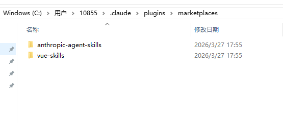
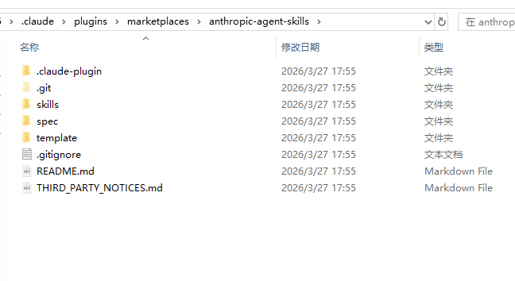
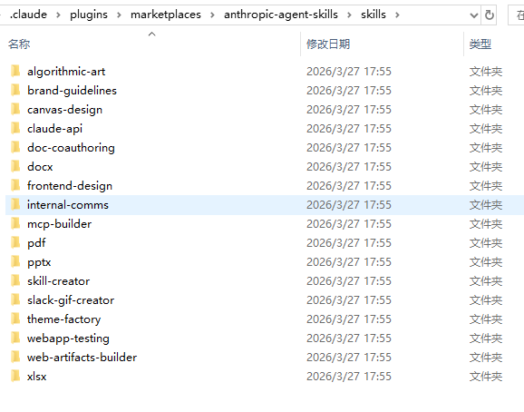
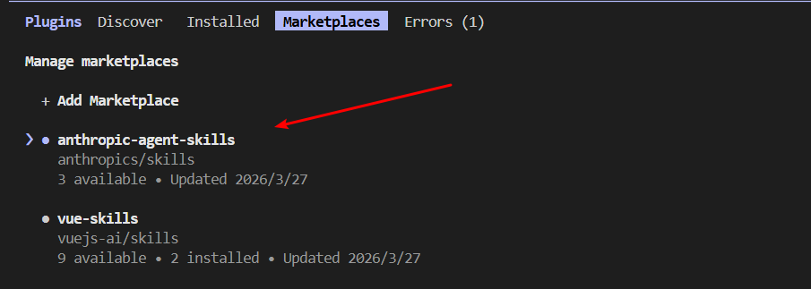
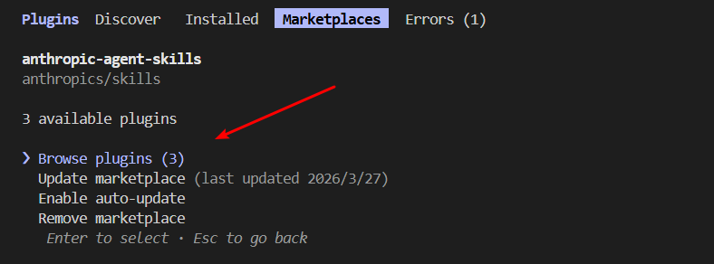
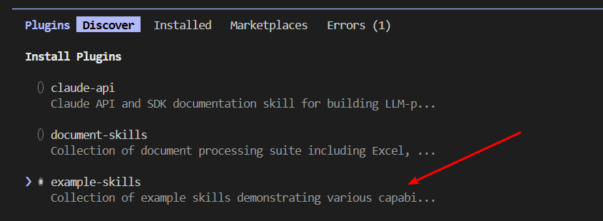
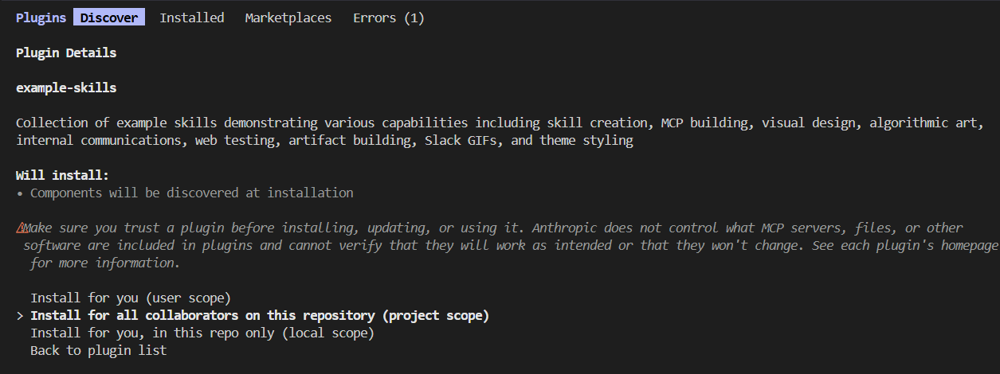
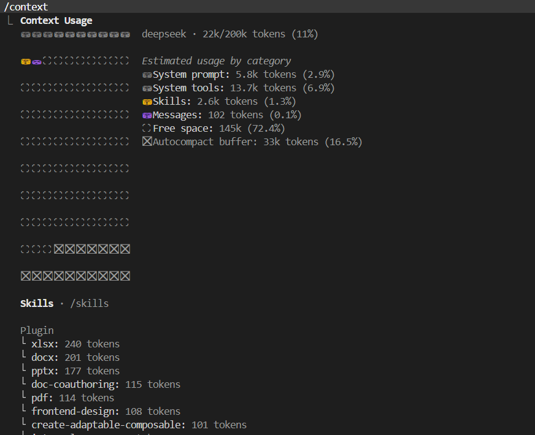
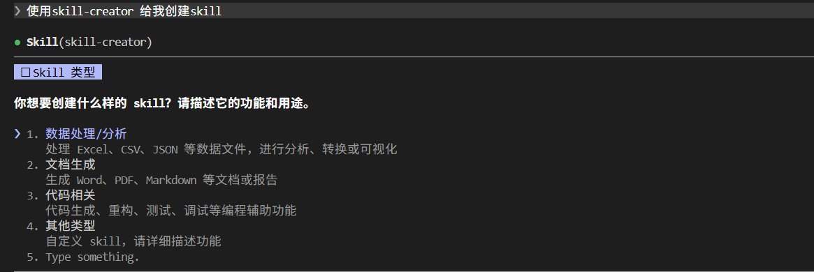

## 安装

```
// 全局安装
npm install -g @anthropic-ai/claude-code

// 更新
npm update -g @anthropic-ai/claude-code

// 验证
claude --version
```


## 配置模型

- 常用国内模型

| 模型             | API地址                                         | 模型名称                | 获取API Key                                                  |
| ---------------- | ----------------------------------------------- | ----------------------- | ------------------------------------------------------------ |
| **智谱 GLM-4.7** | `https://open.bigmodel.cn/api/anthropic`        | `glm-4.7`               | [open.bigmodel.cn/](https://link.juejin.cn?target=https%3A%2F%2Fopen.bigmodel.cn%2F) |
| **Kimi K2**      | `https://api.moonshot.cn/anthropic`             | `kimi-k2-turbo-preview` | [platform.moonshot.cn/console/acc…](https://link.juejin.cn?target=https%3A%2F%2Fplatform.moonshot.cn%2Fconsole%2Faccount) |
| **通义千问**     | `https://dashscope.aliyuncs.com/apps/anthropic` | `qwen-coder-plus`       | [bailian.console.aliyun.com/](https://link.juejin.cn?target=https%3A%2F%2Fbailian.console.aliyun.com%2F) |
| **DeepSeek**     | `https://api.deepseek.com/anthropic`            | `deepseek-chat`         | [platform.deepseek.com/](https://link.juejin.cn?target=https%3A%2F%2Fplatform.deepseek.com%2F) |

- 配置示例

```
 // .claude/settings.json(glm)
{
    "env": {
        "ANTHROPIC_AUTH_TOKEN": "xxxxxx",
        "ANTHROPIC_BASE_URL": "https://open.bigmodel.cn/api/anthropic",
        "ANTHROPIC_MODEL": "glm-4.7",
        "ANTHROPIC_SMALL_FAST_MODEL": "glm-4.5-air"
    }
}
```

## 常用命令

| 命令                    | 说明                                           |
| ----------------------- | ---------------------------------------------- |
| Shift + Tab` / `Alt + M | 切换权限模式（自动接受 / 计划模式 / 正常模式） |
| /clear                  | 清空上下文                                     |
| /resume                 | 恢复之前的对话                                 |
| /review                 | 代码审查                                       |
| /context                | 查看上下文                                     |
| /compact                | 压缩上下文                                     |
| /agents                 | 配置自定义子代理                               |

## 核心概念

### 关键工作原理

[官方文档-关键工作原理](https://code.claude.com/docs/en/how-claude-code-works)

#### 与会话相关的工作

##### 跨分支工作

- 每个 Claude Code 对话绑定到目前目录的会话，即在`/A`、`/B`这两个目录启动的Claude，其会话是不互通的。

- 但是如果是同一个目录，即使你切换了分支，也是可以保持会话的。
- 由于会话是绑定在目录的，所以需要使用`worktrees` 运行并行的Claude 会话，才能为每个分支创建独立的目录。

##### 上下文窗口

- 上下文窗口包含：对话历史、文件内容、CLAUDE.md、自动记忆、skills、系统指令，持久的规则应该要放进CLAUDE.md，可以运行`/context`查看占用的上下文空间
- 可以用`/context`查看上下文空间
- skills 按需加载，claude 在开始时仅查看 skill 的描述，完整内容在使用时才加载
- subagents（分级代理）可以实现任务特定的工作流程和改进的上下文管理，通过`/agents`进行配置

### 扩展 claude code

[官方文档-扩展claude code](https://code.claude.com/docs/en/features-overview)

#### 概述

- CLAUDE.md：持久上下文
- Skills：技能（可重复使用的只是或可调用的工作流程）
- MCP：连接外部服务和工具
- Subagents：独立的上下文中运行并返回摘要
- Agent teams：协调多个独立会话
- Hooks：运行于事件的确定性脚本
- Plugins&marketplaces：插件和市场，负责打包和分发功能

#### 功能讲解

| 特性        | 作用                                  | 何时使用                                 | 示例                                                  |
| ----------- | ------------------------------------- | ---------------------------------------- | ----------------------------------------------------- |
| CLAUDE.md   | 持续上下文                            | 持久的规则                               | “用 pnpm，不要用 npm。在决定之前先做测试。”           |
| Skill 技能  | Claude 可以使用的指令、知识和工作流程 | 可重复使用的内容、参考文档、可重复的任务 | `/deploy` 运行你的部署检查表;API 文档对端点模式的技能 |
| Subagent    | 返回汇总结果的孤立执行上下文          | 上下文隔离、并行任务、专用工作者         | 研究任务需要读取大量文件，但只返回关键发现            |
| Agent teams | 协调多个独立的 Claude Code 会话       | 并行研究、新功能开发、与竞争假设进行调试 | 生成审查员以同时检查安全性、性能和测试                |
| MCP         | 连接外部服务                          | External data or actions 外部数据或操作  | 查询你的数据库，发帖到 Slack，控制浏览器              |
| Hook        | 运行于事件的确定性脚本                | 自动化可预测，无需大型语言模型           | 每次文件编辑后运行 ESLint                             |

#### 插件

- 概念

  - 插件是打包层，将技能、钩子、子代理和 MCP 服务器捆绑成一个可安装单元

  - 想在多个仓库重复使用相同配置或通过marketplace分发给他人时使用

- 使用

  - 将仓库注册为 claude code 插件市场

    ```
    /plugin marketplace add anthropics/skills
    ```

    此时目录文件中会有如下变化：

    

    

    

  - 查看插件&安装：`/plugin`

    

    

    

    

    

- 其他安装方式

  ```
  /plugin install document-skills@anthropic-agent-skills
  ```

- 验证&使用

  - 验证

    

  - 安装插件后，只需要提及技能就可以使用了，例如：

    

### 探索.claude 目录

[官方文档-探索.claude目录](https://code.claude.com/docs/en/claude-directory#ce-claude-json)

其分为项目、全局两个文件配置。

#### 项目

```
- CLAUDE.md
- .mcp.json
- ./claude/
 - settings.json
 - settings.local.json
 - rules/ 
 	- testing.md
 	- api-design.md
 - skills
 	- security-review/
 		- SKILL.md
 		- checklist.md
 - commands/
 	- fix-issue.md
 - output-styles/
 - agents/
 - agent-memory
 	- <agent-name> /
 	 - MEMORY.md
```

##### CLAUDE.md

- 项目级别的，默认是不在./claude 目录下，如果希望整洁可以放在./claude 目录下的
- 这个文件的长度应该在200行以内，较长的虽然可以完整加载，但会降低加载速度
- 每个会话都会加载，非每个会话都需要的，应该移除到skills或rules 中


## 生态

[vuejs-ai/skills](https://github.com/vuejs-ai/skills)

[官方skills](https://github.com/anthropics/skills)

## 常用资源

[claude code 官方文档](https://code.claude.com/docs/zh-CN/)
[claude code 中文文档](https://claudecn.com/docs/claude-code/)