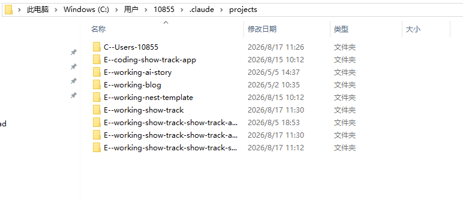
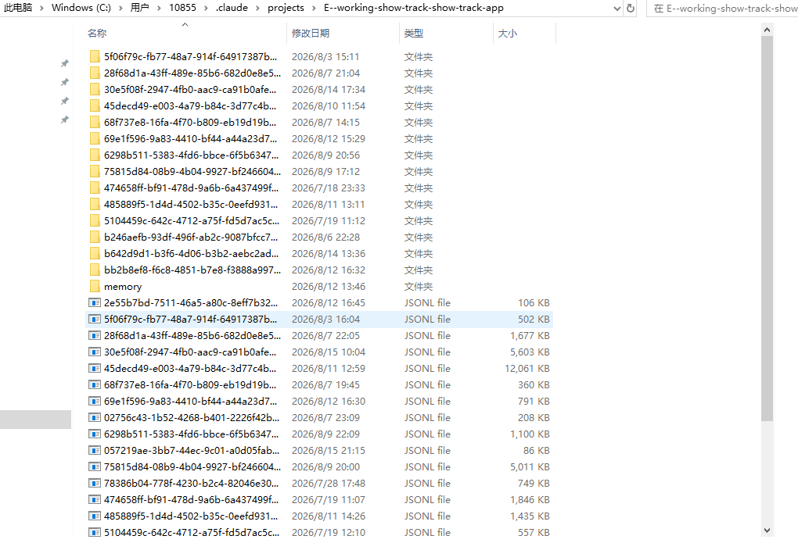
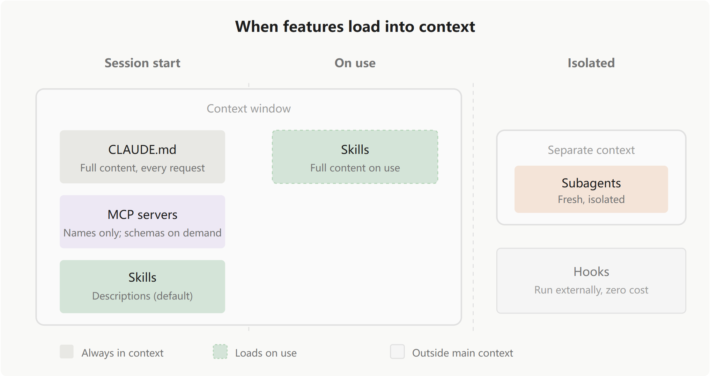
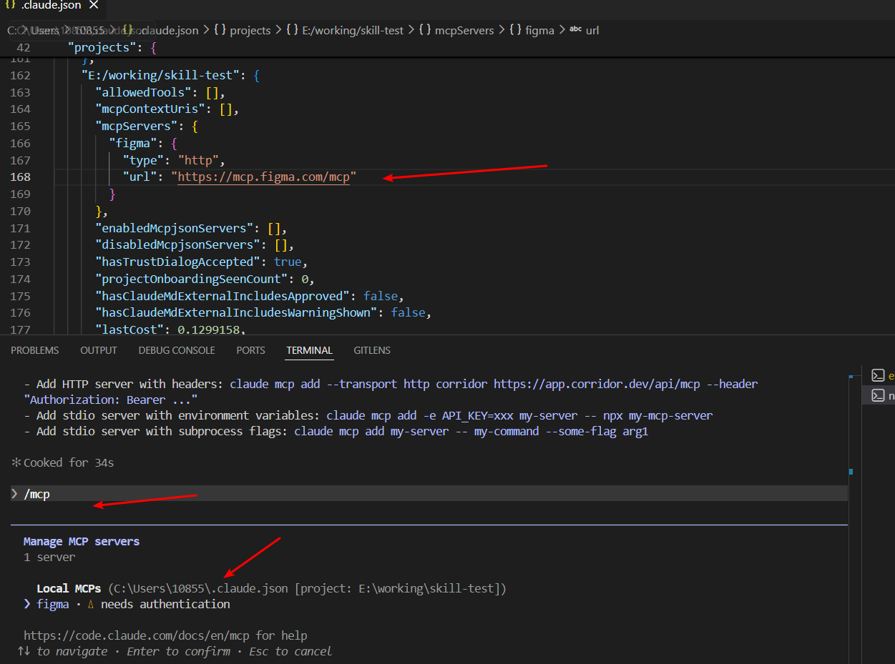
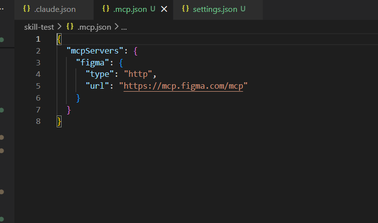
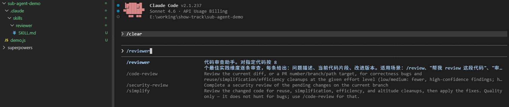
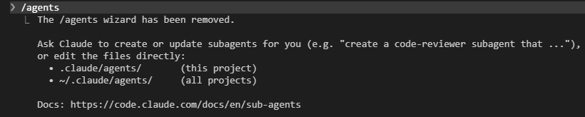
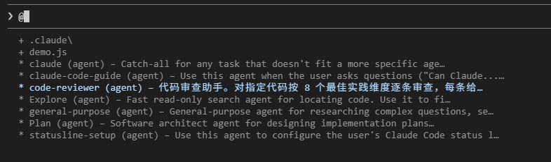
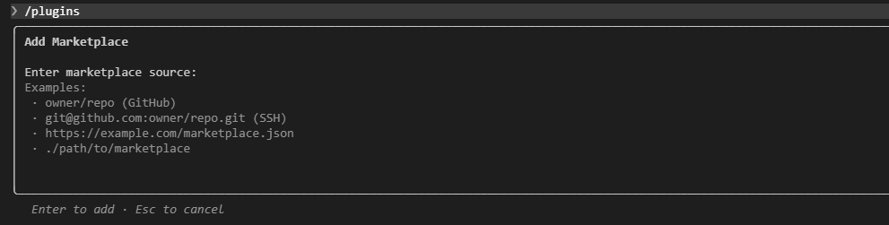
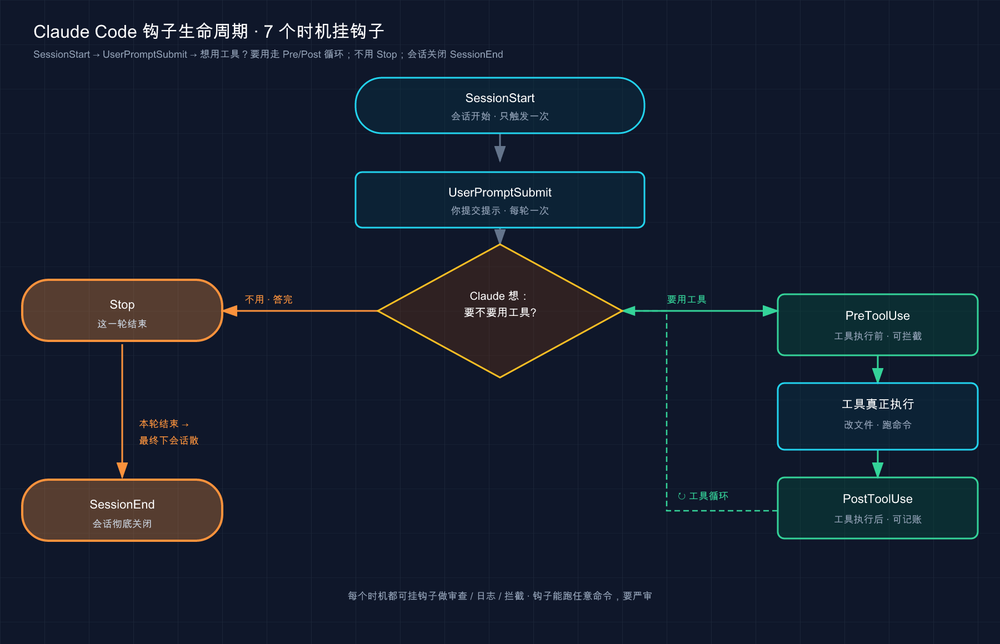

## 安装

```
// 全局安装
npm install -g @anthropic-ai/claude-code

// 更新
npm update -g @anthropic-ai/claude-code

// 验证
claude --version
```


## 配置模型

- 常用国内模型

| 模型             | API地址                                         | 模型名称                | 获取API Key                                                  |
| ---------------- | ----------------------------------------------- | ----------------------- | ------------------------------------------------------------ |
| **智谱 GLM-4.7** | `https://open.bigmodel.cn/api/anthropic`        | `glm-4.7`               | [open.bigmodel.cn/](https://link.juejin.cn?target=https%3A%2F%2Fopen.bigmodel.cn%2F) |
| **Kimi K2**      | `https://api.moonshot.cn/anthropic`             | `kimi-k2-turbo-preview` | [platform.moonshot.cn/console/acc…](https://link.juejin.cn?target=https%3A%2F%2Fplatform.moonshot.cn%2Fconsole%2Faccount) |
| **通义千问**     | `https://dashscope.aliyuncs.com/apps/anthropic` | `qwen-coder-plus`       | [bailian.console.aliyun.com/](https://link.juejin.cn?target=https%3A%2F%2Fbailian.console.aliyun.com%2F) |
| **DeepSeek**     | `https://api.deepseek.com/anthropic`            | `deepseek-chat`         | [platform.deepseek.com/](https://link.juejin.cn?target=https%3A%2F%2Fplatform.deepseek.com%2F) |

- 配置示例

```
 // .claude/settings.json(glm)
{
    "env": {
        "ANTHROPIC_AUTH_TOKEN": "xxxxxx",
        "ANTHROPIC_BASE_URL": "https://open.bigmodel.cn/api/anthropic",
        "ANTHROPIC_MODEL": "glm-4.7",
        "ANTHROPIC_SMALL_FAST_MODEL": "glm-4.5-air"
    }
}
```
- 使用 cc swtich  切换模型

https://github.com/farion1231/cc-switch

## 常用命令

| 命令                    | 说明                                           |
| ----------------------- | ---------------------------------------------- |
| Shift + Tab` / `Alt + M | 切换权限模式（自动接受 / 计划模式 / 正常模式） |
| /clear                  | 清空上下文                                     |
| /resume                 | 恢复之前的对话                                 |
| /review                 | 代码审查                                       |
| /context                | 查看上下文                                     |
| /compact                | 压缩上下文                                     |
| @                       | 指定文件作为上下文                             |
| !                       | 直接跑命令，无需审核，即作为shell使用          |


## 核心概念

### 关键工作原理

主要是了解工具的核心架构、内置功能以及高效使用该工具的技巧。

[官方文档-关键工作原理](https://code.claude.com/docs/en/how-claude-code-works)

#### 非关键原理

- 代理循环

  claude 执行任务分为三个阶段：收集相关信息、采取行动、验证结果。在处理任务时会使用各种工具，比如搜索文件、运行测试。

  - 模型/样式
    - sonnet:日常编程
    - opus: 复杂推理 / 架构决策
  - 工具(大致五类)
    - 文件操作：例如编辑/读取文件等等
    - 搜索：例如浏览代码库
    - 执行/实施：例如执行测试
    - 网络：例如查看文档
    - 代码智能：例如查看类型错误和警告信息

- claude 能访问什么？

  - 所在目录和许可文件
  - 终端信息
  - git 状态
  - claude.md
  - 自动记忆（每次会话开始时，会首先加载 MEMORY.md 文件中的前 200 行内容，或者 25KB 的数据量，以先达到其中之一为准）
  - 各种扩展功能，如mcp、技能、子代理

- 环境与界面

- 撤销更改，通过`esc`来撤销

- claude 能做什么？

  - manual：手动操作模式，Claude 在编辑文件或执行 shell 命令之前会先进行询问
  - accept edits: 接受编辑模式,常见命令无需征求用户确认
  - plan：计划模式，提出计划不对原始文件进行编辑
  - auto：自动模式，在采取任何行动之前，都会进行必要的安全检查

- 高效协作

  - `/init` 指导创建 `CLAUDE.md`
  - `/doctor` 进行安装检查，诊断安装和配置方面的问题
  - 可以中断并重新引导/打断当前进程并重新控制方向
  - 对于复杂的问题，应将研究与编码分开处理。请先使用“计划模式”

#### 与会话相关的工作

- 每次使用 claude code 时，所有对话内容保存在本地，可以查看`~/.claude/projects/`



- 每个新会话都从一个全新的界面开始，不会保留上次会议的对话记录

  

##### 跨分支工作

- 每个 Claude Code 对话绑定到目前目录的会话，即在`/A`、`/B`这两个目录启动的Claude，其会话是不互通的。

- 但是如果是同一个目录，即使你切换了分支，也是可以保持会话的。
- 由于会话是绑定在目录的，所以需要使用`worktrees` 运行并行的Claude 会话，才能为每个分支创建独立的目录。

##### 上下文窗口

- 上下文窗口包含：对话历史、文件内容、CLAUDE.md、自动记忆、skills、系统指令，持久的规则应该要放进CLAUDE.md
- 可以用`/context`查看上下文空间, 工具会自动压缩上下文，也可以运行`/compact`压缩
- 可以通过技能和子代理来管理上下文
  - skills 按需加载，claude 在开始时仅查看 skill 的描述，完整内容在使用时才加载
  - subagents（子代理）拥有自己独立的处理环境，完全独立于你的主要对话流程，完成任务后给出总结到对话流程。


### 扩展 claude code

[官方文档-扩展claude code](https://code.claude.com/docs/en/features-overview)

#### 概述

- CLAUDE.md：持久上下文
- Skills：技能（可重复利用的知识体系，并实现可复用的工作流程）
- Code intelligence: 代码智能（将 Claude 与语言处理服务器相连，从而实现符号级别的操作以及实时错误检测）
- MCP：连接外部服务和工具
- Subagents：子代理，在独立的环境中运行各自的程序，最后输出总结结果
- Agent teams：协调多个独立会话
- Hooks：运行于事件的确定性脚本
- Plugins&marketplaces：插件和市场，负责打包和分发功能

#### 功能讲解

| 特性        | 作用                                  | 何时使用                                 | 示例                                                  |
| ----------- | ------------------------------------- | ---------------------------------------- | ----------------------------------------------------- |
| CLAUDE.md   | 持续上下文                            | 持久的规则                               | “用 pnpm，不要用 npm。在决定之前先做测试。”           |
| Skill 技能  | Claude 可以使用的指令、知识和工作流程 | 可重复使用的内容、参考文档、可重复的任务 | `/deploy` 运行你的部署检查表;API 文档对端点模式的技能 |
| Subagent    | 返回汇总结果的孤立执行上下文          | 上下文隔离、并行任务、专用工作者         | 研究任务需要读取大量文件，但只返回关键发现            |
| Agent teams | 协调多个独立的 Claude Code 会话       | 并行研究、新功能开发、与竞争假设进行调试 | 生成审查员以同时检查安全性、性能和测试                |
| MCP         | 连接外部服务                          | External data or actions 外部数据或操作  | 查询你的数据库，发帖到 Slack，控制浏览器              |
| Hook        | 运行于事件的确定性脚本                | 自动化可预测，无需大型语言模型           | 每次文件编辑后运行 ESLint                             |

#### 插件

- 概念

  - 插件是打包层，将技能、钩子、子代理和 MCP 服务器捆绑成一个可安装单元

  - 想在多个仓库重复使用相同配置或通过marketplace分发给他人时使用

- 使用

  - 将仓库注册为 claude code 插件市场

    ```
    /plugin marketplace add anthropics/skills
    ```

    此时目录文件中会有如下变化：

    

    

    

  - 查看插件&安装：`/plugin`

    

    

    

    

    

- 其他安装方式

  ```
  /plugin install document-skills@anthropic-agent-skills
  ```

- 验证&使用

  - 验证

    

  - 安装插件后，只需要提及技能就可以使用了，例如：

    

#### 功能加载规则

- CLAUDE.md
  - 时间：会话开始时
  - 内容：所有 CLAUDE.md 文件的全部内容（包括在管理级、用户级和项目级上存储的内容）
  - 继承机制：
    - Claude 会从你的工作目录开始，逐级读取 CLAUDE.md 文件，直到到达目录的根目录
    - 子目录的 CLAUDE.md 文件不会一开始就读取，仅读取到这些文件所在目录时加载
- skills
  - 时间：
    - 默认：在会话开始时加载描述信息，实际使用时加载完整信息
    - 限用户使用的技能（ `disable-model-invocation: true` ），在用户主动调用这些技能之前，相关内容都不会被加载
  - 内容：使用了skill则加载完整内容
  - claude 如何选择 skills：
    - 将任务与各种技能描述进行对比，从而选中skill
    - 可以通过`/<name>`方式配置触发技能
- mcp
  - 时间：会话开始时
  - 内容：
    - 加载的内容包括：来自连接服务器的工具名称
    - 完整的 JSON 格式数据则会在 Claude 需要使用某个特定工具时再被加载。
- subagents
  - 时间：按需执行，当创建 subagents 时
  - 内容：包含新鲜、独立的上下文信息
- hooks
  - 时间：在特定生命周期事件发生时，如工具执行、会话结束、提示提交等
  - 内容：默认情况什么都不加载，hooks在主对话流程之外



### 探索.claude 目录

[官方文档-探索.claude目录](https://code.claude.com/docs/en/claude-directory#ce-claude-json)

其分为项目、全局两个文件配置。

```
// 项目
- CLAUDE.md
- .mcp.json
- ./claude/
 - settings.json
 - settings.local.json
 - rules/ 
 	- testing.md
 	- api-design.md
 - skills
 	- security-review/
 		- SKILL.md
 		- checklist.md
 - commands/
 	- fix-issue.md
 - output-styles/
 - agents/
 - agent-memory
 	- <agent-name> /
 	 - MEMORY.md
 - workflow 工作流
 	 
// 全局
- .claude.json
- .claude/
	- CLAUDE.md
	- settings.json
	- keybindings.json
	- projects/
		- MEMORY.md
	- plugins
	- rules
	- skills
	- output-styles
	- agents/
	- agent-memory
```

#### CLAUDE.md

- 项目级别的，默认是不在./claude 目录下，如果希望整洁可以放在./claude 目录下的
- 这个文件的长度应该在200行以内，较长的虽然可以完整加载，但会降低加载速度
- 每个会话都会加载，非每个会话都需要的，应该移除到skills或rules 中

#### mcp.json

- 配置mcp服务

  - 相关命令查看

    - `claude  mcp --help`
    - `claude mcp add -h`

  - `claude mcp add --transport http figma https://mcp.figma.com/mcp`

    - 这个命令会在`.claude.json`中生成

      

    - 通过添加`--scope project`,`claude mcp add --scope project --transport http figma https://mcp.figma.com/mcp`, 在项目级别增加mcp.json

      

#### setting.json/setting.local.json

- 可以设置如：permissions\hooks\statusLine\model\env\outputStyle

- 例子

  ```
  {
    "permissions": {
      "allow": [
        "Bash(claude mcp:*)",
        "Bash(claude:*)",
        "Bash(CLAUDE_CODE_GIT_BASH_PATH=\"E:/Program Files/Git/usr/bin/bash.exe\" claude mcp remove figma)",
        "Bash(CLAUDE_CODE_GIT_BASH_PATH='E:\\\\Program Files\\\\Git\\\\usr\\\\bin\\\\bash.exe' claude mcp remove figma)"
      ]
    }
  }
  ```

#### rules/

- 可以通过通配符配置，如`path`

  ```
  // testing.md
  ---
  paths:
    - "**/*.test.ts"
    - "**/*.test.tsx"
  ---
  
  # Testing Rules
  
  - Use descriptive test names: "should [expected] when [condition]"
  - Mock external dependencies, not internal modules
  - Clean up side effects in afterEach
  ```

#### skills/

- 用于放置 skills，可以当作命令的方式直接运行。



#### commands

- 自定义命令，和 skills 相同的机制

#### agents/

- 输入 /agent 进行创建，会有一步一步的引导
- [创建agent](https://code.claude.com/docs/en/sub-agents#quickstart-create-your-first-subagent)

#### agent-memory/

- 配置 agent 的 momory

## 使用 claude code

### 存储指令和记忆

[官方文档-存储指令和记忆](https://code.claude.com/docs/en/memory#load-from-additional-directories)

#### 编写/整理 CLAUDE.md

- 大小限制，200行以内，超出建议使用 rules

- 所写指令必须够具体

  - 使用“双空格缩进”，而不是“正确格式化代码”
  - “在提交之前先运行 `npm test` ”，而不是“先测试你的更改”
  - “API 处理程序位于 `src/api/handlers/` ”，而不是“保持文件整齐有序”

- 导入其他文件

  - 格式

  ```
  See @README for project overview and @package.json for available npm commands for this project.
  
  # Additional Instructions
  - git workflow @docs/git-instructions.md
  ```

  - 注意点：@的文件是包含在200行以内

- AGENTS.md

  在 CLAUDE.md 中引入这个文件，就可以一起支持其他 agent

  ```
  ## CLAUDE.md
  @AGENTS.md
  
  ...
  ```

- CLAUDE.md/CLAUDE.local.md 优先级

  - 规则：全文拼接合并；后追加到上下文的内容，冲突时权重更高
  - CLAUDE.local.md 在 CLAUDE.md 后追加，优先级更高

#### 使用`.claude/rules`指定文件类型和规则范围

- 大纲

```
your-project/
├── .claude/
│   ├── CLAUDE.md           # Main project instructions
│   └── rules/
│       ├── code-style.md   # Code style guidelines
│       ├── testing.md      # Testing conventions
│       └── security.md     # Security requirements
```

- 规则

  - 没有`path`前缀规则，会话开始时被加载，优先级同`CLAUDE.md`

  - 特定路径

    ```
    ---
    paths:
      - "src/api/**/*.ts"
    ---
    ```

#### 配置自动记忆功能


- 自动记忆功能默认处于开启状态

- 关闭

  ```
  {
    "autoMemoryEnabled": false
  }
  ```

- 规则

  - 会检查该文件的长度是否超过了 200 行或 25KB 的限制。如果文件的大小接近这些限制值，Claude Code 会提醒 Claude 对其进行优化
  - 超过限制的部分在下次加载时会被自动丢弃,只适合于`MEMORY.md`
  - 注意：不适合CLAUDE.md，CLAUDE.md 文件都会被完整加载。不过，文件越短，兼容性越好

- 查看和编辑

  执行下面命令，即可打开对应的MEMORY.md 文件，可以查看和编辑

  ```
   /memory 
  ```

## 高级功能扩展

### 子代理(subagents)

#### 是什么

子代理 = 独立上下文 + 独立人设 + 独立工具的外包小弟。

| 维度                 | 主对话（你）                     | 子代理（外包小弟）                                     |
| :------------------- | :------------------------------- | :----------------------------------------------------- |
| **上下文**           | 你和 Claude 一路聊下来的全部历史 | 一片空白，只收到一句「任务交代」，看不到你们之前聊了啥 |
| **系统提示（人设）** | Claude Code 的默认设定           | 你给它写的专属人设，比如「你是一个只挑刺的代码审查员」 |
| **工具 / 权限**      | 你授权过的所有工具               | 可以单独砍掉，比如「只准读、不准写」                   |

#### 解决什么

- 三个特点

  - 隔离上下文，不污染主线

  - 专精某类任务

  - 可并行

- 注意点

  - 但**简单活儿直接干更快更省**——拆得多 ≠ 专业，过度拆只会又慢又贵又把台面堆回去

  | 对比项       | 简单活儿**直接在主对话干** | 简单活儿**硬拆给子代理**                                   |
  | :----------- | :------------------------- | :--------------------------------------------------------- |
  | **启动开销** | 没有，张嘴就干             | 子代理从白纸起步，得先花时间「收集上下文」摸清状况         |
  | **来回沟通** | 你一句它一句，随时改       | 交代不清就得返工，子代理看不到你们之前的对话               |
  | **花费**     | 一份 token                 | 多开一个上下文 = 多烧 token，开越多烧越多                  |
  | **结果回灌** | 不存在                     | 每个子代理都把详细结果塞回主对话，开太多反而把台面又堆满了 |

#### 怎么建

- 已废弃命令：`/agents`

  

- 推荐方式：通过提示词让 claude 生成

```
prompt: 帮我生成一个代码审查助手子代理，按照最佳实践的维度对代码进行审查，每条都说清问题、贴出当前代码、再给改进版，你需要先让我确认审查维度 

result: .claude/agents/code-reviewer.md
---
name: code-reviewer
description: 代码审查助手。对指定代码按 8 个最佳实践维度逐条审查，每条给出：问题描述、当前代码片段、改进版本。适用场景：/review、"帮我 review 这段代码"、"审查一下这个文件"。
tools: Read, Grep, Glob, Bash
---
```

- 手写方式
  - name 子代理名称
  - description 描述，即定义什么任务应该派发给这个代理，越清楚，自动委派越准
  - tools  省略 = 继承主对话全部工具；想限权就在这列允许清单
  - model 模型，省略和主对话一致
  - permissionMode 权限模式，default`/`acceptEdits`/`auto`/`dontAsk`/`bypassPermissions`/`plan

#### 怎么触发

- 正常提需求

  ```
  帮我对这个项目的代码进行代码审查                                                                                                                   
    ⎿  ⧉ Selected 5 lines from .claude\agents\code-reviewer.md in Visual Studio Code
  ```

- 直接点名：使用【代理名称】做什么事情

- @ 名称触发

  

### 插件（Plugins）

#### 是什么

就是一个文件夹，可以把skill、subagent、hook、命令、mcp 打包在一起，当成一个整体来分发复用

#### 插件市场

- 安装步骤

  - 添加市场
  - 装插件

- 插件内容

  | 件                    | 装进来后怎么用                                               |
  | :-------------------- | :----------------------------------------------------------- |
  | **Skills / Commands** | 变成 `/插件名:skill名` 这种命名空间命令，你手动敲、或 Claude 自动调 |
  | **Subagents**         | 出现在 `/agents` 列表里，Claude 按任务自动派、你也能手动点   |
  | **Hooks**             | 在对应事件（如改文件后）自动触发，不用你管                   |
  | **MCP server**        | 自动启动，它的工具混进 Claude 的工具箱里直接能用             |
  | **LSP server**        | 给 Claude 实时代码智能（跳转定义、查引用、即时报错），需另装语言服务器二进制 |

  注意点：注意上下文，插件装太多，还没开始干活就被各种skill、说明、mcp 工具等占用掉。

- 自定义打包

  ```
  my-first-plugin/
  ├── .claude-plugin/
  │   └── plugin.json 
  │   └── marketplace.json
  ├── skills/
  │   └── hello/
  │       └── SKILL.md
  ├── agents/
  │   └── reviewer.md
  └── hooks/
      └── hooks.json
  ```

  - 关键字段-plugin.json

    ```
    {
      "name": "my-first-plugin",
      "description": "My first plugin for Claude Code",
      "version": "1.0.0",
      "author": {
        "name": "wayliuhaha",
        "email": "1085550655@qq.com"
      },
      "homepage": "https://gitee.com/wayliuhaha/my-first-plugin",
      "repository": "https://gitee.com/wayliuhaha/my-first-plugin",
      "license": "MIT",
      "keywords": [
        "skills"
      ]
    }
    ```

  - 关键字段-marketplace.json

    ```
    {
      "name": "my-first-plugin-dev",
      "description": "Development marketplace for my-first-plugin",
      "owner": {
        "name": "wayliuhaha",
        "email": "1085550655@qq.com"
      },
      "plugins": [
        {
          "name": "my-first-plugin",
          "description": "My first plugin for Claude Code",
          "version": "1.0.0",
          "source": "./",
          "author": {
            "name": "wayliuhaha",
            "email": "1085550655@qq.com"
          }
        }
      ]
    }
    ```

  - 安装

    直接输入git 链接就可以了

    

### 技能（skill）

#### skill 的正确目录

```
my-skill/
├── SKILL.md           # 主要说明（必需）
├── reference.md       # 详细参考文档，按需加载（或者 /references）
├── examples.md        # 示例输出，按需加载
└── scripts/
    └── helper.py      # Claude 可以执行的脚本
```

#### 注意点

- 可以使用skill-creator 创建skill
- 自动触发是关键难点，需要明确 description

### 钩子（hooks）

[官方文档-event-matcher](https://code.claude.com/docs/en/hooks#matcher-patterns)

#### 常见生命周期



| 事件               | 什么时候触发           | 最典型的用法                               |
| :----------------- | :--------------------- | :----------------------------------------- |
| **`PreToolUse`**   | 某个工具**执行前**     | 拦危险命令、保护敏感文件（**能阻止操作**） |
| **`PostToolUse`**  | 某个工具**成功执行后** | 改完文件自动格式化 / 跑 lint               |
| **`Stop`**         | Claude 答完这一轮      | 提醒「活还没干完，继续」、扫一遍工作区     |
| **`SessionStart`** | 会话开始或恢复时       | 往上下文里注入项目状态（如最近的提交）     |

注意点，需要通过matcher 进行收窄

#### 例子-改完文件自动进行格式化

```
{
  "hooks": {
    "PostToolUse": [
      {
        "matcher": "Edit|Write",
        "hooks": [
          {
            "type": "command",
            "command": "jq -r '.tool_input.file_path' | xargs npx prettier --write"
          }
        ]
      }
    ]
  }
}
```

## 生态

[vuejs-ai/skills](https://github.com/vuejs-ai/skills)

[官方skills](https://github.com/anthropics/skills)

[superpowers](https://github.com/obra/superpowers/tree/main)

## 常用资源

[claude code 官方文档](https://code.claude.com/docs/zh-CN/)
[claude code 中文文档](https://claudecn.com/docs/claude-code/)