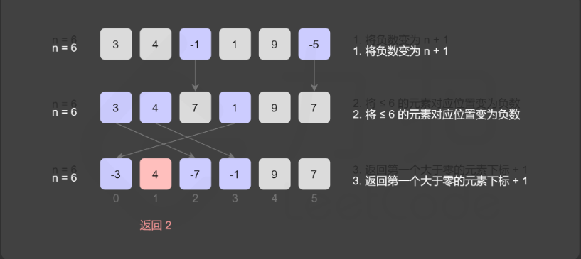

## 两数之和
### 题目
给定一个整数数组 `nums` 和一个整数目标值 `target`，请你在该数组中找出 **和为目标值** *`target`* 的那 **两个** 整数，并返回它们的数组下标。
```
输入：nums = [2,7,11,15], target = 9
输出：[0,1]
解释：因为 nums[0] + nums[1] == 9 ，返回 [0, 1] 。
```

### 思路

构造一个`map`, 将遍历的数字作为key，下标作为值

```
var twoSum = function(nums, target) {
    const map = new Map()
    for (let i=0; i<nums.length; i++) {
        if (map.has(target - nums[i])) {
            return [map.get(target - nums[i]), i]
        } else {
            map.set(nums[i], i)
        }
    }
};
```

## 三数之和

### 题目

给定一个包含 `n` 个整数的数组`nums`，判断 `nums` 中是否存在三个元素`a，b，c` ，使得 `a + b + c = 0 ？`找出所有满足条件且不重复的三元组。

注意：答案中不可以包含重复的三元组。

```js
例如, 给定数组 nums = [-1, 0, 1, 2, -1, -4]，

满足要求的三元组集合为：
[
  [-1, 0, 1],
  [-1, -1, 2]
]
```

### 思路

- 利用排序+双指针
- 先固定一个，剩余的前后作为前指针和后指针向中间移动

```
var threeSum = function(nums) {
    let result = []
    nums = nums.sort((a,b) => a - b)
    for (let i=0; i<nums.length-2; i++) {
        // 如果全部大于0则结束
        if (nums[i] > 0) break
        // 过滤当前和前一个一样
        if (i>0 && nums[i] === nums[i-1]) continue
        // 前指针
        let L = i+1
        // 后指针
        let R = nums.length -1
        while(L<R) {
            const sum = nums[i] + nums[L] + nums[R]
            if (sum === 0) {
                result.push([nums[i], nums[L], nums[R]])
                // 前指针去重
                while(L<R && nums[L] === nums[L+1]) L++
                // 后指针去重
                while(L<R && nums[R] === nums[R-1]) R--
                L++
                R--
            } else if (sum < 0) {
                L++
            } else {
                R--
            }
        }
    }
    return result
};
```

## 四数之和

### 题目

给定一个包含 `n` 个整数的数组`nums`，判断 `nums` 中是否存在四个元素`a，b，c，d` ，使得 `a + b + c + d = 0 ？`找出所有满足条件且不重复的四元组。

注意：答案中不可以包含重复的四元组。

```js
给定数组 nums = [1, 0, -1, 0, -2, 2]，和 target = 0。

满足要求的四元组集合为：
[
  [-1,  0, 0, 1],
  [-2, -1, 1, 2],
  [-2,  0, 0, 2]
]
```

### 思路

通过大小指针降低复杂度
- 过滤和前一个相同的
- 前后指针记得去重

```
var fourSum = function(nums, target) {
    nums = nums.sort((a, b) => a - b)
    const result = []
    for (let i=0; i<nums.length-3; i++) {
        // 过滤和前一个重复
        if (i>0 & nums[i] === nums[i-1]) continue
        for (let j=i+1; j<nums.length-2; j++) {
            // 过滤和前一个重复
            if (j>i+1 && nums[j] === nums[j-1]) continue
             // 前后指针
            let left = j+1
            let right = nums.length-1
            while(left<right) {
                const sum = nums[i] + nums[j] + nums[left] + nums[right]
                if (sum === target) {
                    result.push([nums[i], nums[j], nums[left], nums[right]])
                    // 前指针去重
                    while (left<right && nums[left] === nums[left+1]) left++
                    // 后指针去重
                    while (left<right && nums[right] === nums[right-1]) right--
                    left++
                    right--
                } else if (sum < target) {
                    left++
                } else {
                    right--
                }
            }
        }
    }
    return result
};

```

## 把数组排成最小的数

### 题目

输入一个非负整数数组，把数组里所有数字拼接起来排成一个数，打印能拼接出的所有数字中最小的一个。

```
输入: [10,2]
输出: "102

输入: [3,30,34,5,9]
输出: "3033459"
```

### 思路

- 若拼接字符串 `x+y>y+x`,则x>y,否则y>=x
- 在拼接的时候只需要做一个排序（升序）即可

```
var minNumber = function(nums) {
    for (let i=0; i<nums.length; i++) {
        for (let j=0; j<nums.length-i-1; j++) {
            if (`${nums[j]}${nums[j+1]}` > `${nums[j+1]}${nums[j]}`) {
                [nums[j], nums[j+1]] = [nums[j+1], nums[j]]
            }
        }
    }
    return nums.join('')
};
```

## 第一个只出现一次的字符

### 题目

在字符串 s 中找出第一个只出现一次的字符。如果没有，返回一个单空格。 s 只包含小写字母。

```
输入：s = "abaccdeff"
输出：'b'

输入：s = "" 
输出：' '
```

### 思想

1. 遍历维护一个map记录存在状态（多次-1），遍历返回不为-1的第一个
2. 遍历维护一个map记录存在状态（多次-1），同时维护一个队列记录数值和状态（多次-1），当map存在的时候，如果对头中存在key映射到map为-1的，则出队

```
var firstUniqChar = function(s) {
    const map = new Map()
    for (let i=0; i<s.length; i++) {
        if (map.has(s[i])) {
            map.set(s[i], -1)
        } else {
            map.set(s[i], i)
        }
    }
    for (let i=0; i<s.length; i++) {
        if (map.get(s[i]) !== -1) return s[i]
    }
    return ' '
};
```

```
var firstUniqChar = function(s) {
    const map = new Map()
    const queue = []
    for (let i=0; i<s.length; i++) {
        if (map.has(s[i])) {
            // 如果多次状态为-1
            map.set(s[i], -1)
            // 只要队头存在映射到map为-1 的，则出队
            while(queue.length && map.get(queue[0][0]) === -1) {
                queue.shift()
            }
        } else {
            map.set(s[i], i)
            queue.push([s[i], i])
        }
    }
    return queue.length ? queue[0][0] : ' '
};
```

## 调整数组顺序使奇数位于偶数前面

### 题目

```
输入：nums = [1,2,3,4]
输出：[1,3,2,4] 
注：[3,1,2,4] 也是正确的答案之一。
```

### 思想

双指针 + 一次遍历，首尾往中间

```
var exchange = function(nums) {
    let left = 0
    let right = nums.length-1
    while(left<right) {
        while(left<right && nums[left] % 2 === 1) {
            left++
        }
        while(left<right && nums[right] % 2 === 0) {
            right--
        }
        if (left<right) {
            [nums[left], nums[right]] = [nums[right], nums[left]]
            left++
            right--
        }
    }
    return nums
};
```

## 下一个队列
### 题目
整数数组的一个 排列  就是将其所有成员以序列或线性顺序排列。
例如，arr = [1,2,3] ，以下这些都可以视作 arr 的排列：[1,2,3]、[1,3,2]、[3,1,2]、[2,3,1] 。
必须 **原地** 修改，只允许使用额外常数空间。

```
输入：nums = [1,2,3]
输出：[1,3,2]

输入：nums = [3,2,1]
输出：[1,2,3]
```
### 思想

- 需要将左边【较小数】与右边【较大数】交换，从而让排列变大
- 让【较小数】尽量靠右，【较大数】尽可能小
- [4,5,2,6,3,1]
  - 找到符合【较小数】与【较大数】为2与3
  - 交换后为[4,5,3,6,2,1]，此时我们可以重排「较小数」右边的序列，序列变为 [4,5,3,1,2,6]
- 算法描述
  - 从后向前查找第一个顺序对(i, i+1), 满足`a[i]<a[i+1]`，较小数即为a[i],此时`[i+1, n)`必然是降序的
  - 找到了顺序对，在区间`[i+1, n)` 中从后向前查找第一个元素 j 满足 a[i] < a[j],较大数为a[j]
  - 交换a[i]与a[j],`[i+1, n)`是降序的，反转使其变为升序即可

```
var nextPermutation = function(nums) {
    let i = nums.length - 2
    // 找到较小数下标
    while(i>=0 && nums[i] >= nums[i+1]) {
        i--
    }
    // 找到较大数下标
    if (i >= 0) {
        let j = nums.length - 1
        while(j>=0 && nums[i] >= nums[j]) {
            j--
        }
        // 交换较小较大数
        [nums[i], nums[j]] = [nums[j], nums[i]]
    }
    // 升序交换
    let left = i+1
    let right = nums.length - 1
    while(left<right) {
        [nums[left], nums[right]] = [nums[right], nums[left]]
        left++
        right--
    }
};
```

## 搜索螺旋排序数组
### 题目
整数数组 nums 按升序排列，数组中的值 互不相同 。

在传递给函数之前，nums 在预先未知的某个下标 k（0 <= k < nums.length）上进行了 旋转，使数组变为 [nums[k], nums[k+1], ..., nums[n-1], nums[0], nums[1], ..., nums[k-1]]（下标 从 0 开始 计数）。例如， [0,1,2,4,5,6,7] 在下标 3 处经旋转后可能变为 [4,5,6,7,0,1,2] 。

给你 旋转后 的数组 nums 和一个整数 target ，如果 nums 中存在这个目标值 target ，则返回它的下标，否则返回 -1 。

你必须设计一个时间复杂度为 O(log n) 的算法解决此问题。

```
输入：nums = [4,5,6,7,0,1,2], target = 0
输出：4

输入：nums = [4,5,6,7,0,1,2], target = 3
输出：-1
```

### 思想
- 利用二分查找的方法，确认哪一部分是有序的，从有序的之中再次进行查找
```
var search = function (nums, target) {
    let left = 0
    let right = nums.length - 1
    while (left <= right) {
        let middle = Math.floor((left + right) / 2)
        if (nums[middle] === target) {
            return middle
        }
        // middle 在数组的左段
        if (nums[0] <= nums[middle]) {
            if (nums[0] <= target && target < nums[middle]) {
                right = middle - 1
            } else {
                left = middle + 1
            }
        } else {
            // middle 在数组的右段
            if (nums[middle] < target && target <= nums[nums.length - 1]) {
                left = middle + 1
            } else {
                right = middle - 1
            }
        }
    }
    return -1
}
```

## 缺失的第一个正数

### 题目
给你一个未排序的整数数组 nums ，请你找出其中没有出现的最小的正整数。

请你实现时间复杂度为 O(n) 并且只使用常数级别额外空间的解决方案。

```
输入：nums = [1,2,0]
输出：3

输入：nums = [3,4,-1,1]
输出：2

输入：nums = [7,8,9,11,12]
输出：1
```

### 思想

- 使用常量

  - 构建一个数组，把源数据作为改数组下标
  - 从1开始遍历，如果没有对应的则是最小的第一个正数

  ```
  var firstMissingPositive = function (nums) {
      let arr = []
      for (let i = 0; i < nums.length; i++) {
          if (nums[i] > 0) {
              arr[nums[i]] = nums[i]
          }
      }
      for (let j = 1; j < arr.length; j++) {
          if (!arr[j]) {
              return j
          }
      }
      return arr.length ? arr[arr.length - 1] + 1 : 1
  };
  ```

- 不使用常量

  

  - 长度为N的数组，没有出现的最小整数只能在[1, N+1]中
  - [1, N]都出现，则是N+1,否则出现在[1, N]
  - 对数组遍历得到当前数**x**，如果在[1, N],则将数组中**x-1**（从0开始）个位置标记
  - 遍历结束后，如果都打了标记则是N+1,否则是最小的没有打标记的位置加1
  - 算法过程
    - 将数组小于等于0的数修改为N+1
    - 遍历数组得到**x**,（可能被打了标记（负号））取`|x|`如果在[1, N]，给数组中`|x|-1`个位置添加一个负号
    - 遍历完之后，如果每一个数都是负数，那么答案是N+1,否则第一个正数位置加1

  ```
  var firstMissingPositive = function (nums) {
      const n = nums.length
      // 小于等于0的修改为 n+1
      for (let i=0; i<n; i++) {
          if (nums[i]<=0) {
              nums[i] = n + 1
          }
      }
      // 范围内的值将其对应下标的值变为负数
      for (let i=0; i<n; i++) {
          const num = Math.abs(nums[i])
          if (num <= n) {
              nums[num-1] = -Math.abs(nums[num-1])
          }
      }
      // 找到第一个不为负数的值
      for (let i=0; i<n; i++) {
          if (nums[i] > 0) {
              return i+1
          }
      }
      return n + 1
  };
  ```

## 合并区间

### 题目

以数组 `intervals` 表示若干个区间的集合，其中单个区间为 `intervals[i] = [starti, endi]` 。请你合并所有重叠的区间，并返回 *一个不重叠的区间数组，该数组需恰好覆盖输入中的所有区间* 。

```
输入：intervals = [[1,3],[2,6],[8,10],[15,18]]
输出：[[1,6],[8,10],[15,18]]
解释：区间 [1,3] 和 [2,6] 重叠, 将它们合并为 [1,6].

输入：intervals = [[1,4],[4,5]]
输出：[[1,5]]
解释：区间 [1,4] 和 [4,5] 可被视为重叠区间。
```

### 思想
- 按照区间左端点升序排序，排完序的列表中，可以合并的区间一定是连续的
- 如果当前区间的左端点在`merged`中最后一个区间的右端点后，则他们是不重合的
- 否则是重合的，更新右端点较大值即可


```
var merge = function (intervals) {
  if (intervals.length === 0) {
    return [];
  }
  // 升序排序
  intervals.sort((interval1, interval2) => interval1[0] - interval2[0]);
  const merged = [];
  for (let i = 0; i < intervals.length; i++) {
    let [L, R] = intervals[i];
    if (merged.length === 0 || merged[merged.length - 1][1] < L) {
      // 如果合并数组中大值小于当前的小值,证明不属于这个区间
      merged.push([L, R]);
    } else {
      // 属于这个区间，重新获取这个区间的大值
      merged[merged.length - 1][1] = Math.max(merged[merged.length - 1][1], R);
    }
  }
  return merged;
};
```

## 寻找峰值
### 题目
峰值元素是指其值严格大于左右相邻值的元素。
给你一个整数数组 nums，找到峰值元素并返回其索引。数组可能包含多个峰值，在这种情况下，返回 任何一个峰值 所在位置即可。

你可以假设 nums[-1] = nums[n] = -∞ 。

你必须实现时间复杂度为 O(log n) 的算法来解决此问题。
```
输入：nums = [1,2,3,1]
输出：2
解释：3 是峰值元素，你的函数应该返回其索引 2。
```
```
输入：nums = [1,2,1,3,5,6,4]
输出：1 或 5 
解释：你的函数可以返回索引 1，其峰值元素为 2；
     或者返回索引 5， 其峰值元素为 6。
```

### 思想
1. 寻找最大值
2. 迭代爬坡
 - 在 `[0,n)` 的范围内随机一个初始位置 iii，随后根据 `nums[i−1],nums[i],nums[i+1]` 决定爬的方向
 - `nums[i−1]<nums[i]>nums[i+1]`: i 就是峰值，返回i
 - `nums[i−1]<nums[i]<nums[i+1]`：i 处于上坡，往右走
 - `nums[i−1]>nums[i]>nums[i+1]`：i 处于下坡，往左走
 - `nums[i−1]>nums[i]<nums[i+1]`：i处于山谷，两侧都是上坡，任意方向走，我们规定往右

```
var findPeakElement = function(nums) {
    let left = 0
    let right = nums.length - 1
    while(left<right) {
        // 中间值
        const mid = Math.floor((left+right) / 2)
        if (nums[mid] > nums[mid+1]) {
            // 当前元素大于右侧相邻元素，峰值可能在左侧
            right = mid
        } else {
            // 当前元素小于右侧相邻元素，峰值可能在右侧
            left = mid+1
        }
    }
    return left
}
```

## 合并两个有序数组
### 题目
给你两个按 非递减顺序 排列的整数数组 nums1 和 nums2，另有两个整数 m 和 n ，分别表示 nums1 和 nums2 中的元素数目。

请你 合并 nums2 到 nums1 中，使合并后的数组同样按 非递减顺序 排列。

注意：最终，合并后数组不应由函数返回，而是存储在数组 nums1 中。为了应对这种情况，nums1 的初始长度为 m + n，其中前 m 个元素表示应合并的元素，后 n 个元素为 0 ，应忽略。nums2 的长度为 n 。
```
输入：nums1 = [1,2,3,0,0,0], m = 3, nums2 = [2,5,6], n = 3
输出：[1,2,2,3,5,6]
解释：需要合并 [1,2,3] 和 [2,5,6] 。
合并结果是 [1,2,2,3,5,6] ，其中斜体加粗标注的为 nums1 中的元素。
```

### 题解
1. 直接合并后排序

2. 双指针
   - 利用双指针每次比较两者中较大的放入公共空间
   
   

3. 逆向双指针

   - 把两者中较大的值放到数组的末尾

   ```
   var merge = function (nums1, m, nums2, n) {
     let l = m - 1;
     let r = n - 1;
     let tail = m + n - 1;
     let cur;
     while (l >= 0 || r >= 0) {
       if (l === -1) {
         cur = nums2[r--];
       } else if (r === -1) {
         cur = nums1[l--];
       } else if (nums1[l] > nums2[r]) {
         cur = nums1[l--];
       } else {
         cur = nums2[r--];
       }
       nums1[tail--] = cur;
     }
   };
   ```

## 移除元素
### 题目
给你一个数组 nums 和一个值 val，你需要 原地 移除所有数值等于 val 的元素，并返回移除后数组的新长度。

不要使用额外的数组空间，你必须仅使用 O(1) 额外空间并 原地 修改输入数组。

元素的顺序可以改变。你不需要考虑数组中超出新长度后面的元素。

### 题解
1. 拷贝覆盖
   - 设置下标 ans，遍历数组，当遍历元素不等于 val，则ans自增1，则得到新的数组长度
   ```
   var removeElement = function (nums, val) {
    let ans = 0;
    for (const num of nums) {
        if (num != val) {
        nums[ans] = num;
        ans++;
        }
    }
    return ans;
    };
   ```
   
2. 双指针原地移除

   - 如果左指针 left 指向的元素等于val，此时将右指针 right 指向的元素复制到左指针left 的位置，然后右指针 right 左移一位
   - 如果赋值过来的元素恰好也等于 val，可以继续把右指针right 指向的元素的值赋值过来（左指针 left 指向的等于val 的元素的位置继续被覆盖），直到左指针指向的元素的值不等于val 为止

   ```
   var removeElement = function (nums, val) {
     let left = 0;
     let right = nums.length;
     while (left < right) {
       if (nums[left] === val) {
         nums[left] = nums[right - 1];
         right--;
       } else {
         left++;
       }
     }
     return left;
   };
   ```

## 删除有序数组中的重复项
### 题目
给你一个 升序排列 的数组 nums ，请你 原地 删除重复出现的元素，使每个元素 只出现一次 ，返回删除后数组的新长度。元素的 相对顺序 应该保持 一致 。然后返回 nums 中唯一元素的个数。

考虑 nums 的唯一元素的数量为 k ，你需要做以下事情确保你的题解可以被通过：

更改数组 nums ，使 nums 的前 k 个元素包含唯一元素，并按照它们最初在 nums 中出现的顺序排列。nums 的其余元素与 nums 的大小不重要。
返回 k 。
```
输入：nums = [0,0,1,1,1,2,2,3,3,4]
输出：5, nums = [0,1,2,3,4]
解释：函数应该返回新的长度 5 ， 并且原数组 nums 的前五个元素被修改为 0, 1, 2, 3, 4 。不需要考虑数组中超出新长度后面的元素。
```

### 思路
拷贝覆盖，设置不重复的下标ans，由于是升序，则当目前item和前一个item不一样时则代表不重复，ans+1同时设置数组下标的新值，由于下标从0开始，则长度时ans+1
```
var removeDuplicates = function(nums) {
    let ans = 0
    for (let i=1; i<nums.length; i++) {
        if (nums[i] !== nums[i-1]) {
            nums[++ans] = nums[i]
        }
    }
    return ans+1
};
```