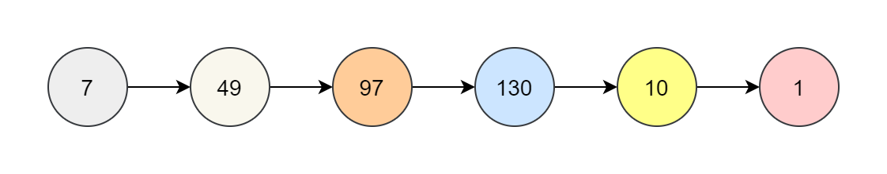

## 赎金信
### 题目
给你两个字符串：ransomNote 和 magazine ，判断 ransomNote 能不能由 magazine 里面的字符构成。
如果可以，返回 true ；否则返回 false 。
magazine 中的每个字符只能在 ransomNote 中使用一次。
```
输入：ransomNote = "a", magazine = "b"
输出：false

输入：ransomNote = "aa", magazine = "aab"
输出：true
```
### 思想
- 对 magazine 里的字符使用 map 记录其每个字符的个数
- 遍历 ransomNote，其出现的字符就把对应的map中减1，如果小于1或者没有这个字符则返回false
```
var canConstruct = function(ransomNote, magazine) {
    const map = new Map()
    for (let i=0; i<magazine.length; i++) {
        if (map.has(magazine[i])) {
            map.set(magazine[i], map.get(magazine[i])+1)
        } else {
            map.set(magazine[i], 1)
        }
    }
    for (let j=0; j<ransomNote.length; j++) {
        if (!map.has(ransomNote[j]) || map.get(ransomNote[j]) < 1) {
            return false
        } else {
            map.set(ransomNote[j], map.get(ransomNote[j])-1)
        }
    }
    return true
};
```

## 同构字符串
### 题目
给定两个字符串 s 和 t ，判断它们是否是同构的。

如果 s 中的字符可以按某种映射关系替换得到 t ，那么这两个字符串是同构的。

每个出现的字符都应当映射到另一个字符，同时不改变字符的顺序。不同字符不能映射到同一个字符上，相同字符只能映射到同一个字符上，字符可以映射到自己本身。
```
输入：s = "egg", t = "add"
输出：true

输入：s = "foo", t = "bar"
输出：false

输入：s = "paper", t = "title"
输出：true
```

### 思想
- 成立条件
  - s 中任意一个字符被 t 中唯一字符对应
  - t 中任意一个字符被 s 中唯一字符对应
```
var isIsomorphic = function(s, t) {
    const s2t = {}
    const t2s = {}
    const len = s.length
    for (let i=0; i<len; i++) {
        const S = s[i]
        const T = t[i]
        // 先判断是否存在再判断是否一致
        if ((s2t[S] && s2t[S] !== T) || (t2s[T] && t2s[T] !== S)) {
            return false
        }
        s2t[S] = T
        t2s[T] = S
    }
    return true
};
```

## 单词规律
### 题目
给定一种规律 pattern 和一个字符串 s ，判断 s 是否遵循相同的规律。

这里的 遵循 指完全匹配，例如， pattern 里的每个字母和字符串 s 中的每个非空单词之间存在着双向连接的对应规律。

```
输入: pattern = "abba", s = "dog cat cat dog"
输出: true

输入:pattern = "abba", s = "dog cat cat fish"
输出: false

输入: pattern = "aaaa", s = "dog cat cat dog"
输出: false
```
### 思想
注意不仅 pattern 的任意唯一字符与 t 中单词对应，t中任意单词也要跟 pattern 中任意字符对应，所以需要两个 map
```
var wordPattern = function(pattern, s) {
    s = s.split(' ')
    let index = 0
    if (pattern.length !== s.length) return false
    length = pattern.length
    const p2sMap = new Map()
    const s2pMap = new Map()
    while(index < length) {
        const P = pattern[index]
        const S = s[index]
        if ((p2sMap.has(P) && p2sMap.get(P) !== S) || (s2pMap.has(S) && s2pMap.get(S) !== P)) {
            return false
        }
        p2sMap.set(P, S)
        s2pMap.set(S, P)
        index++
    }
    return true
};
```

## 有效的字母异位词
### 题目
给定两个字符串 s 和 t ，编写一个函数来判断 t 是否是 s 的字母异位词。

注意：若 s 和 t 中每个字符出现的次数都相同，则称 s 和 t 互为字母异位词。
```
输入: s = "anagram", t = "nagaram"
输出: true

输入: s = "rat", t = "car"
输出: false
```
### 思想
- 只需要s和t中字符出现的次数相等即可
- 可以使用排序加对比，也可以使用 hash 记录字符对比
```
var isAnagram = function (s, t) {
    const sMap = new Map()
    const tMap = new Map()
    if (s.length !== t.length) return false
    let index = 0
    while (index < s.length) {
        const S = s[index]
        const T = t[index]
        if (sMap.has(S)) {
            sMap.set(S, sMap.get(S) + 1)
        } else {
            sMap.set(S, 1)
        }
        if (tMap.has(T)) {
            tMap.set(T, tMap.get(T) + 1)
        } else {
            tMap.set(T, 1)
        }
        index++
    }
    for (const [key, value] of sMap.entries()) {
        if (tMap.get(key) !== value) return false
    }
    return true
}
```

## 快乐数
### 题目
编写一个算法来判断一个数 n 是不是快乐数。
快乐数」 定义为：

- 对于一个正整数，每一次将该数替换为它每个位置上的数字的平方和。
- 然后重复这个过程直到这个数变为 1，也可能是 无限循环 但始终变不到 1。
- 如果这个过程 结果为 1，那么这个数就是快乐数。
如果 n 是 快乐数 就返回 true ；不是，则返回 false 。

```
输入：n = 19
输出：true
解释：
12 + 92 = 82
82 + 22 = 68
62 + 82 = 100
12 + 02 + 02 = 1

输入：n = 2
输出：false
```

### 思想




存在三种可能

- 最终会得到1
- 最终会进入循环
- 值会越来越大，最后接近无穷大（不会发生）

解决方案：

1. 哈希记录是否循环
2. 快慢指针判断是否循环
   - 如果是一个快乐数，那么没有循环，快跑者会比慢跑者先到达1
   - 如果不是一个快乐数，那么快跑者和慢跑者将在同一个数字上相遇

- 哈希

  ```
  var isHappy = function(n) {
      const set = new Set()
      // 如果不是快乐数字且哈希没有记录
      while(n !== 1 && !set.has(n)) {
          set.add(n)
          // 下一次平方和
          n = getNext(n)
      }
      return n === 1
  };
  
  const getNext = function(n) {
      let total = 0
      while(n>0) {
          const d = n % 10
          n = Math.floor(n / 10)
          total += d*d
      }
      return total
  }
  ```

- 快慢指针

  ```
  var isHappy = function(n) {
      // 慢指针在第一个
      let slowRunner = n
      // 快指针在第二个
      let fastRunner = getNext(n)
      // 只要快指针还不是1且快慢指针没有重叠
      while(fastRunner !== 1 && slowRunner !== fastRunner) {
          // 慢指针走一个
          slowRunner = getNext(slowRunner)
          // 快指针走两个
          fastRunner = getNext(getNext(fastRunner))
      }
      return fastRunner === 1
  };
  
  const getNext = function(n) {
      let total = 0
      while(n>0) {
          const d = n % 10
          n = Math.floor(n / 10)
          total += d*d
      }
      return total
  }
  ```

## 存在重复元素 II
### 题目
给你一个整数数组 nums 和一个整数 k ，判断数组中是否存在两个 不同的索引 i 和 j ，满足 nums[i] == nums[j] 且 abs(i - j) <= k 。如果存在，返回 true ；否则，返回 false 。
```
输入：nums = [1,2,3,1], k = 3
输出：true

输入：nums = [1,0,1,1], k = 1
输出：true

输入：nums = [1,2,3,1,2,3], k = 2
输出：false
```
### 思想

- 只要存在两个相同的值且索引的差值在k的范围内即可

- 可以使用 map 记录每个值的索引

  - 如果map记录过，则比较索引差值
    - 如果索引差值在范围内，则符合
    - 否则更新map记录的索引
  - 否则记录

  ```
  var containsNearbyDuplicate = function(nums, k) {
      const map = new Map()
      for (let i=0; i<nums.length; i++) {
          const cur = nums[i]
          if (map.has(cur)) {
              if(i - map.get(cur) <= k) {
                  return true
              } else {
                  map.set(cur, i)
              }
          } else {
              map.set(cur, i)
          }
      }
      return false
  };
  ```

## 字母异位词分组（中等）
### 题目
给你一个字符串数组，请你将 字母异位词 组合在一起。可以按任意顺序返回结果列表。

字母异位词 是由重新排列源单词的所有字母得到的一个新单词。
```
输入: strs = ["eat", "tea", "tan", "ate", "nat", "bat"]
输出: [["bat"],["nat","tan"],["ate","eat","tea"]]

输入: strs = [""]
输出: [[""]]

输入: strs = ["a"]
输出: [["a"]]
```

### 思想
1. 排序
2. 计数

- 排序

  - 第一种写法
  
  ```
  var groupAnagrams = function (strs) {
      const map = new Map()
      const result = []
      let index = 0
      for (let i = 0; i < strs.length; i++) {
          // 对字符串排序
          const cur = strs[i].split('').sort().join('')
          if (map.has(cur)) {
              // 如果map已经存在这个key，则获取下标加入结果集
              const index = map.get(cur)
              result[index].push(strs[i])
          } else {
              map.set(cur, index)
              result.push([strs[i]])
              index++
          }
      }
      return result
  }
  ```
  
  - 第二种写法
  
  ```
  var groupAnagrams = function (strs) {
      const map = new Map()
      for (let str of strs) {
          // 转成数组进行排序
          let array = Array.from(str)
          array.sort()
          // 转成字符串
          let key = array.toString()
          // 如果map存在key对应的值则使用否则新建数组
          let list = map.get(key) ? map.get(key) : new Array()
          list.push(str)
          map.set(key, list)
      }
      // map 转成数组即可
      return Array.from(map.values())
  }
  ```
  
- 计数

  - js 中使用 `charCodeAt()` 方法用于返回指定索引处字符的 Unicode 码点值
  - 使用数组配合 `charCodeAt()` 记录下标位置，这样的话即使是不一样的排序，其数组都是相同的

  ```
  var groupAnagrams = function (strs) {
      const map = {}
      for (let str of strs) {
          const count = new Array(26).fill(0)
          for (let c of str) {
              // 减去 a的差值减少长度，记录下标出现个数
              count[c.charCodeAt() - 'a'.charCodeAt()]++
          }
          map[count] ? map[count].push(str) : map[count] = [str]
      }
      // 对象转成数组
      return Object.values(map)
  }
  ```


## 最长连续序列
### 题目
给定一个未排序的整数数组 nums ，找出数字连续的最长序列（不要求序列元素在原数组中连续）的长度。

请你设计并实现时间复杂度为 **O(n)** 的算法解决此问题。
```
输入：nums = [100,4,200,1,3,2]
输出：4
解释：最长数字连续序列是 [1, 2, 3, 4]。它的长度为 4。

输入：nums = [0,3,7,2,5,8,4,6,0,1]
输出：9
```

### 思想
- 枚举数组中每个数 x, 不断尝试 x+1,x+2... 是否存在，即以升序的方式查找是否连续，更新连续长度即可
```
var longestConsecutive = function(nums) {
    // 使用set存储nums，也可以使用数组的方式通过存储，后续通过下标判断是否存在即可
    const set = new Set()
    for (const num of nums) {
        set.add(num)
    }
    let longestStreak = 0
    for (const num of nums) {
        // 优化：即如果其前一个存在，则可以跳过，因为我们以升序的方式查找一定会找到
        if (!set.has(num - 1)) {
            let currentStreak = 1
            let currentNum = num
            // 以升序的方式查找，更新当前连续值
            while(set.has(currentNum+1)) {
                currentNum++
                currentStreak++
            }
            longestStreak = Math.max(longestStreak, currentStreak)
        }
    }
    return longestStreak
};
```
