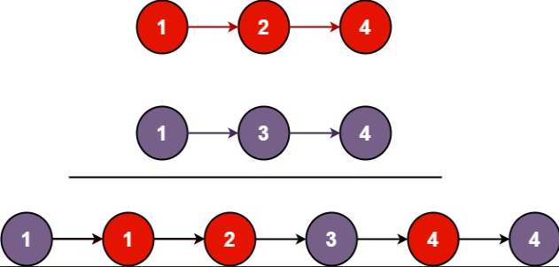
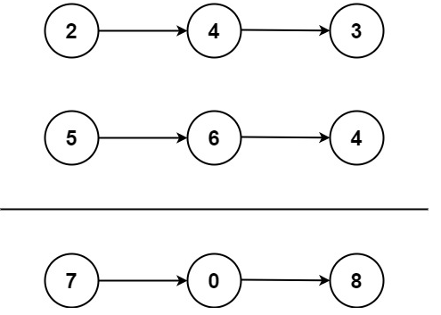
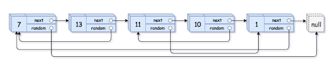
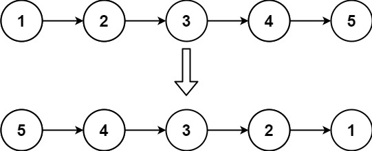

## 环形链表

### 题目

给你一个链表的头节点 head ，判断链表中是否有环。

如果链表中有某个节点，可以通过连续跟踪 next 指针再次到达，则链表中存在环。 为了表示给定链表中的环，评测系统内部使用整数 pos 来表示链表尾连接到链表中的位置（索引从 0 开始）。注意：pos 不作为参数进行传递 。仅仅是为了标识链表的实际情况。

如果链表中存在环 ，则返回 true 。 否则，返回 false 。


```
输入：head = [3,2,0,-4], pos = 1
输出：true
解释：链表中有一个环，其尾部连接到第二个节点。
```

### 思想

- 哈希

  - 遍历一遍记录是否出现过

  ```
  var hasCycle = function(head) {
      const set = new Set()
      while(head !== null) {
          if (set.has(head)) {
              return true
          }
          set.add(head)
          head = head.next
      }
      return false
  };
  ```

- 快慢指针

  - 利用快慢指针，慢指针走一步，快指针走两步
  - 如果快指针为null或者其next为null则代表没有环，其走到了尽头
  - 否则快慢指针一定会相遇

  ```
  var hasCycle = function(head) {
      if (head === null || head.next === null) {
          return false 
      }
      let slow = head
      let fast = head.next
      while (slow !== fast) {
          if (fast === null || fast.next === null) {
              return false
          }
          slow = slow.next
          fast = fast.next.next
      }
      return true
  };
  ```

## 合并两个有序链表

### 题目

将两个升序链表合并为一个新的 **升序** 链表并返回。新链表是通过拼接给定的两个链表的所有节点组成的。 



```
输入：l1 = [1,2,4], l2 = [1,3,4]
输出：[1,1,2,3,4,4]
```

### 思想

- 迭代

  ```
  var mergeTwoLists = function(list1, list2) {
      // 头节点
      let prehead = new ListNode(-1)
      let prev = prehead
      // 从做到右两两比较
      while(list1 !== null && list2!== null) {
          // 取小的节点
          if (list1.val <= list2.val) {
              prev.next = list1
              list1 = list1.next
          } else {
              prev.next = list2
              list2 = list2.next
          }
          prev = prev.next
      }
      // 剩下其中一条没有遍历完的
      prev.next = list1 === null ? list2 : list1
      return prehead.next
  };
  ```

 ## 两数相加（中等）
 ### 题目
 给你两个 非空 的链表，表示两个非负的整数。它们每位数字都是按照 逆序 的方式存储的，并且每个节点只能存储 一位 数字。

请你将两个数相加，并以相同形式返回一个表示和的链表。

你可以假设除了数字 0 之外，这两个数都不会以 0 开头。 



```
输入：l1 = [2,4,3], l2 = [5,6,4]
输出：[7,0,8]
解释：342 + 465 = 807.
```

### 思想

- 创建一个头节点
- 两两节点相加，保存进位数给到下一次使用
- 可能最后一次的进一是链表末尾相加得到的，所以这里需要特殊处理

```
var addTwoNumbers = function(l1, l2) {
	// 头节点
    let prehead = new ListNode(-1)
    let prev = prehead
    let carry = 0
    while(l1 || l2) {
    	// 收集两两节点和进位数的值
        const num1 = l1 ? l1.val : 0
        const num2 = l2 ? l2.val : 0
        const sum = num1 + num2 + carry
        // prev 后移
        prev.next = new ListNode(sum % 10)
        prev = prev.next
        // 进位数
        carry = Math.floor(sum / 10)
        if (l1) {
            l1 = l1.next
        }
        if (l2) {
            l2 = l2.next
        }
    }
    if (carry>0) {
        prev.next = new ListNode(carry)
    }
    return prehead.next
};
```

## 复制带随机指针的链表(中等)
### 题目
给你一个长度为 n 的链表，每个节点包含一个额外增加的随机指针 random ，该指针可以指向链表中的任何节点或空节点。

构造这个链表的 深拷贝。 深拷贝应该正好由 n 个 全新 节点组成，其中每个新节点的值都设为其对应的原节点的值。新节点的 next 指针和 random 指针也都应指向复制链表中的新节点，并使原链表和复制链表中的这些指针能够表示相同的链表状态。复制链表中的指针都不应指向原链表中的节点 。

例如，如果原链表中有 X 和 Y 两个节点，其中 X.random --> Y 。那么在复制链表中对应的两个节点 x 和 y ，同样有 x.random --> y 。

返回复制链表的头节点。

用一个由 n 个节点组成的链表来表示输入/输出中的链表。每个节点用一个 [val, random_index] 表示：

- val：一个表示 Node.val 的整数。
- random_index：随机指针指向的节点索引（范围从 0 到 n-1）；如果不指向任何节点，则为  null 。
你的代码 只 接受原链表的头节点 head 作为传入参数。



```
输入：head = [[7,null],[13,0],[11,4],[10,2],[1,0]]
输出：[[7,null],[13,0],[11,4],[10,2],[1,0]]
```

### 思想

- 回溯+哈希表

  ```
  var copyRandomList = function (head, cachedNode = new Map()) {
    if (head === null) {
      return null;
    }
    if (!cachedNode.has(head)) {
      cachedNode.set(head, { val: head.val });
      Object.assign(cachedNode.get(head), {
        next: copyRandomList(head.next, cachedNode),
        random: copyRandomList(head.random, cachedNode),
      });
    }
    return cachedNode.get(head);
  };
  ```
  

## 反转链表

### 题目

给你单链表的头节点 `head` ，请你反转链表，并返回反转后的链表。



```
输入：head = [1,2,3,4,5]
输出：[5,4,3,2,1]
```

### 思想

- 迭代

  假设链表为 1→2→3→∅，我们想要把它改成 ∅←1←2←3。

  - 在遍历链表时，将当前节点的 **next** 指针改为指向前一个节点。
  - 由于节点没有引用其前一个节点，因此必须事先存储其前一个节点。
  - 在更改引用之前，还需要存储后一个节点。最后返回新的头引用。

```
var reverseList = function(head) {
    // 前一个节点
    let prev = null
    // 当前节点
    let curr = head
    while(curr) {
        // 获取下一个节点next
        const next = curr.next
        // 将当前节点指向前一个节点（反转）
        curr.next = prev
        // 存储当前节点与下一节点，继续反转
        prev = curr
        curr = next
    }
    return prev
};
```

- 递归

  - 假设链表为： n1→…→nk−1→nk→nk+1→…→nm→∅
  - 若从节点 nk+1 到 nm 已经被反转，而我们正处于 nk，*n*1→…→nk*−1→*nk*→*nk+1←…←nm
  - 我们希望nk+1的下一个节点指向nk，所以nk.next.next = nk

  ```
  var reverseList = function(head) {
      // 终止条件：当链表为空或只有一个节点时，直接返回该节点
      if (head === null || head.next == null) return head
      
      // 递归反转剩余部分
      const newHead = reverseList(head.next)
  
      // 将当前节点的下一个节点的 next 指针指向当前节点，实现反转
      head.next.next = head
      head.next = null
  
      // 返回反转后的链表头节点
      return newHead
  };
  ```

  
