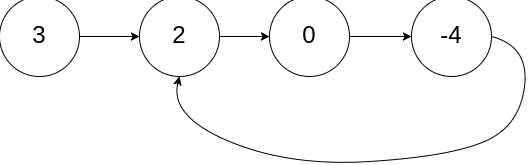

## 环形链表

### 题目

给你一个链表的头节点 head ，判断链表中是否有环。

如果链表中有某个节点，可以通过连续跟踪 next 指针再次到达，则链表中存在环。 为了表示给定链表中的环，评测系统内部使用整数 pos 来表示链表尾连接到链表中的位置（索引从 0 开始）。注意：pos 不作为参数进行传递 。仅仅是为了标识链表的实际情况。

如果链表中存在环 ，则返回 true 。 否则，返回 false 。



```
输入：head = [3,2,0,-4], pos = 1
输出：true
解释：链表中有一个环，其尾部连接到第二个节点。
```

### 思想

- 哈希

  - 遍历一遍记录是否出现过

  ```
  var hasCycle = function(head) {
      const set = new Set()
      while(head !== null) {
          if (set.has(head)) {
              return true
          }
          set.add(head)
          head = head.next
      }
      return false
  };
  ```

- 快慢指针

  - 利用快慢指针，慢指针走一步，快指针走两步
  - 如果快指针为null或者其next为null则代表没有环，其走到了尽头
  - 否则快慢指针一定会相遇

  ```
  var hasCycle = function(head) {
      if (head === null || head.next === null) {
          return false 
      }
      let slow = head
      let fast = head.next
      while (slow !== fast) {
          if (fast === null || fast.next === null) {
              return false
          }
          slow = slow.next
          fast = fast.next.next
      }
      return true
  };
  ```

## 合并两个有序链表

### 题目

将两个升序链表合并为一个新的 **升序** 链表并返回。新链表是通过拼接给定的两个链表的所有节点组成的。 


```
输入：l1 = [1,2,4], l2 = [1,3,4]
输出：[1,1,2,3,4,4]
```

### 思想

- 迭代

  ```
  var mergeTwoLists = function(list1, list2) {
      // 头节点
      let prehead = new ListNode(-1)
      let prev = prehead
      // 从做到右两两比较
      while(list1 !== null && list2!== null) {
          // 取小的节点
          if (list1.val <= list2.val) {
              prev.next = list1
              list1 = list1.next
          } else {
              prev.next = list2
              list2 = list2.next
          }
          prev = prev.next
      }
      // 剩下其中一条没有遍历完的
      prev.next = list1 === null ? list2 : list1
      return prehead.next
  };
  ```

 ## 两数相加（中等）
 ### 题目
 给你两个 非空 的链表，表示两个非负的整数。它们每位数字都是按照 逆序 的方式存储的，并且每个节点只能存储 一位 数字。

请你将两个数相加，并以相同形式返回一个表示和的链表。

你可以假设除了数字 0 之外，这两个数都不会以 0 开头。 


```
输入：l1 = [2,4,3], l2 = [5,6,4]
输出：[7,0,8]
解释：342 + 465 = 807.
```

### 思想

- 创建一个头节点
- 两两节点相加，保存进位数给到下一次使用
- 可能最后一次的进一是链表末尾相加得到的，所以这里需要特殊处理

```
var addTwoNumbers = function(l1, l2) {
	// 头节点
    let prehead = new ListNode(-1)
    let prev = prehead
    let carry = 0
    while(l1 || l2) {
    	// 收集两两节点和进位数的值
        const num1 = l1 ? l1.val : 0
        const num2 = l2 ? l2.val : 0
        const sum = num1 + num2 + carry
        // prev 后移
        prev.next = new ListNode(sum % 10)
        prev = prev.next
        // 进位数
        carry = Math.floor(sum / 10)
        if (l1) {
            l1 = l1.next
        }
        if (l2) {
            l2 = l2.next
        }
    }
    if (carry>0) {
        prev.next = new ListNode(carry)
    }
    return prehead.next
};
```

