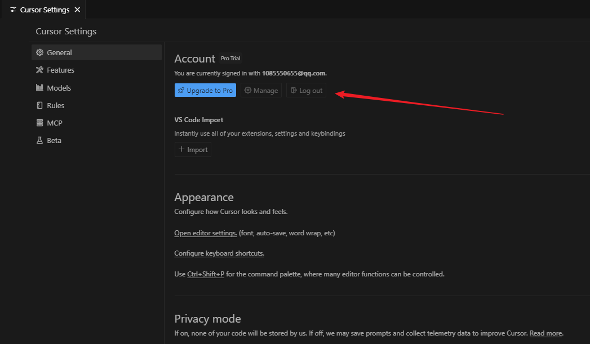
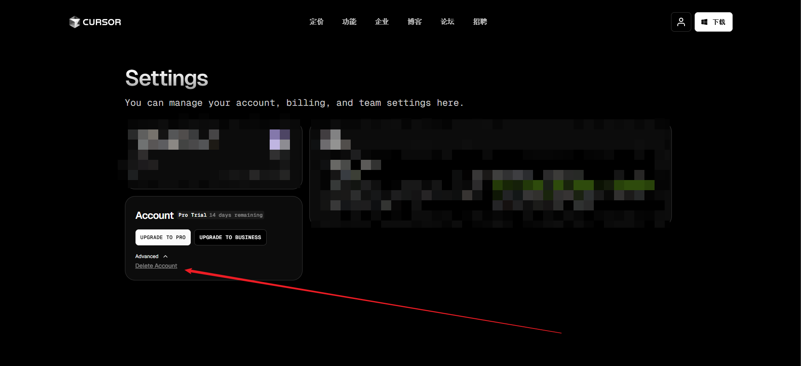

## windows

1. 在 Cursor IDE 中退出当前登录的账号
   

2. 完全关闭 Cursor IDE

3. 以管理员身份打开命令提示符或 PowerShell

4. 复制粘贴执行以下命令：

```
powershell -ExecutionPolicy Bypass -Command "[Net.ServicePointManager]::SecurityProtocol = [Net.SecurityProtocolType]::Tls12; iwr -Uri 'https://raw.githubusercontent.com/hamflx/cursor-reset/main/reset.ps1' -UseBasicParsing | iex"
```

5. 重置完成后打开 Cursor IDE，**使用新的账号登录（不要使用之前的账号）**

   如果脚本卡在"正在等待 Cursor 进程退出..."，可以在管理员权限的命令行中执行以下命令强制结束所有 Cursor 进程：

   ```
   taskkill /f /im cursor.exe
   ```

6. 如何删除cursor账号

   链接：https://www.cursor.com/cn/settings

   

## macOS

1. 在 Cursor IDE 中退出当前登录的账号
2. 完全关闭 Cursor IDE
3. 打开终端，执行以下命令：

```
curl -fsSL https://raw.githubusercontent.com/hamflx/cursor-reset/main/reset.sh | bash
```

4. 启动 Cursor 并使用新账号登录（不要使用之前的账号）

如果需要恢复到原始状态，可以使用以下命令：

```
curl -fsSL https://raw.githubusercontent.com/hamflx/cursor-reset/main/reset.sh | bash -s -- --restore
```

如果脚本卡在"正在等待 Cursor 进程退出..."，可以在终端中执行以下命令强制结束 Cursor 进程：

```
pkill -9 Cursor
```

