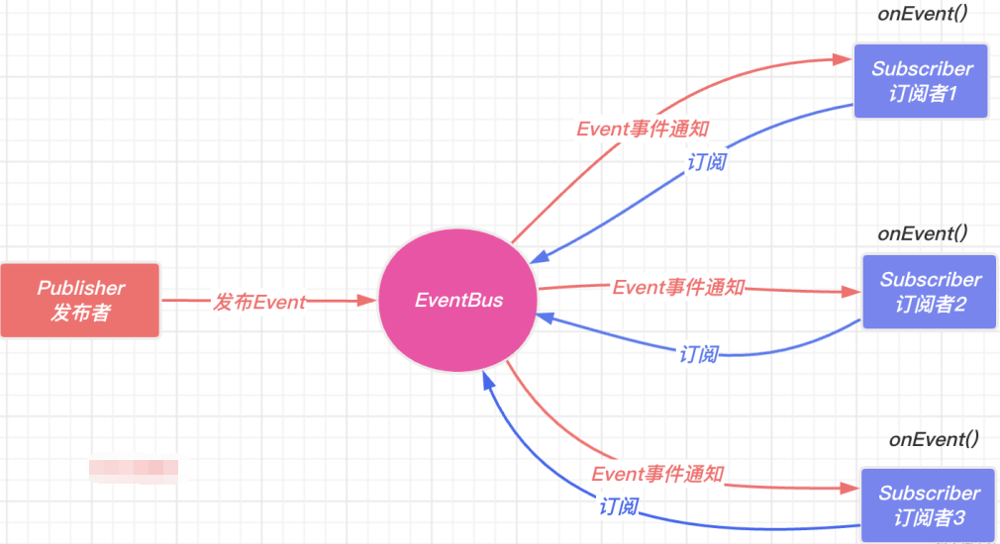

## 什么是 EventBus

EventBus 事件总线是发布订阅设计模式的应用。多个模块 `module1`，`module2`，`module3`都订阅了事件 `EventA` ，然后我们在 `module4` 中通过事件总线发布事件 `EventA` ，事件总线会通知所有订阅者`module1`，`module2`，`module3`，它们收到消息会执行对应函数逻辑，注意这里通知的时候还可以传递 `extraArgs` 参数



## eventMap 结构

- eventName 对应的是一个对象，再通过把callbackId 作为属性值的作用是可以通过此属性值取消该订阅
- 以`one${callbackId}`通过添加前缀的形式，实现触发后匹配到前缀移除监听

```
{
	eventName: {
		callbackId | `one${callbackId}`: callback
	}
}
```

## 完整实现

```
class EventBus {
    constructor(maxListeners) {
        // 用来存储发布订阅事件的集合
        this.eventMap = {}
        // 最大监听数量
        this.maxListeners = maxListeners || Infinity
        // 监听函数唯一id
        this.callbackId = 0
    }

    /**
     * 订阅事件
     * @param {事件名称} eventName
     * @param {事件函数} funCallback
     */
    subscribe(eventName, funCallback) {
        // 判断是否订阅过,没有订阅过则初始化
        if (!Reflect.has(this.eventMap, eventName)) {
            Reflect.set(this.eventMap, eventName, {})
        }
        // 判断是否超过了最大监听数
        if (Object.keys(this.eventMap[eventName]).length >= this.maxListeners) {
            console.warn(`该事件${eventName}超过了最大监听数`)
        }

        const thisCallbackId = this.callbackId++
        this.eventMap[eventName][thisCallbackId] = funCallback
        // 用于取消定于的函数
        const unSubscribe = () => {
            // 根据 callbackId 取消订阅对应的 funCallback
            delete this.eventMap[eventName][thisCallbackId]
            // 如果一个事件下的 funCallback 为空，清理掉 eventName
            if (Object.keys(this.eventMap[eventName].length === 0)) {
                delete this.eventMap[eventName]
            }
        }
        return {
            unSubscribe
        }
    }

    subscribeOne(eventName, funCallback) {
        // 判断是否订阅过,没有订阅过则初始化
        if (!Reflect.has(this.eventMap, eventName)) {
            Reflect.set(this.eventMap, eventName, {})
        }
        // 判断是否超过了最大监听数
        if (Object.keys(this.eventMap[eventName]).length >= this.maxListeners) {
            console.warn(`该事件${eventName}超过了最大监听数`)
        }

        const theCallbackId = `one${this.callbackId}`
        this.eventMap[eventName][theCallbackId] = funCallback
        // 取消订阅
        const unSubscribe = () => {
            // 根据 callbackId 去取消订阅对应的 callback
            delete this.eventMap[eventName][theCallbackId]
            // 如果一个事件下的 funCallback 为空，清理掉 eventName
            if (Object.keys(this.eventMap[eventName].length === 0)) {
                delete this.eventMap[eventName]
            }
        }
        return {
            unSubscribe
        }
    }

    /**
     * 发布事件
     * @param {事件名称} eventName
     * @param {事件执行额外参数} args
     */
    emit(eventName, ...args) {
        if (!Reflect.has(this.eventMap, eventName)) {
            console.warn(`从未订阅过此事件${eventName}`)
            return
        }
        const callbackList = this.eventMap[eventName]

        if (Object.keys(callbackList).length === 0) {
            console.warn(`事件${eventName}无函数可执行`)
            return
        } else {
            for (const [id, callback] of Object.entries(callbackList)) {
                callback.call(this, ...args)
                if (id.startsWith('one')) {
                    delete callbackList[id]
                }
            }
        }
    }

    /**
     * 清空某个事件名称下所有的回调函数
     * @param {事件名称} eventName
     * @returns
     */
    clear(eventName) {
        if (!eventName) {
            console.warn(`需提供要被清除的事件名称${eventName}`)
            return
        }
        // delete this.eventMap[eventName]
        Reflect.defineProperty(this.eventMap, eventName)
    }

    /**
     * 清空事件监听函数
     */
    clearAll() {
        this.eventMap = {}
    }
}
```

## 测试

```
const eventBus = new EventBus(2)
const fun1 = function () {
    console.log('111', ...arguments)
}
const fun2 = function () {
    console.log('222')
}
const fun3 = function () {
    console.log('333')
}
const fun4 = function () {
    console.log('444')
}

// subscribe订阅一次，触发多次
eventBus.subscribe('testName1', fun1)
eventBus.emit('testName1', '参数1')
eventBus.emit('testName1', '参数1')

// 订阅多次触发一次
eventBus.subscribe('testName2', fun2)
eventBus.subscribe('testName2', fun2)
eventBus.emit('testName2')

//  unSubscribe 取消订阅
const { unSubscribe } = eventBus.subscribe('testName3', fun3)
unSubscribe()
eventBus.emit('testName3')

// subscribeOne 订阅一次只能触发一次
eventBus.subscribeOne('testName4', fun4)
eventBus.emit('testName4')
eventBus.emit('testName4')

/**
 * 111  参数1
 * 111 参数1
 * 222
 * 222
 * 从未订阅过此事件testName3
 * 444
 * 事件testName4无函数可执行
 */
```

