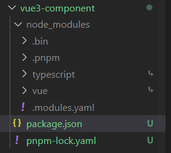

## 什么是 Monorepo（单仓库多模块）
Monorepo 是一种项目代码管理方式，指单个仓库中管理多个项目，有助于简化代码共享、版本控制、构建和部署等方面的复杂性，并提供更好的可重用性和协作性。Monorepo 提倡了开放、透明、共享的组织文化，这种方法已经被很多大型公司广泛使用，如 Google、Facebook 和 Microsoft。

## 与 MultiRepo(多仓库多模块)对比

| **场景**   | **MultiRepo**                                                | **MonoRepo**                                                 |
| ---------- | ------------------------------------------------------------ | ------------------------------------------------------------ |
| 代码可见性 | ✅ 代码隔离，研发者只需关注自己负责的仓库<br/>❌ 包管理按照各自owner划分，当出现问题时，需要到依赖包中进行判断并解决。 | ✅ 一个仓库中多个相关项目，很容易看到整个代码库的变化趋势，更好的团队协作。<br/>❌ 增加了非owner改动代码的风险 |
| 依赖管理   | ❌ 多个仓库都有自己的 node_modules，存在依赖重复安装情况，占用磁盘内存大。 | ✅ 多项目代码都在一个仓库中，相同版本依赖提升到顶层只安装一次，节省磁盘内存， |
| 代码权限   | ✅ 各项目单独仓库，不会出现代码被误改的情况，单个项目出现问题不会影响其他项目。 | ❌ 多个项目代码都在一个仓库中，没有项目粒度的权限管控，一个项目出问题，可能影响所有项目。 |
| 开发迭代   | ✅ 仓库体积小，模块划分清晰，可维护性强。<br/>❌ 多仓库来回切换（编辑器及命令行），项目多的话效率很低。多仓库见存在依赖时，需要手动 `npm link`，操作繁琐。<br/>❌ 依赖管理不便，多个依赖可能在多个仓库中存在不同版本，重复安装，npm link 时不同项目的依赖会存在冲突。 | ✅ 多个项目都在一个仓库中，可看到相关项目全貌，编码非常方便。<br/>✅ 代码复用高，方便进行代码重构。<br/>❌ 多项目在一个仓库中，代码体积多大几个 G，`git clone`时间较长。<br/>✅ 依赖调试方便，依赖包迭代场景下，借助工具自动 npm link，直接使用最新版本依赖，简化了操作流程。 |
| 工程配置   | ❌ 各项目构建、打包、代码校验都各自维护，不一致时会导致代码差异或构建差异。 | ✅ 多项目在一个仓库，工程配置一致，代码质量标准及风格也很容易一致。 |
| 构建部署   | ❌ 多个项目间存在依赖，部署时需要手动到不同的仓库根据先后顺序去修改版本及进行部署，操作繁琐效率低。 | ✅ 构建性 Monorepo 工具可以配置依赖项目的构建优先级，可以实现一次命令完成所有的部署。 |

## 为什么用pnpm
- 磁盘空间的节省：相同的文件只会存储一次，避免了冗余的存储，尤其是在多个项目共享依赖项时
- 快速的依赖项安装：由于文件已经存在于 store 中，所以安装依赖项时可以直接使用已有的文件，而无需下载和解压，从而提高了安装速度
  - npm3 之前是嵌套结构，npm3 之后是扁平结构
  - 嵌套结构的问题
    - 安装时间延长
    - 重复安装包,磁盘空间占用
    - 冗余的依赖项
  - 扁平结构问题
    - 依赖结构的不确定性（不同包依赖某个包的不同版本 最终安装的版本具有不确定性）可通过lock文件确定安装版本
    - 扁平化算法复杂，耗时
    - 非法访问未声明的包(幽灵依赖)
- 支持 monorepo

## 使用

```
npm i pnpm -g // 全局安装pnpm
pnpm init // 初始化package.json配置⽂件 私有库
pnpm install vue typescript // 全局下添加依赖
```

只有package.json 中依赖声明了的vue与typescript会在node_modules的根目录下，其余的在 .pnpm目录下。



使⽤pnpm必须要建⽴.npmrc⽂件，shamefully-hoist = true，否则安装的模块⽆法放置到node_modules⽬录下

**.npmrc**

```
shamefully-hoist = true
```

**安装子模块到根目录**

```
pnpm install @××× -w 
```

