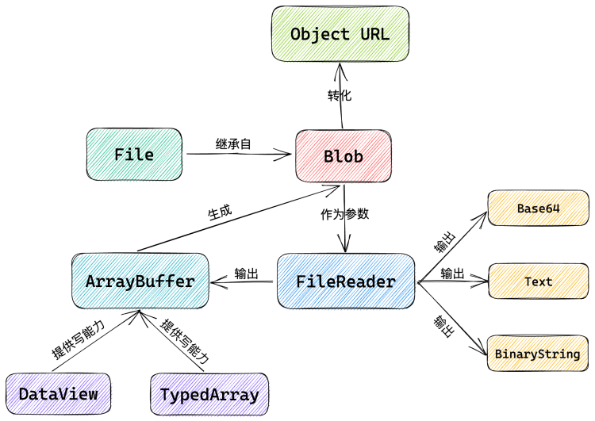
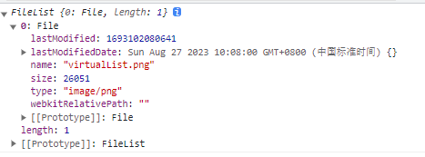
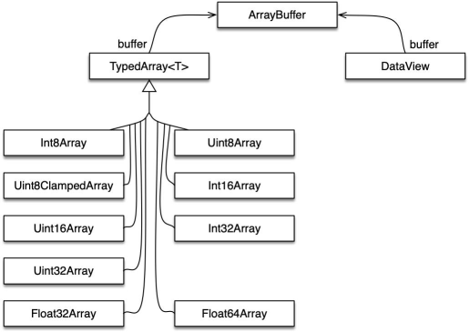
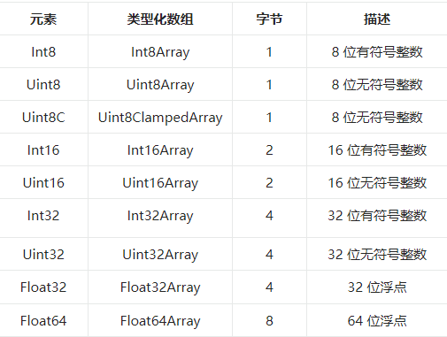
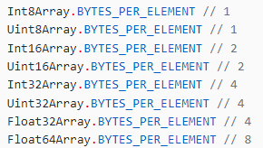
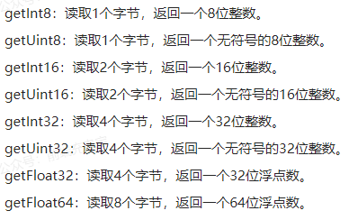
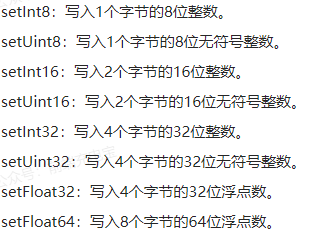

## 二进制

javaScript 提供了一些 API 来处理文件或原始数据，例如

- File
- Blob
- FileReader
- ArrayBuffer
- base64



## Blob
1. 定义
2. 创建
3. 常见 MIME 类型
4. 分片


- 定义
  - Blob 即 binary large object, 二进制大对象，表示原始的类似文件的数据
  - MDN: Blob 对象表示一个不可变、原始数据的类文件对象。其数据可以按照文本或二进制进行读取，也可以转换成 ReadableStream 来用于数据操作。
  - 实际上，Blob 对象是包含有只读原始数据的类文件对象，简单概括就是一个不可修改的二进制文件

- Blob 创建
  - `new Blob(array, options)`
  - `array`：由`ArrayBuffer`、`ArrayBufferView`、`Blob`、`DOMString`、等对象构成，将会被放进`Blob`
  - `options`: 可选的`BlobPropertyBag`字典，可能指定如下两个属性
    - `type`: 默认值为`""`，表示将会放入到`blob`中的数组内容的 MIME 类型
    - endings：默认值为`transparent`, 用于指定包含行结束符`\n`的字符串如何被写入，不常用
  
  ```
  const blob = new Blob(['Hello World'], { type: 'text/plain' })
  const url = URL.createObjectURL(blob)
  
  console.log(blob.size) // 11
  console.log(blob.type) // text/plain
  console.log(url) // blob:null/d2286794-367f-432a-aee8-ef4043ae03da
  ```
  
  
  
- 常见 MIME 类型

  |  常见 MIME 类型  |      描述       |
  | :--------------: | :-------------: |
  |    text/plain    |   纯文本文档    |
  |    text/html     |    HTML文档     |
  | text/javascript  | JavaScript 文件 |
  |     text/css     |    css 文件     |
  | application/json |    JSON文件     |
  | application/pdf  |     PDF文件     |
  | application/xml  |     XML文件     |
  |    image/jpeg    |    JPEG图像     |
  |    image/png     |     PNG图像     |
  |    image/gif     |     GIF图像     |
  |  image/svg+xml   |     SVG图像     |
  |    audio/mpeg    |     MP3文件     |
  |    video/mpeg    |     MP4文件     |

- Blob 分片

  ```
  const blob = new Blob(['Hello World'], { type: 'text/plain' })
  // 分片
  const subBlob = blob.slice(0, 5)
  console.log(subBlob.size) // 5
  ```

## File

1. 定义
2. input
3. 文件拖放

- 定义

  - `File` 对象是特殊类型的`Blob`，可以用在任意的`Blob`类型的`context`中
  - `Blob`的属性和方法都可以用于`File`对象中
  - 主要通过两种方法来获取`File`对象
    - `<input>`元素上选择文件后返回的`FileList`对象
    - 文件拖放操作生成的`DataTransfer`对象

- input

  - FileList 是一个数组，每个元素都是一个File对象
  - File 对象包含文件的一些属性，继承自 Blob 对象
    - lastModified：引用文件最后修改日期，为自1970年1月1日0:00以来的毫秒数
    - lastModifiedDate：引用文件最后修改日期
    - name：名称
    - size：大小
    - type：文件的媒体类型(MIME)
    - webkitRelativePath: 文件的路径或URL

  ```
  <input type="file" id="fileInput" multiple="multiple">
  
  const fileInput = document.getElementById('fileInput')
  fileInput.onchange = (e) => {
  	console.log(e.target.files)
  }
  ```

  

- 文件拖放

  ```
  <div id="drop-zone">拖放上传区域</div>
  
  // 文件拖放
  const dropZone = document.getElementById('drop-zone')
  dropZone.ondragover = e => {
  	e.preventDefault()
  }
  dropZone.ondrop = e => {
  	e.preventDefault()
  	const files = e.dataTransfer.files
  	console.log(files)
  }
  ```


## FileReader

1. 定义
2. 基本使用
3. 事件处理

- 定义

  - FileReader 是一个异步 API, 用于读取文件并提供其内容以供进一步使用
  - 其可以将 Blob 读取为不同的格式

- 基本使用

  ```
  const reader = new FileReader()
  ```

  - 常用属性如下

    - error： 读取文件时发生错误

    - result：文件内容

    - readyState：FileReader 状态的数字

      | 常量名  |  值   |      描述      |
      | :-----: | :---: | :------------: |
      |  EMPTY  |   0   | 还没有加载数据 |
      | LOADING |   1   |  数据正在加载  |
      |  DONE   |   2   |    完成读取    |

  - 加载文件方法

    - `readAsArrayBuffer()`：读取指定`Blob`中的内容，完成之后，`result`属性中保存的是被读取文件的`ArrayBuffer`数据对象
    - `readAsBinaryString()`：读取指定`Blob`中的内容，完成之后，`result`属性中保存的是被读取文件的原始二进制数据
    - `FileReader.readAsDataURL()`：读取指定`Blob`中的内容，完成之后，`result`属性中将包含一个`data:URL`格式的 `Base 64`字符串以表示所读取文件的内容
    - `FileReader.readAsText()`：读取指定`Blob`中的内容，完成之后，`result`属性中将包含一个字符串以表示所读取的文件内容

- 事件处理

  - abort: 中断
  - error： 错误
  - load： 完成读取
  - progress：在读取Blob时触发
  - 这些方法可以加上前置的on在HTML元素上使用
  - 由于`FileReader`对象继承自`EventTarget`，因此可以使用`addEventListener()监听上述事件`

  ```
  <input type="file" id="fileInput" multiple="multiple">
  
  const fileInput = document.getElementById('fileInput')
  const reader = new FileReader()
  
  fileInput.onchange = e => {
      // 作为text读取
      // reader.readAsText(e.target.files[0])
      // 作为 url 读取
      reader.readAsDataURL(e.target.files[0])
  }
  reader.onload = e => {
  	console.log(e.target.result)
  }
  ```

## ArrayBuffer

1. 定义
2. ArrayBuffer 常用属性方法
3. TypedArray
4. DataView

- 定义

  - 表示通用的、固定长度的**原始二进制数据缓冲区**

  - 与Blob 区别

    - Blob 作为一个整体文件，适用于传输
    - 当需要对二进制数据进行操作时，比如要修改某一段数据时，就可以使用ArrayBuffer

  - ArrayBuffer 内容不能直接操作，只能通过`DataView`对象或者`TypedArray`对象来访问，这些对象用于读取和写入缓冲区内容

  - ArryBuffer 本身就是一个黑盒，不能直接读写所存储数据，需要借助一下视图对象来读写

    - TypedArray: 用来生成内存的视图，通过9个构造函数，可以生成9种数据格式的视图
    - DataViews: 用来生成内存的视图，可以自定义格式和字节序

    

- ArrayBuffer 常用属性方法

  - `new ArrayBuffer(bytelength)`
  - `ArrayBuffer.prototype.byteLength`
  - `ArrayBuffer.prototype.slice()`
  - `ArrayBuffer.isView()`
    - 用来判断参数是否是TypedArray 实例或者 DataView 实例

  ```
  const buffer = new ArrayBuffer(16)
  console.log(buffer.byteLength) // 16
  const newBuffer = buffer.slice(0, 8)
  console.log(newBuffer) // ArrayBuffer(8)
  console.log(ArrayBuffer.isView(buffer)) // false
  const view = new Uint32Array(buffer)
  console.log(ArrayBuffer.isView(view)) // true
  ```

- TypeDArray

  - TypedArray 对象一共提供9种类型的视图，每一种视图都是一种构造函数

    
    
  - `new TypedArray(buffer[, byteoffset[,length]])`
  
  - `BYTES_PER_ELEMENT`： 表示每种数据类型占据的字节数
  
    
  
  - `TypedArray.prototype.buffer`
  
  - `TypedArray.prototype.slice()`
  
  - `byteLength` ：返回 TypedArray 占据的内存长度，单位为字节
  
  - `length`：返回TypeArray 元素个数
  
  ```
  let viewInt8 = new Int8Array(16)
  viewInt8[0] = 10
  console.log(viewInt8)
  console.log(Int8Array.BYTES_PER_ELEMENT) // 1
  const viewInt32 = new Int32Array(viewInt8)
  console.log(viewInt32.buffer) // ArrayBuffer(64)
  console.log(viewInt8.slice(0, 1))
  console.log(viewInt8.length) // 16
  console.log(viewInt8.byteLength) // 16
  ```
  
- DataView

  - `new DataView(buffer, [,byteOffset[,byteLength]])`

    - `buffer`：一个已存在的`ArrayBuffer`对象，`DataView`对象数据源
    - `byteOffset`: 偏移量
    - `byteLength`: 字节长度

  - 读取内存

    

  - 写入内存

    

  ```
  const dataView = new DataView(new ArrayBuffer(16))
          console.log(dataView)
          console.log(dataView.getUint8(0))
  ```

## Object URL

1. 定义
2. createObjectURL
3. revokeObjectURL

- 定义

  - 用来表示File Object 或 Blob Object 的 URL

    