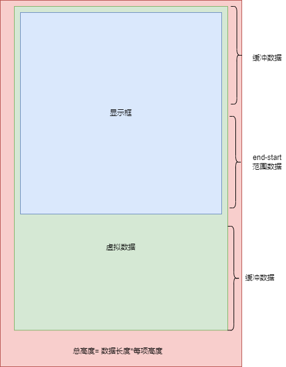

## 实现原理

- 两种实现思路

  1. 使用定位+translate3d实现

     - remain:  展示个数
     - items: 数据
     - size: 元素高度
     - vl：显示框，其高度等于 remain*size,这里设置为relative
     - scroll-bar: 总高度，其高度等于 items.length*remain
     - scroll-list: 渲染区，其设置translate3d 用于标识滚动位置

     ```
     <div class="vl">
     	<div class="scroll-bar"></div>
     	<div class="scroll-list">
     		<div></div>
     	</div>
     </div>
     ```

  2. 使用上下padding

     - dataSource: 总数据
     - keeps： 展示个数
     - estimateSize: 元素高度
     - dataKey: 元素标识
     - buffer: 缓存区，这里设置为keeps/3
     - 这里的padding用于撑起整个数据的高度，例如dataSource:100,keeps: 30, estimateSize: 80,则默认展示30个数据，剩下的70个数据的高度需要用70*estimateSize 的结果赋值为下padding撑开

     ```
     <div class="virtual-list">
      <div style="padding:×××">
      	<div></div>
      </div>
     <div>
     ```

     



## translate 实现

- render函数

  ```
  <div class={bem.b()} ref={wrapperRef} onScroll={handleScroll}>
  	{/* 模拟总长度，感觉有很多数据 */}
  	<div class={bem.e('scroll-bar')} ref={barRef}></div>
  	<div
  		class={bem.e('scroll-list')}
  		style={{ transform: `translate3d(0, ${offset.value}px, 0)` }}
  	>
  		{visibleData.value.map((node, idx) => slots.default!({ node }))}
  	</div>
  </div>
  ```

- 核心逻辑

  - prev：前置缓冲区数量，取最小值确保不超过需要的数量
  - next：后置缓冲区数量，取最小值确保不超过剩余数据量
  - visibleData
    - state.start - prev.value: 开始-前置缓冲
    - state.end+next.value: 开始+后置缓冲
    - 这样就可以展示的时候多加上缓冲区，在快速滚动的时候不会导致白屏
  - handleScroll
    - scrollTop: 获取滚动条偏移量
    - state.start: 根据滚动条偏移量/子项高度即得到开始下标
    - state.end: 开始下标+展示个数得到结束下标
    - offset：（ 开始下标-前置数量）* 子项高度等到需要translate3d的值

  ```
  const wrapperRef = ref<HTMLElement>()
  const barRef = ref<HTMLElement>()
  
  // 计算显示的区域
  const state = reactive({
      start: 0,
      end: props.remain
  })
  // 偏移量：滚动过去了多少个
  const offset = ref(0)
  
  const prev = computed(() => {
  	return Math.min(state.start, props.remain)
  })
  const next = computed(() => {
  	return Math.min(props.remain, props.items.length - state.end)
  })
  
  // 这里应该多展示上八条和下八条(两屏)，保证快速滚动不会白屏
  const visibleData = computed(() => {
  	return props.items.slice(state.start - prev.value, state.end + next.value)
  })
  
  // 监听滚动
  const handleScroll = throttle(() => {
      // 根据当前滚动的距离来算过去了几个数据
      const scrollTop = wrapperRef.value!.scrollTop
      // 滚动后的开始位置
      state.start = Math.floor(scrollTop / props.size)
      // 滚动后的结束位置
      state.end = state.start + props.remain
      // 滚动过去了多少个（- props.size * prev.value）：减去前面补的
      offset.value = state.start * props.size - props.size * prev.value
  }, 17)
  
  const initWrapper = () => {
      wrapperRef.value!.style.height = `${props.remain * props.size}px`
      barRef.value!.style.height = `${props.items.length * props.size}px`
  }
  
  watch(
      () => props.items,
      () => {
      	initWrapper()
      }
  )
  
  onMounted(() => {
  	initWrapper()
  })
  ```


## padding 实现固定高度

- render 函数

  ```
  return () => {
      // 从范围变量中获取上下padding并设置
      const { padBehind, padFront } = range.value!
      const paddingStyle = {
      	padding: `${padFront}px 0 ${padBehind}px`
      }
      return (
          <div onScroll={onScroll} ref={root}>
          	<div style={paddingStyle}>{genRenderComponent()}</div>
          </div>
      )
  }
  ```

- 核心逻辑

  - installVirtual 中传入初始数据和更新函数，返回一个对象一个对象virtual，包括了处理滚动等方法
  - 滚动事件使用virtual.handleScroll 处理

  ```
  // 定义范围变量
  const range = ref<RangeOptions | null>(null)
  // 方法对象
  let virtual: ReturnType<typeof initVirtual>
  // 列表 ref
  const root = ref<HTMLElement | null>(null)
  
  // 获取数据源id数组
  const getUniqueIdFromDataSources = () => {
      const { dataSources, dataKey } = props
      return dataSources.map(dataSource => dataSource[dataKey])
  }
  
  // 更新范围
  const update: updateType = newRange => {
  	range.value = newRange
  }
  
  // 初始化范围
  const installVirtual = () => {
      // 初始化范围
      virtual = initVirtual(
      {
          keeps: props.keeps,
          buffer: Math.round(props.keeps / 3),
          uniqueIds: getUniqueIdFromDataSources(),
          estimateSize: props.estimateSize
      },
      	update
      )
  }
  // 根据范围更新渲染的组件
  function genRenderComponent() {
      const slots = []
      const { start, end } = range.value!
      const { dataSources, dataComponent, dataKey } = props
      for (let index = start; index <= end; index++) {
          const dataSource = dataSources[index]
          const uniqueKey = dataSource[dataKey]
          if (dataComponent) {
              slots.push(
              <dataComponent key={uniqueKey} source={dataSource}></dataComponent>
              )
          }
      }
      return slots
  }
  // 滚动事件
  const onScroll = throttle(() => {
      if (root.value) {
          // 获取滚动卷去的高度
          const offset = root.value.scrollTop
          virtual.handleScroll(offset)
      }
  }, 16.7)
  
  // 挂载前计算范围
  onBeforeMount(() => {
  	installVirtual()
  })
  ```

- 核心逻辑-virtual

  - handleScroll
    - handleFront: 向上滑动
    - handleBehind：向下滑动
  - getScrollOvers：通过滚动条偏移量/元素高度=滚动过的个数
  - getEndByStart: 根据开始下标计算结束下标
  - handleFront
    - 如果滚动的个数>开始下标，则表示没有超出不用处理
    - 如果超出了开始下标，则减去缓冲区数量得到新的开始下标
    - 通过checkRange 检查范围
  - handleBehind
    - 如果划过的还在缓冲区里则不用处理
    - 一旦草住缓冲区，把偏移量作为开始下标重新计算
  - checkRange
    - 如果数据长度达不到结束下标，则调整结束下标为数据长度
    - 如果结尾的下标与开始下标达不到渲染个数，重新赋值开始下标
    - 调用updateRange 更新范围
  - updateRange
    - 调用 getPadFront（预估高度*开始下标）得到上padding
    - 调用getPadBehind(剩余数据长度*预估高度)得到下padding

  ```
  import { RangeOptions, VirtualOptions, updateType } from './props'
  
  export function initVirtual(param: VirtualOptions, update: updateType) {
    // 初始化范围参数
    const range: RangeOptions = {
      start: 0,
      end: 0,
      padFront: 0,
      padBehind: 0
    }
    let offsetValue: number = 0
    // 获取上paddining
    function getPadFront() {
      // padding-top = 预估高度 * 显示开始下标
      return param.estimateSize * range.start
    }
    // 获取下padding
    function getPadBehind() {
      // 全部数据末尾下标
      const lastIndex = param.uniqueIds.length - 1
      // padding-bottom = (全部数据末尾下标-显示结束下标) * 预估高度
      return (lastIndex - range.end) * param.estimateSize
    }
    function checkRange(start: number, end: number) {
      // 所有的数据长度
      const total = param.uniqueIds.length
      // 页面渲染的个数
      const keeps = param.keeps
      // 如果所有的数据长度还达不到渲染的个数，则结束下标是数据长度结束下标
      if (total < keeps) {
        start = 0
        end = total - 1
      } else if (end - start < keeps - 1) {
        // 如果结尾下标与开始下标的差值达不到渲染个数，重新赋值开始下标
        start = end - keeps + 1
      }
      updateRange(start, end)
    }
    // 根据开始与结束下标更新范围
    function updateRange(start: number, end: number) {
      range.start = start
      range.end = end
      range.padFront = getPadFront()
      range.padBehind = getPadBehind()
      update({ ...range })
    }
    // 获取滑动的个数
    function getScrollOvers() {
      // 通过 滚动条滚动长度/预估高度 向下取整得到滑动的元素个数
      return Math.floor(offsetValue / param.estimateSize)
    }
    // 向上滚动处理函数
    function handleFront() {
      // 获取划过个数
      const overs = getScrollOvers()
      // 如果上滑时滑动的没有超过开始下标，无需更新，比如start： 0， 上一次overs是5这次滑动到4
      if (overs > range.start) {
        return
      }
      // 如果超出了开始下标，则减去缓冲区数量得到开始下标，不能小于0
      const start = Math.max(overs - param.buffer, 0)
      checkRange(start, getEndByStart(start))
    }
    // 向下滚动处理函数
    function handleBehind() {
      // 获取划过个数
      const overs = getScrollOvers()
      if (overs < range.start + param.buffer) {
        // 如果划过的还在缓冲区里则不用处理
        return
      }
      // 一旦超出了缓存区，则把滚动的个数作为开始下标计算即可
      checkRange(overs, getEndByStart(overs))
    }
    // 根据开始下标计算结束下标
    function getEndByStart(start: number) {
      // 计算后的结束下标 = 开始下标 + 渲染个数
      const computedEnd = start + param.keeps - 1
      // 由总数可能小于计算出来的结束下标，所以需要取二者较小值
      const end = Math.min(computedEnd, param.uniqueIds.length - 1)
      return end
    }
    // 滚动处理函数
    function handleScroll(offset: number) {
      // 和上一次滚动的高度对比确定方向，FRONT: 向上滚动 BEHIND: 向下滚动
      const direction = offset < offsetValue ? 'FRONT' : 'BEHIND'
      offsetValue = offset
      if (direction === 'FRONT') {
        handleFront()
      } else if (direction === 'BEHIND') {
        handleBehind()
      }
    }
    // 初始化检查范围
    checkRange(0, param.keeps - 1)
    return {
      handleScroll
    }
  }
  ```

## padding 进一步实现动态高度

- 原理

  - 在每个item渲染完成后收集其id与高度映射，如果是动态高度的，则更新平均值
  - 在获取滑动的个数时，如果是动态高度，则使用二分查找最近的那个即可

- render 函数

  ```
  function onItemResize(id: string | number, size: number) {
  	virtual.saveSize(id, size)
  }
  
  function genRenderComponent() {
       ...
            
       slots.push(
           <VirtualItem
           uniqueKey={uniqueKey}
           source={dataSource}
           component={dataComponent}
           onItemResize={onItemResize}
           ></VirtualItem>
       )
        return slots
  }
  ```

- VirtualItem

  - 在挂载和更新完毕后重新派发`itemResize`

  ```
  import { defineComponent, onMounted, onUpdated, ref } from 'vue'
  import { virtualItemProps } from './props'
  
  export default defineComponent({
    name: 'virtual-item',
    props: virtualItemProps,
    emits: ['itemResize'],
    setup(props, { emit }) {
      const root = ref<HTMLElement | null>(null)
  
      const dispatchEvent = () => {
        emit('itemResize', props.uniqueKey, root.value?.offsetHeight)
      }
  
      onMounted(dispatchEvent)
      onUpdated(dispatchEvent)
      return () => {
        const { component: Com, source, uniqueKey } = props
        return (
          Com && (
            <div key={uniqueKey} ref={root}>
              <Com source={source}></Com>
            </div>
          )
        )
      }
    }
  })
  ```

- 核心逻辑

  - saveSize： 保存id->高度的映射
    - 初始化时记录第一个为固定高度
    - 如果存在高度有变化的，为动态高度
    - 如果是动态高度的，使用映射表计算其平均高度
  - getScrollOvers
    - 如果是固定高度则返回（滚动条偏移量/定值）
    - 否则使用二分法，获取最接近的下标，这个作为滚动到的个数
  - getIndexOffSet
    - 如果映射表中有对应的id高度，则使用对应的，否则使用平均或者预估的
    - 这样就能得出精确的上padding

  ```
  const enum CALC_TYPE {
    INIT = 'INIT', // 初始
    FIXED = 'FIXED', // 固定
    DYNAMIC = 'DYNAMIC' // 动态
  }
  export function initVirtual(param: VirtualOptions, update: updateType) {
  	...
  	// 初始化元素方式
      let calcType = CALC_TYPE.INIT
      // 默认元素固定高度
      let fixedSizeVal = 0
      // 初始化滚动条偏移量
      let offsetValue: number = 0
      // 收集id=>高度 映射
      const sizes = new Map<string | number, number>()
      // 元素渲染后的高度平均值
      let firstRangeAvg = 0
  
      // 判断是否是固定高度
      function isFixed() {
        return calcType === CALC_TYPE.FIXED
      }
  
      // 获取单个元素高度
      function getEstimateSize() {
        // 如果是固定高度，则使用固定高度
        // 否则使用平均值或者预期值
        return isFixed() ? fixedSizeVal : firstRangeAvg || param.estimateSize
      }
      // 获取上paddining
      function getPadFront() {
        // padding-top = 预估高度 * 显示开始下标
        // 准确计算上偏移量
        if (isFixed()) {
          return getEstimateSize() * range.start
        } else {
          // 将滚动后的元素累加一遍计算上高度
          return getIndexOffSet(range.start)
        }
      }
      // 累计计算上偏移量
      function getIndexOffSet(idx: number) {
        if (!idx) return 0
        let offset = 0
        for (let i = 0; i < idx; i++) {
          let indexSize = sizes.get(param.uniqueIds[i])
          offset += typeof indexSize === 'number' ? indexSize : getEstimateSize()
        }
        return offset
      }
      // 获取下padding
      function getPadBehind() {
        // 全部数据末尾下标
        const lastIndex = param.uniqueIds.length - 1
        // padding-bottom = (全部数据末尾下标-显示结束下标) * 预估高度
        return (lastIndex - range.end) * getEstimateSize()
      }
      function saveSize(id: string | number, size: number) {
        // 保存id=>size 映射
        sizes.set(id, size)
        if (calcType === CALC_TYPE.INIT) {
          // 如果是初始化，则记录 fixedSizeVal
          fixedSizeVal = size
          calcType = CALC_TYPE.FIXED
        } else if (calcType === CALC_TYPE.FIXED && fixedSizeVal !== size) {
          // 如果不是初始化且高度变化则是动态高度
          calcType = CALC_TYPE.DYNAMIC
          fixedSizeVal = 0
        }
        if (calcType === CALC_TYPE.DYNAMIC) {
          // 如果是动态高度,根据已经加载的数据算一个平均值来撑开滚动条
          // 根据当前展示的数据，来计算一个滚动条的值
          if (sizes.size < Math.min(param.keeps, param.uniqueIds.length)) {
            firstRangeAvg = Math.round(
              [...sizes.values()].reduce((acc, val) => acc + val, 0) / sizes.size
            )
          }
        }
      }
  }
  ```

  

## 使用

- playVirtualScrollList.vue

  ```
  <script setup lang="ts">
  import { Random } from 'mockjs'
  import { ref } from 'vue'
  import playItem from './playItem.vue'
  import { DefineComponent } from 'vue'
  const totalCount = 100
  interface DataType {
    id: number,
    name: string,
    desc: string,
    index: number
  }
  const data: Array<DataType> = []
  let index = 0
  while (index++ !== totalCount) {
    data.push({
      id: index,
      name: Random.name(),
      desc: Random.csentence(20, 120),
      index
    })
  }
  const items = ref<Array<DataType>>(data)
  console.log(items)
  </script>
  
  <template>
    <z-virtual-scroll-list class="virtual-list" :data-sources="items" data-key="id" :keeps="30" :estimateSize="80"
      :data-component="(playItem as DefineComponent<{}, {}, any>)">
    </z-virtual-scroll-list>
  </template>
  
  <style lang="scss">
  .virtual-list {
    width: 100%;
    height: 500px;
    overflow-y: scroll;
    border: 1px solid red;
  }
  </style>
  ```

  

- playItem.vue

  ```
  <template>
    <div class="item" :data-index="source.index">
      <div class="head" :style="{ color: 'red', fontWeight: 'bold', fontSize: '35px' }">
        <span>
          {{ source.index }}
        </span>
        <span>
          {{ source.name }}
        </span>
      </div>
      <div class="body" :style="{ fontSize: '18px' }">
        <span>{{ source.desc }}</span>
      </div>
    </div>
  </template>
  
  <script lang="ts" setup>
  defineProps({
    source: {
      type: Object,
      default: () => { }
    }
  })
  </script>
  ```

  