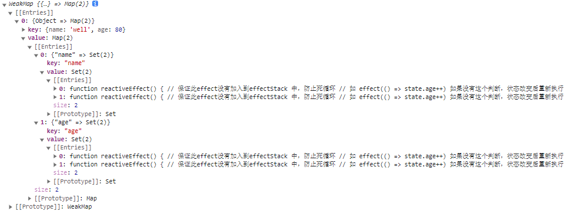

## vue3整体架构


## 环境搭建

### 安装依赖

```
yarn add typescript rollup rollup-plugin-typescript2 @rollup/plugin-node-resolve @rollup/plugin-json @rollup/plugin-commonjs minimist execa@4 --ignore-workspace-root-check
```

|            依赖             |           作用            |
| :-------------------------: | :-----------------------: |
|         typescript          |  在项目中支持Typescript   |
|           rollup            |         打包工具          |
|  rollup-plugin-typescript2  |    rollup 和 ts的 桥梁    |
|     @rollup/plugin-json     |       支持引入json        |
| @rollup/plugin-node-resolve |    解析node第三方模块     |
|   @rollup/plugin-commonjs   | 将CommonJS转化为ES6Module |
|          minimist           |      命令行参数解析       |
|           execa@4           |        开启子进程         |

### monorepo

```
yarn workspace @vue/reactivity add @vue/shared@1.0.0
```

## Reactive

- reactive: 深层响应式代理。
- shallowReactive：浅层响应式代理，只有根属性具有响应式。
- readonly: 深层只读代理。
- shallowReadonly：浅层只读代理，只有根属性只读。

### shared

- isObject
- extend

```
export const isObject = (value: unknown):boolean => typeof value === "object" && value !== null;

export const extend = Object.assign
```

### reactive

#### index.ts

- 导出 reactive、shallowReactive、readonly、shallowReadonly

```
export {
    reactive,
    shallowReactive,
    readonly,
    shallowReadonly
} from './reactive'
```

#### reactive.ts

- 通过`createReactiveObject` 柯里化通过配置结合Proxy生成代理对象并返回代理对象。
  - target：目标对象。
  - isReadonly：通过这个区分使用不同的缓存对象。
  - baseHandlers：配置 Proxy 的 getter setter。
- 使用WeakMap 会自动垃圾回收，不会造成内存泄漏，存储的key只能是对象。
- 剩下的看 baseHandlers，这个在调用 createReactiveObject 时传入，具体看 baseHandlers.ts。

```
import { isObject } from "@vue/shared";
import {
  mutableHandlers,
  readonlyHandlers,
  shallowReactiveHandlers,
  shallowReadonlyHandlers,
} from "./baseHandlers";

export function reactive(target) {
  return createReactiveObject(target, false, mutableHandlers);
}

export function shallowReactive(target) {
  return createReactiveObject(target, false, shallowReactiveHandlers);
}

export function readonly(target) {
  return createReactiveObject(target, true, readonlyHandlers);
}

export function shallowReadonly(target) {
  return createReactiveObject(target, true, shallowReadonlyHandlers);
}

// 代理缓存
// WeakMap 会自动垃圾回收，不会造成内存泄漏，存储的key只能是对象
const reactiveMap = new WeakMap();
const readonlyMap = new WeakMap();

/**
 * 柯里化 new Proxy() 最核心的需要拦截
 * @param target 目标对象
 * @param isReadonly boolean  是不是仅读
 * @param baseHandlers
 */
export function createReactiveObject(
  target: object,
  isReadonly: boolean,
  baseHandlers: object
) {
  // 如果目标不是对象，没法拦截了 reactive 这个 api 只能拦截对象
  if (!isObject(target)) return target;

  // 使用 proxy 代理, 将要代理的对象合对应的结果进行缓存
  // 如果某个对象已经代理过了，就不要再次代理
  // 可能一个对象 被代理是深度的 又被仅读代理了
  const proxyMap = isReadonly ? readonlyMap : reactiveMap;
  const existProxy = proxyMap.get(target);
  // 如果已经被代理了直接返回即可
  if (existProxy) return existProxy;
  const proxy = new Proxy(target, baseHandlers);
  proxyMap.set(target, proxy);

  return proxy;
}
```

####  baseHandlers.ts

- createGetter：通过配置生成不同的`getter`函数。
  - isReadonly: 是否仅读。
  - shallow: 是否浅层代理。
  - 使用`Reflect`反射获取值。
  - 如果是非仅读的，进行依赖收集，等会数据变化后更新对应视图。
  - 如果是浅层的直接返回值。
  - 如果是对象，则进行递归代理（vue2是初始化就直接递归代理，vue3是取值时会进行代理（懒代理））。
- createSetter
  - 使用`Reflect`反射设置值并返回boolean标识是否设置成功。
- Relect 的优点
  - 后续Object的方法属性会往Reflect迁移。
  - 如果用target[key] = value 方式设置值可能会失败，并不会报异常，也没有返回值标识。
  - Reflect 方法具备返回值,判断是否设置成功。
- readonlyObj
  - 用于readonly 的 setter。

```
import { extend, isObject } from "@vue/shared";
import { reactive, readonly } from "./reactive";

// Relect 的优点
// 1.后续Object的方法属性会往Reflect迁移
// 2.如果用target[key] = value 方式设置值可能会失败，并不会报异常，也没有返回值标识
// 2.Reflect 方法具备返回值

// 是否是仅读的，是的话set时会报异常
// 是否是深度的
function createGetter(isReadonly: boolean = false, shallow: boolean = false) {
  // target: 目标对象 key: 属性名 receiver: Proxy
  return function get(target, key, receiver) {
    // 使用 reflect获取结果
    // target: 需要取值的目标对象 key: 需要获取的值的键值 receiver: 如果target对象中指定了getter，receiver则为getter调用时的this值
    // 相当于 target[key]
    const res = Reflect.get(target, key, receiver);

    // 如果是非仅读的，进行依赖收集，等会数据变化后更新对应视图
    if (!isReadonly) {
    }

    // 如果是浅层的
    if (shallow) return res;
    // vue2是初始化就直接递归代理，vue3是取值时会进行代理（懒代理）
    if (isObject(res)) {
      return isReadonly ? readonly(res) : reactive(res);
    }

    return res;
  };
}

function createSetter(isShallow: boolean = false) {
  // target: 目标对象 key: 属性名 value: 新属性值 receiver: Proxy
  return function set(target, key, value, receiver) {
    // target: 需要取值的目标对象 key: 需要获取的值的键值 value: 设置的值 receiver: 如果target对象中指定了getter，receiver则为getter调用时的this值
    const result = Reflect.set(target, key, value, receiver);
    return result;
  };
}

// 生成 getter
const get = createGetter();
const shallowGet = createGetter(false, true);
const readonlyGet = createGetter(true);
const shallowReadonlyGet = createGetter(true, true);

// 生成 setter
const set = createSetter();
const shallowSet = createSetter(true);

// readonly Setter
const readonlyObj = {
  set: (target, key) => {
    console.warn(`set ${target} on key ${key} failed`);
  },
};

export const mutableHandlers = {
  get,
  set,
};
export const shallowReactiveHandlers = {
  get: shallowGet,
  set: shallowSet,
};
export const readonlyHandlers = extend({
  get: readonlyGet
}, readonlyObj);
export const shallowReadonlyHandlers = extend({
  get: shallowReadonlyGet,
}, readonlyObj);

```

#### 1.reactive.html

```
<script>
  let { reactive, shallowReactive, readonly, shallowReadonly } = VueReactivity
  let stateReactive = reactive({
      name: 'well',
      info: {
          age: 18
      }
  })
        
  let stateShallowReactive = shallowReactive({
      name: 'well',
      info: {
          age: 18
      }
  })

  let stateReadonly = readonly({
      name: 'well',
      info: {
          age: 18
      }
  })
        
  let stateShallowReadonly = shallowReadonly({
      name: 'well',
      info: {
          age: 18
      }
  })

  //  reactive
  stateReactive.info.age = 80
  stateReactive.name = 'wellReactive'
  console.log('reactive', stateReactive.info, stateReactive.name)

  //  shallowReactive
  stateShallowReactive.name = 'wellShallowReactive'
  stateShallowReactive.info.age = 80
  console.log('shallowReactive', stateShallowReactive.info, stateShallowReactiname)

  // shallowReadonly
  stateShallowReadonly.name = 'wellShallowReadonly'
  stateShallowReadonly.info.age = 80
  console.log('shallowReadonly', stateShallowReadonly.info, stateShallowReadonname)

  // readonly
  stateReadonly.name = 'wellReadonly'
  stateReadonly.info.age = 80
  console.log('readonly', stateReadonly.info, stateReadonly.name)
</script>
```

## effect：副作用函数（收集依赖）

- 第一次默认就会执行

- 默认执行时会进行取值操作，只要取值就会调用`getter`，这时候将对应的`effect`函数存放起来，在重写赋值的时候执行对应的`effect`函数就可以实现页面的更新

  ```
  <div id="app"></div>
  <script src="https://unpkg.com/vue@3/dist/vue.global.js"></script>
  <script>
  	const { effect, reactive } = Vue
      let state = reactive({
          name: 'well',
          age: 18
      })
      effect(() => {
          app.innerHTML = `${state.name}${state.age}`
      })
      setTimeout(() => {
          state.age = 80
      }, 1000);
  </script>
  ```


### reactive/index.ts

```
...
export {
    effect
} from './effect'
```

### operators.ts

```
export const enum TrackOpTypes {
    GET
}
```

### effect.ts

- function `effect`

  - 调用`createReactiveEffect`生成一个`effect`,这个`effect`是一个函数，默认执行一次。

- function `createReactiveEffect`

  - 定义`effect`等于一个函数`reactiveEffect`。
  - 这个函数利用`activeEffect`这个变量存储当前的`effect`，供 `track`函数获取。
  - 由于在使用的时候可能会有`effect`中嵌套`effect`的情况，为了保证属性收集的`effect`是正确的，需要用`effectStack`入栈出栈保证`activeEffect`的正确。
  - 执行传入的函数`fn`，这个函数的执行会触发对应的getter函数，这个时候进行依赖的关联（baseHanlers.ts => createGetter(if (!isReadonly)) 分支）

- function `track`

  - `const targetMap = new WeakMap()`全局收集依赖的存储变量。

  - 如果不是`effect`中触发的`getter`进而触发的`track`属性不需要收集依赖
  - 判断此target是否已经存在`targetMap`,如果没存在则创建，其值是一个map，并赋值给depsMap。
  - 从 depsMap 获取 key 对应的值，如果没有则创建并赋值给 dep，其值是一个set数组，用于存放effect数组

```
import { TrackOpTypes } from "./operators";

export function effect(fn: Function, options: any = {}) {
  // 需要让这个 effect 变成响应式的 effect，实现数据变化重新执行
  const effect = createReactiveEffect(fn, options);

  // 响应式的effect默认会先执行一次，如果是lazy不执行
  if (!options.lazy) {
    effect();
  }

  return effect;
}

// 全局 effect，用于存储当前的 effect，供 track 获取
let activeEffect;
/**
 * effect 栈，用于effect 嵌套中获得正确的effect上下文
 * 保证每个属性收集的effect是正确的
 * effect(() => {
 *  state.name // effect1
 *  effect(() => {state.age}) //effect2
 *  state.sex // effect1
 * })
 */
const effectStack = [];
// effect 唯一标识,用于区分 effect
let uid = 0;
function createReactiveEffect(fn, options) {
  const effect = function reactiveEffect() {
    // 保证此effect没有加入到effectStack 中，防止死循环
    // 如 effect(() => state.age++) 如果没有这个判断，状态改变后重新执行会死循环
    if (!effectStack.includes(effect)) {
      try {
        effectStack.push(effect);
        activeEffect = effect;
        // 函数执行时会执行对应的 getter 方法，这个时候进行关联
        // baseHanlers.ts => createGetter(if (!isReadonly)) 分支
        return fn();
      } finally {
        effectStack.pop();
        activeEffect = effectStack[effectStack.length - 1];
      }
    }
  };
  // 唯一标识
  effect.id = uid++;
  // 用于标识这个是响应式effect
  effect._isEffect = true;
  // 记录effect对应的函数
  effect.raw = fn;
  // 记录选项
  effect.options = options;
  return effect;
}

// 收集effect依赖
const targetMap = new WeakMap();

/**
 * 让某个对象中的属性收集对应的effect函数
 * @param target 目标对象
 * @param type 类型
 * @param key 属性
 */
export function track(target: object, type: TrackOpTypes, key: string) {
  // 构建对应的weakMap(key: target value: map(key: key(依赖属性名), value: set[effect1,...]))
  // 没在effect中使用的属性不用收集
  if (activeEffect === undefined) return;
  // 从 targetMap 获取 target 对应的值，如果没有则创建并赋值给 depsMap，其值是一个map，用于存放key => set[effect]
  let depsMap = targetMap.get(target);
  if (!depsMap) {
    targetMap.set(target, (depsMap = new Map()));
  }
  // 从 depsMap 获取 key 对应的值，如果没有则创建并赋值给 dep，其值是一个set数组，用于存放effect数组
  let dep = depsMap.get(key);
  if (!dep) {
    depsMap.set(key, (dep = new Set()));
  }
  // 避免添加重复的
  if (!dep.has(activeEffect)) {
    dep.add(activeEffect)
  }
  console.log(targetMap)
}
```

### baseHandlers.ts

- 在 `effect`的执行时，会触发这里的`getter`函数，在这里调用`track`函数进行依赖的收集。

```
function createGetter(isReadonly: boolean = false, shallow: boolean = false) {
  // target: 目标对象 key: 属性名 receiver: Proxy
  return function get(target, key, receiver) {
    // 使用 reflect获取结果
    // target: 需要取值的目标对象 key: 需要获取的值的键值 receiver: 如果target对象中指定了getter，receiver则为getter调用时的this值
    // 相当于 target[key]
    const res = Reflect.get(target, key, receiver);

    // 如果是非仅读的，进行依赖收集，等会数据变化后更新对应视图
    if (!isReadonly) {
      + console.log("执行 effect 时会取值，收集 effect");
      + // 调用 track 收集依赖
      + track(target, TrackOpTypes.GET, key);
    }

    // 如果是浅层的
    if (shallow) return res;
    // vue2是初始化就直接递归代理，vue3是取值时会进行代理（懒代理）
    if (isObject(res)) {
      return isReadonly ? readonly(res) : reactive(res);
    }

    return res;
  };
}
```

```
<script src="../node_modules/@vue/reactivity/dist/reactivity.global.js"></script>
    <script>
        const { effect, reactive } = VueReactivity
        let state = reactive({
            name: 'well',
            age: 18
        })
        effect(() => {
            app.innerHTML = `${state.name}${state.age}`
        })
        effect(() => {
            app.innerHTML = `${state.name}${state.age}`
        })
        setTimeout(() => {
            state.age = 80
        }, 1000);
    </script>
```




## 触发更新

### operators.ts

```
...
export const enum TriggerOrTypes {
    ADD,
    SET
}
```

### baseHandlers.ts

- 当数据更新时，通知对应属性的收集的`effect`重新执行
- 这里需要区分属性是新增的还是修改的
- 获取旧数据（watch需要旧数据）
- 调用 trigger 收集所有待重新执行的`effect`,统一执行。

```
function createSetter(isShallow: boolean = false) {
  // target: 目标对象 key: 属性名 value: 新属性值 receiver: Proxy
  return function set(target, key, value, receiver) {
    +// 当数据更新时，通知对应属性的 effect 重新执行
    +// 我们要区分是新增的还是修改的
    +// vue2里无法监控更改索引，无法监控数组的长度
    +// 获取未变更的值
    +const oldValue = target[key];
    +// 判断是否存在这个属性
    +let hadKey =
    +  isArray(target) && isIntegerKey(key)
    +   ? Number(key) < target.length
    +    : hasOwn(target, key);

    // target: 需要取值的目标对象 key: 需要获取的值的键值 value: 设置的值 receiver: 如果target对象中指定了getter，receiver则为getter调用时的this值
    const result = Reflect.set(target, key, value, receiver);

    +if (!hadKey) {
    +  // 新增
    +  trigger(target, TriggerOrTypes.ADD, key, value);
    +} else if (hasChanged(oldValue, value)) {
    + // 修改
    +  trigger(target, TriggerOrTypes.SET, key, value, oldValue);
    +}

    return result;
  };
}
```

### effect.ts

- 如果这个属性没有收集过`effect`依赖则不需要继续
- 判断修改的对象是数组且修改的是`length`属性
  - 直接修改数组`length`导致长度变更
  - 通过`push`等操作长度变更
- 收集 `effect`统一执行

```
export function trigger(target, type?, key?, newValue?, oldValue?) {
  console.log(target, type, key, newValue, oldValue);
  // 如果这个属性没有收集过 effect 不需要做任何操作
  const depsMap = targetMap.get(target);
  if (!depsMap) return;

  // 将所有的effect全部暂存到一个新的集合中，最终一起执行
  const effects: Set<Function> = new Set()
  // 添加 effect
  const add = effectsToAdd => {
    if (effectsToAdd) {
      effectsToAdd.forEach(effect => effects.add(effect))
    }
  }

  // 1.判断是否修改数组的长度，修改数组的长度影响较大
  if (key === 'length' && isArray(target)) {
    // 如果对应的长度有依赖收集，则需要更新
    depsMap.forEach((dep, key) => {
      console.log(depsMap, dep, key)
      // 如果更改的长度小于收集的索引，那么这个索引也需要触发effect重新更新（state.arr.length = 1）
      // 如果不是直接更改length，如push的这种，key已经是新增的下标了
      if (key === 'length' || key > newValue) {
        add(dep)
      }
    })
  } else {
    // 2.如果不是修改数组的长度
    if (key !== undefined) {
      add(depsMap.get(key))
    }
    // 如果是修改数组中某一个索引
    switch (type) {
      case TriggerOrTypes.ADD:
        if (isArray(target) && isIntegerKey(key)) {
          add(depsMap.get('length'))
        }
        break;
      default:
        break;
    }
  }
  // 执行所有effect
  effects.forEach(effect => effect())
}
```

## ref

- `ref` 和 `reactive` 的区别
  - reactive 内部采用 proxy
  - ref 内部使用的是 defineProperty
  - ref 是为了解决 reactive 中 proxy 无法处理基本类型

### ref.ts

- RefImpl
  - __v_isRef 标识是一个ref属性
  - _value getter 和setter 的中间变量
  - rawValue：旧值
  - shallow：是否是浅的
  - constructor: 如果是深度的，需要调用`convert`把对象变成响应式
  - getter：调用`track`收集依赖
  - setter：调用`trigger`触发更新，如果是深度的需要需要调用`convert`把对象变成响应式
  - getter、setter 在编译后会转换成`Object.defineProperty`
- convert
  - 如果是对象，调用`reactive`把对象进行代理
- ObjectRefImpl
  - 通过 getter setter 做一个简单的代理

```
import { hasChanged, isArray, isObject } from "@vue/shared";
import { track, trigger } from "./effect";
import { TrackOpTypes, TriggerOrTypes } from "./operators";
import { reactive } from "./reactive";

// value 是一个普通类型或者对象
export function ref(value) {
  // 将普通类型变成一个对象
  return createRef(value);
}

export function shallowRef(value) {
  return createRef(value, true);
}

const convert = (val) => (isObject(val) ? reactive(val) : val);

class RefImpl {
  public _value;
  // 参数的实例添加_v-isRef 表示是一个ref属性
  public _v_isRef = true;
  // 参数中前面增加修饰符 标识此属性放到了实例上
  constructor(public rawValue, public shallow) {
    // 如果是深度的，需要把里面的都变成响应式（使用reactive转换）
    this._value = shallow ? rawValue : convert(rawValue);
  }

  // 类的属性访问器(编译后会自动转成defineProperty)
  get value() {
    track(this, TrackOpTypes.GET, "value");
    return this._value;
  }
  set value(newValue) {
    // 判断老值和新值是否有变化
    if (hasChanged(newValue, this.rawValue)) {
      this.rawValue = newValue;
      this._value = this.shallow ? newValue : convert(newValue);
      trigger(this, TriggerOrTypes.SET, "value", newValue);
    }
  }
}

function createRef(rawValue, shallow: boolean = false) {
  return new RefImpl(rawValue, shallow);
}

// toRef toRefs 只是做了一层代理
class ObjectRefImpl {
  public __v_isRef = true;
  constructor(public target, public key) {}
  get value() {
    return this.target[this.key];
  }
  set value(newValue) {
    this.target[this.key] = newValue;
  }
}

// 将对象的一个属性变成ref类型
export function toRef(target, key) {
  return new ObjectRefImpl(target, key);
}

// object 可能传递的是一个数组或者对象
export function toRefs(object) {
  const ret = isArray(object) ? new Array(object.length) : {};
  for (let key in object) {
    ret[key] = toRef(object, key);
  }
  return ret;
}

```

### 用例

```
<script>
	const { effect, reactive, ref } = VueReactivity
    // 将普通过的类型转化成一个对象，这个对象中value 属性指向原来的值
    // 如果是对象类型，value会是一个proxy对象
    let name = ref('well')
    let info = ref({ age: 18 })
    let state = {
    	sex: 'femal'
    }
    console.log('name', name)
    console.log('info', info)
    effect(() => {
    	app.innerHTML = name.value + info.value.age
    })
    setTimeout(() => {
    	name.value = 'liuguowei'
    	info.value.age = 80
    }, 1000)
</script>
```

```
<script>
    const { effect, reactive, ref, toRef, toRefs } = VueReactivity

    let state = reactive({
        name: 'well',
        age: 18
    })
    let info = {
    	sex: '男'
    }

    let nameRef = toRef(state, 'name')
    // let stateRef = toRefs(state)
    // 可以配合 toRefs 解构，如果不用toRefs解构则失去响应式
    let { age } = toRefs(state)

    effect(() => {
    	app.innerHTML = nameRef.value + age.value
    })
    setTimeout(() => {
        nameRef.value = 'liuguowei'
        age.value = 80
    }, 1000)
</script>
```

```
<script>
    const { createApp, reactive, toRefs } = Vue
    const App = {
    	setup() {
    		let state = reactive({
    			name: 'well',
    			age: 18
    		})
            return {
                ...toRefs(state)
            }
    	}
    }
    createApp(App).mount('#app')
</script>
```

## Es6

### symbol

- symbol 是唯一的
- Reflect.ownKeys
- Reflect.apply
- Symbol.for

```
let s1 = Symbol('well')
let s2 = Symbol('well')
let obj = {
    name: 'liuguowei',
    age: 18,
    [s1]: 'ok'
}

// symbol 是唯一的
console.log(s1 === s2) // false

// 如果一个对象的key的 symbol 的，只能使用Reflect.ownKeys 才能获取
console.log(Object.keys(obj)) // [ 'name', 'age' ]
console.log(Reflect.ownKeys(obj)) // [ 'name', 'age', Symbol(well) ]

const fn = (a, b) => {
    console.log('fn', a, b)
}
fn.apply = function () {
    console.log('apply')
}
// 调用函数本身的apply方法如何调用？
fn.apply() // apply
// 让apply方法中的this指向fn，并让apply方法执行 fn.apply(null, [1,2])
Function.prototype.apply.call(fn, null, [1, 2])
// 使用 Reflect
Reflect.apply(fn, null, [1, 2])

// Symbol.for 定义取值
let s3 = Symbol.for('liuguowei') // 声明全新的
let s4 = Symbol.for('liuguowei') // 把之前声明的拿过来用
console.log(s3 === s4) // true
```

### Set、Map、WeakMap

```
let set = new Set([1, 1, 2, 2, 3, 3, 4, 4])
console.log(set) // Set(4) { 1, 2, 3, 4 }

let map = new Map()
map.set('a', 1)
map.set('a', 1)
console.log(map) // Map(1) { 'a' => 1 }

// weakMap 弱引用，不影响垃圾回收(浏览器控制台中输入)
class MyTest {}
let my = new MyTest()
let weakMap = new WeakMap()
weakMap.set(my, 1)
my = null
// 隔一段时间后会回收
console.log(weakMap) // WeakMap {}
```

## computed

### index.ts

```
// reactivity/src/index.ts
...
export { computed } from './computed'
```

### computed.ts

```
// reactivity/src/computed.ts
import { isFunction } from '@vue/shared'
import { effect, track, trigger } from './effect'
import { TrackOpTypes, TriggerOrTypes } from './operators'

class ComputedRefImpl {
    // 默认取值时不要用缓存
    public _dirty = true
    public _value
    public effect
    // ts 中默认不会挂载到this上
    constructor(
        getter,
        public setter
    ) {
        // 计算属性默认会产生一个effect
        this.effect = effect(getter, {
            lazy: true, // 默认不执行
            scheduler: () => {
                // triggle 触发执行后，把_dirty置为true，再次触发get时候即可再次更新
                if (!this._dirty) {
                    this._dirty = true
                    // 通知依赖进行更新
                    trigger(this, TriggerOrTypes.SET, 'value')
                }
            }
        })
    }
    // 计算属性也要收集依赖
    get value() {
        // 在取值的时候才执行 effect(_dirty)
        if (this._dirty) {
            // 在 effect 执行时，会将用户的返回值返回，这时候可以更新 _value
            this._value = this.effect()
            this._dirty = false
        }
        // 收集此对象的.value属性的依赖
        track(this, TrackOpTypes.GET, 'value')
        return this._value
    }
    set value(newValue) {
        this.setter(newValue)
    }
}

export function computed(getterOrOptions) {
    let getter
    let setter

    if (isFunction(getterOrOptions)) {
        getter = getterOrOptions
        setter = () => {
            console.warn('computed value must be readonly')
        }
    } else {
        getter = getterOrOptions.get
        setter = getterOrOptions.set
    }
    return new ComputedRefImpl(getter, setter)
}

```

### effect.ts

```
export function trigger(target, type?, key?, newValue?, oldValue?) {
	...
	// 执行所有effect
	- effects.forEach(effect => effect())
	+ effects.forEach((effect: any) => {
    +    if (effect.options.scheduler) {
    +        effect.options.scheduler(effect)
    +    } else {
    +        effect()
    +    }
    + })
}
```

### 用例

```
<body>
    <div id="app"></div>
    <!-- <script src="https://unpkg.com/vue@3/dist/vue.global.js"></script> -->
    <script src="../node_modules/@vue/reactivity/dist/reactivity.global.js"></script>
    <script>
        const { ref, computed, effect } = VueReactivity
        // const { ref, computed } = Vue

        const age = ref(18)
        const myAge = computed(() => {
            console.log('getter 执行了')
            return age.value + 10
        })

        /* console.log(myAge.value) // 28
        console.log(myAge.value) // 28

        // // 更新age，myAge 不会立刻重新计算，当执行myAge.value才会重新计算
        age.value = 100

        console.log(myAge.value) // 110 */

        // 当修改了age.value 时，我们也希望触发下面的effect执行
        effect(() => {
            // 此 effect 没有使用 age，所以需要收集其依赖的值
            console.log(myAge.value)
        })
        age.value = 500
    </script>
</body>

</html>
```


## render

### compositionApi 的好处

- 相比optionsApi，由于以前是通过`this`、`data`、`methods`声明，难以做到`tree-sharking`
- 可以把data、computed、watch、methods 在一个文件里自由组合（hooks）

### 模板使用

```
<body>
    <div id="app"></div>
    <script src="https://unpkg.com/vue@3/dist/vue.global.js"></script>
    <script>
        let { createApp, h, reactive } = Vue
        let App = {
            props: {
                name: String
            },
            // 替换 beforeCreate created，只运行一次
            setup(props, context) {

                console.log(props.name) // well
                console.log(context) // {attrs:xxx, emit:xxx, xxx}

                const state = reactive({ count: 1 })
                const fn = () => {
                    state.count++
                }
                
                // render 函数是一个effect，数据变化 render 函数会重新执行
                return (proxy) => {
                    console.log(proxy.name) // well
                    return h('div', { style: { color: 'red' }, onclick: fn }, `hello world ${state.count}`)
                }
            }
        }
        createApp(App, { name: 'well' }).mount('#app')
    </script>
</body>

```

