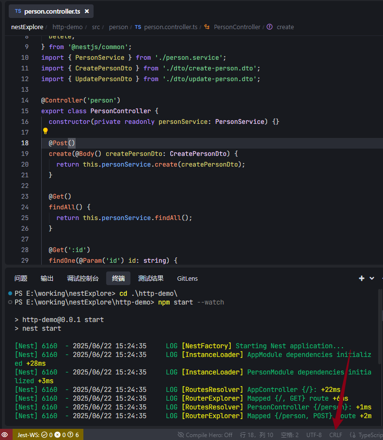

## 换行符格式不一致

### 表现

出现：Delete `␍`eslintprettier/prettier 提示

### 解决方法

#### 1、使用VS code 转换

- 打开存在问题的文件。
- 查看编辑器底部状态栏，点击显示的 `CRLF`。
- 从弹出的菜单中选择 `LF`。
- 保存文件。



#### 2、让 Prettier 支持 CRLF 换行符

```
//  .prettierrc 
{
  "singleQuote": true,
  "trailingComma": "all",
  "endOfLine": "crlf"  // 新增这一行
}
```

####  3、配置 ESLint 以忽略换行符检查（推荐）

```
// .eslintrc.js
rules: {
  // 其他规则保持不变
  "prettier/prettier": ["error", { "endOfLine": 0 }] // 新增这一行
}
```

