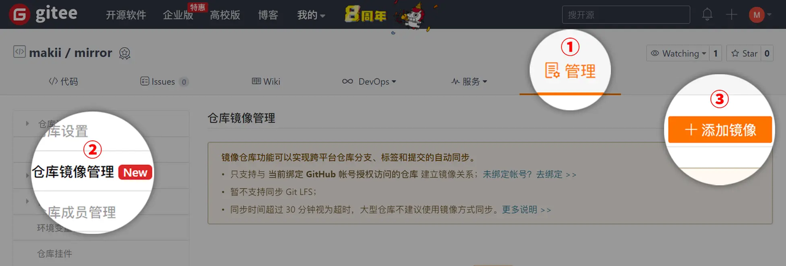
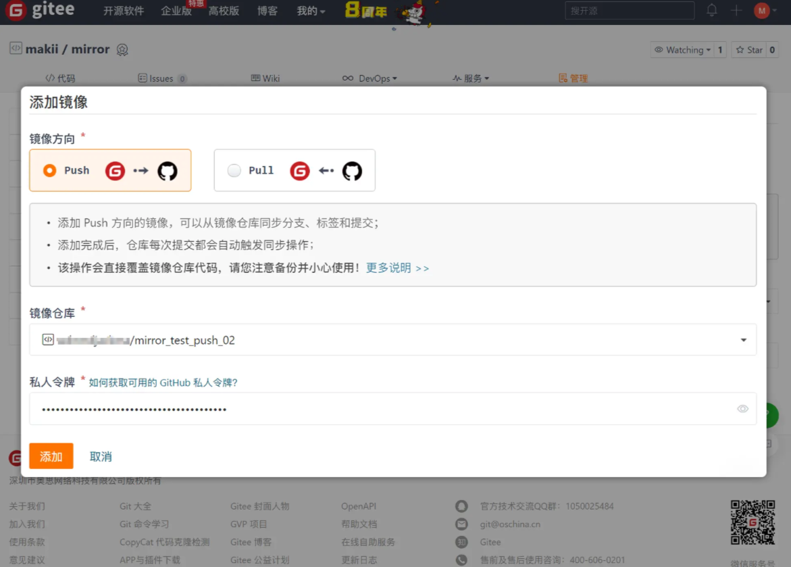
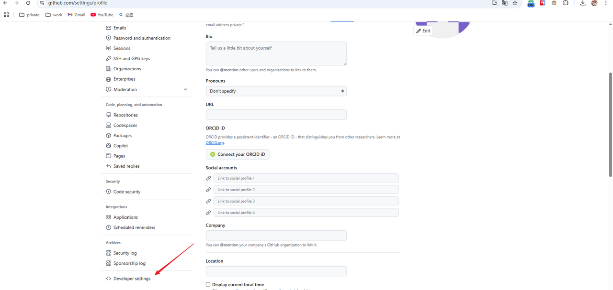

##  Gitee 设置

Push 方向的镜像用于将 Gitee 的仓库自动镜像到 GitHub 。
配置此镜像后，当你提交代码到 Gitee 的仓库时，Gitee 会自动向 GitHub 同步仓库。
你可以通过以下方式添加 Push 方向的镜像：

1. 进入需要使用镜像功能的仓库，进入「管理」找到「仓库镜像管理」选项，点击「添加镜像」按键；

2. 如果你还没有绑定 GitHub 帐号，请根据弹窗提示绑定 GitHub 帐号；

  

3. 添加镜像

  

  4. 在「镜像方向」中选择 Push 方向；

  5. 在「镜像仓库」下拉列表中选择需要镜像的仓库；

  3. 在「个人令牌」中输入你的 [GitHub 私人令牌](https://gitee.com/help/articles/4336#%E5%A6%82%E4%BD%95%E7%94%B3%E8%AF%B7-github-%E7%A7%81%E4%BA%BA%E4%BB%A4%E7%89%8C) ；
        1. 私人令牌中必须包含对 repo 的访问授权，否则添加后镜像不可用。
      
  4. 点击「添加」保存镜像配置。

配置完成后，可以通过以下方式触发镜像操作（Gitee 向 GitHub 同步仓库）：
- 提交代码到 Gitee 仓库
- [手动更新镜像](https://gitee.com/help/articles/4336#%E6%89%8B%E5%8A%A8%E6%9B%B4%E6%96%B0)
镜像触发的最短间隔时间为 5 分钟。
如果只配置了 Push 方向的镜像，建议将最新的代码提交到 Gitee 仓库；
Gitee 会自动向 GitHub 同步仓库（分支/Branches、标签/Tags、提交记录/Commits）。

## GitHub 私人令牌配置

.png)

.png)

## 资料来源

1. [配置仓库镜像](https://gitee.com/help/articles/4336#article-header2)
2. [GitHub 私人令牌](https://gitee.com/help/articles/4336#article-header10)

