## 基础调试

```
// index.js

const os = require('os');

const homedir = os.homedir();

console.log(homedir);
```

1. 以调试模式跑起来：

```
node --inspect-brk index.js
```

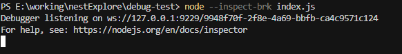

可以看到，它起了一个ws服务

然后我们用调试客户端连上它，比如用 Chrome DevTools。

2. 连接调试

打开`chrome://inspect/`，可以看到可以调试的目标：

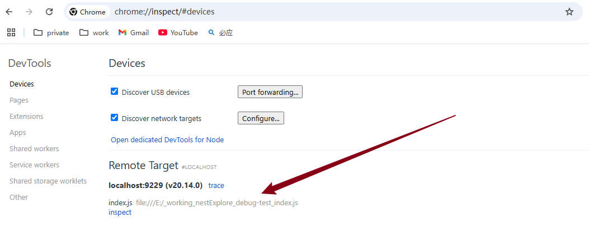

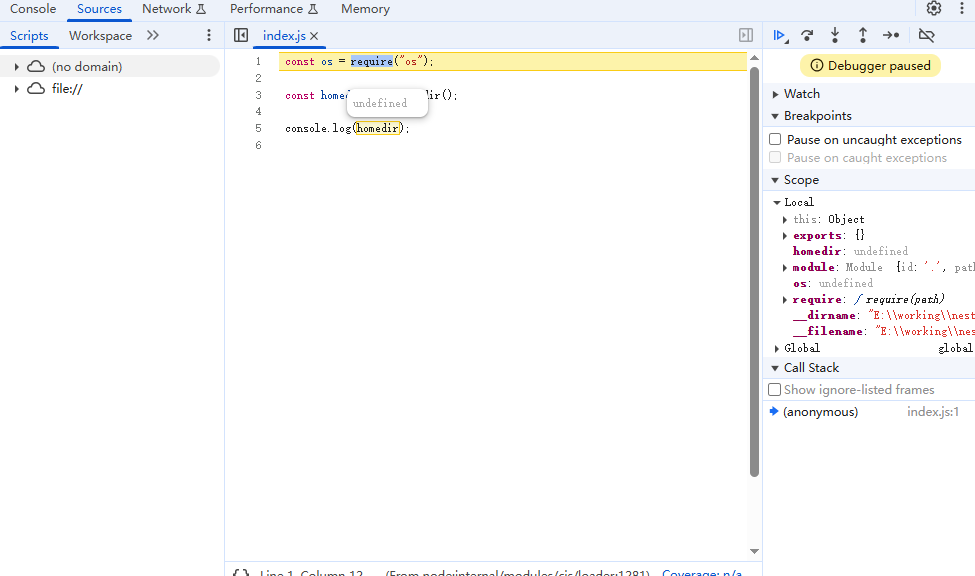

3. 检查配置

如果没有调试目标，则配置下network target, 加上 `localhost:9229`

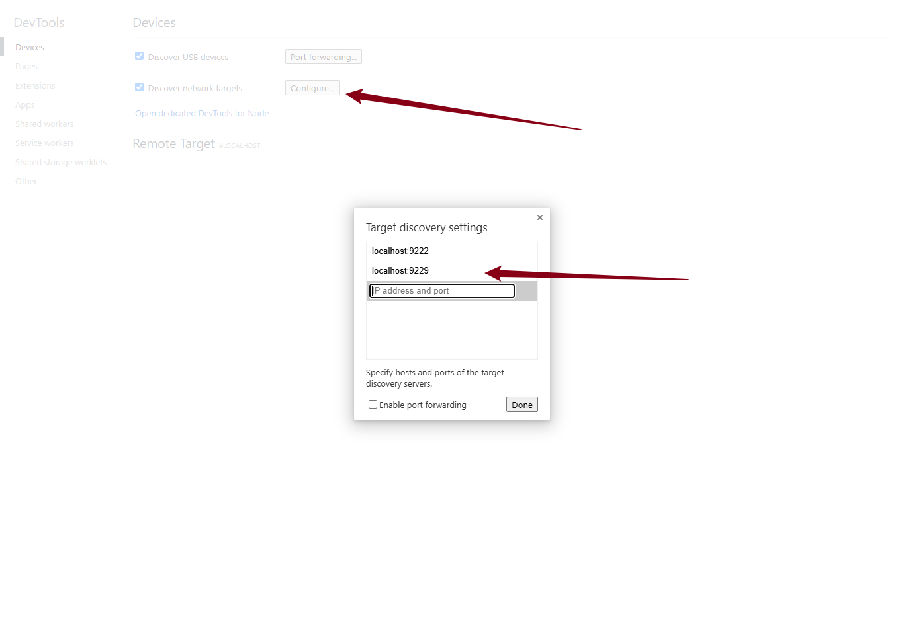

## 调试nest项目（浏览器）

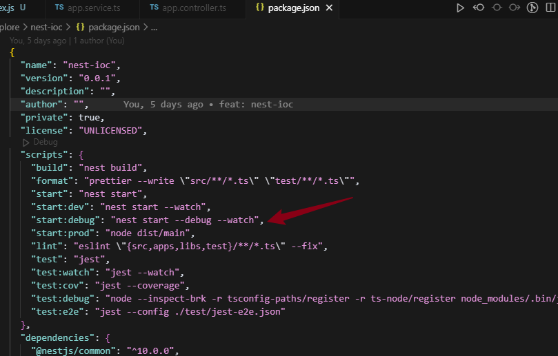

```
npm run start:debug
```

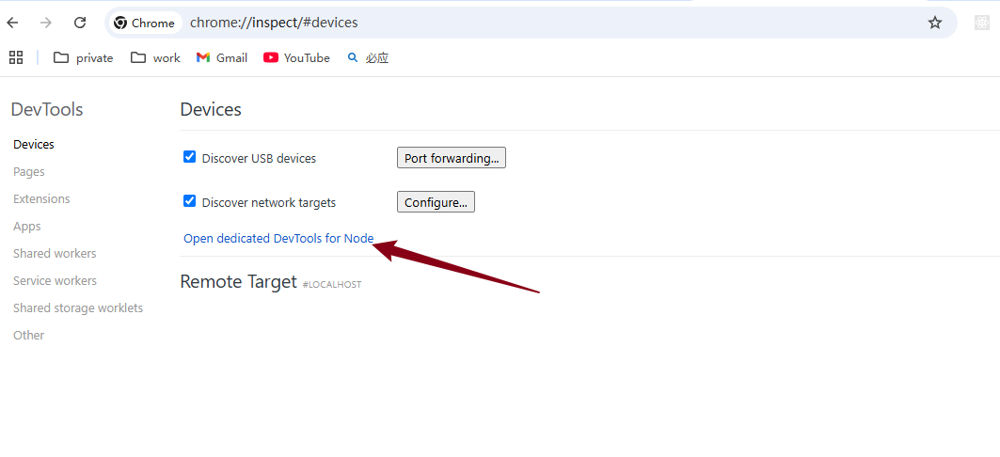

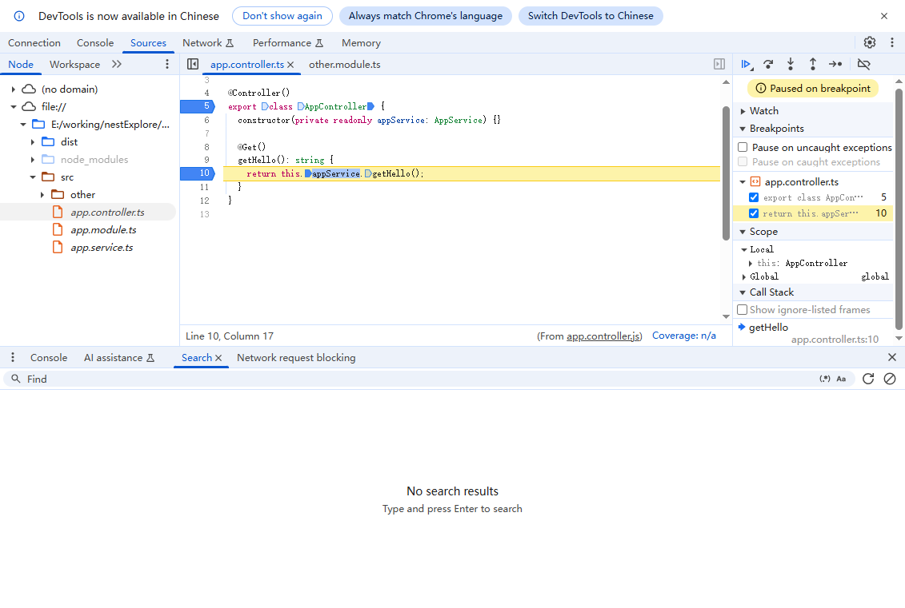

## launch.json 配置调试

### 常见配置参数

1. **`"type"`**：指定调试器的类型，例如 "node" 表示 Node.js 调试器，"python" 表示 Python 调试器，"java" 表示 Java 调试器等。
2. **`runtimeExecutable`**：指定用于启动调试会话的可执行文件路径，如”npm“
3. **`"request"`**：指定调试的请求类型，可以是 "launch"（启动一个新的进程）或 "attach"（附加到已有的进程）。
4. **`"name"`**：为配置提供一个友好的名称，方便识别不同的调试配置。
5. **`"cwd"`**：指定程序的工作目录，可以是绝对路径或相对于工作目录的路径。
6. **`"program"`**：用于指定程序的入口文件路径，可以是绝对路径或相对于工作目录的路径。
7. **`"args"`**：传递给程序的命令行参数，以数组形式提供。
8. **`"env"`**：设置程序运行时的环境变量，以对象形式提供。
9. **`"stopOnEntry"`**：设置为 **`true`** 时，在启动后会在入口处停止，等待调试器连接。
10. **`externalConsole"`**：设置为 **`true`** 时，将在外部控制台中运行程序。
11. **`"internalConsoleOptions"`**：控制内部控制台的显示方式，可以是 "neverOpen"、"openOnSessionStart" 或 "openOnFirstSessionStart"。
12. **`"showAsyncStacks"`**：设置为 **`true`** 时，在堆栈跟踪中显示异步调用的信息。
13. **`"stopOnError"`**：设置为 **`true`** 时，当发生错误时暂停调试。
14. **`"smartStep"`**：设置为 **`true`** 时，跳过无需调试的代码。
15. **`"skipFiles"`**：指定不需要调试的文件或文件夹。
16. **`"justMyCode"`**：设置为 **`true`** 时，只调试自己的代码。
17. preLaunchTask"：指定在启动调试前运行的任务，通常是一个编译任务。
18. postDebugTask：指定在调试结束后运行的任务，比如清理任务。
19. outFiles：设置输出文件的路径，用于映射源代码和编译后的文件。
20. sourceMaps：控制是否启用源代码映射，可以是 "inline"、"both" 或 "false"。
21. sourceMapPathOverrides：用于根据源代码映射调整文件路径。

### 调试普通入口文件

```
// github 
https://gitee.com/wayliuhaha/create_sql.git
```

```
{
    // 使用 IntelliSense 了解相关属性。 
    // 悬停以查看现有属性的描述。
    // 欲了解更多信息，请访问: https://go.microsoft.com/fwlink/?linkid=830387
    "version": "0.2.0",
    "configurations": [
        {
            "type": "node",
            "request": "launch",
            "name": "启动程序",
            "skipFiles": [
                "<node_internals>/**"
            ],
            "program": "${workspaceFolder}\\bin\\index.js",
            "args": [
                "V"
            ],
        }
    ]
}
```

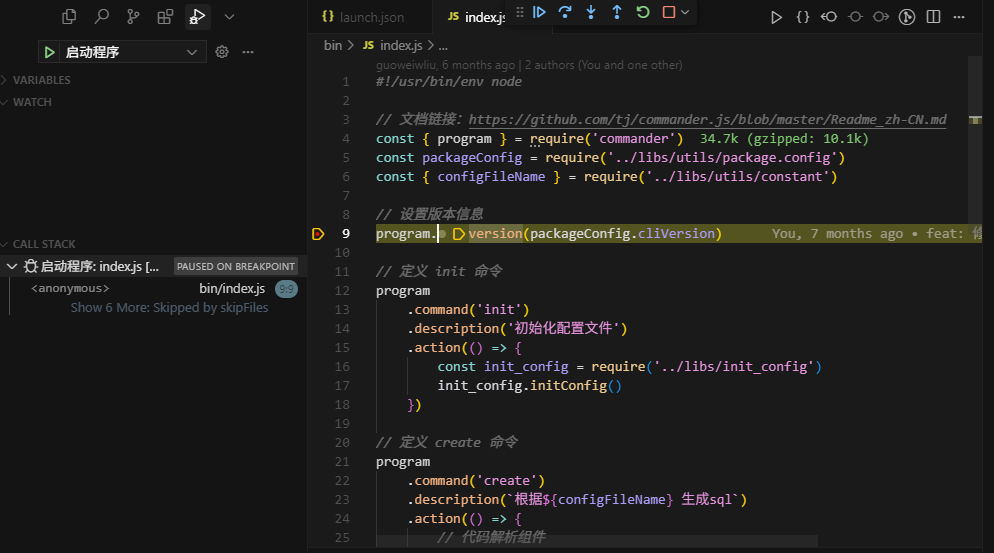

### 调试npm文件入口

与上面的区别在于：runtimeExecutable

```
{
  "version": "0.2.0",
  "configurations": [
    {
      "type": "node",
      "request": "launch",
      "name": "debug nest",
      "runtimeExecutable": "npm",
      "args": ["run", "start:dev"],
      "skipFiles": ["<node_internals>/**"],
      "console": "integratedTerminal",
    }
  ]
}
```

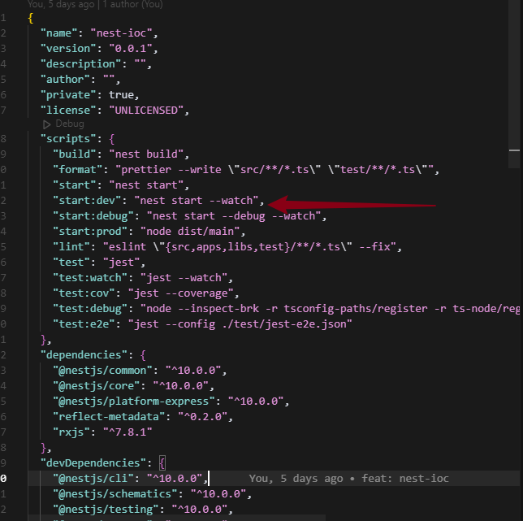

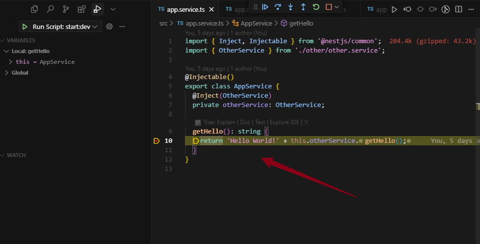

### 快捷方式

直接调试package.json 种配置的scripts

1. 第一种：直接在package.json 中点击Debug，然后选取需要调试的脚本

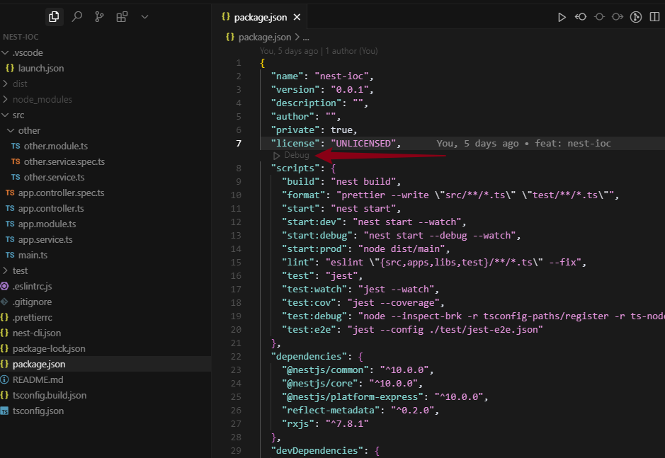

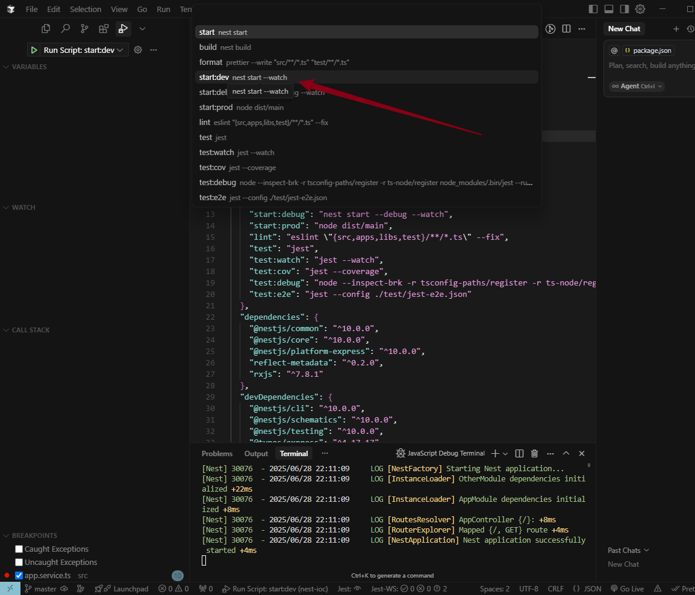

2. 第二种：在调试界面选Node.js, 然后就同样选取package.json 中配置的脚本了

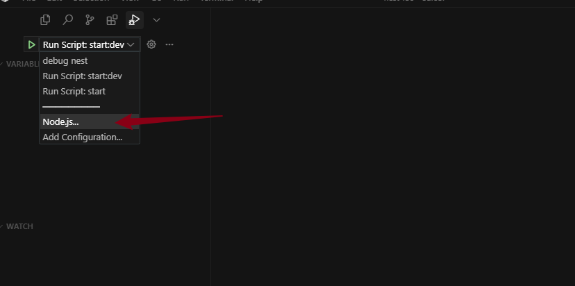

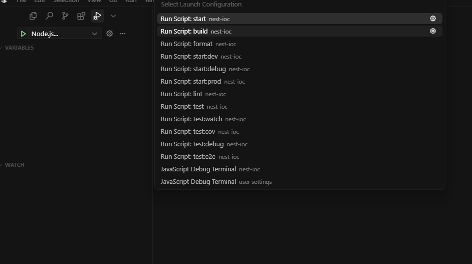

### 端点类型

1. Add Breakpoint: 即断点停住
2. Add Conditional Breakpoint:  表达式成立才对断点停住
3. Add Logpoint：打印日志，即避免console.log, 需要输入你要的变量，用{}包裹
4. Add Triggered Breakpoint：与2大概一致

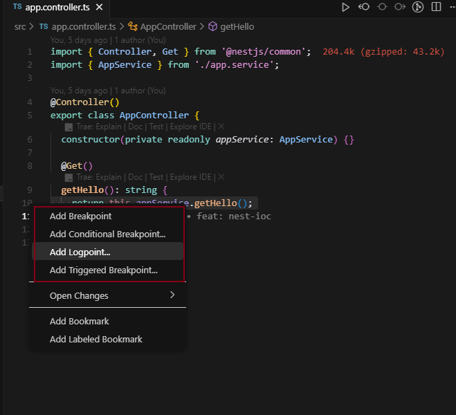
