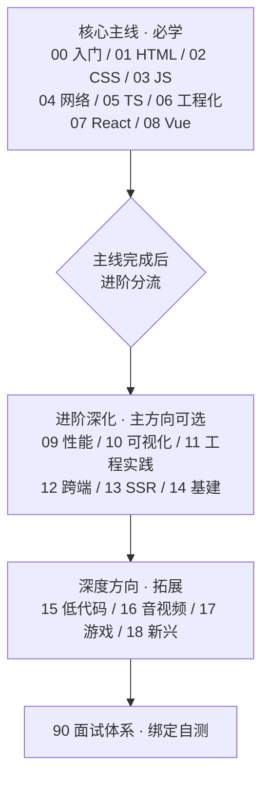

# 前端知识体系

> 从零开始，系统学习前端开发（HTML / CSS / JavaScript / TypeScript / React / Vue / 工程化 / 性能优化）。
> 面向希望达到初中高级水平的前端工程师，按"核心主线 → 进阶深化 → 深度方向 → 面试附录"四大层组织，每章遵循**四层范式**渐进式学习。

---

## 一、分层知识地图

- **核心主线（必学）**：00 入门与环境 → 08 前端框架-Vue。初级搭建 + 中级进阶的根基，逐章顺序学习。
- **进阶深化（主方向可选）**：09–14。根据方向选择性深入，多数知识依赖主线前置。
- **深度方向（拓展）**：15–18。面向具体业务/兴趣，可作为长期延伸目标。
- **面试附录（验证）**：90。把所学转化为"能讲、能答、能写"。

> 层次划分：物理文件与目录结构保持不变，仅调整导航与学习心智模型。

---

## 二、四层范式标记

本体系每章按**四层范式**组织，命中哪层标哪层（一个知识点可叠加多层）：

| 标记 | 含义 | 考核点 |
|------|------|--------|
| 🟢 **入门** | 是什么、怎么用、能跑通 | 会说会用了吗 |
| 🔵 **进阶** | 原理、能优化、会排查 | 能解释原理吗 |
| 🟠 **实战** | 完整项目、可运行验证 | 能独立开发吗 |
| 🔴 **最小实现** | 从零实现核心、掌握原理 | 能手写/扣原理吗 |

每层内容与 [90-附录-面试体系](/frontend/90-附录-面试体系/01-面试自测题) 的题号绑定，见各章标注。

---

## 三、核心主线（必学）

> 打牢地基。建议按顺序逐章完成，不要跳步。

### 第 00 章 · 入门与环境

| 文件 | 说明 | 层级 |
|------|------|------|
| [前端工程师需要什么](/frontend/00-入门与环境/01-前端工程师需要什么) | 预读指南 + 知识地图 + 权重 + 体系衔接 | 🟢 入门 |
| [开发环境与调试](/frontend/00-入门与环境/02-开发环境与调试) | 完整四层范式：环境搭建到最小实现 | 🟢🔵🟠🔴 |

### 第 01 章 · HTML 基础

| 文件 | 说明 | 层级 |
|------|------|------|
| [HTML 语义化与结构](/frontend/01-HTML%20基础/01-HTML%20语义化与结构) | 语义标签、文档结构、SEO 基础 | 🟢 入门 |
| [表单与标签](/frontend/01-HTML%20基础/02-表单与标签) | form、input 类型、属性、约束验证 | 🟢🔵🔴 |

### 第 02 章 · CSS

| 文件 | 说明 | 层级 |
|------|------|------|
| [CSS 基础与选择器](/frontend/02-CSS/01-CSS%20基础与选择器) | 层叠、优先级、选择器、盒模型 | 🟢 入门 |
| [布局](/frontend/02-CSS/02-布局) | 浮动、Flex、Grid、居中方案 | 🟢🔵 |
| [响应式与移动端](/frontend/02-CSS/03-响应式与移动端) | 媒体查询、rem/vw、视口、适配方案 | 🔵 进阶 |
| [动画与变换](/frontend/02-CSS/04-动画与变换) | transition、animation、transform、性能 | 🔵 进阶 |
| [BEM 与 CSS 规范](/frontend/02-CSS/05-BEM%20与%20CSS%20规范) | BEM 命名、CSS 工程化方案对比 | 🔵 进阶 |
| [综合实战](/frontend/02-CSS/06-综合实战) | 综合实战落地 | 🟠 实战 |

### 第 03 章 · JavaScript 核心

| 文件 | 说明 | 层级 |
|------|------|------|
| [数据类型与变量](/frontend/03-JavaScript%20核心/01-数据类型与变量) | 原始/引用类型、类型检测、类型转换 | 🟢 入门 |
| [作用域与闭包](/frontend/03-JavaScript%20核心/02-作用域与闭包) | 执行上下文、作用域链、闭包 | 🟢🔵 |
| [原型与继承](/frontend/03-JavaScript%20核心/03-原型与继承) | 原型链、class、继承方式 | 🟢🔵 |
| [异步编程与事件循环](/frontend/03-JavaScript%20核心/04-异步编程与事件循环) | Promise、async/await、宏/微任务 | 🟢🔵 |
| [内存管理与垃圾回收](/frontend/03-JavaScript%20核心/05-内存管理与垃圾回收) | GC、内存泄漏、V8 引擎 | 🔵🔴 |
| [手写实现与源码](/frontend/03-JavaScript%20核心/06-手写实现与源码) | 手写 call/apply/bind、深拷贝、发布订阅 | 🔵🔴 |

### 第 04 章 · 网络与浏览器

| 文件 | 说明 | 层级 |
|------|------|------|
| [HTTP 与 HTTPS](/frontend/04-网络与浏览器/01-HTTP%20与%20HTTPS) | 请求方法、状态码、缓存、HTTPS | 🔵 进阶 |
| [浏览器渲染原理](/frontend/04-网络与浏览器/02-浏览器渲染原理) | 渲染管线、回流/重绘、合成层 | 🔵🔴 |
| [浏览器存储与本地缓存](/frontend/04-网络与浏览器/03-浏览器存储与本地缓存) | Cookie/localStorage/SessionStorage/IndexedDB | 🔵 进阶 |
| [前端安全](/frontend/04-网络与浏览器/04-前端安全) | XSS、CSRF、CSP、数据脱敏 | 🔵 进阶 |

### 第 05 章 · TypeScript

| 文件 | 说明 | 层级 |
|------|------|------|
| [TypeScript 类型系统](/frontend/05-TypeScript/01-TypeScript%20类型系统) | 基础类型、推断、泛型、高级类型 | 🔵 进阶 |
| [TypeScript 工程实践](/frontend/05-TypeScript/02-TypeScript%20工程实践) | tsconfig、类型体操、声明文件、工程落地 | 🔵🔴 |

### 第 06 章 · 前端工程化 & 基建

| 文件 | 说明 | 层级 |
|------|------|------|
| [前端工程化全景](/frontend/06-工程化与构建/01-前端工程化全景) | 工程化体系全景、演进、成熟度模型 | 🔵 进阶 |
| [模块化规范](/frontend/06-工程化与构建/02-模块化规范) | CommonJS、ESM、AMD/CMD | 🟢🔵 |
| [构建工具](/frontend/06-工程化与构建/03-构建工具) | Webpack / Vite / Rollup / esbuild 原理与配置 | 🔵🔴 |
| [代码规范](/frontend/06-工程化与构建/04-代码规范) | ESLint、Prettier、husky、git 提交规范 | 🟢 入门 |
| [Git 与协作](/frontend/06-工程化与构建/05-Git%20与协作) | git 常用命令、工作流、Monorepo | 🟢 入门 |
| [调试技巧](/frontend/06-工程化与构建/06-调试技巧) | vscode 调试、性能面板、错误排查 | 🟢🔵 |
| [脚手架的诞生](/frontend/06-工程化与构建/07-脚手架的诞生) | CLI 设计、模板引擎、脚手架平台 | 🔵🔴 |
| [Monorepo 工程化](/frontend/06-工程化与构建/08-Monorepo工程化) | pnpm workspace、增量构建、编排 | 🔴 最小实现 |
| [CI/CD 自动化](/frontend/06-工程化与构建/09-CI-CD自动化) | 流水线设计、GitHub Actions | 🔵🟠 |
| [质量体系与测试](/frontend/06-工程化与构建/10-质量体系与测试) | 规范治理、单元/E2E 测试、质量门禁 | 🔵🟠 |
| [发布、灰度与监控](/frontend/06-工程化与构建/11-发布、灰度与监控) | 蓝绿/金丝雀/灰度、可观测性 | 🔴 最小实现 |

> 本章聚焦「提升团队前端开发效率」：从构建工具、组件库/设计系统、CLI 与脚手架、代码生成器，到监控埋点 SDK、微前端框架，再到包管理 / Monorepo / CI-CD / ESLint / Babel 等基建能力。第 06 章是前端工程化与基建的合辑。

### 第 07 章 · React

| 文件 | 说明 | 层级 |
|------|------|------|
| [React 核心概念](/frontend/07-前端框架-React/01-React%20核心概念) | JSX、组件、Props、State、生命周期 | 🟢 入门 |
| [React Hooks](/frontend/07-前端框架-React/02-React%20Hooks) | useState/useEffect/自定义 hooks、规则 | 🟢🔵 |
| [React 路由](/frontend/07-前端框架-React/03-React%20路由) | React Router、路由设计、懒加载 | 🟢🔵 |
| [React 状态管理](/frontend/07-前端框架-React/04-React%20状态管理) | Context、useReducer、Redux、MobX、Zustand | 🔵 进阶 |
| [React 使用 TS](/frontend/07-前端框架-React/05-React%20使用%20TS) | 组件类型、hooks 类型、泛型组件 | 🔵 进阶 |
| [React 使用 CSS](/frontend/07-前端框架-React/06-React%20使用%20CSS) | CSS Module、CSS-in-JS、Tailwind | 🔵 进阶 |
| [React 高级与原理](/frontend/07-前端框架-React/07-React%20高级与原理) | **原理独立模块**：性能优化、Fiber、diff、手写 mini-react | 🔵🔴 |

### 第 08 章 · Vue

| 文件 | 说明 | 层级 |
|------|------|------|
| [Vue 核心基础](/frontend/08-前端框架-Vue/01-Vue%20核心基础) | 模板语法、计算属性、watch、绑定 | 🟢 基础 |
| [Vue 组件](/frontend/08-前端框架-Vue/02-Vue%20组件) | 组件通信、插槽、props、setup | 🟢🔵 基础→进阶 |
| [Vue 路由与状态](/frontend/08-前端框架-Vue/03-Vue%20路由与状态) | Vue Router、Pinia、组合式 API 实践 | 🔵 进阶 |
| [Vue3 原理](/frontend/08-前端框架-Vue/04-Vue3%20原理) | **原理**：响应式、虚拟 DOM、编译原理、源码 | 🔵🔴 |
| [Vue SSR 与周边](/frontend/08-前端框架-Vue/05-Vue%20SSR%20与周边) | Nuxt、SSR 方案对比 | 🔵 进阶 |

---

## 四、进阶深化（主方向可选）

> 主线完成后按方向深入；依赖对应主线前置知识。

### 第 09 章 · 性能优化与监控

| 文件 | 说明 | 层级 |
|------|------|------|
| [性能指标与评估](/frontend/09-性能优化与监控/01-性能指标与评估) | LCP/CLS/INP、Performance API、Lighthouse | 🔵🔴 |
| [性能优化实践](/frontend/09-性能优化与监控/02-性能优化实践) | 懒加载、虚拟滚动、代码分割、缓存 | 🔵🟠 |
| [监控平台](/frontend/09-性能优化与监控/03-监控平台) | 前端监控、错误上报、埋点 | 🔵🔴 |

### 第 10 章 · 可视化与 WebGL

| 文件 | 说明 | 层级 |
|------|------|------|
| [Canvas 基础](/frontend/10-可视化与WebGL/01-Canvas%20基础) | 绘制图形、动画、图像处理 | 🔵 进阶 |
| [数据可视化与图表库](/frontend/10-可视化与WebGL/02-数据可视化与图表库) | ECharts/AntV、图表选型、大数据渲染 | 🔵 进阶 |
| [SVG 图形](/frontend/10-可视化与WebGL/03-SVG%20图形) | SVG 图形与路径、与 Canvas 对比 | 🔵 进阶 |
| [WebGL 与 Three.js](/frontend/10-可视化与WebGL/04-WebGL%20与%20Three.js) | 着色器、3D 场景、性能优化 | 🔴 最小实现 |
| [可视化工程实践](/frontend/10-可视化与WebGL/05-可视化工程实践) | 大屏架构、选型、跨端可视化 | 🟠 实战 |

### 第 11 章 · 工程实践与架构

| 文件 | 说明 | 层级 |
|------|------|------|
| [设计模式在前端](/frontend/11-工程实践与架构/01-设计模式在前端) | 发布订阅、单例、工厂、观察者 | 🔵 进阶 |
| [组件设计](/frontend/11-工程实践与架构/02-组件设计) | 组件设计原则、组件库、可复用抽象 | 🔵🟠 |

### 第 12 章 · 跨端开发

| 文件 | 说明 | 层级 |
|------|------|------|
| [跨端开发概览与选型](/frontend/12-跨端开发/01-跨端开发概览与选型) | 端侧全景、主流方案对比、选型 | 🔵 进阶 |
| [小程序开发-Taro与uni-app](/frontend/12-跨端开发/02-小程序开发-Taro与uni-app) | Taro/uni-app 编译模型、生命周期 | 🔵 进阶 |
| [React Native](/frontend/12-跨端开发/03-React%20Native) | RN 架构、New Architecture、性能 | 🔵🔴 |
| [Flutter](/frontend/12-跨端开发/04-Flutter) | Dart、Widget 树、自绘渲染引擎 | 🔵🔴 |
| [跨端渲染原理与性能优化](/frontend/12-跨端开发/05-跨端渲染原理与性能优化) | 三条渲染路线、JS/原生通信 | 🔴 最小实现 |

### 第 13 章 · SSR 与 SSG 服务端渲染

| 文件 | 说明 | 层级 |
|------|------|------|
| [SSR 入门与原理](/frontend/13-SSR与SSG服务端渲染/01-SSR入门与原理) | CSR/SSR/SSG 对比、工作流程 | 🔵 进阶 |
| [同构渲染与 Hydration](/frontend/13-SSR与SSG服务端渲染/02-同构渲染与Hydration) | 同构代码、水合、流式渲染 | 🔴 最小实现 |
| [Next.js 实战](/frontend/13-SSR与SSG服务端渲染/03-Next.js实战) | App Router、数据获取、缓存 | 🔵🟠 |
| [Nuxt.js 实战](/frontend/13-SSR与SSG服务端渲染/04-Nuxt.js实战) | Nitro、routeRules、数据获取 | 🔵🟠 |
| [ISR 与缓存策略](/frontend/13-SSR与SSG服务端渲染/05-ISR与缓存策略) | 增量再生、CDN/HTTP 缓存、SWR | 🔴 最小实现 |
| [SSR 架构选型与工程实践](/frontend/13-SSR与SSG服务端渲染/06-SSR架构选型与工程实践) | 选型决策树、渲染集群、降级 | 🟠 实战 |

### 第 15 章 · 低代码与无代码

| 文件 | 说明 | 层级 |
|------|------|------|
| [低代码与无代码概览](/frontend/15-低代码与无代码/01-低代码与无代码概览) | 概念区别、平台形态、选型 | 🔵 进阶 |
| [表单引擎](/frontend/15-低代码与无代码/02-表单引擎) | Schema 设计、字段体系、校验联动 | 🔵🔴 |
| [渲染引擎与运行时](/frontend/15-低代码与无代码/03-渲染引擎与运行时) | Schema→渲染、注册表、表达式引擎 | 🔴 最小实现 |
| [可视化搭建](/frontend/15-低代码与无代码/04-可视化搭建) | 搭建器架构、拖拽、undo/redo | 🟠 实战 |
| [Schema 驱动与协议设计](/frontend/15-低代码与无代码/05-Schema驱动与协议设计) | DSL、Parser/Compiler/Generator、出码 | 🔴 最小实现 |

### 第 16 章 · 音视频与富媒体前端

| 文件 | 说明 | 层级 |
|------|------|------|
| [音视频基础概念](/frontend/16-音视频与富媒体前端/01-音视频基础概念) | 编码原理、封装格式、浏览器支持 | 🔵 进阶 |
| [HTML5 播放器原理](/frontend/16-音视频与富媒体前端/02-HTML5播放器原理) | MSE 播放流程、播放器架构、秒开 | 🔵🔴 |
| [WebRTC 实时音视频](/frontend/16-音视频与富媒体前端/03-WebRTC实时音视频) | SDP/ICE、NAT 穿透、弱网策略 | 🔴 最小实现 |
| [直播技术方案](/frontend/16-音视频与富媒体前端/04-直播技术方案) | 直播链路、协议对比、低延迟 | 🔵🟠 |
| [富媒体性能优化](/frontend/16-音视频与富媒体前端/05-富媒体性能优化) | 图片/视频优化、秒开、监控 | 🔴 最小实现 |

### 第 17 章 · Web 游戏开发

| 文件 | 说明 | 层级 |
|------|------|------|
| [Web 游戏开发现状与游戏循环](/frontend/17-Web游戏开发/01-Web游戏开发现状与游戏循环) | 形态、引擎选型、主循环、rAF | 🔵 进阶 |
| [2D 游戏与 PixiJS](/frontend/17-Web游戏开发/02-2D游戏与PixiJS) | 渲染管线、显示对象、精灵表 | 🔵🟠 |
| [3D 游戏与 Three.js](/frontend/17-Web游戏开发/03-3D游戏与Three.js) | 场景图、模型加载、射线检测 | 🔵🟠 |
| [游戏物理引擎](/frontend/17-Web游戏开发/04-游戏物理引擎) | 刚体、碰撞检测、引擎选型 | 🔴 最小实现 |
| [游戏性能优化与发布](/frontend/17-Web游戏开发/05-游戏性能优化与发布) | 合批、加载、多端适配 | 🔴 最小实现 |

### 第 18 章 · 新兴方向

| 文件 | 说明 | 层级 |
|------|------|------|
| [WebAssembly](/frontend/18-新兴方向/01-WebAssembly) | 高性能调用 C/C++/Rust、WASI | 🔴 最小实现 |
| [PWA 渐进式网页应用](/frontend/18-新兴方向/02-PWA渐进式网页应用) | Service Worker、缓存、离线安装 | 🔵🟠 |
| [AI 前端-LLM 交互页面](/frontend/18-新兴方向/03-AI前端-LLM交互页面) | 大模型对接、SSE 流式、对话 UI | 🔵🟠 |
| [AI 绘图与 AI 代码编辑器](/frontend/18-新兴方向/04-AI绘图与AI代码编辑器) | 文生图集成、流式补全、端上推理 | 🔴 最小实现 |
| [AI 组件与 Agent 网页端](/frontend/18-新兴方向/05-AI组件与Agent网页端) | AI 组件思想、Agent 形态、安全 | 🔴 最小实现 |
| [WebGPU 与前端新趋势](/frontend/18-新兴方向/06-WebGPU与前端新趋势) | WebGPU 概念、GPGPU、趋势展望 | 🔴 最小实现 |

---

## 六、面试附录（验证）

> 把所学转化为"能讲、能答、能写"，见[附录：面试体系](/frontend/90-附录-面试体系/01-面试自测题)。

包含：分级面试自测题（初级/中级/高级共 135 题）、分级参考答案、场景设计题、面试方法论、自测记录表、前端学习路径图。面试题覆盖本体系全部阶段（含跨端、SSR、基建、低代码、音视频、游戏、新兴方向等深度领域）。

---

## 使用说明

- **级别含义**：初级内容必须掌握，中级面试高频，高级可后续深入学习。

| 级别 | 适用人群 | 掌握程度 |
|------|---------|---------|
| [初级] | 0-6 个月经验 | 知道是什么、怎么用，能写 CRUD |
| [中级] | 1 年左右经验 | 理解原理、能优化、能排查问题 |
| [高级] | 2 年以上经验 | 能设计架构、能解决复杂场景 |

- **四层范式**：命中哪层标哪层，详见上文"二、四层范式标记"。
- **学习建议**：① 按主线顺序学习，不要跳步；② 每章看完后动手写代码验证；③ 配套[不止于面试](/interview/index)的自测题巩固。

## 附录：章节内容来源说明

本模块整合了原 `react/`、`vue/`、`engineer/`、`interview/`、`visualization/`、`article/` 中分散的前端知识，并按统一的"核心主线 → 进阶深化 → 深度方向 → 面试附录"分层体系重新组织与补充。