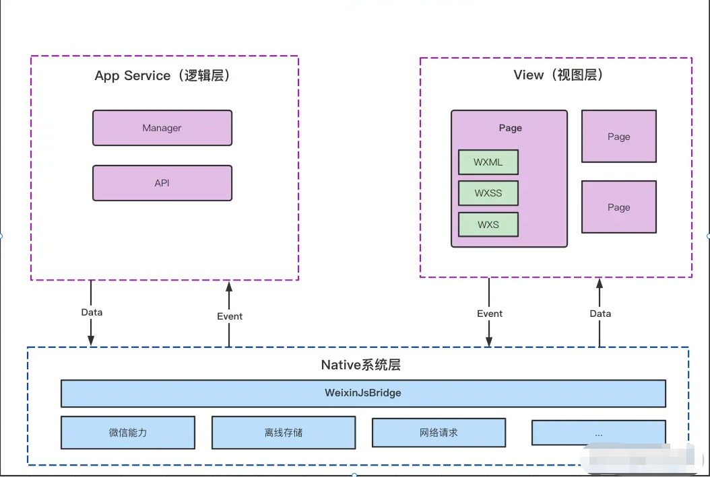
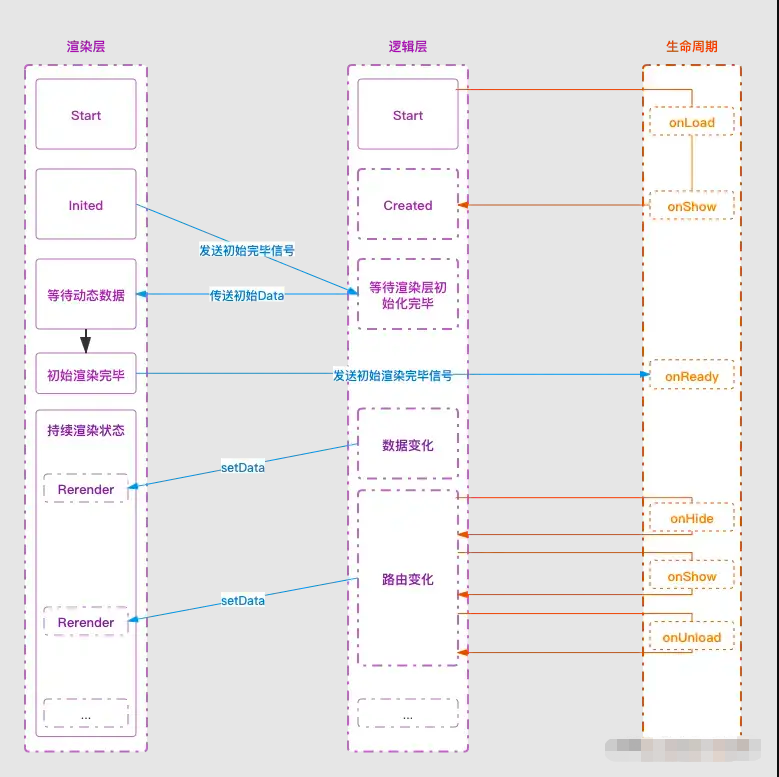
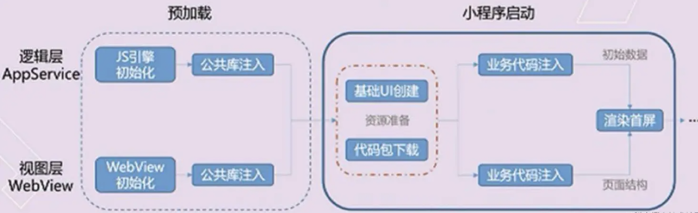

## 生命周期

## 应用生命周期
在app.js里面调用的

- onLaunch：小程序初始化完成时触发，全局只触发一次
- onShow：小程序启动或从后台进入前台时触发
- onHide：小程序从前台进入后台时触发
- onErro：小程序发生脚本错误或API调用报错时触发
- onPageNotFound：小程序要打开的页面不存在时触发
- onUnhandledRejection: 小程序未处理的Promise拒绝时触发
- onThemeChange: 系统切换主题时触发
- globalData: 存储全局数据

```
App({
  onLaunch (options) {
    // Do something initial when launch.
  },
  onShow (options) {
    // Do something when show.
  },
  onHide () {
    // Do something when hide.
  },
  onError (msg) {
    console.log(msg)
  },
  globalData: 'I am global data'
})
```

## 页面生命周期

1. onLoad: 页面创建时执行 - 发送请求获取数据
2. onShow：页面出现在前台执行 - 请求数据
3. onReady：首次渲染后执行 - 获取页面元素
4. onHide：页面从前台变为后台执行 - 终止任务，如定时器或播放音乐
5. onUnload：页面销毁时执行 - 终止任务


## 组件生命周期

1. created：组件实例刚创建时，还不能调用`setData`
2. attached：组件实例进入页面节点树时
3. ready：组件在视图布局完成后执行
4. moved：组件实例被移动到节点树另一个位置时
5. detached：组件实例从页面节点移除时
6. error：每当组件方法抛出错误时执行

## 页面路由

1. navigateTo: 打开新页面
2. redirectTo: 页面重定向
3. navigateBack: 页面返回，只触发onShow
4. switchTab: 切换tab
5. wx.reLaunch: 重启动

注意事项：

1. `navigateTo`, `redirectTo` 只能打开非 tabBar 页面。
2. `switchTab` 只能打开 tabBar 页面。
3. `reLaunch` 可以打开任意页面。

## 双线程架构





- 渲染层
  - 使用 webview 进行渲染，有多个页面，所以存在多个webview
- 逻辑层
  - 才有jsCore 运行js 代码
- 两个线程之间由Native层之间统一处理，无论是线程的通信还是数据的传递、网络请求都由Native层左转发

## 微信小程序性能优化

小程序刚开始进入启动状态，会展示一个固定的启动界面，界面包含小程序的图标、名称、加载提示图标等，微信会在背后完成几项工作

- 下载小程序代码包
- 加载小程序代码包
- 初始化小程序首页



## 微信小程序启动优化

- 控制代码包大小
  - 上传代码时启用压缩
  - 清理无用代码与资源
  - 图片等资源放到cdn
- 分包加载 `subpackages`
  - 将小程序中不经常使用的页面放到多个分包，主包只保留核心页面
  - 使用分包会出现页面切换延迟（进入分包页面需要下载和注入分包），可以使用预下载

```
"subpackages": [
  {
    "root": "pages/order/",
    "name": "orderPage",
    "pages": [
      "page1",
      "page2"
    ]
  }
]
```

- 预加载`preloadRule`

```
"preloadRule": {
  // 进行预加载的路径
  "pages/start/index": {
    "network": "all",
    // 指定所属的分包
    "packages": ["orderPage"]
  }
}
```

## 微信小程序首屏渲染优化

- 提前首屏数据请求，如将接口请求放在onLoad而不是onReady
- 精简首屏数据，与视图渲染无关的数据尽量不要放在data
- 避免阻塞渲染，如在onLoad里不要使用同步

## 微信小程序渲染性能优化

- 避免不当使用`setData`
  - 每次`setData`调用都是一次进程间通信过程，通信开销与`setDta`数据量正相关
  - `setData`会引发视图层面内容更新，会阻塞用户交互
  - 不要频繁调用`setData`与每次`setData`不要塞太多数量数据
- 在列表渲染中合理使用key值
- 长列表渲染优化
  - 虚拟列表
  - 微信[recycle-view](https://github.com/wechat-miniprogram/recycle-view)
- 使用wxs直接操作视图数据，避免跨线程开销

