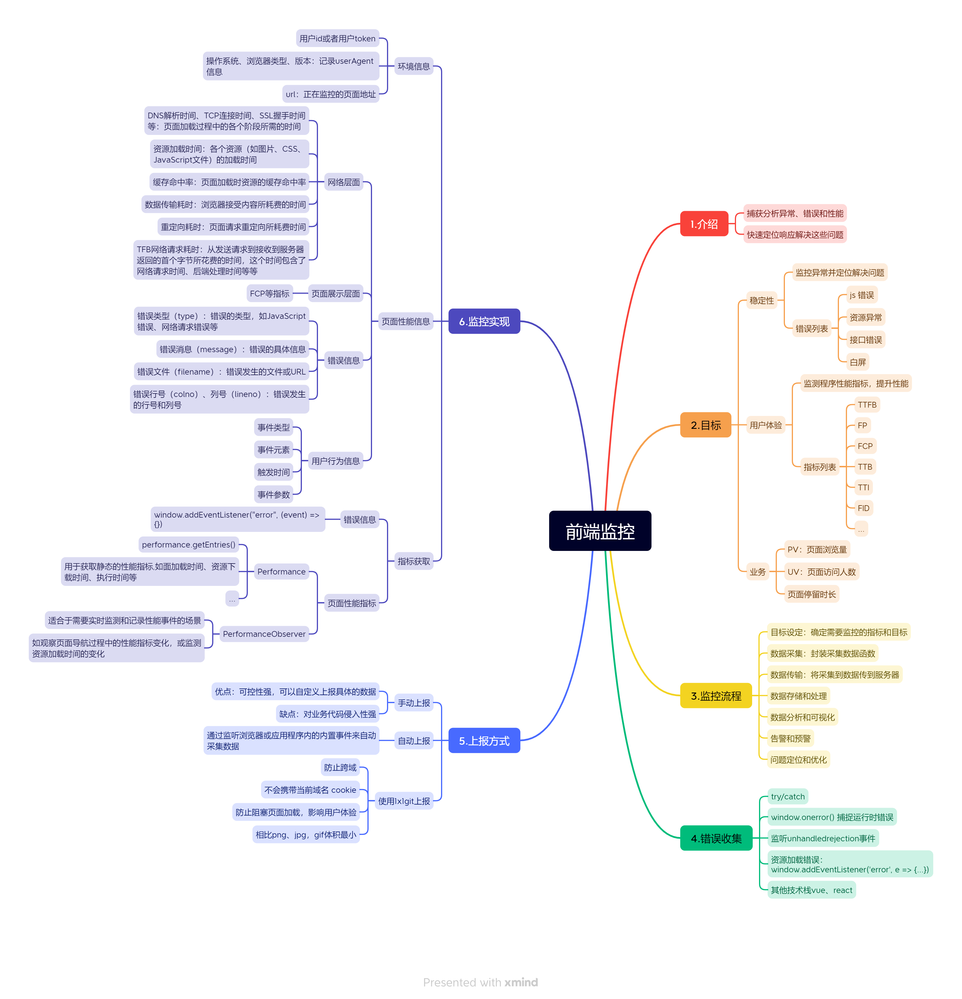
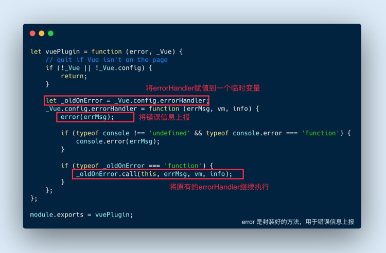
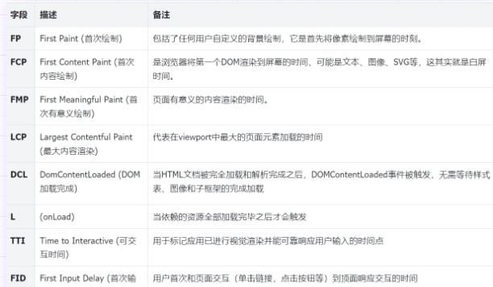

## 介绍

前端监控（Frontend Monitoring）是一种用于捕获、分析和报告网站或应用程序中的异常、错误和性能问题的方法。通过前端监控，我们可以实时了解用户在使用我们的产品时可能遇到的问题，从而快速响应和解决这些问题。

## 目标

1. 稳定性
   - 监测前端应用程序中的异常情况，如 JavaScript 错误、未捕获的异常、网络错误等
   - 通过监控异常，及时定位并解决问题，提高应用程序稳定性和用户体验
   - 错误列表
     - js错误：js执行错误或者promise异常
     - 资源异常：script、link等资源加载异常
     - 接口错误：ajax或者fetch接口请求异常
     - 白屏：页面空白

2. 用户体验
   - 监测应用程序的性能指标，目的是识别潜在的性能瓶颈，优化应用程序的加载速度和响应时间
   - TTFB(time to first byte）(首字节时间)：发送请求到接收返回首个字节时间
   - FP(first paint)(首次绘制)：浏览器首次将向上绘制到屏幕上的时间
   - FCP(first content paint)(首次内容绘制)：将第一个dom渲染到dom的时间
   - FMP(First Meaningful pain)（首次有意义绘制）：网页加载过长中可以看到有意义内容时间点
   - FID(first input delay)（首次输入延迟）：用户首次和页面交互到页面响应交互时间
   - 卡顿：超过50ms的长任务
3. 业务
   - PV: page view,页面浏览量或点击量
   - UV: 访问某个站点的不同ip地址人数
   - 页面停留时长

## 监控流程

1. 目标设定：确定需要监控的指标和目标，例如页面加载时间、错误率、用户行为等。
2. 数据采集：使用适当的工具或技术来收集监控数据、或者自己封装函数进行监控数据
3. 数据传输：将采集到的监控数据传输到监控系统或后端服务器。数据传输可以使用HTTP请求、WebSocket等方式进行
4. 数据存储和处理：将传输过来的监控数据进行存储和处理。可以使用数据库、日志文件或数据分析平台进行存储和处理，以便后续的分析和展示
5. 数据分析和可视化：对存储的监控数据进行分析和展示，生成可视化报表、图表或仪表盘，以帮助开发人员和运营人员了解系统的性能和用户行为
6. 告警和预警：根据设定的监控指标和阈值，当监控数据超过或达到预设阈值时，触发告警或预警机制，通知相关人员进行处理
7. 问题定位和优化：问题定位和优化：根据监控数据和告警信息，定位问题的具体原因和位置，进行优化和改进，提升系统的性能和用户体验

## 错误收集

- `try/catch` 中手动捕获

- `window.onerror()` 捕捉运行时错误

  ```
  window.onerror = () => {...}
  ```

- 监听`unhandledrejection`事件

  - 当 Promise 被 reject 冰球额没有得到处理的时候会触发

  ```
  window.addEventListener('unhandledrejection', (e) => {...})
  ```

- 资源加载错误：`window.addEventListener('error', e => {...})`

  ```
  window.addEventListener("error", (event) => {
  	...
  })
  ```
  
- 其他技术栈——vue.js

  Vue 项目中有自带的错误不错机制：Vue.config.errorHandler(errorCaptured)，这里可以通过劫持Vue.config.errorHandler,当发生错误时，进行上报

  

  

## 上报方式

- 手动上报

  - 优点：可控性强，可以自定义上报具体的数据
  - 缺点：对业务代码侵入性强

- 自动上报

  - 通过监听浏览器或应用程序内的内置事件来自动采集数据

  ```
  window.onerror = function() {
  	monitor.trackError(...)
  }
  ```

- 使用1x1git上报
  - 防止跨域
  - 不会携带当前域名 cookie
  - 防止阻塞页面加载，影响用户体验
  - 相比png、jpg，gif体积最小

## 监控实现-监控指标

1. 环境信息

   - 用户id或者用户token
   - 操作系统、浏览器类型、版本：记录userAgent 信息
   - url：正在监控的页面地址

2. 页面性能信息

   - 网络层面

     - DNS解析时间、TCP连接时间、SSL握手时间等：页面加载过程中的各个阶段所需的时间。
     - 资源加载时间：各个资源（如图片、CSS、JavaScript文件）的加载时间。
     - 缓存命中率：页面加载时资源的缓存命中率。
     - 数据传输耗时：浏览器接受内容所耗费的时间。
     - 重定向耗时：页面请求重定向所耗费时间。
     - TTFB网络请求耗时：从发送请求到接收到服务器返回的首个字节所花费的时间，这个时间包含了网络请求时间、后端处理时间等等。

   - 页面展示层面

     - 页面大小：通常以字节数表示

     - 卡顿：超过50ms的长任务

     - 性能指标

       

3. 错误信息
   - 错误类型（type）：错误的类型，如JavaScript错误、网络请求错误等。
   - 错误消息（message）：错误的具体信息。
   - 错误文件（filename）：错误发生的文件或URL。
   - 错误行号（colno）、列号（lineno）：错误发生的行号和列号
4. 用户行为信息
   - 事件类型：用户进行的具体操作，如点击、滚动、输入等。
   - 事件元素（srcElement）：操作发生在哪个元素上。
   - 触发时间（timeStamp）：操作发生的时间。
   - 事件参数：某些特定事件可能会带有额外的参数，如输入事件可能会有输入的内容

## 监控实现——指标获取

1. 错误信息

   window.addEventListener("error", (event) => {}) 中 `event` 的错误信息解析：（通过这个 `errorEvent` 我们可以获取到大多数需要的错误信息指标）

   ```
   ErrorEvent {
   
       isTrusted: true, // 表示事件是否由用户操作触发。当事件是由用户操作触发时，它的值为 `true`，否则为 `false`。
   
       bubbles: false, // 指示事件是否会向上传播到父元素。当事件可以冒泡时，它的值为 `true`，否则为 `false`。
   
       cancelBubble: false, // 表示是否取消进一步的事件传播。如果将 `cancelBubble` 设置为 `true`，则事件不会进一步冒泡到父元素。
   
       cancelable: true, // 指示事件是否可以被取消。当事件可以取消时，它的值为 `true`，否则为 `false`。
   
       colno: 34, // 表示发生错误的列号。
   
       composed: false, // 指示事件是否可以穿过Shadow DOM边界传播。当事件可以穿过Shadow DOM边界时，它的值为 `true`，否则为 `false`。
   
       currentTarget:Window {0: Window, window: Window, self: Window, document: document, name: '', location: Location, …}, // 表示正在处理事件的当前元素。
   
       defaultPrevented: false, // 指示事件的默认行为是否已经被取消。如果默认行为已经被取消，它的值为 `true`，否则为 `false`
   
       error: { // 一个包含有关错误的对象。它可能包含错误的类型、消息和堆栈信息等。
       
           **message**: "Cannot set properties of undefined (setting 'error')"
   
           **stack**: "TypeError: Cannot set properties of undefined (setting 'error')\n    at errorClick (http://localhost:8080/:17:34)\n    at HTMLInputElement.onclick (http://localhost:8080/:11:72)"
   
           [[Prototype]]: Error
       }
       
       eventPhase: 0, // 表示事件传播的当前阶段。它的值可以是 0（无事件阶段）、1（捕获阶段）或 2（冒泡阶段）。
   
       filename: "http://localhost:8080/", // 表示发生错误的文件名或 URL。
   
       lineno: 17, // 表示发生错误的行号。
   
       message: "Uncaught TypeError: Cannot set properties of undefined (setting 'error')", // 表示事件的错误消息。
   
       returnValue: true, // 指示在事件处理完成后是否应继续执行事件的默认操作。如果应该继续执行默认操作，它的值为 `true`，否则为 `false`。
   
       srcElement:Window {0: Window, window: Window, self: Window, document: document, name: '', location: Location, …}, // 表示触发事件的元素。
   
       target:Window {0: Window, window: Window, self: Window, document: document, name: '', location: Location, …}, // 表示触发事件的元素。
   
       timeStamp: 3406, // 表示事件生成的时间戳。
   
       type: "error", // 表示事件的类型。
   
       [[Prototype]]: ErrorEvent
       
   }
   ```

2. 页面性能指标

   `Performance` 是 Web API 中的一个接口，提供了访问和测量网页性能数据的功能。通过 `Performance` 接口，你可以获取与网页加载、资源下载、执行时间等相关的性能指标。

   以下是一些常用的 `Performance` 接口提供的属性和方法：

   - `performance.timing`: 返回包含与页面导航过程相关的时间戳的对象。可以通过该对象获取例如页面加载开始时间、DNS 解析时间、DOM 完全加载时间等。
   - `performance.navigation`: 返回一个包含有关页面导航类型和重定向次数的对象。
   - `performance.now()`: 返回当前时间相对于导航开始时的毫秒数。可用于测量执行时间和性能优化。
   - `performance.mark(name)`: 创建一个用户定义的时间戳标记，用于测量代码执行的不同阶段或事件。
   - `performance.measure(name, startMark, endMark)`: 根据给定的开始和结束时间戳标记计算两个时间点之间的时间差，并将结果存储为一个性能测量。
   - `performance.getEntries()`: 返回一个数组，包含所有类型的性能条目（entries），如导航、资源、标记和测量。
   - `performance.getEntriesByName(name, type)`: 返回一个数组，包含与指定名称和类型的性能条目匹配的条目。

   PerformanceObserver：一种异步方式监控网页的性能指标，主要获取页面动态性能指标

   ```
   const observer = new PerformanceObserver((list) => {
     const entries = list.getEntries();
     entries.forEach((entry) => {
       console.log('加载时间:', entry.duration);
       // 处理和记录性能数据
     });
   });
   
   // 指定要观察的性能指标类型（此处为导航相关）
   observer.observe({ entryTypes: ['navigation'] });
   ```

   1. 网络层面

      - DNS 解析时间

        ```
        const { 
            domainLookupEnd, 
            domainLookupStart 
        } = performance.getEntriesByType("navigation")[0];
        let DNS = domainLookupEnd - domainLookupStart;
        ```

      - TCP 连接时间

        ```
        const { 
            connectEnd, 
            secureConnectionStart 
        } = performance.getEntriesByType("navigation")[0];
        let TCP = connectEnd - secureConnectionStart;
        ```

      - SSL 握手时间

        ```
        const { 
            connectEnd, 
            connectStart 
        } = performance.getEntriesByType("navigation")[0];
        let SSL = connectEnd - connectStart;
        ```

      - 资源加载时间

        ```
        const { 
            loadEventStart, 
            domContentLoadedEventStart 
        } = performance.getEntriesByType("navigation")[0];
        let resourceLoadTime = loadEventStart - domContentLoadedEventStart;
        ```

      - 数据传输耗时

        ```
        const { 
            responseEnd, 
            responseStart 
        } = performance.getEntriesByType("navigation")[0];
        let dataResponseTime = responseEnd - responseStart;
        ```

      - 重定向耗时

        ```
        const { 
            redirectEnd, 
            redirectStart 
        } = performance.getEntriesByType("navigation")[0];
        let redirect = redirectEnd - redirectStart;
        ```

      - TTFB 网络请求耗时

        ```
        const { 
            responseStart, 
            requestStart 
        } = performance.getEntriesByType("navigation")[0];
        let TTFB = responseStart - requestStart;
        
        ```

   2. 页面展示层面

      使用PerformanceObserver进行监测