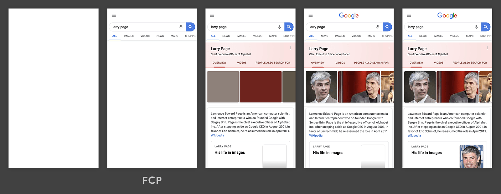

## 什么是性能

MDN上的web性能定义：web性能是网站或应用程序的客观度量和可感知的用户体验。

- 减少整体加载时间：减小文件体积、减少HTTP请求、使用预加载
- 使网站尽快可用：仅加载首屏内容，其他内容根据需要进行懒加载
- 平滑和交互性：使用css替代js动画、较少UI重绘
- 感知表现：你的用户可能不能做得更快，但你可以让用户感觉更快。耗时操作要给用户反馈，比如加载动画、进度条、骨架屏等提示信息
- 性能测定：性能指标、性能测试、性能监控持续优化

## 如何进行web性能优化

1. 首先需要了解性能指标——多快才算快？
2. 使用专业的工具可量化地评估出网站或应用的性能表现
3. 立足于网站页面响应的生命周期，分析出造成性能表现的原因
4. 进行技术改造，可行性分析等具体的优化实施
5. 迭代优化

## 性能指标

- RAIL 性能模型
- 基于用户体验的核心指标
- 新一代性能指标：Web Vitals

## 性能测量

- 浏览器DevTools调试工具
- 网络监控分析
- 性能监控分析
- 灯塔（Lighthouse）
- 网站整体质量评估，并给出优化建议
- WebPageTest
- 多测试地点
- 全面的性能报告


## web 性能指标

## RAIL 性能模型

- 响应 Response:：应该尽可能快速的响应用户(感知延迟之前接收到操作的反馈)（100ms内）
  - 比如在点击按钮向后台发起某项业务处理请求时，首先反馈给用户开始处理的提示，然后在处理完成的回调后反馈完成的提示
- 动画 Animation：展示动画每一帧以16ms进行渲染，保持一致性避免卡顿
- 空闲 Idel：使用js主线程应把任务划分到执行时间小于50ms片段，这样可以释放线程进行用户交互
- 加载：应该小于5s的时间加载完成网站，并且可以进行交互

## 基于用户体验的性能指标

## FCP(First Contentful Paint) 首次内容绘制

浏览器首次绘制来自DOM的内容的时间，内容必须是文本、图片（包含背景图）、非白色的canvas或SVG，包括带有正在加载中的web字体的文本（下图二即是FCP）



### 速度指标

| FCP时间（m） | 颜色编码     | FCP分数（HTTP存档百分位数） |
| ------------ | ------------ | --------------------------- |
| 0-2          | 绿色（快速） | 75-100                      |
| 2-4          | 橙色（中等） | 50-74                       |
| >4           | 红色（慢）   | 0-49                        |

### 优化方案

https://web.dev/fcp/#how-to-improve-fcp

## LCP(Largest Contentful Paint) 最大内容绘制

可视区域中最大的内容元素（占用资源最大）呈现到屏幕上的时间，用以估算页面的主要内容对用户可见时间。

LCP考虑的元素

- Img
- Video 封面图
- 通过 url 函数加载背景图
- 文本节点或其他文本元素子级块级元素


- LCP随着加载是会变化的，图上绿色的就是LCP

### 速度指标

| LCP时间（m） | 颜色编码     |
| ------------ | ------------ |
| 0-2          | 绿色（快速） |
| 2-4          | 橙色（中等） |
| >4           | 红色（慢）   |

### 优化方案

https://web.dev/optimize-lcp/

## FID(First Input Delay) 首次输入延迟

从用户第一次与页面交互到浏览器能够响应交互（单击链接、按钮）等到浏览器实际能够响应交互的时间

输入延迟是因为浏览器的主线程在忙于其他事情，如解析和执行大量计算的JavaScript

第一次输入延迟通常发生在第一次内容绘制(FCP)和可持续交互时间(TTI)之间，因为页面已经呈现了一些内容，但还不能可靠交互


### 速度指标


### 优化方案

https://web.dev/fid/#how-to-imporve-fid

## TTI(Time to Interactive)完全达到可交互状态

第一次达到完全可交互状态，可以持续响应用户输入。完全达到可交互状态的时间点是在最后一个长任务完成的时间，并在随后的5s内网络和主线程是空闲的。


### 速度指标

| TTI时间（m） | 颜色编码     |
| ------------ | ------------ |
| 0-3.8        | 绿色（快速） |
| 3.8-7.3      | 橙色（中等） |
| >7.3         | 红色（慢）   |

### 优化方案

https://web.dev/tti/#how-to-improve-tti

## TBT(Total Block Time)总阻塞时间

度量了FCP和TTI之间的总时间，在该时间范围内，主线程被阻塞足够长的时间以防止输入响应。

我们说主线程“被阻止”是因为浏览器无法中断正在进行的任务，如果用户在较长的任务中间与页面进行交互，则浏览器必须等待任务完成才能响应。给定的长任务的阻止时间是其持续时间超过50ms，页面的总阻塞时间=FCP+TTI之间发生的每个长任务的阻塞时间的总和。


上方的时间轴上有五个任务，其中三个是长任务，因为这些任务的持续时间超过 50 毫秒。下图显示了各个长任务的阻塞时间：


因此，虽然在主线程上运行任务的总时间为 560 毫秒，但其中只有 345 毫秒被视为阻塞时间。

### 速度指标

| TBT时间（ms） | 颜色编码     |
| ------------- | ------------ |
| 0-300         | 绿色（快速） |
| 300-600       | 橙色（中等） |
| >600          | 红色（慢）   |

### 优化方案

https://web.dev/tbt/#how-to-improve-tbt

## **CLS(Cumulative Layout Shift) 累计布局偏移** 

 CLS会测量在页面整个生命周期中发生的每个意外的布局移位的所有单独布局移位分数的总和，它是一种保证页面的视觉稳定性，从而提高用户体验的指标方案。


页面内容的意外移动通常是由于异步加载资源或将DOM元素动态添加到现有内容上方的页面而发生的。可以使用加载占位符使布局不变。

### 速度指标

| CLS      | 颜色编码     |
| -------- | ------------ |
| 0-0.1    | 绿色（快速） |
| 0.1-0.25 | 橙色（中等） |
| >0.25    | 红色（慢）   |

### 优化方案

https://web.dev/cls/#how-to-improve-cls

## Speed Index 速度指数

页面可视区域中内容的填充速度的指标，可以通过计算页面可见区域内容显示的平均时间来衡量。

### 速度指标

| TBT时间（s） | 颜色编码     |
| ------------ | ------------ |
| 0-4.3        | 绿色（快速） |
| 4.3-5.8      | 橙色（中等） |
| >5.8         | 红色（慢）   |


## web Vitals

精简版性能指标，包括：

- 加载体验
- 交互性
- 页面内容的视觉稳定性

### core web Vitals 与 web Vitals


Core web Vitals 是应用所有web页面的子集，是其最重要的核心


- 加载性能（LCP）-显示最大内容元素所需的时间
- 交互性（FID）-首次输入延迟时间
- 视觉稳定性（CLS）-累积布局配置偏移 

### 测量Web Vitals

- 性能测试工具，比如Lighthouse
- 使用web-vitals库
- 使用浏览器插件Web Vitals


## web 性能测试

- Lighthouse 
- Performance
- Memory
- Chrome DevTools

## 网页生命周期
1. 浏览器查看缓存，判断请求资源在缓存中并且新鲜
  - 如果已缓存且足够新鲜，直接提供给客户端
  - 否则与服务器进行验证
    - 强缓存：Expires、Cache-Control
    - 协商缓存：（Last-Modified、If-Modified-Since）、（Etag、If-None-Match）
2. 解析URL获取协议、主机、端口，并组装一个请求报文
3. 获取主机的ip地址
   - 浏览器缓存
   - 本地DNS服务器
   - 根域名服务器
   - 顶级域名服务器
   - 权威域名服务器
4. 建立TCP连接，并进行三次握手
5. TCP建立连接，发送http请求
6. 服务端相关处理
   - 检查http请求头是否包含缓存信息并验证
   - 读取请求并准备http响应，可能需要进行数据库查询
   - 将响应报文发送回浏览器
7. 浏览器接收HTTP响应，根据情况是否关闭或者重用TCP连接，关闭需要进行四次挥手
8. 浏览器检查响应状态，判断资源是否可缓存，解码（如gzip压缩）
9. 对资源类型决定如何处理（假设HTML文档，即关键渲染路径）
   - 解析文档，构建DOM树
   - 下载资源，构建CSSOM 树
   -  渲染绘制：将上面两个对象模型合并为渲染树，该渲染树只包含渲染可见的节点
      1. 从所生成的DOM树根节点向下遍历每个节点，忽略所有不可见的节点
      2. 在CSSOM 中为每个可见的子节点找到对应规则应用
      3. 布局阶段：根据所得到的渲染树，计算他们在设备视图中的具体位置和大小，输出一个“盒模型”
      4. 绘制阶段：将每个节点的具体绘制方式转化为屏幕上的实际像素
10. HTM 解析遇到script标签时进行资源加载和执行
   - async、defer

## 性能优化总结
- 资源响应速度
- 资源体积优化
- 资源加载顺序
- 代码质量
- 交互相关性能优化
  - 操作响应速度
  - 页面流畅度
  - 交互设计体验

## 资源响应速度
1. 使用 CDN 加速：利用CDN增加并发连接和长缓存的优势来加速下载静态资源
2. 开启gzip压缩：使用 gzip 压缩编码技术，减小资源体积。
3. 浏览器缓存：利用浏览器缓存(强缓存与协商缓存)与 Nginx 代理层缓存，缓存静态资源文件。
4. 减少网络请求次数和体积：通过压缩文件及合并小文件为大文件，减少网络请求次数，但需要找到合理的平衡点。
5. 升级 HTTP 协议

- CDN 加速
  - 内容分发网络（CDN） 是一组分布在多个不同物理位置的 web 服务器
  - 当服务器离用户越远，延迟越高
  - CDN 通过在多个位置部署服务器，缩短距离从而达到缩短时间
  - [CDN原理](/interview/network.html#七、cdn)
  
- gzip 压缩
  - 前端使用 webpack 进行 gzip 压缩
  - 服务器使用 Nginx 进行压缩
  
  ```
  // webpack
  if (process.env.NODE_ENV === 'production') {
    plugins.push(new CompressionWebpackPlugin({
      filename: '[path].gz[query]',
      algorithm: 'gzip',
      test: new RegExp(`\.(${productionGzipExtensions.join('|')})$`),
      threshold: 10240,
      minRatio: 0.8,
      deleteOriginalAssets: false
    }))
  }
  
  // nginx
  gzip on;
  gzip_static on;
  gzip_min_length 1k;
  gzip_buffers 4 16k;
  gzip_comp_level 2;
  gzip_types text/plain application/javascript application/x-javascript text/css application/xml text/javascript application/x-httpd-php application/vnd.ms-fontobject font/ttf font/opentype font/x-woff image/png image/jpeg image/svg+xml image/gif;
  gzip_vary off;
  gzip_disable "MSIE [1-6].";
  ```
- [浏览器缓存](/interview/browser.html#三、http-缓存)
- 减少网络请求次数和体积
  - 合理使用 webpack 打包策略进行代码拆包
  - 图片精灵（升级HTTP/2后不建议使用）
  - 清理多余js/css代码
  - 图片转base64策略优化，太大的突破不要使用base64，base64体积会更大，且影响js体积
- [升级 HTTP 协议](/interview/network.html#_5-版本总结比较)

## 资源体积优化
- 文本资源（html、css、js）
  - 代码压缩：minify
  - 压缩内容：比如使用 gzip 压缩
  - 代码精简
  - JS 体积优化方案
      - Tree Shaking
      - Code Split
      - 组件按需加载
      - 代码按需打包
  - CSS 体积优化方案
      - 引入第三方库样式文件时按需引入
      - 减少不必要的 css 前缀补全
- 图片资源
  - 去掉不必要的图片，能使用样式实现的不要使用图片
  - 雪碧图（HTTP/2及以上不需要雪碧图）
  - 上传图片大小限制
  - 压缩项目静态图片
  - 接入Webp图片处理，可以根据浏览器请求中所带的 accept 来判断是否支持webp格式，各cdn厂商基本上也都支持webp图片转换：阿里云图像处理

## 资源加载的顺序优化
图片、音频、视频等文件就不会阻塞页面的首次渲染，而 JavaScript、首次请求的 HTML 资源文件、CSS 文件是会阻塞首次渲染的，因为在构建 DOM 的过程中需要 HTML 和 JavaScript 文件，在构造渲染树的过程中需要用到 CSS 文件
- 把 css 放在 header中，便于页面渲染出来时，页面能按照预期中的样式正常显示
- js 代码一般放在 DOM 底部，如果 JavaScript 文件中没有操作 DOM 相关代码，就可以将该 JavaScript 脚本设置为异步加载，通过 async 或 defer 来标记代码

## 代码质量
代码质量分为很多方面，比如代码量、复杂度、代码结构设计等等
- 代码量
  - 代码精简：使用简洁并清晰的代码编写，这个一般与开发者的工作经验或者知识面有很大的关系
    - 使用 lodash 提供的功能函数
    - 使用正则替代一些复杂的js校验或者匹配功能
    - 合理使用一些位运算符
    - 使用es6语法
    - 去除无效代码
  - 抽离并封装公用模块代码
    - 当一个功能被多次使用就应该封装成公共函数
    - 公共组件封装
  - css原子化，尽量让每一行css都能得到充分利用
- 代码复杂度设计
  - 时间复杂度（增加 js 解析时间，影响了性能）
    - 减少嵌套循环，使用空间换时间
    - 使用高性能算法处理复杂功能
  - 空间复杂度（占据设备内存过大时，可能引起浏览器崩溃等问题）
    - 减少全局变量，和注意全局变量所占内存，防止内存不断增大，导致内存溢出。
    - 注意销毁不需要的对象，防止不销毁旧的对象，又不断生成新的对象，页面所在内存持续增长，导致页面崩溃。
- 代码结构设计
  - 组件懒加载
  - virtual-list
  - 图片懒加载

## 交互相关性能优化
影响交互性能的主要有几方面： 操作响应速度、 页面流畅度、 交互体验设计
- 操作响应速度
  - 什么情况会影响操作的响应速度？
    - 操作后执行时间过长，用户等待时间长
    - 有任务正在执行，占据主线程，需要等待主线程空闲
  - 优化
    - 首次加载只执行首屏需要代码，其他按需加载
    - 优化代码执行时间
- 页面流畅度
   - 渲染不及时，页面掉帧
     - js 执行时间过长
     - 回流重绘较多
     - 资源加载阻塞 
   - 页面内存占用过高，运行卡顿
     - 全局变量引起的内存泄露
     - 闭包引起的内存泄露
     - 定时器没清除
     - 循环引用
     - DOM 删除时没有解绑事件
     - 没有清理的 DOM 元素引用
- 交互体验设计
  - 用户习惯
  - 及时反馈

## vue 中优化

- 合理使用 watch 和 computed
- 合理使用组件，提高代码可维护性，降低耦合
- 使用路由懒加载
- 利用 vuex 缓存数据
- 合理使用 mixins，抽离公共代码模块
- 合理使用 v-if、v-show
- v-for 不要和 v-if 一起使用
- v-for 不要使用 index 做 key
- 使用 异步组件，避免一次性加载太多组件
- 避免使用v-html，有安全风险和性能问题
- 使用 keep-alive 缓存组件，避免组件重复加载

## webpack 优化

- 代码切割，使用`code splitting`将代码进行分割，避免将所有代码打包到一个文件，减少响应体积。
- 按需加载代码，在使用使用的时候加载代码。
- 压缩代码体积，可以减小代码体积
- 优化静态资源，使用字体图标、雪碧图、webp格式的图片、svg图标等
- 使用`Tree Shaking` 删除未被引用的代码
- 开启`gzip`压缩
- 静态资源使用`CDN`加载，减少服务器压力
