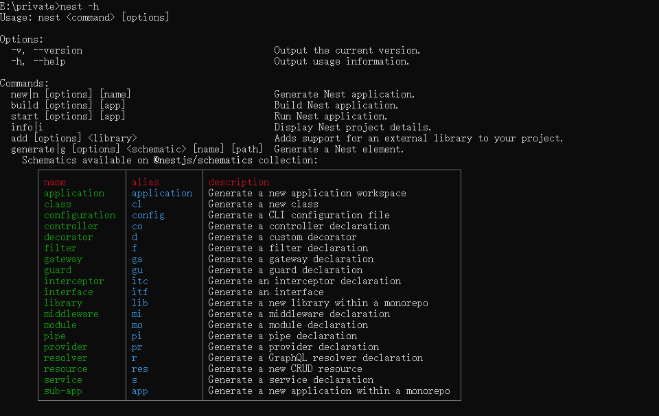
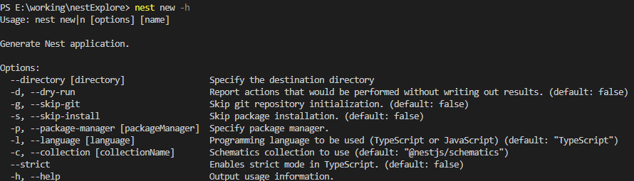

## 概述
Nest 在 @nestjs/cli 这个包里提供了相关命令。
可以直接 npx 执行，npm 会把它下载下来然后执行：
```
npx @nestjs/cli new 项目名
```
也可以安装到全局，然后执行，更推荐这种：
```
npm install -g @nestjs/cli

nest new 项目名
```
不过后者要时不时升级下版本，不然可能用它创建的项目版本不是最新的：
```
npm update -g @nestjs/cli
```
那 nest 都提供了啥命令呢？
```
nest -h
```



## nest new
- 作用：用来创建一个新的 nest 项目
- 具有选项：`nest new -h`



## nest generate

- 作用：生成一些代码片段，如controller、service、module 等
- 例子：生成module

```
nest generate module aaa
```


## nest build
## nest-cli.json
## nest start
## nest info
## 总结