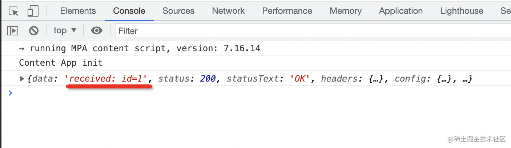
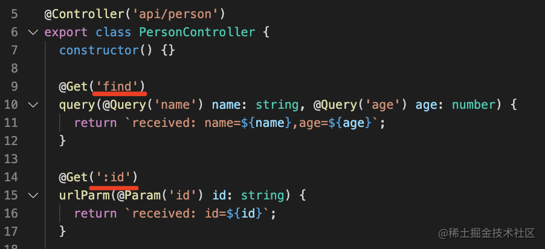
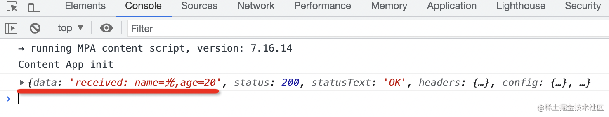
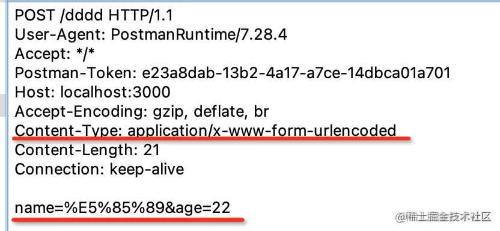
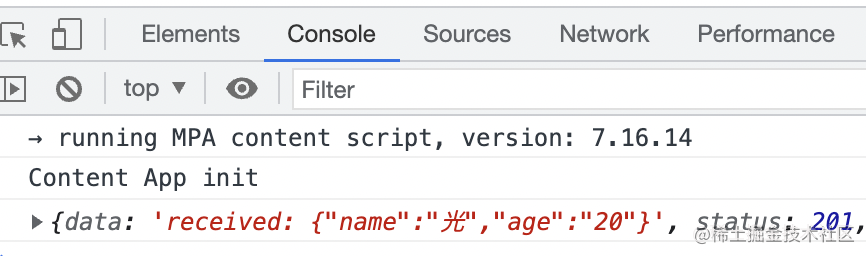
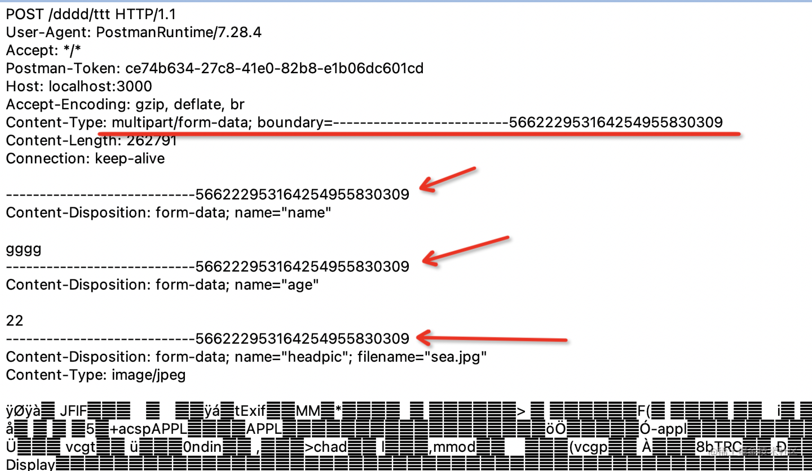
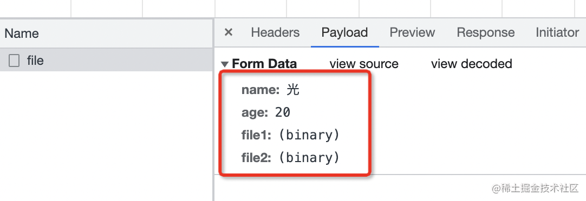
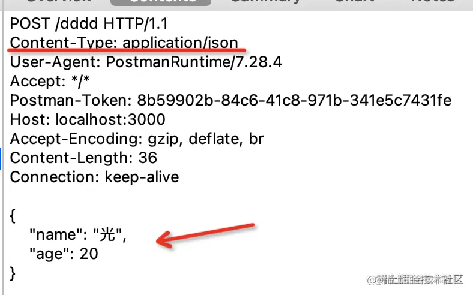
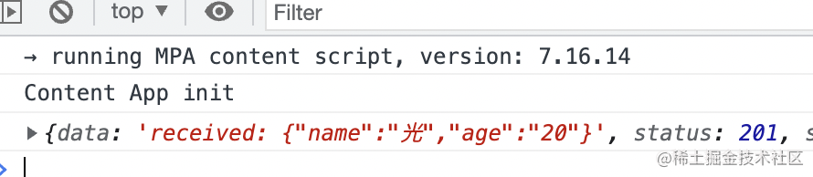

## url param

### 基础

http://localhost:3000/person/123

这里的123就是路径种的参数，服务端框架或者单页应用的路由都支持从 url 中取出参数

### nest 示例

url param 是 url 中的参数，Nest 里通过 :参数名 的方式来声明（比如下面的 :id），然后通过 @Param(参数名) 的装饰器取出来注入到 controller：

```
@Controller('api/person')
export class PersonController {
  @Get(':id')
  urlParam(@Param('id') id: string) {
    return `received: id=${id}`;
  }
}
```

@Controller('api/person') 的路由和 @Get(':id') 的路由会拼到一起，也就是只有 /api/person/xxx 的 get 请求才会走到这个方法。

### 前端示例

```
<!DOCTYPE html>
<html lang="en">
<head>
    <script src="https://unpkg.com/axios@0.24.0/dist/axios.min.js"></script>
</head>
<body>
    <script>
        async function urlParam() {
            const res = await axios.get('/api/person/1');
            console.log(res);            
        }
        urlParam();
   </script>
</body>
```



## query

### 基础

通过 url 中 ？后面的用 & 分隔的字符串传递数据。比如：

http://guang.zxg/person?name=guang&age=20

其中非英文的字符和一些特殊字符要经过编码，可以使用 encodeURIComponent 的 api 来编码：

```
const query = "?name=" + encodeURIComponent('光') + "&age=20"

// ?name=%E5%85%89&age=20
```

### nest 示例

在 Nest 里，通过 @Query 装饰器来取：

```
@Controller('api/person')
export class PersonController {
  @Get('find')
  query(@Query('name') name: string, @Query('age') age: number) {
    return `received: name=${name},age=${age}`;
  }
}
```

注意，这个 find 的路由要放到 :id 的路由前面，因为 Nest 是从上往下匹配的，如果放在后面，那就匹配到 :id 的路由了。



### 前端示例

```
<!DOCTYPE html>
<html lang="en">
<head>
    <script src="https://unpkg.com/axios@0.24.0/dist/axios.min.js"></script>
</head>
<body>
    <script>
        async function query() {
            const res = await axios.get('/api/person/find', {
                params: {
                    name: '光',
                    age: 20
                }
            });
            console.log(res);            
        }
        query();
   </script>
</body>
</html>
```



## form urlencoded

### 基础

因为内容也是 query 字符串，所以也要用 encodeURIComponent 的 api 或者 query-string 库处理下。

这种格式也很容易理解，get 是把数据拼成 query 字符串放在 url 后面，于是表单的 post 提交方式的时候就直接用相同的方式把数据放在了 body 里。

通过 & 分隔的 form-urlencoded 的方式需要对内容做 url encode，如果传递大量的数据，比如上传文件的时候就不是很合适了，因为文件 encode 一遍的话太慢了，这时候就可以用 form-data



### nest 示例

用 Nest 接收的话，使用 @Body 装饰器，Nest 会解析请求体，然后注入到 dto 中。

dto 是 data transfer object，就是用于封装传输的数据的对象：

```
export class CreatePersonDto {
    name: string;
    age: number;
}
```

```
import { CreatePersonDto } from './dto/create-person.dto';

@Controller('api/person')
export class PersonController {
  @Post()
  body(@Body() createPersonDto: CreatePersonDto) {
    return `received: ${JSON.stringify(createPersonDto)}`
  }
}
```

### 前端示例

前端代码使用 post 方式请求，指定 content type 为 `application/x-www-form-urlencoded`，用 qs 做下 url encode：

```
<!DOCTYPE html>
<html lang="en">
<head>
    <script src="https://unpkg.com/axios@0.24.0/dist/axios.min.js"></script>
    <script src="https://unpkg.com/qs@6.10.2/dist/qs.js"></script>
</head>
<body>
    <script>
        async function formUrlEncoded() {
            const res = await axios.post('/api/person', Qs.stringify({
                name: '光',
                age: 20
            }), {
                headers: { 'content-type': 'application/x-www-form-urlencoded' }
            });
            console.log(res);  
        }

        formUrlEncoded();
    </script>
</body>
</html>
```



## form data

### 基础



form-data 需要指定 content type 为 `multipart/form-data`，然后指定 boundary 也就是分割线。

body 里面就是用 boundary 分隔符分割的内容。

### nest 示例

Nest 解析 form data 使用 FilesInterceptor 的拦截器，用 @UseInterceptors 装饰器启用，然后通过 @UploadedFiles 来取。非文件的内容，同样是通过 @Body 来取。

```
import { AnyFilesInterceptor } from '@nestjs/platform-express';
import { CreatePersonDto } from './dto/create-person.dto';

@Controller('api/person')
export class PersonController {
  @Post('file')
  @UseInterceptors(AnyFilesInterceptor({
      dest: 'uploads/'
  }))
  body2(@Body() createPersonDto: CreatePersonDto, @UploadedFiles() files: Array<Express.Multer.File>) {
    console.log(files);
    return `received: ${JSON.stringify(createPersonDto)}`
  }
}
```

### 前端示例

```
npm i -D @types/multer
```

前端代码使用 axios 发送 post 请求，指定 content type 为 `multipart/form-data`：

```
<!DOCTYPE html>
<html lang="en">
<head>
    <script src="https://unpkg.com/axios@0.24.0/dist/axios.min.js"></script>
</head>
<body>
    <input id="fileInput" type="file" multiple/>
    <script>
        const fileInput = document.querySelector('#fileInput');

        async function formData() {
            const data = new FormData();
            data.set('name','光');
            data.set('age', 20);
            data.set('file1', fileInput.files[0]);
            data.set('file2', fileInput.files[1]);

            const res = await axios.post('/api/person/file', data, {
                headers: { 'content-type': 'multipart/form-data' }
            });
            console.log(res);     
        }

        fileInput.onchange = formData;
    </script>
</body>
</html>
```



## json

### 基础

form-urlencoded 需要对内容做 url encode，而 form data 则需要加很长的 boundary，两种方式都有一些缺点。如果只是传输 json 数据的话，不需要用这两种。

可以直接指定content type 为 application/json 就行：



### nest 示例

后端代码同样使用 @Body 来接收，不需要做啥变动。form urlencoded 和 json 都是从 body 取值，Nest 内部会根据 content type 做区分，使用不同的解析方式。

```
@Controller('api/person')
export class PersonController {
  @Post()
  body(@Body() createPersonDto: CreatePersonDto) {
    return `received: ${JSON.stringify(createPersonDto)}`
  }
}
```

### 前端示例

前端代码使用 axios 发送 post 请求，默认传输 json 就会指定 content type 为 `application/json`，不需要手动指定：

```
<!DOCTYPE html>
<html lang="en">
<head>
    <script src="https://unpkg.com/axios@0.24.0/dist/axios.min.js"></script>
</head>
<body>
    <script>
        async function json() {
            const res = await axios.post('/api/person', {
                name: '光',
                age: 20
            });
            console.log(res);     
        }
        json();
    </script>
</body>
</html>
```



## nest 实现

1. 安装 @nestjs/cli，使用 nest new xxx 创建一个 Nest 的项目

```
nest new http-demo
```

2. 在根目录执行 nest g resource person 快速生成 person 模块的 crud 代码

```
nest g resource person
```

3. nest start --watch 启动 Nest 服务

```
nest start --watch
```

4. main.ts

是负责启动 Nest 的 ioc 容器的，调用下 useStaticAssets 来支持静态资源的请求：

```
import { NestFactory } from '@nestjs/core';
import { AppModule } from './app.module';

async function bootstrap() {
  const app = await NestFactory.create(AppModule);
  await app.listen(3000);
}
bootstrap();
```

