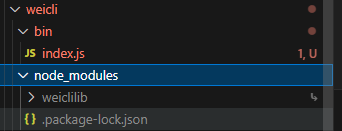

# 脚手架开发流程

## 开发流程

- 创建`npm`项目

- 创建脚手架入口文件，最上方添加：

  ```
  #!/usr/bin/env node
  ```

- 配置`package.json`，添加`bin`属性

  - 通过`bin`属性及对应的入口文件地址

- 编写脚手架代码

- 将脚手架发布到`npm`

## 难点解析

- 分包：将复杂的系统拆分成若干个模块
- 命令注册,如：

```
vue create
vue add
vue invoke
```

- 参数解析：

```
vue command [options] <params>
```

- options全称：`--version`、`--help`

- options简写：`-v`、`-h`

- 带 params 的options：`--path /Users/well/xxx`

- 帮助文档

  - global help
    - Usage
    - Options
    - Commands

- 示例：`vue`的帮助信息

  - 脚手架帮助信息

  ```
  Usage: vue <command> [options]
  
  Options:
    -V, --version                              output the version number
    -h, --help                                 display help for command
  
  Commands:
    create [options] <app-name>                create a new project powered by vue-cli-service
    add [options] <plugin> [pluginOptions]     install a plugin and invoke its generator in an already created project
    invoke [options] <plugin> [pluginOptions]  invoke the generator of a plugin in an already created project
    inspect [options] [paths...]               inspect the webpack config in a project with vue-cli-service
    serve                                      alias of "npm run serve" in the current project
    build                                      alias of "npm run build" in the current project
    ui [options]                               start and open the vue-cli ui
    init [options] <template> <app-name>       generate a project from a remote template (legacy API, requires @vue/cli-init)  
    config [options] [value]                   inspect and modify the config
    outdated [options]                         (experimental) check for outdated vue cli service / plugins
    upgrade [options] [plugin-name]            (experimental) upgrade vue cli service / plugins
    migrate [options] [plugin-name]            (experimental) run migrator for an already-installed cli plugin
    info                                       print debugging information about your environment
    help [command]                             display help for command
  
    Run vue <command> --help for detailed usage of given command.
  ```

  - 脚手架帮助信息：`vue <command> --help`，如 `vue create --help`

  ```
  Usage: vue create [options] <app-name>
  
  create a new project powered by vue-cli-service
  
  Options:
    -p, --preset <presetName>       Skip prompts and use saved or remote preset
    -d, --default                   Skip prompts and use default preset
    -i, --inlinePreset <json>       Skip prompts and use inline JSON string as preset
    -m, --packageManager <command>  Use specified npm client when installing dependencies
    -r, --registry <url>            Use specified npm registry when installing dependencies (only for npm)
    -g, --git [message]             Force git initialization with initial commit message
    -n, --no-git                    Skip git initialization
    -f, --force                     Overwrite target directory if it exists
    --merge                         Merge target directory if it exists
    -c, --clone                     Use git clone when fetching remote preset
    -x, --proxy <proxyUrl>          Use specified proxy when creating project
    -b, --bare                      Scaffold project without beginner instructions
    --skipGetStarted                Skip displaying "Get started" instructions
    -h, --help                      display help for command
  ```

- 其他

  - 命令行交互
  - 日志打印
  - 命令行文字变色
  - 网络通信：HTTP/WebSocket
  - 文件处理

# 第一个脚手架

## 快速发布第一个脚手架

1. 文件路径

   ```
   weicli
   	- bin
   		- index.js
   package.json
   ```

2. `package.json`

```
"name": "@well_haha/weicli",
"bin": {
    "weicli": "bin/index.js"
}
```

3. `bin/index.js`

```
#!/usr/bin/env node

console.log('一个最简单的脚手架！')
```

4. `npm login`，`npm publish`

登录的过程中遇到高版本`node`无法登录的情况，在切换`node`版本后登录上再切换回来

5. 使用

```
npm i @well_haha/weicli -g

weicli
```

## 如何调试本地脚手架

1. 在文件目录执行 npm link

```
// weicli 目录
npm link
```

此时，我们的npm 全局模块上就会增加生成软链


2. 解除本地链接

```
npm unlink weicli
```

试了不行，就直接到全局模块上删掉软链入口就好了

## 调试库文件

1. 文件目录

```
weiclilib
  - lib
    - index.js
package.json
```

2. lib/index.js

```
module.exports = {
    sum(a, b) {
        return a + b
    }
}
```

3. package.json

`main`的作用，是该文件作为库时的入口

```
"name": "weiclilib",
"version": "1.0.0",
"main": "lib/index.js"
```

4. 使用

   1. 手动添加依赖

   ```
   // weicli/package.json
   "dependencies": {
       "weiclilib": "^1.0.0"
   }
   ```

   2. weicli 目录下执行-添加软链

   ```
   // weicli 目录下执行-添加软链
   npm link weiclilib
   ```

   测试weicli 下会增加一个node_modules 文件夹

    

   3. 执行，在脚手架中调用库文件即可

   ```
   // weicli/bin/index.js
   #!/usr/bin/env node
   
   const lib = require('weiclilib')
   console.log(lib.sum(1, 2))
   
   console.log('一个最简单的脚手架！')
   ```
   

## 脚手架命令注册和参数解释

### 参数解释

```
// weicli/bin/index.js
#!/usr/bin/env node

console.log(require('process').argv)
```

执行 `weicli  init    `

```
[
  'C:\\Program Files\\nodejs\\node.exe',
  'C:\\Program Files\\nodejs\\node_modules\\@well_haha\\weicli\\bin\\index.js',
  'init'
]
```

可以通过 argv[2]来获取参数

### 简单demo

```
// weiclilib/lib/index.js

module.exports = {
    init({ option, param }) {
        console.log('执行init流程', option, param)
    }
}

```

```
#!/usr/bin/env node

const lib = require('weiclilib')
const argv = require('process').argv

// 脚手架第一个参数
const command = argv[2]

// 脚手架第一个参数后的参数
const options = argv.slice(3)

if (options.length) {
    let [option, param] = options
    option = option.replace('--', '')

    if (command) {
        if (lib[command]) {
            lib[command]({ option, param })
        } else {
            console.log('请输入正确命令')
        }
    } else {
        console.log('请输入命令')
    }
}

// 实现全局参数解释 --version -V
if (command.startsWith('--') || command.startsWith('-')) {
    const globalOption = command.replace(/--|-/g, '')
    if (globalOption === 'V' || globalOption === 'version') {
        console.log('1.0.0')
    }
}
```

1. 解析命令并调用库文件的方法

```
weicli init --name well 
// 执行init流程 name well
```

2. 测试全局函数

```
weicli -version
// 1.0.0
```

## 发布上线

1. 先发布库文件

   ```
   npm publish
   ```

2. 解除脚手架与库文件的软链接，直接安装线上包

   ```
   npm unlink weiclilib
   npm i weiclilib
   ```

3. 发布脚手架包即可

