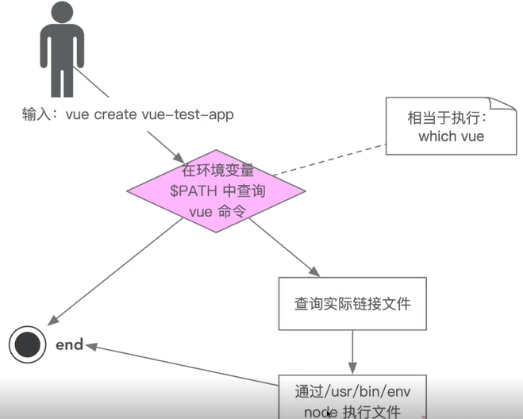

## 解密 vue-cli 的执行过程
在使用vue-cli 的时候，当我们输入```vue create xxx``` 的时候，到底发生了什么呢？
1. 为什么全局安装`@vue/cli` 后会添加的命令为 `vue`?

     1. 通过查看`@vue/cli` 下的 `package.json`文件

        ```
        "bin": {
            "vue": "bin/vue.js"
        }
        ```

     2. package.json 中 bin 属性的作用

        1. 指定一个名为 `vue` 的命令，其入口文件位于 `bin/vue.js`
        2. 当你全局安装该包后，可以直接通过在终端中属性`vue`来运行相应的命令

2. 全局安装 `@vue/cli`时发生了什么？

     1. `npm` 会把对应的包下载到node_modules 目录下

     2. 解析包中`package.json` 中 `bin`的配置，配置一个对应命令`vue`的软链接，所以我们会在C:\Program Files\nodejs\node_modules 下有一个 vue.cmd 文件，此文件识别到vue命令，执行`bin`目录中配置的js文件

          ```
          @ECHO off
          GOTO start
          :find_dp0
          SET dp0=%~dp0
          EXIT /b
          :start
          SETLOCAL
          CALL :find_dp0
          
          IF EXIST "%dp0%\node.exe" (
            SET "_prog=%dp0%\node.exe"
          ) ELSE (
            SET "_prog=node"
            SET PATHEXT=%PATHEXT:;.JS;=;%
          )
          
          endLocal & goto #_undefined_# 2>NUL || title %COMSPEC% & "%_prog%"  "%dp0%\node_modules\@vue\cli\bin\vue.js" %*
          ```

3. 执行 `vue` 命令时发生了什么？为什么`vue`指向一个`js`文件，我们可以直接通过`vue`命令去执行它？

     1. 从操作系统的角度来看

          1. 当我们在命令中输入`vue`中的时候，操作系统会尝试根据环境变量中的路径来查找可执行文件。在安装 Node.js 和 Vue CLI 时，相关的可执行文件被添加到系统的环境变量中（通常是 PATH 变量）

          2. Node.js 在系统中的环境变量路径查看

               ```
               // cmd
               echo %PATH%
               
               C:\Users\10855\AppData\Roaming\nvm;C:\Program Files\nodejs
               ```

          3. 打开  Node.js 环境变量路径（C:\Program Files\nodejs）

               1. 文件目录

                    ```
                    - node_modules (目录)
                    	- @vue
                    		- cli
                    			- bin
                    				- vue.js
                    - vue (文件)
                    - vue.cmd (文件)
                    ```

                    我们在全局安装的时候，npm会在node_modules下载包，并添加软链接(vue/vue.cmd)

               2. vue/vue.cmd 文件内容与作用

                    其是一个shell 脚本，会执行当前目录路径下/node_modules/@vue/cli/bin/vue.js

                    - vue 文件代码

                    ```
                    #!/bin/sh
                    basedir=$(dirname "$(echo "$0" | sed -e 's,\\,/,g')")
                    
                    case `uname` in
                        *CYGWIN*|*MINGW*|*MSYS*) basedir=`cygpath -w "$basedir"`;;
                    esac
                    
                    if [ -x "$basedir/node" ]; then
                      exec "$basedir/node"  "$basedir/node_modules/@vue/cli/bin/vue.js" "$@"
                    else 
                      exec node  "$basedir/node_modules/@vue/cli/bin/vue.js" "$@"
                    fi
                    ```

                    - vue.cmd

                    ```
                    @ECHO off
                    GOTO start
                    :find_dp0
                    SET dp0=%~dp0
                    EXIT /b
                    :start
                    SETLOCAL
                    CALL :find_dp0
                    
                    IF EXIST "%dp0%\node.exe" (
                      SET "_prog=%dp0%\node.exe"
                    ) ELSE (
                      SET "_prog=node"
                      SET PATHEXT=%PATHEXT:;.JS;=;%
                    )
                    
                    endLocal & goto #_undefined_# 2>NUL || title %COMSPEC% & "%_prog%"  "%dp0%\node_modules\@vue\cli\bin\vue.js" %*
                    ```

     2. 从执行的角度

          1. 操作系统会通过which vue/ where vue 的路径找到并执行文件

          ```
          C:\Users\10855>where vue
          C:\Program Files\nodejs\vue
          C:\Program Files\nodejs\vue.cmd
          ```

          2. 这个文件作为软链接，会去执行对应的js 文件

          3. 对应的js文件

             这段代码指定 node 解析器来执行此段代码

             ```
             #!/usr/bin/env node
             
             ...
             ```




## 从应用角度如何开发一个脚手架

1. 开发`npm`项目，该项目中应包含一个`bin/vue.js `文件，并将这个项目发布到`npm`
2. 将 `npm` 项目安装到 `node` 的 `node_modules`
3. 将 `node` 的 `bin` 目录下配置 `vue` 软链接执行 `node_modules/@vue/cli/bin/vue.js `

