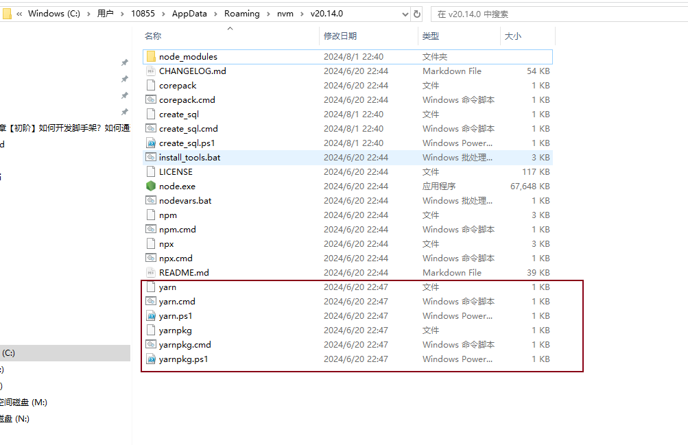

## 脚手架入口
每个脚手架，都需要指定其入口，例如：
yarn 的源码目录中，其 package.json 配置类似如下：

其提供了一个 yarn 的命令

```
{
    "bin": {
        "yarn": "bin/yarn.js"
    }
}

```


## 指定运行环境

必须加这段代码指定运行环境，才不会报错

```
// bin/yarn.js

#!/usr/bin/env node
```


## 软链接

```
npm i yarn -g
```

当我们通过命令安装的时候， 会在我们的全局npm 目录上生成脚手架的软链接，使用yarn命令的时候就会通过软链接运行配置的bin文件


