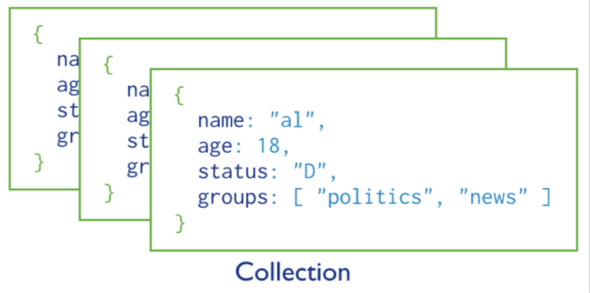

## 基础概念与操作
- 类似一个大对象，对象里面有不同的集合，集合里面有不同的文档

  

- 数据库操作

  ```
  // 显示数据库
  show dbs
  
  // 创建数据库
  use myDB
  
  // 删除数据库
  db.dropDatabase()
  ```

- 集合

  -  语法规则：`db.collectionName.method`

  ```
  // 创建集合
  db.users.insertOne({name: 'well', age: 18})
  
  // 删除集合
  db.users.drop()
  
  // 查看集合
  show collections
  ```

- 文档

  - MongoDB 将数据记录存储为 BSON 文档

  - BSON（Binary JSON）是 JSON 文档的二进制表示形式，它比 JSON 包含更多的数据类型

  - [BSON 规范](http://bsonspec.org/)

  - [BSON 支持的数据类型](https://docs.mongodb.com/manual/reference/bson-types/)

  - 常用数据类型

    | 类型               | 整数标识符 | 别名（字符串标识符） |
    | ------------------ | ---------- | -------------------- |
    | Double             | 1          | “double”             |
    | String             | 2          | “string”             |
    | Object             | 3          | “object”             |
    | Array              | 4          | “array”              |
    | Binary data        | 5          | “binData”            |
    | ObjectId           | 7          | “objectId”           |
    | Boolean            | 8          | “bool”               |
    | Date               | 9          | “date”               |
    | Null               | 10         | “null”               |
    | Regular Expression | 11         | “regex”              |
    | 32-bit integer     | 16         | “int”                |
    | Timestamp          | 17         | “timestamp”          |
    | 64-bit integer     | 18         | “long”               |
    | Decimal128         | 19         | “decimal”            |

  - _id 字段

    - 默认情况下，MongoDB 在创建集合时会在 `_id` 字段上创建唯一索引
    - `_id` 字段始终是文档中的第一个字段
    - `_id` 字段可以包含任何 BSON 数据类型的值，而不是数组

  ```
  db.users.find()
  // {
  //  _id: ObjectId("64da394f3793e664ffacbefc"),
  //  name: 'well',
  //  age: 18
  // }
  ```


## 创建文档

- db.collection.insertOne()
- db.collection.insertMany()

```
db.users.insertOne({name: 'xiaoming', age: 25, info: {sport: ['football']}})
```

## 查询文档

- 常用查询[操作符](https://www.mongodb.com/docs/manual/reference/operator/query/)
  1. 比较操作符
     - `$eq`：等于
     - `$ne`：不等于
     - `$gt`：大于
     - `$gte`：大于等于
     - `$lt`：小于
     - `$lte`：小于等于
     - `$in`：在给定数组中
     - `$nin`：不在给定数组中
  2. 逻辑操作符
     - `$and`：逻辑与
     - `$or`：逻辑或
     - `$not`：逻辑非
     - `$nor`：既不是此又不是那个
  3. 元素操作符
     - `$exists`：字段是否存在
     - `$type`：字段类型
  4. 数组操作符
     - `$all`：匹配包含所有指定元素的数组
     - `$elemMatch`：匹配数组中满足指定条件的元素
     - `$size`：匹配数组长度为指定大小的文档
  5. 正则表达式操作符
     - `$regex`：正则表达式匹配
  6. 文本搜索操作符
     - `$text`：文本搜索
  7. 日前操作符
     - `$date`：日期和时间操作
  
- 查询文档
  
  - `db.collection.find([query][, projection])`
    - query: 查询条件
    - 投影操作符指定返回的键，1：返回 0：不返回
  
  ```
  db.users.find()
  
  // 指定查询内容与返回字段
  db.users.find({name:'well'}, {age: 1})
  
  // 利用操作符指定查询内容
  db.users.find({name: 'well', age: {$lt: 30}})
  db.users.find({
  	$or: [
          {name: 'liuguowei'},
          {age: {$lt: 30}}
  	]
  })
  ```

## 更新文档

- db.collection.updateOne(queryObj, updateObj)
- db.collection.updateMany(queryObj, updateObj)
- db.collection.replaceOne(queryObj, updateObj)
- queryObj：查询条件对象：指定要匹配的文档条件
- updateObj：更新操作对象：指定要应用于匹配文档的更新操作

```
db.users.updateOne({name: 'well'}, {$set: {"info.sex": 'femal'}})
```

## 删除文档

- db.inventory.deleteMany(queryObj)
- db.inventory.deleteOne(queryObj)

## [node 操作MongoDB](https://www.mongodb.com/docs/drivers/node/current/quick-start/connect-to-mongodb/)
```
npm install mongodb
```
```
/* eslint-disable @typescript-eslint/no-var-requires */
const { MongoClient } = require('mongodb')

const client = new MongoClient('mongodb://127.0.0.1:27017', {
    useUnifiedTopology: true
})

async function run() {
    try {
        // 开始连接
        await client.connect()
        const personDB = client.db('myDB')
        const usersCollection = personDB.collection('users')
        const userDocument = {
            name: 'well',
            age: 18,
            info: {
                job: 'player',
                sport: ['soccer', 'pingpong']
            }
        }
        await usersCollection.insertOne(userDocument)
        const ret = await usersCollection.find()
        console.log(await ret.toArray())
    } catch (err) {
        // 连接失败
        console.log('连接失败', err)
    } finally {
        // 关闭连接
        await client.close()
    }
}

run()
```

## [mongoose](http://www.mongoosejs.net/)
```
npm i mongoose --save
```
- Schema
  - 用于定义数据库中文档结构的规范
  - 定义了文档所包含的字段、字段类型、验证规则等信息
- Model
  - 通过 Schema 编译生成的构造函数，用于创建具有相同属性和行为的文档实例
  - Model允许你操作数据库，如保存、查询、更新和删除文档等
- Document
  - Document是Model的实例，表示数据库中的一个文档
```
const mongoose = require('mongoose')
mongoose.connect('mongodb://127.0.0.1:27017/myDB')

// 使用mongoose连接数据库
const db = mongoose.connection
// 当连接失败的时候
db.on('error', err => {
    console.log('MongoDB 数据库连接失败', err)
})
// 当连接成功的时候
db.once('open', function () {
    console.log('MongoDB 数据库连接成功')
    start()
})

// 定义 Schema
const userSchema = new mongoose.Schema({
    name: String,
    age: Number,
    info: {
        job: String,
        sport: Array
    }
})

// 创建数据模型
const users = mongoose.model('users', userSchema)

const start = async () => {
    try {
        // const user = new users({
        //     name: 'mike',
        //     age: 18,
        //     info: {
        //         job: 'player',
        //         sport: ['basketball']
        //     }
        // })
        // await user.save()
        const result = await users.find()
        console.log(result)
    } catch (error) {
        console.error(error.message)
    }
}
```
