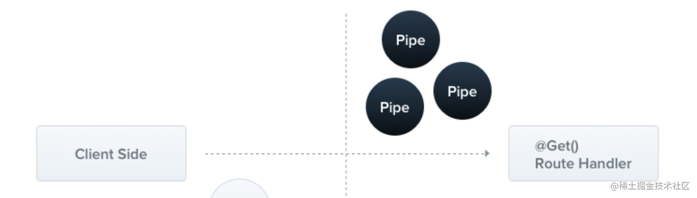
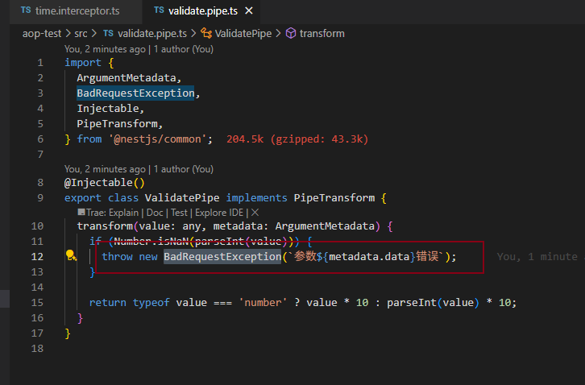

## MVC 架构

MVC 是 Model View Controller 的简写。MVC 架构下，请求会先发送给 Controller，由它调度 Model 层的 Service 来完成业务逻辑，然后返回对应的 View。


## AOP


**AOP 的好处是可以把一些通用逻辑分离到切面中，保持业务逻辑的纯粹性，这样切面逻辑可以复用，还可以动态的增删。**

其实 Express 的中间件的洋葱模型也是一种 AOP 的实现，因为你可以透明的在外面包一层，加入一些逻辑，内层感知不到。

而Nest 实现 AOP 的方式更多，一共有五种，包括 Middleware、Guard、Pipe、Interceptor、ExceptionFilter。

新建个 nest 项目，我们挨个试一下：

```
nest new aop-test
```

### 中间件 Middleware

中间件是 Express 里的概念，Nest 的底层是 Express，所以自然也可以使用中间件，但是做了进一步的细分，分为了全局中间件和路由中间件。

#### 全局中间件


1. handlers


2. 效果


#### 路由中间件

1. 生成中间件

```
nest g middleware log --no-spec --flat
```

--no-spec 是不生成测试文件，--flat 是平铺，不生成目录。


2. 增加打印日志：

```
import { Injectable, NestMiddleware } from '@nestjs/common';

@Injectable()
export class LogMiddleware implements NestMiddleware {
  use(req: any, res: any, next: () => void) {
    console.log('before2', req.url);

    next();
    
    console.log('after2');
  } 
}
```

3. 在  AppModule 里启用


4. 测试

a-m 的 路由生效了，b-m的路由配置了没应用

```
# 访问
http://localhost:3000/a-m/findAll

# 打印
before: /a-m/findAll
before2 /findAll
after2
after:
```

```
# 访问
http://localhost:3000/b-m/findAll

# 打印
before: /b-m/findAll
after:
```

### 路由守卫 Guard

Guard 是路由守卫的意思，可以用于在调用某个 Controller 之前判断权限，返回 true 或者 false 来决定是否放行：


1. 创建 Guard：

```
nest g guard login --no-spec --flat
```


Guard 要实现 CanActivate 接口，实现 canActivate 方法，可以从 context 拿到请求的信息，然后做一些权限验证等处理之后返回 true 或者 false。

我们加个打印语句，然后返回 false：

2. 在 AppController 里启用


效果：


打印日志：

```
before: /test1
login check
after:
```

3. controller 使用


3. 全局启用

   (1) 第一种使用方式

   这种方式是手动new 的 Guard 实例，不 在 IOC 容器里


​	（2）第二种使用方式

​		这种使用 provider 的方式声明的 Guard 是在 IOC 容器里，可以注入到别的provider


​		可以注入依赖的实例，如AppService:


```
# 打印日志

before: /test2
login check Hello World!
after:
```


### 拦截器 Interceptor

Interceptor 是拦截器的意思，可以在目标 Controller 方法前后加入一些逻辑：

其与Middleware 差不多，主要区别在于参数不同，Interceptor 可以拿到调用的controller 和 handler


1. 创建 interceptor

```
nest g interceptor time --no-spec --flat
```


Interceptor 要实现 NestInterceptor 接口，实现 intercept 方法，调用 next.handle() 就会调用目标 Controller，可以在之前和之后加入一些处理逻辑。

Controller 之前之后的处理逻辑可能是异步的。Nest 里通过 rxjs 来组织它们，所以可以使用 rxjs 的各种 operator。

```
import {
  CallHandler,
  ExecutionContext,
  Injectable,
  NestInterceptor,
} from '@nestjs/common';
import { Observable, tap } from 'rxjs';

@Injectable()
export class TimeInterceptor implements NestInterceptor {
  intercept(context: ExecutionContext, next: CallHandler): Observable<any> {
    // interceptor 可以拿到调用的controller和handler
    console.log(context.getClass().name, context.getHandler().name);

    const startTime = Date.now();

    return next.handle().pipe(
      tap(() => {
        console.log('time: ', Date.now() - startTime);
      }),
    );
  }
}

```

2.  在 AppController 使用


打印日志：

```
# 访问
http://localhost:3000/test2
# 打印日志
AppController getTest2
getTest2 called
time:  5
```

3. controller 使用


4. 全局使用


### Pipe 管道

Pipe 是管道的意思，用来对参数做一些检验和转换：



1. 创建管道

```
nest g pipe validate --no-spec --flat
```

Pipe 要实现 PipeTransform 接口，实现 transform 方法，里面可以对传入的参数值 value 做参数验证，比如格式、类型是否正确，不正确就抛出异常。也可以做转换，返回转换后的值。


```
import {
  ArgumentMetadata,
  BadRequestException,
  Injectable,
  PipeTransform,
} from '@nestjs/common';

@Injectable()
export class ValidatePipe implements PipeTransform {
  transform(value: any, metadata: ArgumentMetadata) {
    if (Number.isNaN(parseInt(value))) {
      throw new BadRequestException(`参数${metadata.data}错误`);
    }

    return typeof value === 'number' ? value * 10 : parseInt(value) * 10;
  }
}

```

这里的 value 就是传入的参数，如果不能转成数字，就返回参数错误，否则乘 10 再传入 handle

2.  在 AppController 使用


3. 内置 Pipe
   1. ValidationPipe
   2. ParseIntPipe
   3. ParseBoolPipe
   4. ParseArrayPipe
   5. ParseUUIDPipe
   6. DefaultValuePipe
   7. ParseEnumPipe
   8. ParseFloatPipe
   9. ParseFilePipe
4. 对 controller 生效


5. 全局生效


### ExceptionFilter

ExceptionFilter 可以对抛出的异常做处理，返回对应的响应：


其实我们刚刚在 pipe 里抛的这个错误，能够返回 400 的响应，就是 Exception Filter 做的：



1. 创建 filter

   ```
   nest g filter test --no-spec --flat
   ```

   

```
import {
  ArgumentsHost,
  BadRequestException,
  Catch,
  ExceptionFilter,
} from '@nestjs/common';
import { Response } from 'express';

@Catch(BadRequestException)
export class TestFilter implements ExceptionFilter {
  catch(exception: BadRequestException, host: ArgumentsHost) {
    const response: Response = host.switchToHttp().getResponse();

    response.status(400).json({
      statusCode: 400,
      message: 'test: ' + exception.message,
    });
  }
}

```

2. 在 AppController 使用


3. 内置 http 异常

   Nest 内置了很多 http 相关的异常，都是 HttpException 的子类：

   1. BadRequestException
   2. UnauthorizedException
   3. NotFoundException
   4. ForbiddenException
   5. NotAcceptableException
   6. RequestTimeoutException
   7. ConflictException
   8. GoneException
   9. PayloadTooLargeException
   10. UnsupportedMediaTypeException
   11. UnprocessableException
   12. InternalServerErrorException
   13. NotImplementedException
   14. BadGatewayException
   15. ServiceUnavailableException
   16. GatewayTimeoutException

当然，也可以自己扩展：


**Nest 通过这样的方式实现了异常到响应的对应关系，代码里只要抛出不同的异常，就会返回对应的响应，很方便。**

4. controller 或全局使用


### 几种AOP 机制的顺序


