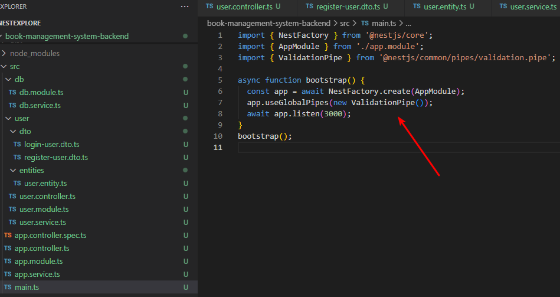
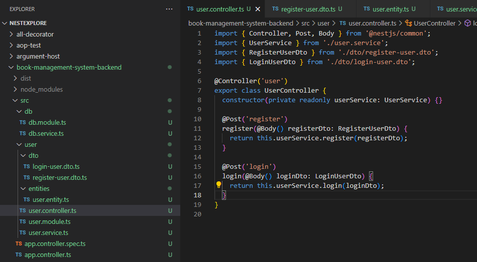
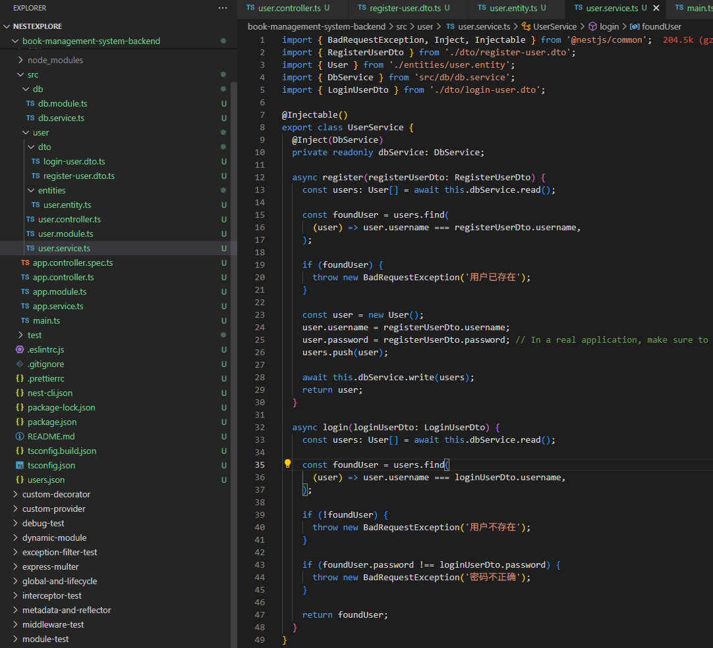
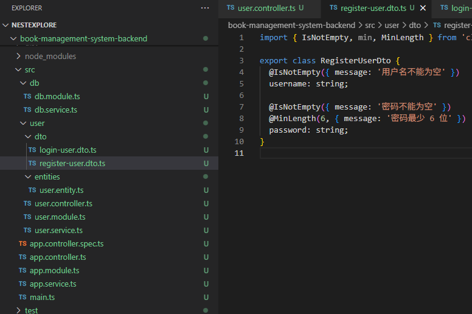
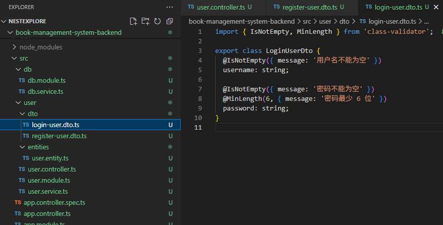
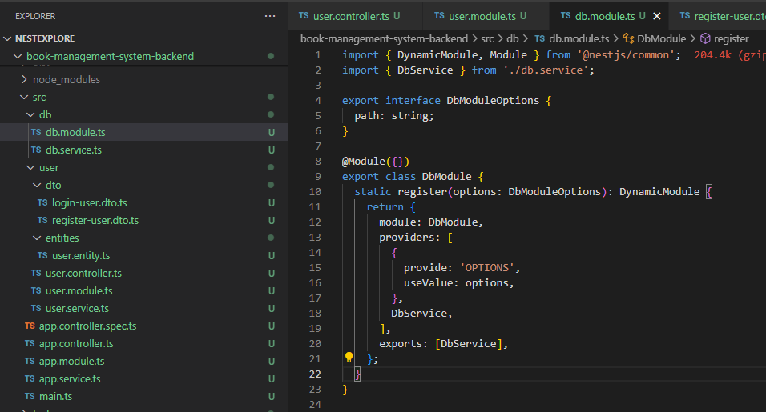
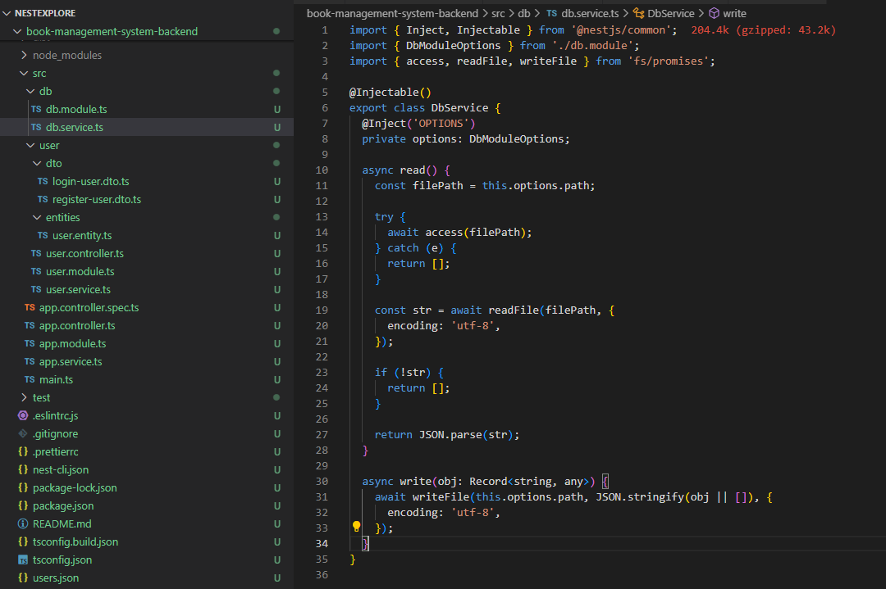
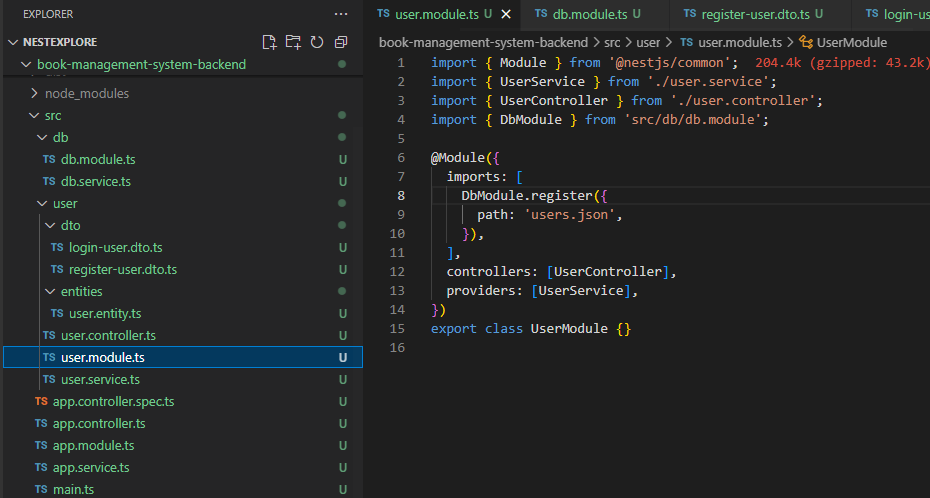

## 项目初始化
1. 创建项目
```
nest new book-management-system-backend
```

2. 运行
```
npm run start:dev
```

3. 过滤器

```
npm install --save class-transformer class-validator
```



## user 模块

1. 创建 user 模块

```
nest g resource user --no-spec
```


2. service 



3. dto





4. db





