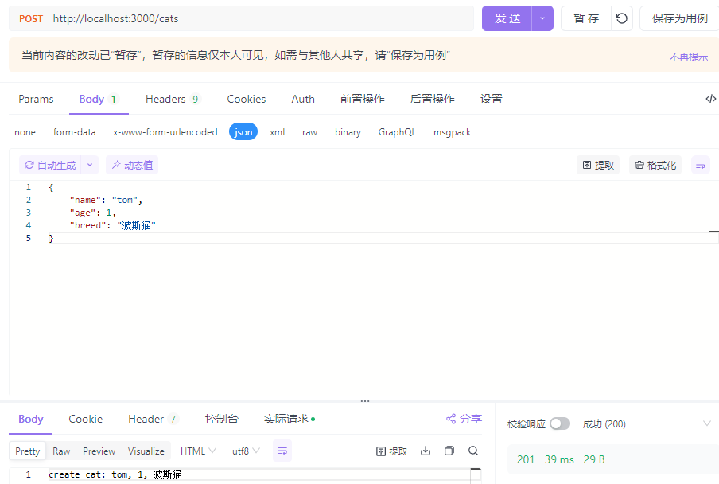
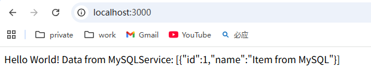

## 模块（Module）

### 设计意图

- 将应用划分为逻辑单元，每个模块负责特定功能
- 提高代码的可复用性和可维护性

### 用法

Nest 应用由多个模块组成，每个模块是一个独立的功能单元。

- 根模块 `AppModule` 是应用的入口点
- 使用 `@Module()` 装饰器定义模块

```
// src/app.module.ts
import { Module } from '@nestjs/common';
import { AppController } from './app.controller';
import { AppService } from './app.service';

@Module({
  imports: [], // 导入其他模块
  controllers: [AppController], // 该模块的控制器
  providers: [AppService], // 服务提供者（可注入）
  exports: [], // 导出供其他模块使用的提供者
})
export class AppModule {}
```

### 文档资料

#### 资料链接

​	[模块](https://nest.nodejs.cn/modules)

#### 全局模块

#### 识动态模块

## 控制器

### 设计意图

- 控制器处理请求，负责接收客户端请求并返回响应
- 遵循单一职责原则

### 用法

控制器负责处理 **HTTP 请求** 并返回响应。

- 使用 `@Controller()` 装饰器定义
- 支持 `@Get()`, `@Post()`, `@Put()`, `@Delete()` 等请求方法装饰器

```
// src/app.controller.ts
import { Controller, Get } from '@nestjs/common';
import { AppService } from './app.service';

@Controller() // 可选参数：指定路由前缀，如 @Controller('users')
export class AppController {
  constructor(private readonly appService: AppService) {}

  @Get() // 处理 GET / 请求
  getHello(): string {
    return this.appService.getHello();
  }

  @Get('users') // 处理 GET /users 请求
  getUsers() {
    return [{ id: 1, name: '张三' }];
  }
}
```

### 文档资料

#### 资料链接

​	[控制器](https://nest.nodejs.cn/controllers)

#### 其他知识

##### 请求对象

| `@Request(), @Req()`       | `req`                               |
| -------------------------- | ----------------------------------- |
| `@Response(), @Res()`***** | `res`                               |
| `@Next()`                  | `next`                              |
| `@Session()`               | `req.session`                       |
| `@Param(key?: string)`     | `req.params` / `req.params[key]`    |
| `@Body(key?: string)`      | `req.body` / `req.body[key]`        |
| `@Query(key?: string)`     | `req.query` / `req.query[key]`      |
| `@Headers(name?: string)`  | `req.headers` / `req.headers[name]` |
| `@Ip()`                    | `req.ip`                            |
| `@HostParam()`             | `req.hosts`                         |

##### 资源

Nest 为所有标准的 HTTP 方法提供装饰器：`@Get()`、`@Post()`、`@Put()`、`@Delete()`、`@Patch()`、`@Options()` 和 `@Head()`。此外，`@All()` 定义了一个端点来处理所有这些。

```
@Controller('cats')
export class CatsController {
  constructor(private readonly catsService: CatsService) {}
  @Get()
  findAll() {
    return this.catsService.findAll();
  }

  @Get(':id')
  findOne(@Param('id') id: string) {
    return this.catsService.findOne(+id);
  }
  
  ...
}

```

- findAll: http://localhost:3000/cats

- findOne: http://localhost:3000/cats/1

##### 路由通配符

```
@Get('abcd/*')
findAll() {
  return 'This route uses a wildcard';
}
```

`'abcd/*'` 路由路径将匹配 `abcd/`、`abcd/123`、`abcd/abc` 等。连字符 (`-`) 和点 (`.`) 由基于字符串的路径逐字解释。

##### 状态码

- 响应的默认状态代码始终为 200，但 POST 请求除外，其默认为 201。
- 可以通过在处理程序级别使用 `@HttpCode(...)` 装饰器轻松更改此行为

```
@Post()
@HttpCode(204)
create(@Body() createCatDto: CreateCatDto) {
	return this.catsService.create(createCatDto);
}

create(createCatDto: CreateCatDto) {
	return `create cat: ${createCatDto.name}, ${createCatDto.age}`;
}
```

这里指定了HttpCode(204),会强制NestJs 返回一个空的响应体，无论你的方法返回了什么

##### 响应头

```
@Get()
@Header('Cache-Control', 'no-store')
findAll() {
	return this.catsService.findAll();
}
```

##### 重定向

```
@Get()
@Redirect('https://nest.nodejs.cn', 301)


@Get('docs')
@Redirect('https://nest.nodejs.cn', 302)
getDocs(@Query('version') version) {
  if (version && version === '5') {
    return { url: 'https://nest.nodejs.cn/v5/' };
  }
}
```

##### 路由参数

http://localhost:3000/cats/1

使用@Param()

```
@Get(':id')
findOne(@Param('id') id: string) {
	return this.catsService.findOne(+id);
}
```

##### 请求负载

使用@Query



```
// create-cat.dto.ts
export class CreateCatDto {
  name: string;
  age: number;
  breed: string;
}

@Post()
create(@Body() createCatDto: CreateCatDto) {
	return this.catsService.create(createCatDto);
}

create(createCatDto: CreateCatDto) {
	return `create cat: ${createCatDto.name}, ${createCatDto.age}, ${createCatDto.breed}`;
}
```

##### 查询参数

http://localhost:3000/cats?breed=波斯猫

```
@Get()
findAll(@Query('breed') breed?: string) {
	return this.catsService.findAll(breed);
}
```

##### 其他

1. 子域路由
2. 状态共享
3. 异步性

## 提供器

### 设计意图

通过 **依赖注入（Dependency Injection, DI）** 机制实现组件间的解耦，让代码更易于测试、维护和扩展。

| 类型             | 用途                                                   | 示例场景                        |
| ---------------- | ------------------------------------------------------ | ------------------------------- |
| **类提供器**     | 最常用，封装业务逻辑、数据处理等                       | 用户服务、商品管理服务          |
| **工厂提供器**   | 动态创建提供器实例，支持复杂初始化逻辑                 | 数据库连接池、第三方 API 客户端 |
| **值提供器**     | 注入简单的值（常量、配置对象等）                       | 应用配置、静态数据              |
| **类工厂提供器** | 通过类的静态方法创建实例，结合类的封装性和工厂的灵活性 | 带配置的服务实例                |
| **异步提供器**   | 支持异步初始化（如等待数据库连接成功）                 | 数据库服务、消息队列客户端      |

### 用法

**服务**就是一个最典型的类提供器。

### 文档资料

#### 资料链接

[提供器](https://nest.nodejs.cn/providers)

#### 其他知识

##### 服务

1. 定义提供器（类提供器）

   使用 `@Injectable()` 装饰器标记类，指定其作用域（默认全局，可通过 `scope` 配置修改）。

2.  注入提供器

   在需要使用提供器的组件（如控制器、其他提供器）中，通过 **构造函数参数** 注入。Nest 会自动从容器中获取实例

3. 注册提供器

   提供器必须在 **模块（Module）** 中注册，才能被 Nest 容器识别。在模块的 `providers` 数组中添加提供器类。

```
// cats.services.ts（定义提供器）
import { Injectable } from '@nestjs/common';
@Injectable()
export class CatsService {
  findOne(id: number) {
    return `This action returns a #${id} cat`;
  }
}

// cats.controller.ts（注入提供器）
import {
  Controller,
  Get,
  Param
} from '@nestjs/common';
import { CatsService } from './cats.service';
@Controller('cats')
export class CatsController {
  constructor(private readonly catsService: CatsService) {}

  @Get(':id')
  findOne(@Param('id') id: string) {
    return this.catsService.findOne(+id);
  }
}

// cats.module.ts（注册提供器）
import { Module } from '@nestjs/common';
import { CatsService } from './cats.service';
import { CatsController } from './cats.controller';
@Module({
  controllers: [CatsController],
  providers: [CatsService],
})
export class CatsModule {}
```

##### 依赖注入

- 依赖注入是一种设计模式，它的核心思想是 **“组件不应该自己创建依赖，而是由外部容器提供”**。

- 推荐用法：始终使用构造函数注入

##### 作用域

###### 作用

作用域决定了一个提供器的实例何时被创建以及它的生命周期。Nest 提供了三种作用域，以适应不同的应用场景。

###### 用法

通过 `@Injectable()` 装饰器的 `scope` 属性来设置。

| 作用域               | 装饰器设置                                | 含义                                                         | 适用场景                                                   |
| -------------------- | ----------------------------------------- | ------------------------------------------------------------ | ---------------------------------------------------------- |
| **默认 (Singleton)** | `@Injectable()`                           | 整个应用生命周期内只有一个实例。当应用启动时创建，应用关闭时销毁。 | 无状态的服务，如数据处理、工具函数等。这是最常用的作用域。 |
| **请求 (Request)**   | `@Injectable({ scope: Scope.REQUEST })`   | 每个传入的请求都会创建一个新的实例。请求处理完毕后，实例被垃圾回收。 | 需要存储请求级别的状态，例如追踪当前请求的用户上下文。     |
| **瞬时 (Transient)** | `@Injectable({ scope: Scope.TRANSIENT })` | 每次注入时都会创建一个新的实例。                             |                                                            |

###### 示例：请求作用域

在这个例子中，对每个 HTTP 请求，`RequestScopedService` 都会是一个全新的实例，拥有不同的 `requestId`。

```
import { Injectable, Scope } from '@nestjs/common';

@Injectable({ scope: Scope.REQUEST })
export class RequestScopedService {
  private requestId = Math.random().toString(36).substring(7);

  getRequestId() {
    return this.requestId;
  }
}
```

##### 自定义提供器

###### 作用

- 标准的类提供器适用于大多数情况，但有时你需要更灵活的方式来定义提供器，例如：

  - 注入一个简单的值（如配置对象）。

  - 注入一个由工厂函数动态创建的实例。

  - 别名一个已存在的提供器。

  - 提供一个接口的不同实现。

- 推荐用法
  - `useValue` 用于常量
  - `useFactory` 用于动态创建
  - `useClass` 用于类替换

自定义提供器通过 `providers` 数组中的对象字面量来定义，它有多种形式。

###### 值提供器（Value Provider）

用于注入一个预先计算好的值。使用 `useValue`。

```
// src\provider-module\provider-module.service.ts
const config = {
  apiKey: 'secret-key',
  endpoint: 'https://api.example.com',
};
@Module({
  controllers: [ProviderModuleController],
  providers: [ProviderModuleService, { provide: 'CONFIG', useValue: config }],
})
export class ProviderModuleModule {}

// src\provider-module\provider-module.controller.ts
@Controller('provider-module')
export class ProviderModuleController {
  constructor(private readonly providerModuleService: ProviderModuleService) {}

  @Get('endpoint')
  getEndpoint() {
    return this.providerModuleService.getEndpoint();
  }
}

// src\provider-module\provider-module.service.ts
@Injectable()
export class ProviderModuleService {
  constructor(@Inject('CONFIG') private config: any) {}
  getEndpoint() {
    return this.config.endpoint;
  }
}
```

###### 工厂提供器

用于通过一个工厂函数来动态创建提供器实例。这在创建实例前需要进行一些计算或依赖解析时非常有用。使用 `useFactory`。

1. .env

   ```
   # .env 文件
   DB_TYPE=mysql
   # DB_TYPE=postgres
   
   # 其他数据库配置（如果需要覆盖默认值）
   # DB_HOST=192.168.1.100
   # DB_PORT=5432
   # DB_USERNAME=admin
   # DB_PASSWORD=secure_password
   # DB_NAME=production_db
   ```

2. 配置服务（config.service.ts）

   这个服务负责读取应用配置，是工厂函数的一个依赖。

   ```
   import { Injectable } from '@nestjs/common';
   import * as dotenv from 'dotenv';
   
   // 加载 .env 文件中的环境变量
   dotenv.config();
   
   @Injectable()
   export class ConfigService {
     // 获取数据库类型
     getDatabaseType(): 'mysql' | 'postgres' {
       const type = process.env.DB_TYPE;
       return type === 'mysql' || type === 'postgres' ? type : 'mysql'; // 默认使用 mysql
     }
   
     // 获取数据库主机
     getDatabaseHost(): string {
       return process.env.DB_HOST || 'localhost';
     }
   
     // 获取数据库端口
     getDatabasePort(): number {
       return parseInt(process.env.DB_PORT, 10) || 3306; // MySQL 默认端口
     }
   
     // 获取数据库用户名
     getDatabaseUsername(): string {
       return process.env.DB_USERNAME || 'root';
     }
   
     // 获取数据库密码
     getDatabasePassword(): string {
       return process.env.DB_PASSWORD || 'password';
     }
   
     // 获取数据库名称
     getDatabaseName(): string {
       return process.env.DB_NAME || 'test_db';
     }
   }
   ```

3. 数据库服务接口（database.interface.ts）

   ```
   // src/database/database.interface.ts
   export interface DatabaseService {
     connect(): Promise<void>;
     query(sql: string): Promise<any[]>;
     disconnect(): Promise<void>;
   }
   ```

4. 具体数据库服务—mysql（mysql.service.ts）

   ```
   // src/database/mysql.service.ts
   import { Injectable } from '@nestjs/common';
   import { DatabaseService } from './database.interface';
   
   @Injectable()
   export class MySQLService implements DatabaseService {
     private isConnected = false;
   
     constructor(
       private host: string,
       private port: number,
       private username: string,
       private password: string,
       private database: string,
     ) {}
   
     async connect(): Promise<void> {
       // 模拟数据库连接
       console.log(
         `[MySQL] Connecting to ${this.host}:${this.port}/${this.database} as ${this.username}...`,
       );
       // 这里应该是真实的 MySQL 客户端连接代码
       // await mysql.createConnection({ ... });
       this.isConnected = true;
       console.log('[MySQL] Connected successfully.');
     }
   
     async query(sql: string): Promise<any[]> {
       if (!this.isConnected) {
         throw new Error('Not connected to the database.');
       }
       console.log(`[MySQL] Executing query: ${sql}`);
       // 模拟查询
       return Promise.resolve([{ id: 1, name: 'Item from MySQL' }]);
     }
   
     async disconnect(): Promise<void> {
       // 模拟断开连接
       console.log('[MySQL] Disconnecting...');
       this.isConnected = false;
       console.log('[MySQL] Disconnected.');
     }
   }
   ```

   5. 具体数据库服务—postgres（postgres.service.ts）

      ```
      // src/database/postgres.service.ts
      import { Injectable } from '@nestjs/common';
      import { DatabaseService } from './database.interface';
      
      @Injectable()
      export class PostgreSQLService implements DatabaseService {
        private isConnected = false;
      
        constructor(
          private host: string,
          private port: number,
          private username: string,
          private password: string,
          private database: string,
        ) {}
      
        async connect(): Promise<void> {
          // 模拟数据库连接
          console.log(
            `[PostgreSQL] Connecting to ${this.host}:${this.port}/${this.database} as ${this.username}...`,
          );
          // 这里应该是真实的 PostgreSQL 客户端连接代码
          // await new Pool({ ... }).connect();
          this.isConnected = true;
          console.log('[PostgreSQL] Connected successfully.');
        }
      
        async query(sql: string): Promise<any[]> {
          if (!this.isConnected) {
            throw new Error('Not connected to the database.');
          }
          console.log(`[PostgreSQL] Executing query: ${sql}`);
          // 模拟查询
          return Promise.resolve([{ id: 1, name: 'Item from PostgreSQL' }]);
        }
      
        async disconnect(): Promise<void> {
          // 模拟断开连接
          console.log('[PostgreSQL] Disconnecting...');
          this.isConnected = false;
          console.log('[PostgreSQL] Disconnected.');
        }
      }
      ```

   6. 数据库和工厂提供器

      ```
      // src/database/database.module.ts
      import { Module, Provider } from '@nestjs/common';
      import { ConfigService } from '../config/config.service';
      import { DatabaseService } from './database.interface';
      import { MySQLService } from './mysql.service';
      import { PostgreSQLService } from './postgres.service';
      
      // 定义一个令牌（Token），用于标识我们的数据库服务
      export const DATABASE_SERVICE_TOKEN = 'DATABASE_SERVICE';
      
      // 工厂提供器
      const databaseProvider: Provider = {
        provide: DATABASE_SERVICE_TOKEN, // 使用令牌作为提供器的标识
        useFactory: async (
          configService: ConfigService,
        ): Promise<DatabaseService> => {
          // 1. 从配置服务中获取数据库类型和连接信息
          const dbType = configService.getDatabaseType();
          const host = configService.getDatabaseHost();
          const port = configService.getDatabasePort();
          const username = configService.getDatabaseUsername();
          const password = configService.getDatabasePassword();
          const database = configService.getDatabaseName();
      
          // 2. 根据数据库类型，动态创建并返回相应的数据库服务实例
          let dbService: DatabaseService;
      
          switch (dbType) {
            case 'postgres':
              dbService = new PostgreSQLService(
                host,
                port,
                username,
                password,
                database,
              );
              break;
            case 'mysql':
            default:
              dbService = new MySQLService(host, port, username, password, database);
              break;
          }
      
          // 3. (可选) 工厂函数可以执行异步操作，比如提前建立数据库连接
          await dbService.connect();
      
          // 4. 返回创建好的实例
          return dbService;
        },
        // 声明工厂函数的依赖项，Nest 会自动注入
        inject: [ConfigService],
      };
      
      @Module({
        // 注册工厂提供器和其他所需的提供器
        providers: [
          databaseProvider,
          ConfigService, // ConfigService 本身也是一个提供器
          // MySQLService 和 PostgreSQLService 不需要在这里列出，因为它们是在工厂内部手动实例化的
        ],
        // 导出令牌，以便其他模块可以注入这个动态创建的数据库服务
        exports: [DATABASE_SERVICE_TOKEN],
      })
      export class DatabaseModule {}
      ```

   7. 应用控制器（app.controller.ts）

      ```
      @Controller()
      export class AppController implements OnModuleDestroy {
        constructor(
          private readonly appService: AppService,
          @Inject(DATABASE_SERVICE_TOKEN)
          private readonly databaseService: DatabaseService,
        ) {}
      
        @Get()
        async getHello(): Promise<string> {
          const results = await this.databaseService.query('SELECT * FROM items');
          return `Hello World! Data from ${this.databaseService.constructor.name}: ${JSON.stringify(results)}`;
        }
      
        // 在应用关闭时，断开数据库连接
        async onModuleDestroy() {
          await this.databaseService.disconnect();
        }
      }
      ```

      

###### 类提供器

不同的环境提供不同的配置服务

```
const configServiceProvider = {
  provide: ConfigService,
  useClass:
    process.env.NODE_ENV === 'development'
      ? DevelopmentConfigService
      : ProductionConfigService,
};

@Module({
  providers: [configServiceProvider],
})
export class AppModule {}
```

##### 可选提供器

###### 作用

当一个提供器可能存在也可能不存在时，可以将其标记为可选的。这样，即使该提供器未被注册，应用也不会抛出错误。

###### 用法

使用 `@Optional()` 装饰器。

```
import { Injectable, Optional, Inject } from '@nestjs/common';

@Injectable()
export class CatsService {
  // 如果 'LOGGER_SERVICE' 没有被注册，logger 参数会是 undefined
  constructor(
    @Optional() @Inject('LOGGER_SERVICE') private readonly logger: LoggerService,
  ) {}

  findAll() {
    if (this.logger) {
      this.logger.log('Fetching all cats');
    }
    return ['Cat1', 'Cat2'];
  }
}
```

##### 基于属性的注入

###### 作用

这是一种替代构造函数注入的方式，通过直接在类的属性上使用 `@Inject()` 装饰器来注入依赖。

**注意**：Nest 团队**推荐使用构造函数注入**，因为它更符合依赖倒置原则，使得类的依赖关系在构造函数中一目了然，也更易于进行单元测试（因为可以通过构造函数直接传入模拟依赖）。属性注入通常在某些特殊场景下使用，例如当父类需要注入依赖，而子类又不想在构造函数中重复传递这些依赖时。

###### 用法

```
import { Injectable, Inject } from '@nestjs/common';

@Injectable()
export class CatsService {
  // 直接在属性上注入
  @Inject('LOGGER_SERVICE')
  private readonly logger: LoggerService;

  // 构造函数可以是空的
  constructor() {}

  findAll() {
    this.logger.log('Fetching cats');
    // ...
  }
}
```

##### 手动实例化

###### 作用

虽然 Nest 鼓励使用依赖注入，但在某些情况下（例如在动态模块或非常特殊的逻辑中），你可能需要手动从容器中获取一个提供器的实例。

###### 用法

可以通过 `ModuleRef` 来实现。`ModuleRef` 本身也是一个可以注入的提供器。

```
import { Injectable, ModuleRef } from '@nestjs/common';

@Injectable()
export class DynamicService {
  constructor(private moduleRef: ModuleRef) {}

  getCatsService() {
    // 手动获取 CatsService 的实例
    // 注意：这会返回与当前模块上下文相关的实例
    const catsService = this.moduleRef.get(CatsService);
    return catsService.findAll();
  }
}
```

