## 基础使用

### 创建

```
nest g decorator test --flat
```

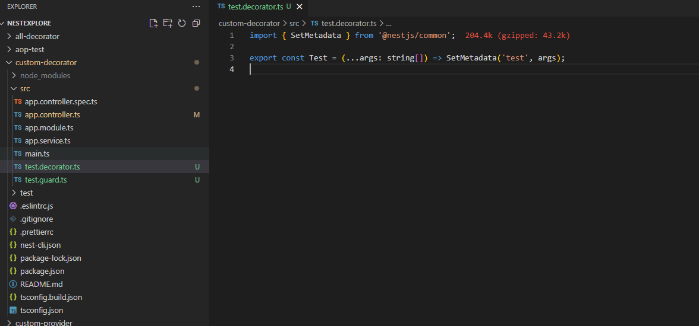

### 验证

```
nest g guard test --flat --no-spec
```

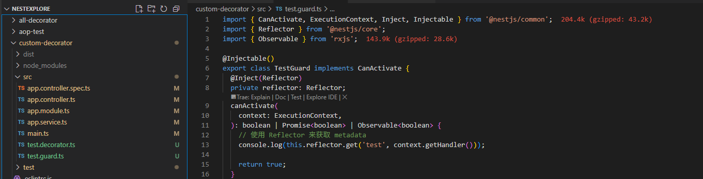

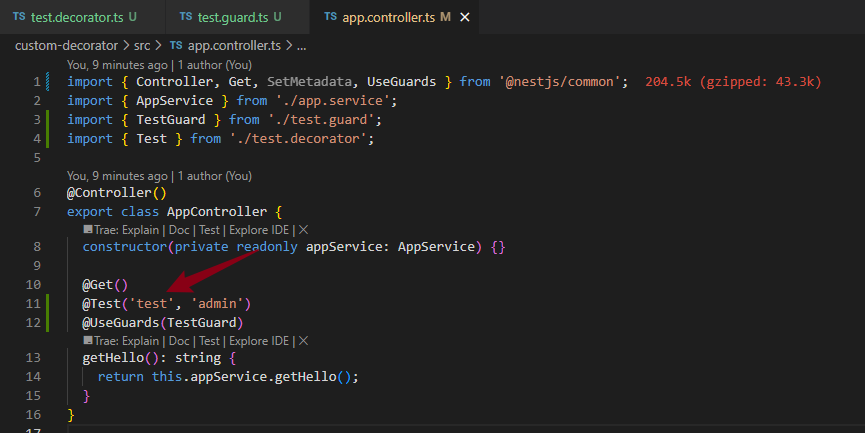

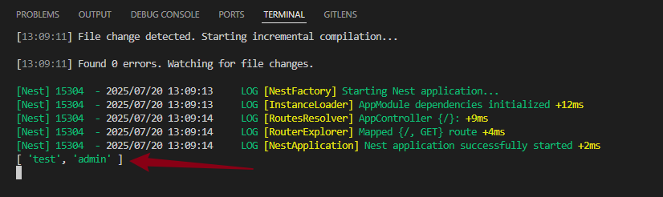

## 合并多个装饰器

### 创建

```
nest g decorator test2 --flat
```

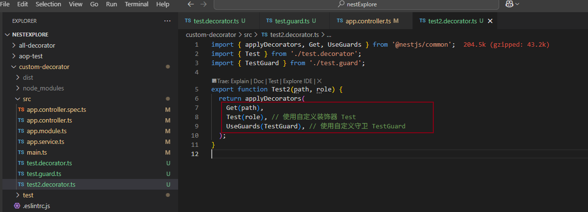

### 验证

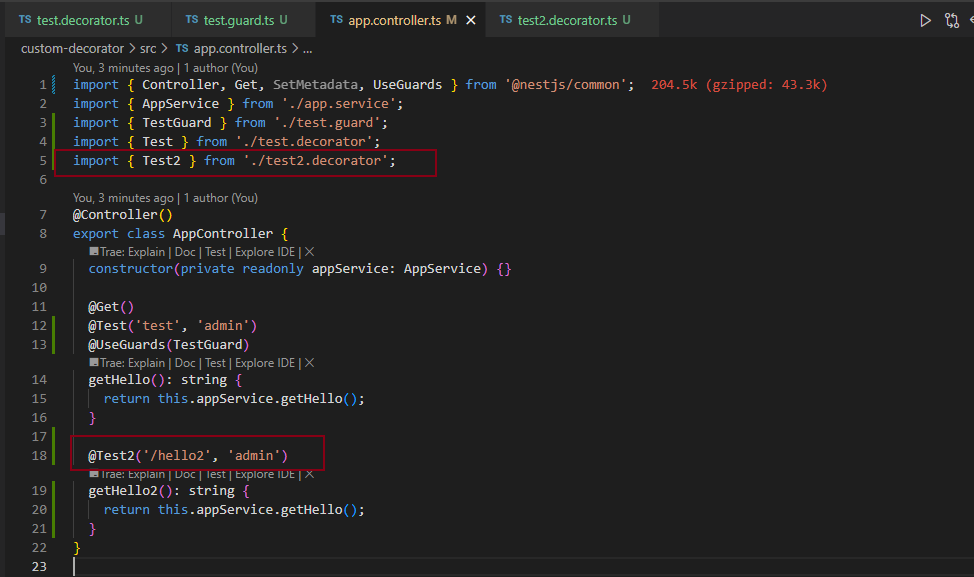

```
访问：http://localhost:3000/hello2
```

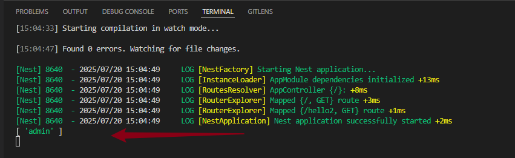

## 自定义参数装饰器

### 参数透传

```
nest g decorator test3 --flat
```

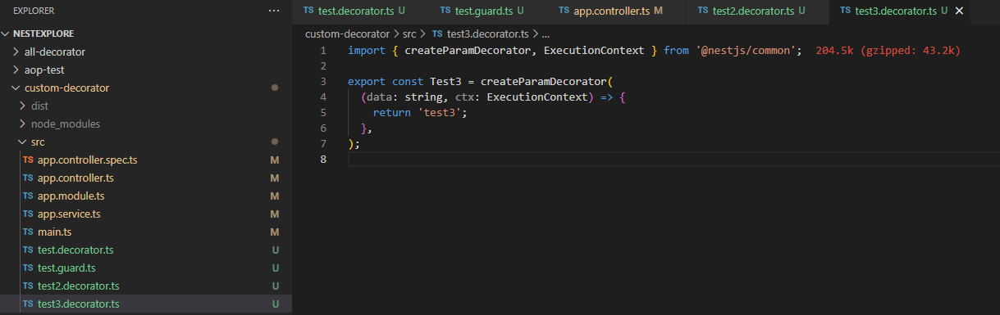

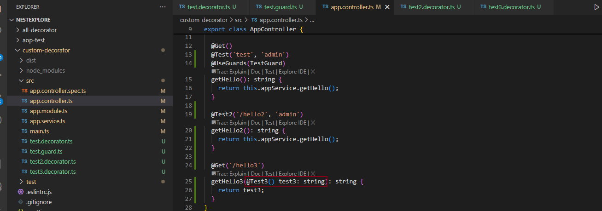

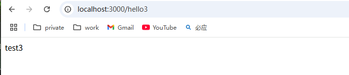

### 实现内置装饰器-headers

```
nest g decorator MyHeaders --flat
```

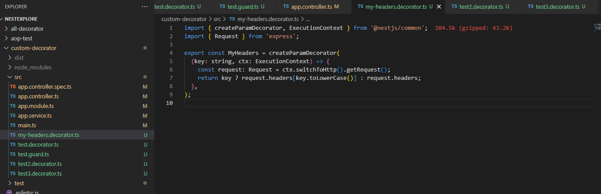

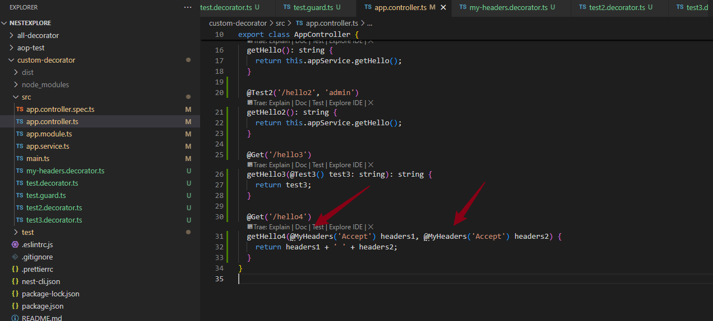

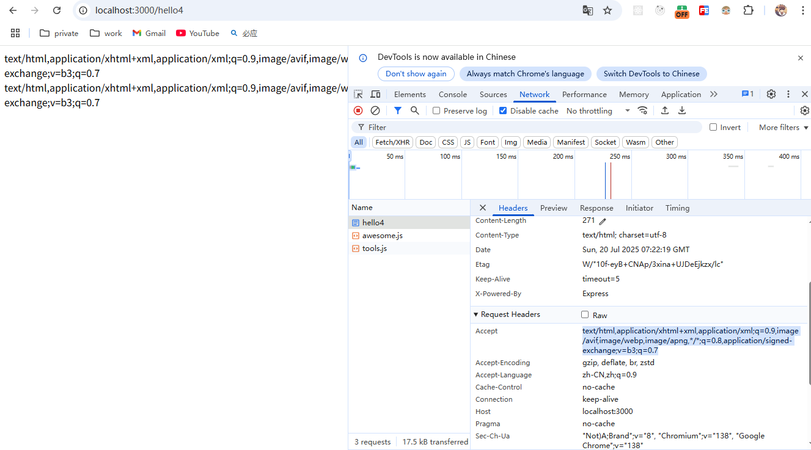

### 实现内置装饰器-@Query

```
nest g decorator MyQuery --flat
```

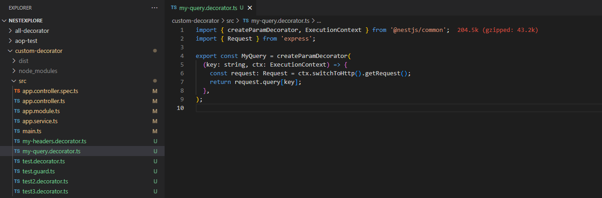

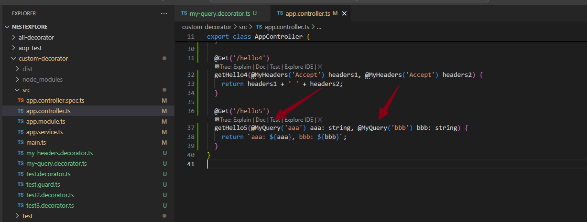

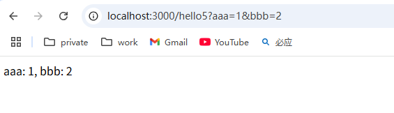

## class 装饰器

### 基础使用

```
nest g decorator test4 --flat
```

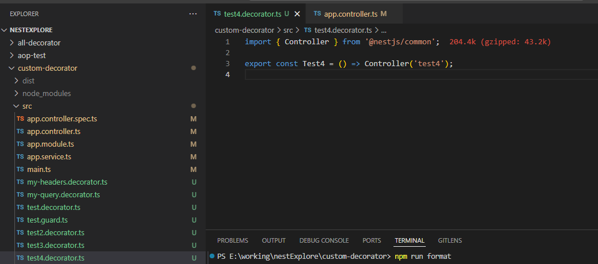

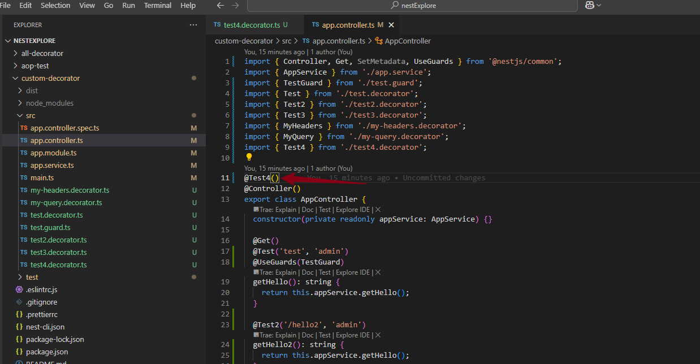


### 组合多个装饰器

```
nest g decorator test5 --flat
```

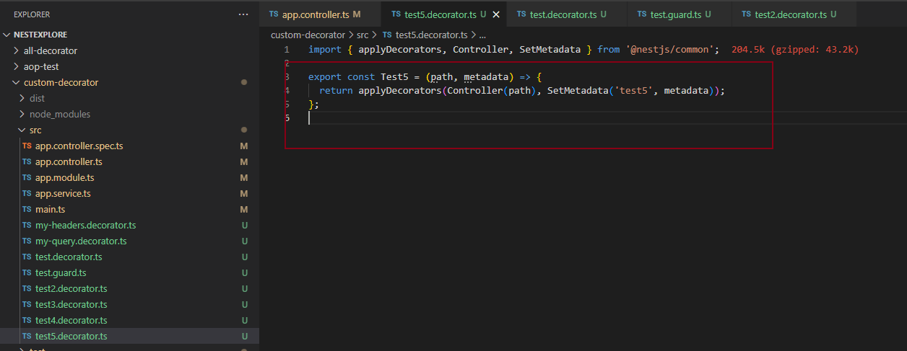

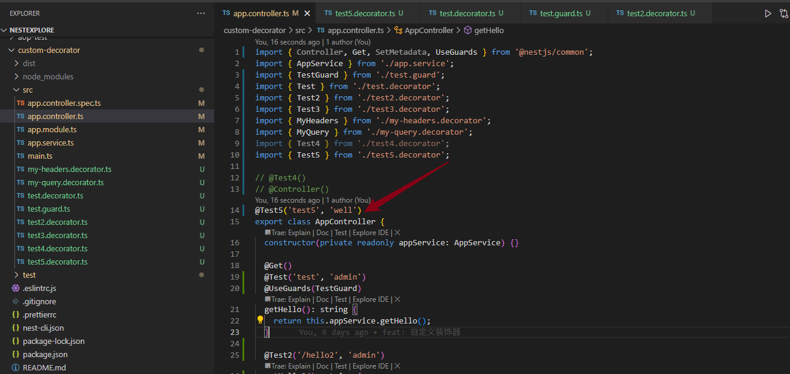

