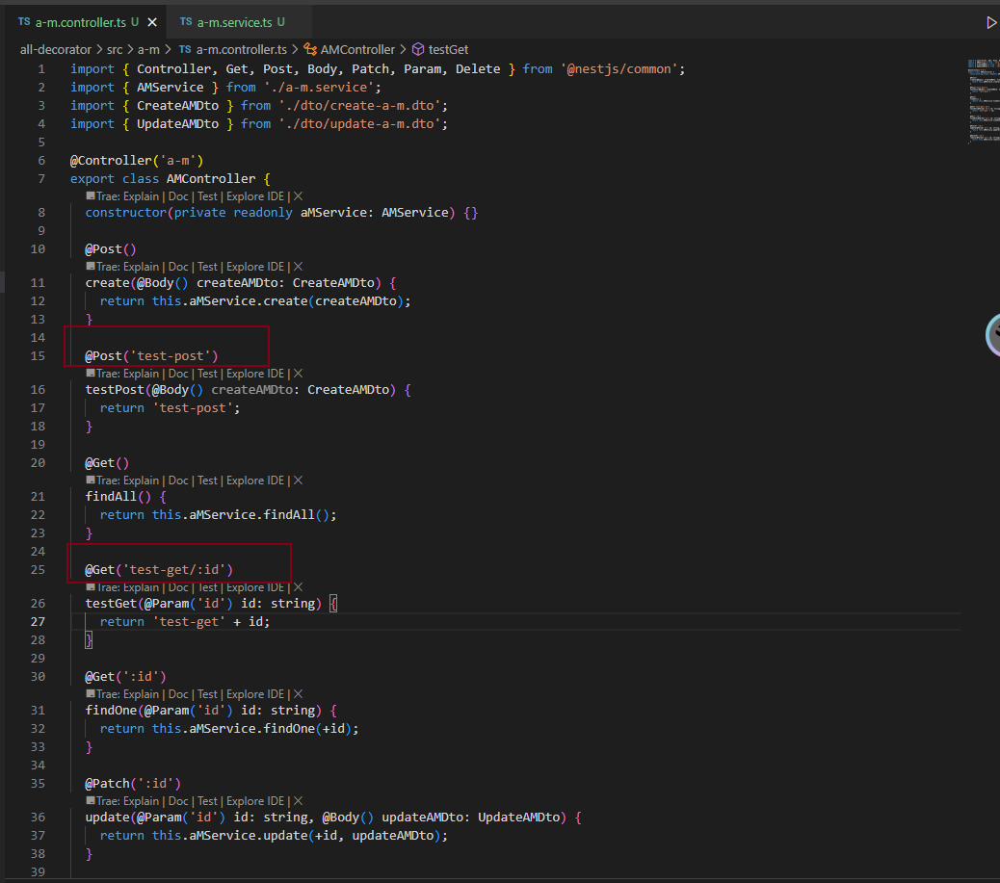
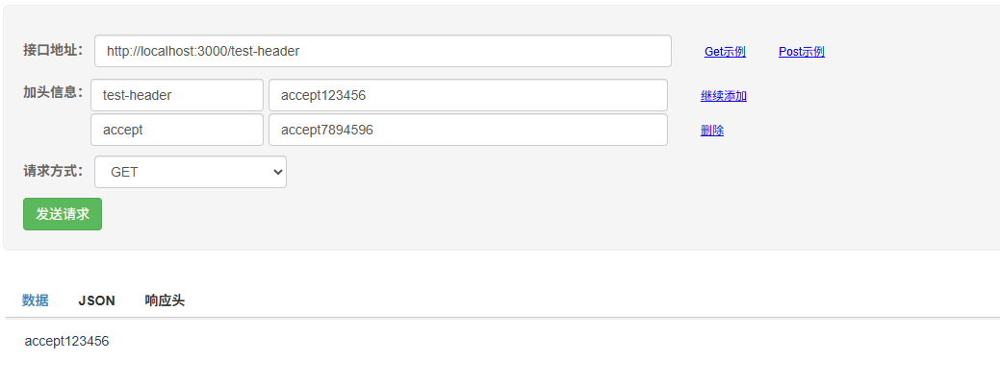
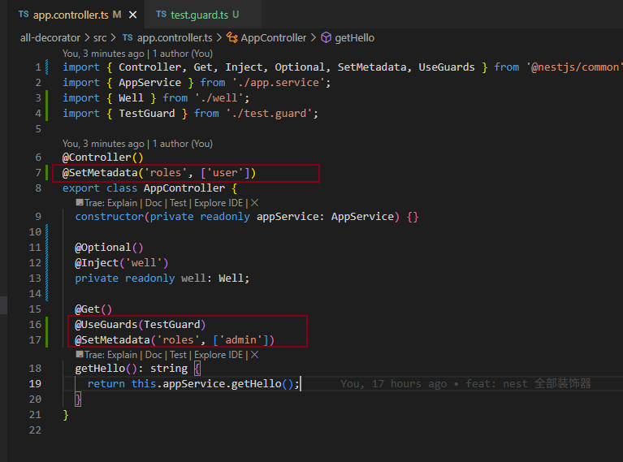
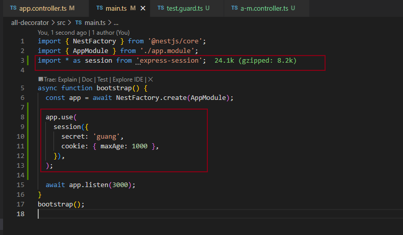
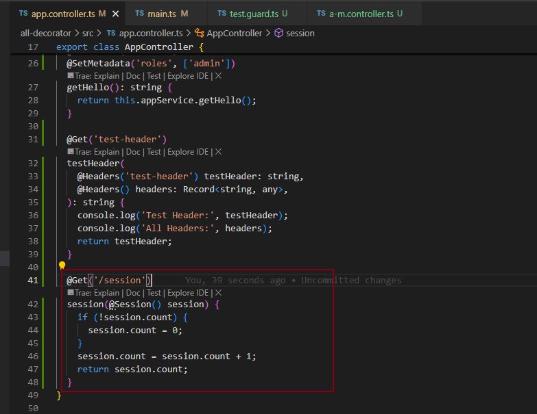

## 装饰器列表

1. @Module： 声明 Nest 模块
2. @Controller：声明模块里的 controller
3. @Injectable：声明模块里可以注入的 provider
4. @Inject：通过 token 手动指定注入的 provider，token 可以是 class 或者 string
5. @Optional：声明注入的 provider 是可选的，可以为空
6. @Global：声明全局模块
7. @Catch：声明 exception filter 处理的 exception 类型
8. @UseFilters：路由级别使用 exception filter
9. @UsePipes：路由级别使用 pipe
10. @UseInterceptors：路由级别使用 interceptor
11. @SetMetadata：在 class 或者 handler 上添加 metadata
12. @Get、@Post、@Put、@Delete、@Patch、@Options、@Head：声明 get、post、put、delete、patch、options、head 的请求方式
13. @Param：取出 url 中的参数，比如 /aaa/:id 中的 id
14. @Query: 取出 query 部分的参数，比如 /aaa?name=xx 中的 name
15. @Body：取出请求 body，通过 dto class 来接收
16. @Headers：取出某个或全部请求头
17. @Session：取出 session 对象，需要启用 express-session 中间件
18. @HostParm： 取出 host 里的参数
19. @Req、@Request：注入 request 对象
20. @Res、@Response：注入 response 对象，一旦注入了这个 Nest 就不会把返回值作为响应了，除非指定 passthrough 为true
21. @Next：注入调用下一个 handler 的 next 方法
22. @HttpCode： 修改响应的状态码
23. @Header：修改响应头
24. @Redirect：指定重定向的 url
25. @Render：指定渲染用的模版引擎


## @Module

通过@Module 声明模块；

- imports：导入其他模块，使当前模块可以使用被导入模块中导出的 providers, 例如使用其它模块的服务（Service）
- controllers：声明当前模块负责处理 HTTP 请求的控制器
- providers：声明当前模块的服务、工厂函数、值对象等可被依赖注入的对象


## @Controller

声明模块里的 controller, 在 module 的 controllers 配合声明


## @Injectable & @Inject

@Injectable：声明模块里可以注入的 provider,在 module 的 provider 配合声明

@Inject：属性注入的方式声明

****

其中，provider 注入的方式，有两种：详情可以看：[多种provider&注入对象](providerAndInject)

1. 构造器注入


2. 属性注入

### 

## @Optional

声明注入的 provider 是可选的，可以为空;如果没有这个装饰器且为空，运行会报错


##  @Global

声明某个模块为全局模块，详细用法：[全局模块](globalAndLifecycle#全局模块)

其他模块可以无需导入，直接注入全局模块并使用


## @Catch

声明 exception filter 处理的 exception 类型, 通过 filter 应用到 handler 上


## @UseGuards|Pipe|Interceptor|Filters

分别为使用路由守卫、管道、拦截器、过滤器，详情查看[aop](aop#aop)

其局部应用，可以声明在

1. handlers
2. controllers

其全局应用，可以声明在

1. main.ts
2. providers


## @Get|Post|Put|Delete|Patch|Options|Head

声明 get、post、put、delete、patch、options、head 的请求方式

可以指定路径及参数：




## @Headers

```
@Get('test-header')
  testHeader(@Headers('test-header') testHeader: string, @Headers() headers: Record<string, any>): string {
    console.log('Test Header:', testHeader);
    console.log('All Headers:', headers);
    return testHeader;
  }
```




## @Param|Query|Body

取出参数

```
@Post('test-post')
testPost(@Body() createAMDto: CreateAMDto) {
	return 'test-post';
}

@Get('test-get/:id')
testGet(@Param('id') id: string, @Query('name') name: string) {
	return 'test-get' + id + name;
}
```


## @SetMetadata

核心作用：

1. **附加自定义数据**：在装饰器中定义键值对，将数据与目标（控制器、路由等）绑定。
2. **运行时反射**：通过 NestJS 的 `Reflector` 类在运行时获取这些元数据，实现动态逻辑。




```
# 访问
http://localhost:3000
```


## @session

取出 session 对象，需要启用 express-session 中间件

```
npm install express-session
```





刷新页面后，会返回 set-cookie 的响应头，设置了cooke，包含 sid 也就是 sessionid


## @HostParam

1. controller 除了可以指定某些 path 生效外，还可以指定 host

```
@Controller({
  host: ':host.0.0.1',
  path: 'b-m',
})
```

2. 通过@HostParam 获取 host 信息

```
@Get()
findAll(@HostParam('host') host: string) {
	console.log('Host:', host);
	return this.bMService.findAll();
}
```


## @Req

前面取的这些都是 request 里的属性，当然也可以直接注入 request 对象：

```
@Get('test-req')
testReq(@Req() req: Request) {
	console.log(req.hostname);
	console.log(req.url);
	return req.hostname + ' ' + req.url;
}
```

```
// 访问
http://127.0.0.1:3000/test-req

// 127.0.0.1 /test-req
```


## @HttpCode

```
@Get('test-httpcode')
@HttpCode(201)
testHttpCode() {
	return 'http code test';
}
```


## @Header

```
@Get('test-setheader')
@Header('aaa', 'bbb')
testSetHeader(): string {
	return 'test-set-header';
}
```


## @Redirect

```
@Get('test-redirect')
@Redirect('https://www.example.com', 302)
testRedirect() {
	return { url: 'https://www.example.com' };
}
```

