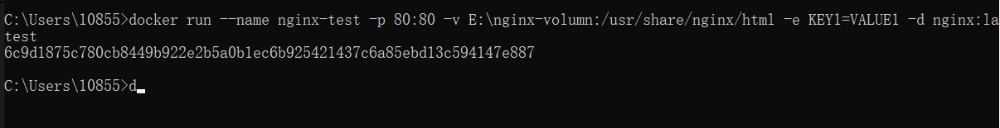

## docker 核心概念


| 概念                 | 说明                                                         | 简单类比                                               |
| -------------------- | ------------------------------------------------------------ | ------------------------------------------------------ |
| **镜像 (Image)**     | 一个**只读的模板**，包含了运行应用所需的代码、运行时、库和配置 。 | 就像是安装操作系统时使用的 `.iso`系统镜像文件。        |
| **容器 (Container)** | 镜像的一个**运行实例**。容器是独立、可执行的轻量级环境 。    | 就像是使用系统镜像安装好之后，正在运行的**操作系统**。 |
| **仓库 (Registry)**  | 一个集中存储和分发 Docker 镜像的地方，最著名的是 Docker Hub 。 | 就像是软件开发领域的 **GitHub** 或手机应用商店。       |

## 必备命令

以下是一些最常用的 Docker 命令，建议你在终端中逐一尝试。

| 类别             | 命令                                     | 说明与示例                                                   |
| ---------------- | ---------------------------------------- | ------------------------------------------------------------ |
| **镜像操作**     | `docker pull <镜像名>`                   | 从仓库下载镜像，如 `docker pull nginx`。                     |
|                  | `docker images`                          | 列出本地已下载的所有镜像 。                                  |
|                  | `docker rmi <镜像名或ID>`                | 删除本地镜像 。                                              |
|                  | `docker search  <镜像名或ID>`            | 查找镜像                                                     |
| **容器生命周期** | `docker run [选项] <镜像名>`             | **创建并启动**一个新容器。常用选项： - `-d`：后台运行（守护式） - `-p 宿主机端口:容器端口`：端口映射，如 `-p 80:80` - `--name`：为容器命名 - `-it`：交互式运行（进入容器） 示例：`docker run -d --name my-nginx -p 80:80 nginx`。 |
|                  | `docker ps`                              | 查看**正在运行**的容器。加 `-a`选项查看所有容器（包括已停止的） 。 |
|                  | `docker stop <容器名或ID>`               | 停止一个运行中的容器 。                                      |
|                  | `docker start <容器名或ID>`              | 启动一个已停止的容器 。                                      |
|                  | `docker rm <容器名或ID>`                 | 删除一个已停止的容器（加 `-f`可强制删除运行中的容器） 。     |
| **容器交互**     | `docker exec -it <容器名或ID> /bin/bash` | 进入一个正在运行的容器的内部命令行环境 。                    |
|                  | `docker logs <容器名或ID>`               | 查看容器的日志输出，常用于故障排查 。                        |
|                  | `docker inspect <容器名或ID>`            | 查看容器的详情                                               |
|                  | `docker volumes`                         | 管理数据卷; create \| inspect \| ls \| prune \| rm           |

## docker run nginx

1. 启动容器

```
docker run --name nginx-test -p 80:80 -v E:\nginx-volumn:/usr/share/nginx/html -e KEY1=VALUE1 -d nginx:latest
```



在本地的`E:\nginx-volumn`	放置一个`html`文件，就可以通过`http://localhost/`访问了

2. 进入容器后常见操作

```
# 查看 Nginx 版本
nginx -v

# 查看容器内的目录结构
ls /usr/share/nginx/html

# 查看 Nginx 配置文件
cat /etc/nginx/conf.d/default.conf

# 重启 Nginx 服务
nginx -s reload

# 退出容器（不影响容器运行）
exit
```


## 目录挂载（Volume/Bind Mount）

### 核心作用

目录挂载（也叫**数据卷挂载**）是 Docker 中实现**主机与容器之间数据共享、持久化**的核心机制，本质是将**主机的文件 / 目录**或**Docker 管理的卷**映射到容器内的指定路径。其核心作用可分为以下 5 类：

#### 1. **数据持久化：避免容器销毁后数据丢失**

Docker 容器的文件系统是**临时的、隔离的**—— 容器被删除时，其内部的所有数据（如 Nginx 的日志、MySQL 的数据文件）都会被清空。通过挂载，数据会被存储在**主机目录**或**Docker 卷**中，即使容器被删除，数据依然保留。**示例**：

- 挂载 MySQL 的数据目录 `-/var/lib/mysql` 到主机，容器删除后，数据库数据不会丢失。
- 挂载 Nginx 的日志目录 `/var/log/nginx` 到主机，方便持久化查看日志。

#### 2. **主机与容器的数据同步：实时修改无需重启容器**

挂载后，**主机的挂载目录**和**容器内的挂载路径**会实时双向同步：

- 开发场景中，将本地代码目录挂载到容器的应用目录（如 Node.js 的 `/app`、Java 的 `/usr/app`），修改本地代码后，容器内的代码会立即生效，无需重新构建镜像或重启容器。
- 运维场景中，修改主机的配置文件（如 Nginx 的 `default.conf`），容器内的配置会实时更新，无需进入容器修改。

**示例**：你之前的 Nginx 命令中，将主机的 `C:/tmp/aaa` 挂载到容器的 `/usr/share/nginx/html`（Nginx 静态文件目录），只需在主机的 `C:/tmp/aaa` 中放入 `index.html`，访问 `localhost` 就能立即看到效果。

#### 3. **容器间数据共享：多个容器共用一份数据**

多个容器可以挂载同一个主机目录或 Docker 卷，实现数据共享。**示例**：

- 一个 Nginx 容器和一个 Node.js 容器都挂载主机的 `C:/static` 目录，Nginx 可直接访问 Node.js 生成的静态文件。
- 多个微服务容器共享同一个配置文件目录，统一管理配置。

#### 4. **简化数据管理：无需进入容器操作数据**

通过挂载，可直接在主机上操作容器内的文件（如修改配置、下载日志、备份数据），无需通过 `docker exec` 进入容器，提升效率。**示例**：要备份容器内的数据库文件，只需复制主机上的挂载目录即可，无需在容器内执行备份命令。

#### 5. **节省容器存储空间：复用主机资源**

容器的文件系统存储在宿主机的 Docker 存储目录中，若大量数据都存在容器内，会占用宿主机存储空间。通过挂载，数据直接存储在主机，无需占用容器的存储资源。

### 每一个容器都需要挂载吗？

####  1. **不需要挂载的场景**

- **无状态容器**：容器本身不产生、不存储数据，仅提供计算 / 服务能力，销毁后重建不影响功能。**示例**：
  - 纯计算的容器（如执行一次 `python test.py` 的容器）；
  - 静态的 Web 服务容器（镜像内已包含所有静态文件，无需动态修改）；
  - 临时测试的容器（如 `docker run hello-world`、`docker run ubuntu bash`）。
- **容器内数据无需持久化**：数据仅在容器运行期间有效，销毁后无需保留。**示例**：
  - 一个临时的日志处理容器，处理完日志后直接退出，数据无需保存。

#### 2. **必须 / 建议挂载的场景**

- **有状态容器**：容器产生或依赖的**核心数据需要持久化**。**示例**：
  - 数据库容器（MySQL、Redis、MongoDB）：必须挂载数据目录，否则容器删除后数据全部丢失；
  - 消息队列容器（RabbitMQ、Kafka）：挂载数据目录保证消息不丢失。
- **需要动态修改配置 / 代码的容器**：**示例**：
  - Web 服务容器（Nginx、Apache）：挂载配置文件或静态文件目录，方便动态修改；
  - 开发环境的应用容器（Node.js、Java、Python）：挂载代码目录，实现热更新。
- **需要收集日志的容器**：**示例**：
  - 所有生产环境的容器：建议将日志目录挂载到主机，方便集中收集和分析（如 ELK 日志系统）。

### Docker 挂载的两种主要类型

| **Bind Mount（绑定挂载）** | 直接挂载主机的任意目录 / 文件到容器（如 `-v C:/tmp/aaa:/usr/share/nginx/html`） | 开发环境、需直接访问主机文件 |
| -------------------------- | ------------------------------------------------------------ | ---------------------------- |
| **Volume（Docker 卷）**    | Docker 统一管理的存储卷（如 `-v nginx-data:/usr/share/nginx/html`） | 生产环境、数据持久化（推荐） |

