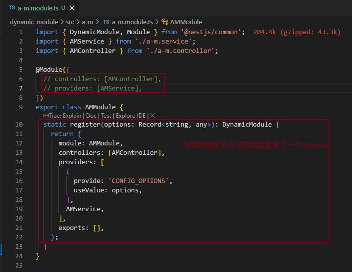
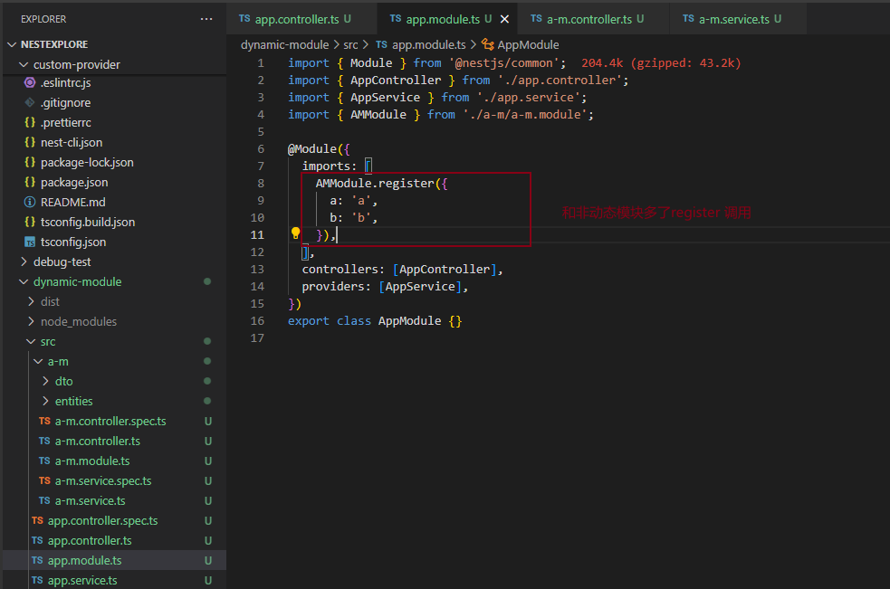
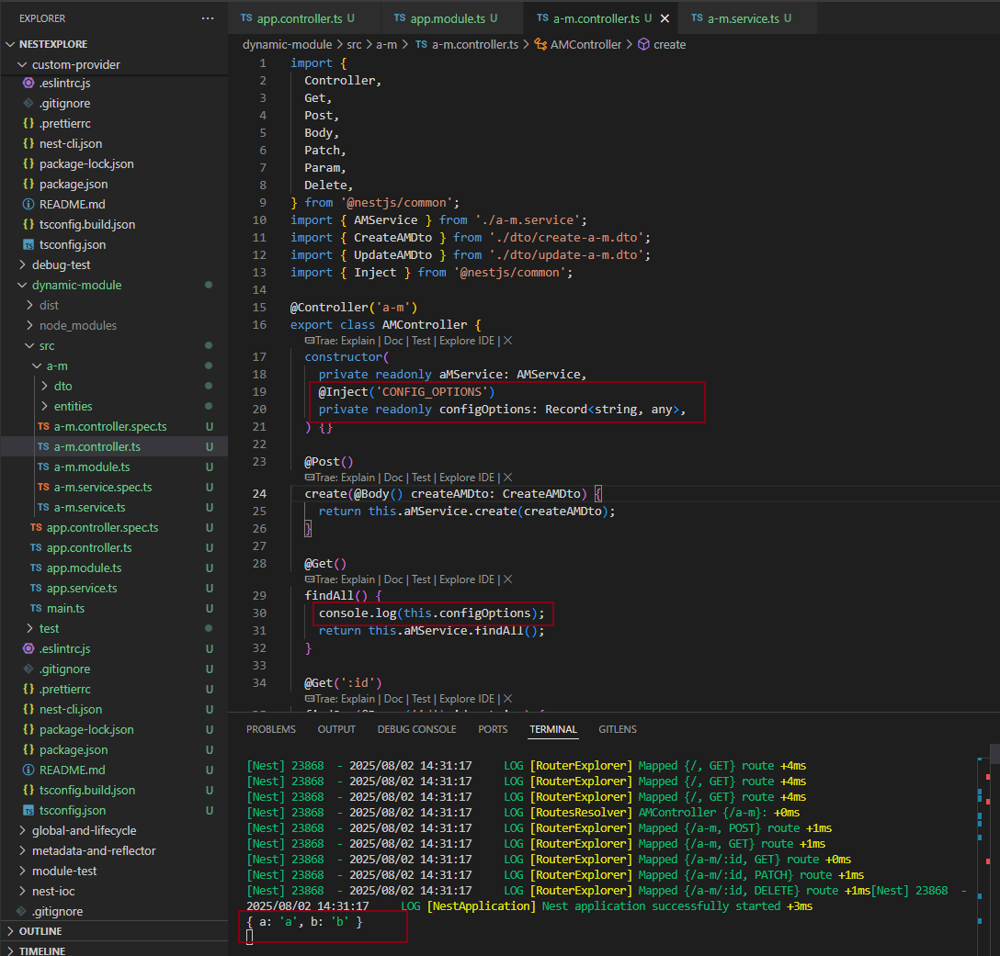
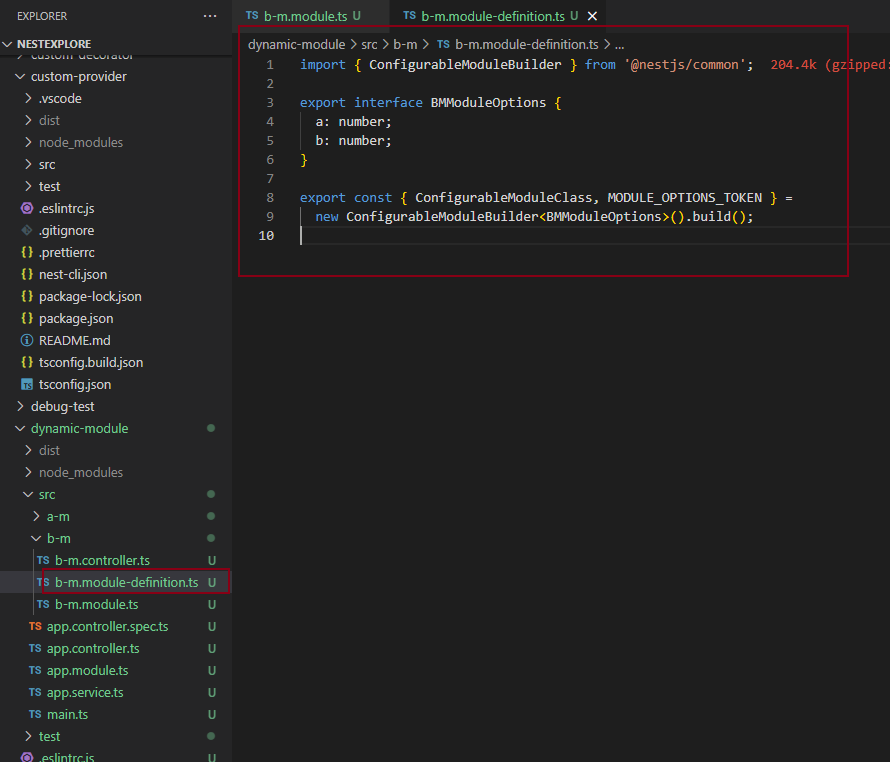
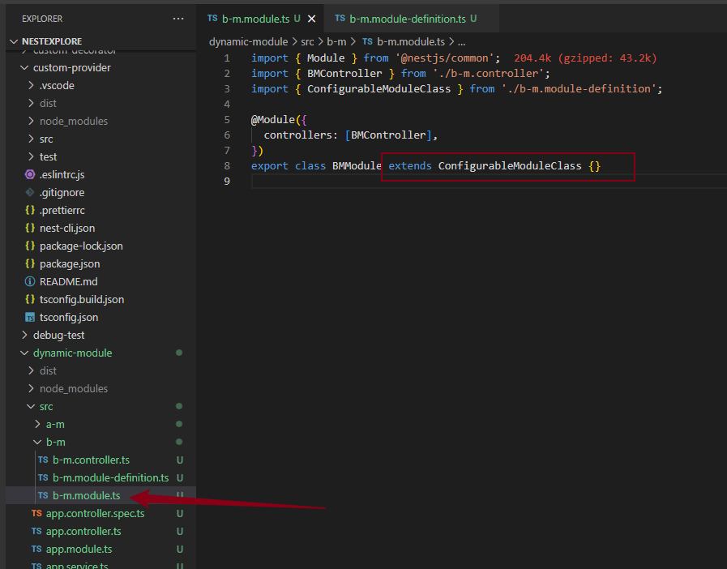
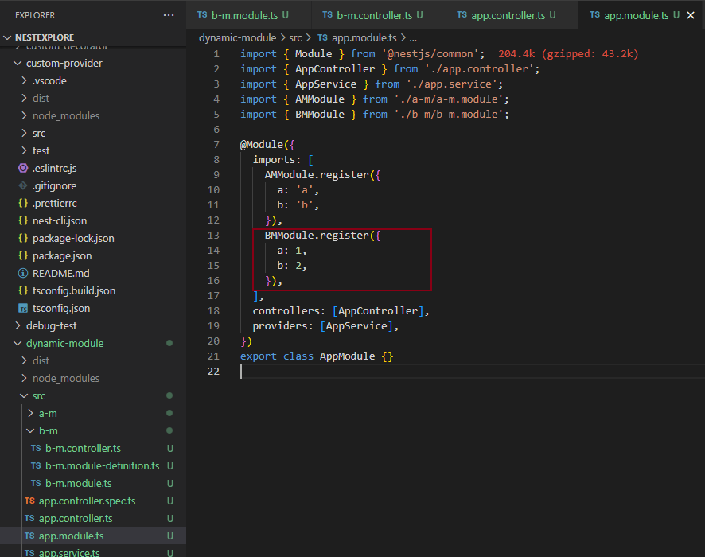
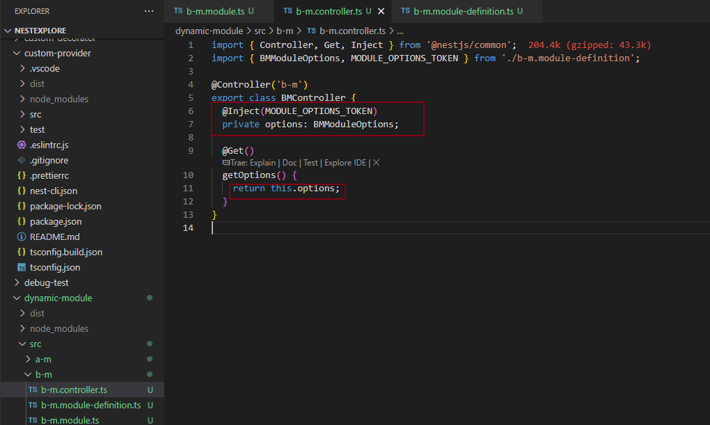
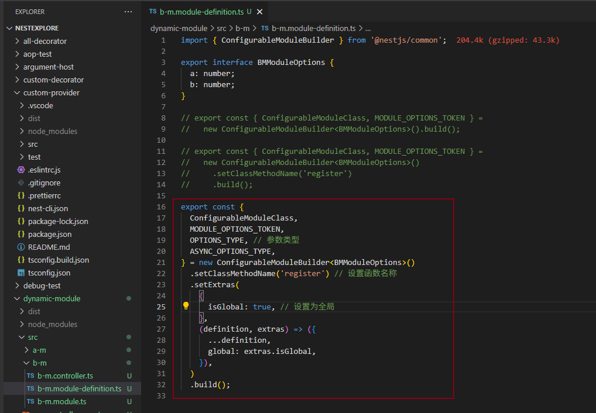
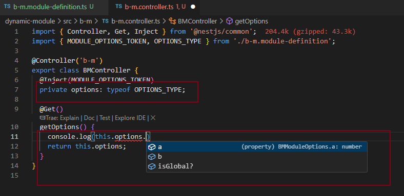
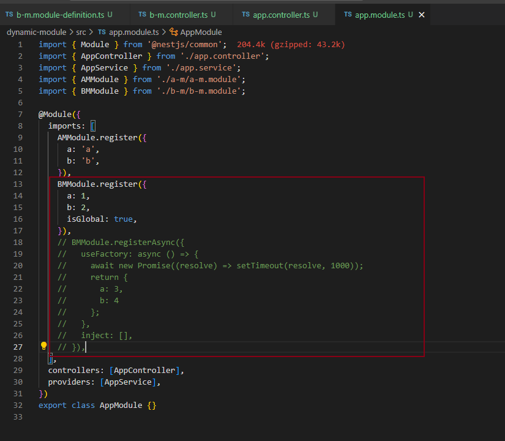

## 创建动态模块方式一

```
nest new dynamic-module -p npm

nest g resource aM 
```

### 实现模块注册函数



### 使用模块





这里的 register 方法其实叫啥都行，但 nest 约定了 3 种方法名：

- register
- forRoot
- forFeature

我们约定它们分别用来做不同的事情：

- register：用一次模块传一次配置，比如这次调用是 BbbModule.register({aaa:1})，下一次就是 BbbModule.register({aaa:2}) 了
- forRoot：配置一次模块用多次，比如 XxxModule.forRoot({}) 一次，之后就一直用这个 Module，一般在 AppModule 里 import
- forFeature：用了 forRoot 固定了整体模块，用于局部的时候，可能需要再传一些配置，比如用 forRoot 指定了数据库链接信息，再用 forFeature 指定某个模块访问哪个数据库和表。

## 创建动态模块方式二

### 实现

```
nest g module bM
nest g controller bM --no-spec
```





### 使用





### 其他使用








## 总结

Module 可以传入 options 动态产生，这叫做动态 Module，你还可以把传入的 options 作为 provider 注入到别的对象里。

建议的动态产生 Module 的方法名有 register、forRoot、forFeature 3种。

- register：用一次注册一次
- forRoot：只注册一次，用多次，一般在 AppModule 引入
- forFeature：用了 forRoot 之后，用 forFeature 传入局部配置，一般在具体模块里 imports

并且这些方法都可以写 xxxAsync 版本，也就是传入 useFactory 等 option，内部注册异步 provider。

这个过程也可以用 ConfigurableModuleBuilder 来生成。通过 setClassMethodName 设置方法名，通过 setExtras 设置额外的 options 处理逻辑。

并且返回的 class 都有 xxxAsync 的版本。

这就是动态模块的定义方式，后面用到 typeorm、mongoose 等模块会大量见到这种模块。