## 异常默认处理

Exception Filter 是在 Nest 应用抛异常的时候，捕获它并返回一个对应的响应。如：

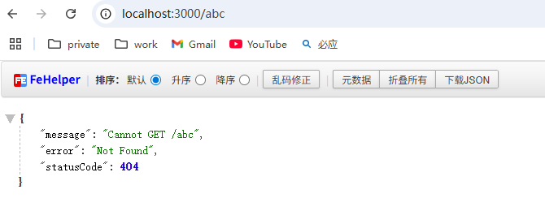

## 自定义异常返回格式

```
nest new exception-filter-test

nest g filter hello --flat --no-spec
```

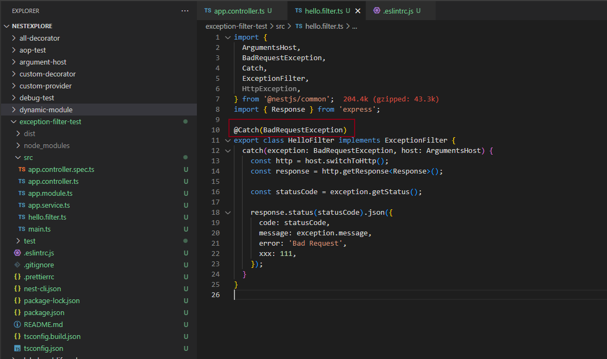

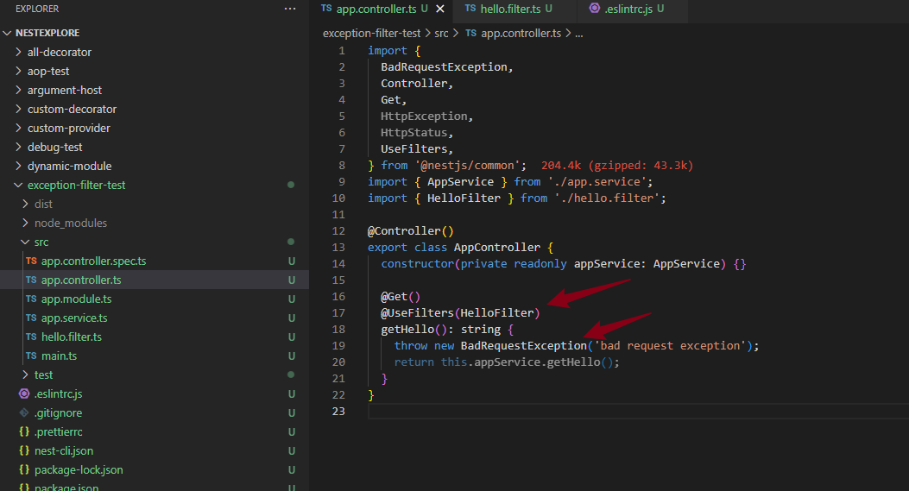

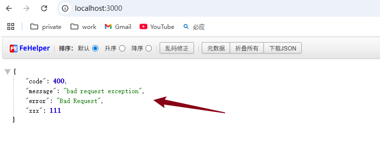

## 异常filter & ValidationPipe 兼容

### 其他异常无法自定义格式

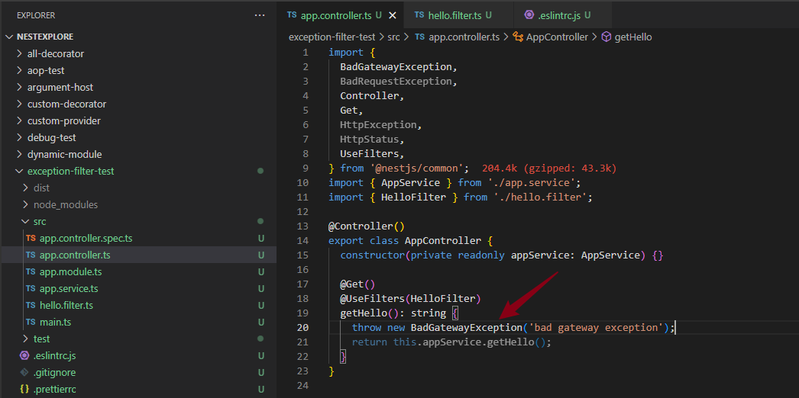

由于filter catch的是BadRequestException，所以这里无法格式化

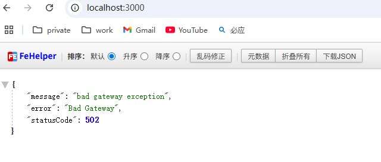

### 使用HttpException 实现

那我们只要 @Catch 指定 HttpException 不就行了？

因为 BadRequestExeption、BadGateWayException 等都是它的子类

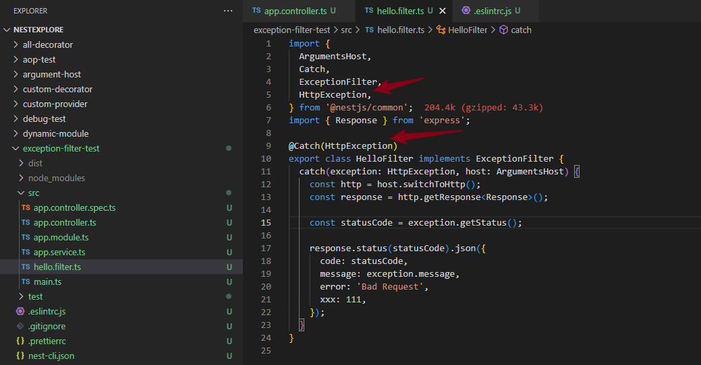

### 兼容 ValidationPipe

```
npm install --save class-validator class-transformer
```

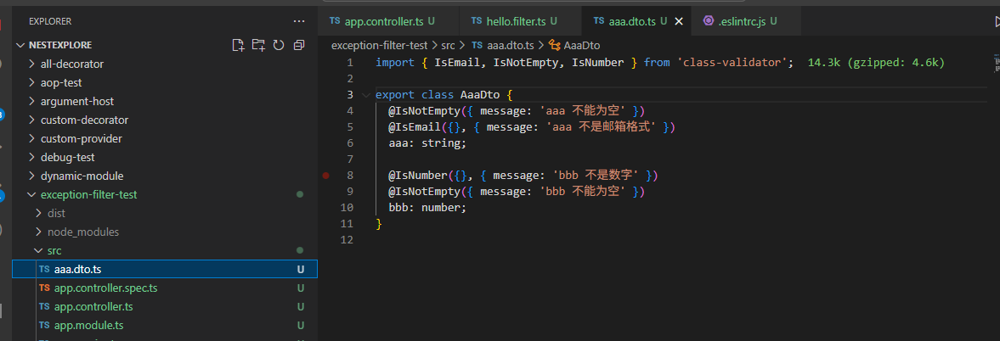

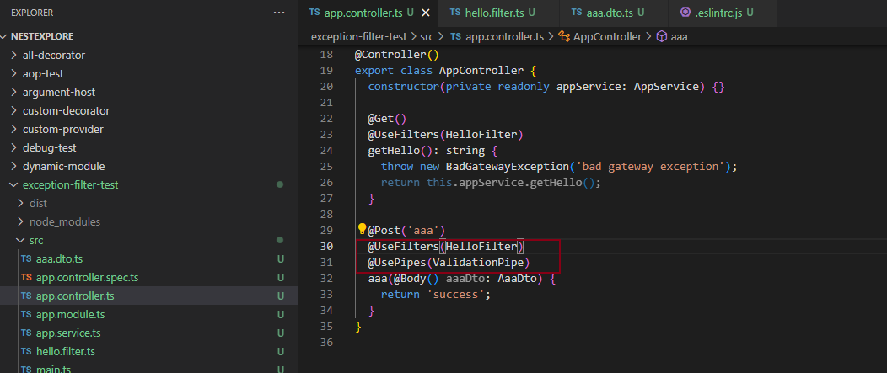

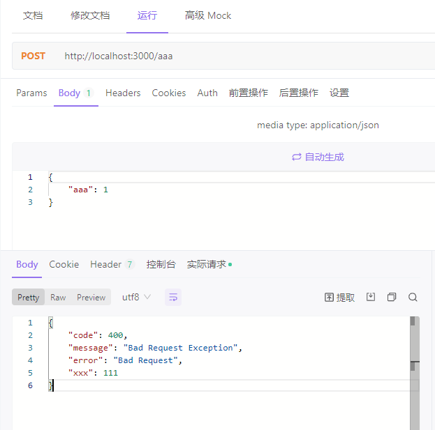

可以看到，提示的错误也不对了。
自定义的 exception filter 会拦截所有 HttpException，但是没有对这种情况做支持。

不加filter 的返回值应该是：

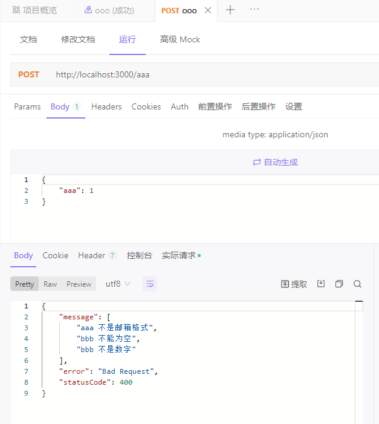

优化 filter：

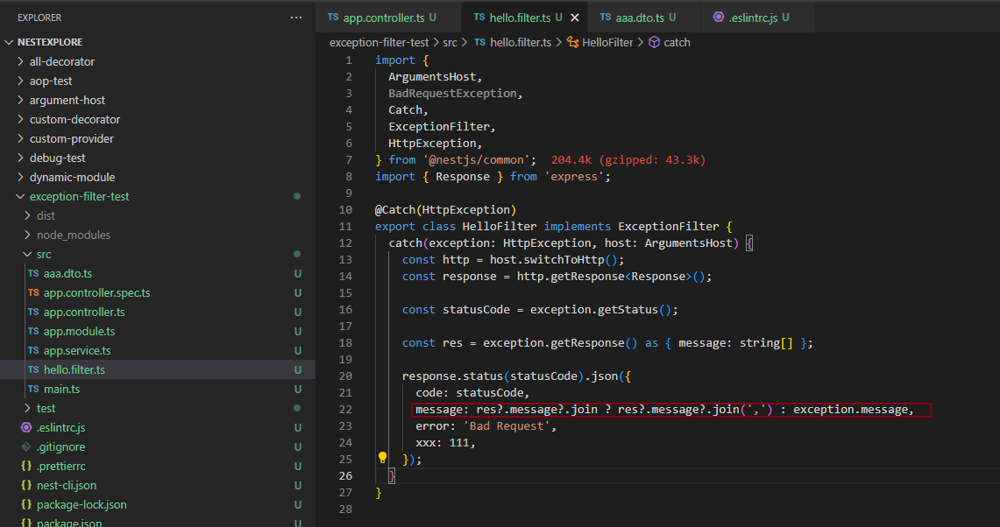

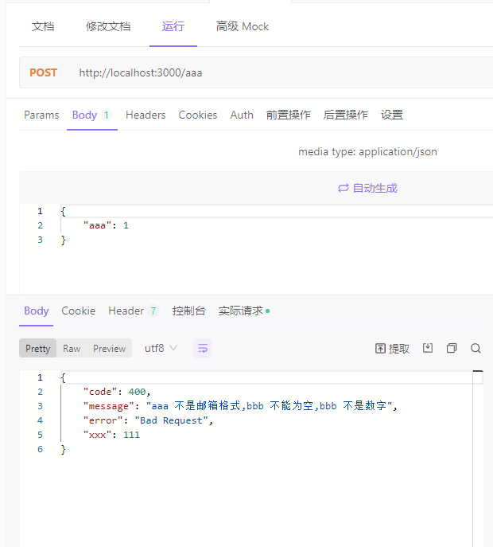
