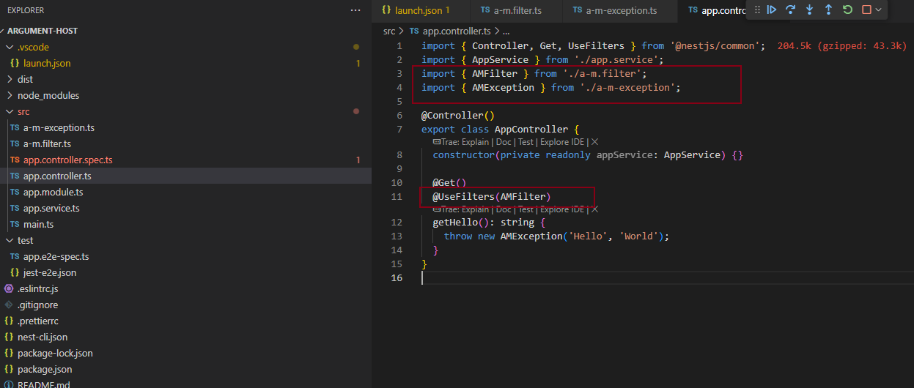

## 原因

Nest 支持创建多种类型的服务：

包括 HTTP 服务、WebSocket 服务，还有基于 TCP 通信的微服务。

这三种服务都会支持 Guard、Interceptor、Exception Filter 功能。

那么问题来了：

不同类型的服务它能拿到的参数是不同的，比如 http 服务可以拿到 request、response 对象，而 websocket 服务就没有。

也就是说你不能在 Guard、Interceptor、Exception Filter 里直接操作 request、response，不然就没法复用了，因为 websocket 没有这些。

那如何让同一个 Guard、Interceptor、Exception Filter 在不同类型的服务里复用呢？

Nest 的解决方法是 ArgumentHost 这个类。

## ArgumentsHost filter 试验

**ArgumentHost 是用于切换 http、websocket、rpc 等上下文类型的，可以根据上下文类型取到对应的 argument，让 Exception Filter 等在不同的上下文中复用**。

```
nest new argument-host
nest g filter a-m --flat --no-spec
```

```
// a-m.filter.ts

import { ArgumentsHost, Catch, ExceptionFilter } from '@nestjs/common';
import { AMException } from './a-m-exception';

@Catch(AMException)
export class AMFilter<T> implements ExceptionFilter {
  catch(exception: T, host: ArgumentsHost) {
    console.log("exception:", exception);
    console.log("host:", host);
  }
}
```

```
// a-m-exception.ts

export class AMException {
    constructor(public message1: string, public message2: string) {}
}
```

### 使用



### 验证

```
// launch.json

{
  // Use IntelliSense to learn about possible attributes.
  // Hover to view descriptions of existing attributes.
  // For more information, visit: https://go.microsoft.com/fwlink/?linkid=830387
  "version": "0.2.0",
  "configurations": [
    {
      "type": "node",
      "request": "launch",
      "name": "debug nest",
      "runtimeExecutable": "npm",
      "args": ["run", "start:dev"],
      "skipFiles": ["<node_internals>/**"],
      "console": "integratedTerminal"
    }
  ]
}
```


### 真实使用


## ExecutionContext Guard 试验

```
nest g guard a-m --no-spec --flat
```


### 使用


### 验证


### 说明

ExecutionContext 是 ArgumentHost 的子类，扩展了 getClass、getHandler 方法。


### 使用demo

```
nest g decorator Roles --flat
```

```
// roles.decorator.ts
import { SetMetadata } from '@nestjs/common';

export const Roles = (...args: string[]) => SetMetadata('roles', args);

// role.ts
export enum Role {
  User = 'user',
  Admin = 'admin',
}
```


## 总结

为了让 Filter、Guard、Exception Filter 支持 http、ws、rpc 等场景下复用，Nest 设计了 ArgumentHost 和 ExecutionContext 类。

ArgumentHost 可以通过 getArgs 或者 getArgByIndex 拿到上下文参数，比如 request、response、next 等。

更推荐的方式是根据 getType 的结果分别 switchToHttp、switchToWs、swtichToRpc，然后再取对应的 argument。

而 ExecutionContext 还提供 getClass、getHandler 方法，可以结合 reflector 来取出其中的 metadata。

在写 Filter、Guard、Exception Filter 的时候，是需要用到这些 api 的。