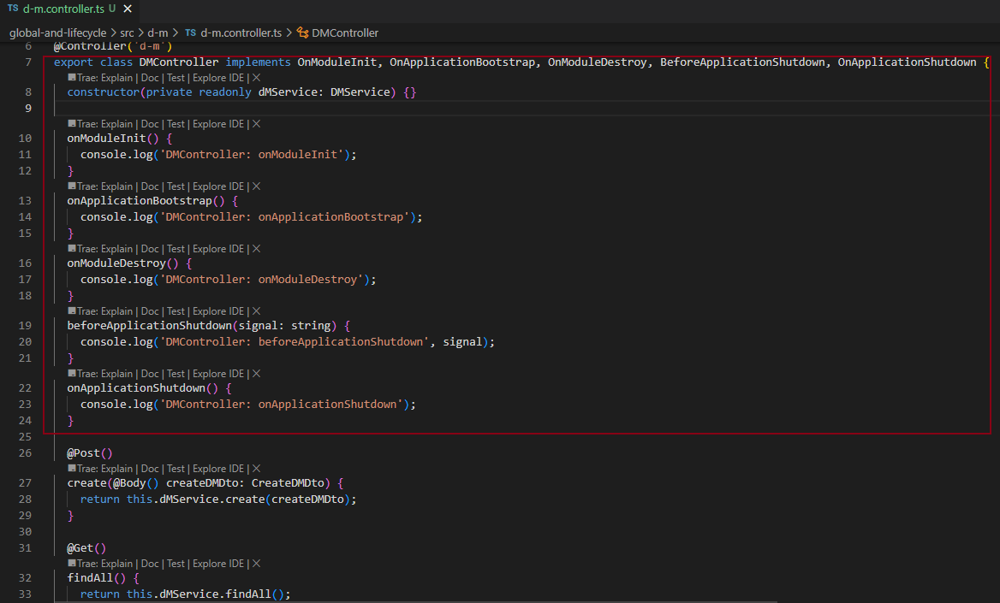
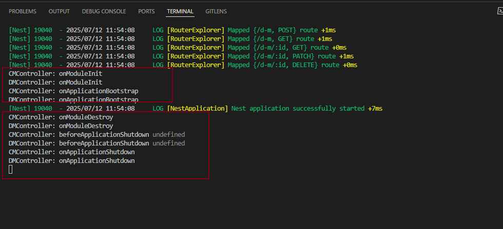

## 普通模块引用

### 创建项目及模块

```
nest new global-and-lifecycle -p npm

nest g resource a-m --no-spec
nest g resource b-m --no-spec
```

### B模块引用A模块

1. A 模块导出 A service


2. B 模块引用 A 模块


3. B service 引用 A service，并生命依赖A service，可使用A service 实例


## 全局模块

全局模块还是尽量少用，不然注入的很多 provider 都不知道来源，会降低代码的可维护性。

1. 声明为全局模块


2. B 模块无需导入 A 模块


3.  依然正常注入 A service


## 生命周期

1. 实现生命周期方法




2. 实验销毁

app.close() 只是触发销毁逻辑，但不会真正退出进程


3. 打印日志


