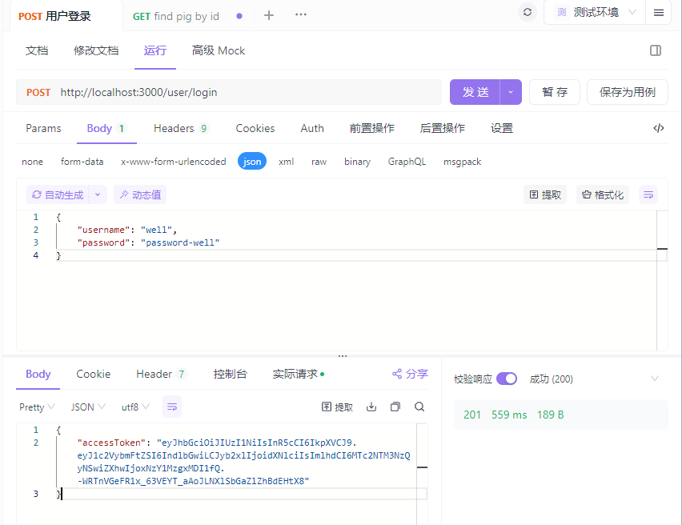
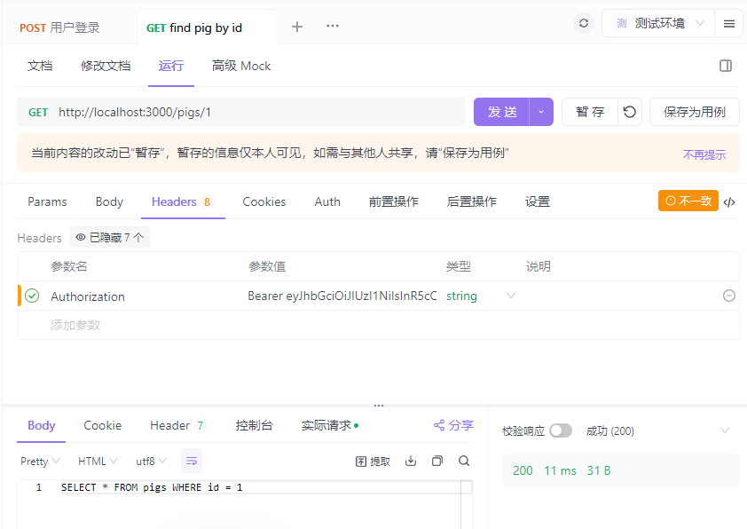

## 核心概念

### 守卫的定位

- **执行时机**：在中间件（Middleware）之后，拦截器（Interceptor）/ 管道（Pipe）之前执行。
- **核心作用**：基于某些条件（如角色、权限、请求参数等）判断请求是否能进入路由处理程序，本质是 “**条件路由拦截**”。
- **核心特性**：可以是控制器级、方法级、全局级；支持依赖注入；能访问完整的执行上下文。

### 执行上下文

执行上下文是守卫的核心入参，它扩展了 `ArgumentsHost`，能让你获取当前请求的**执行环境信息**（HTTP/RPC/WebSocket），核心方法：

- `getType()`：获取当前应用类型（`http`/`rpc`/`ws`）。
- `switchToHttp()`：切换到 HTTP 上下文，获取 `request`/`response`/`next`。
- `getHandler()`：获取当前被调用的路由处理方法（如 `findAll`）。
- `getClass()`：获取当前处理方法所属的控制器类（如 `UserController`）。

示例（HTTP 上下文获取请求）：

```
import { CanActivate, ExecutionContext, Injectable } from '@nestjs/common';

@Injectable()
export class TestGuard implements CanActivate {
  canActivate(context: ExecutionContext): boolean {
    // 切换到HTTP上下文
    const httpContext = context.switchToHttp();
    const request = httpContext.getRequest(); // 获取Express/Fastify请求对象
    const response = httpContext.getResponse();

    // 打印当前路由信息
    console.log('当前控制器:', context.getClass().name);
    console.log('当前方法:', context.getHandler().name);

    return true; // 返回true允许访问，false拒绝
  }
}
```

## 文档资料

### 资料连接

[守卫](https://nest.nodejs.cn/guards)

### 授权守卫

#### JWT 配置

```
// .env
JWT_SECRET=my_dev_secret_key_123456
JWT_EXPIRES_IN=1h
```

#### 引入 JWT

1. 使用`@nestjs/config` 的 `ConfigModule` 和 `ConfigService`，用于获取`.env`文件中的配置
2. 全局注册`JwtModule`，通过工厂函数指定其参数

```
// app.module.ts
import { JwtModule } from '@nestjs/jwt';
import {
  ConfigModule as NestConfigModule,
  ConfigService as NestConfigService,
} from '@nestjs/config';

@Module({
  imports: [
    // 全局注册JwtModule
    JwtModule.registerAsync({
      global: true,
      imports: [NestConfigModule],
      useFactory: (configService: NestConfigService) => ({
        secret: configService.get('JWT_SECRET', 'default_secret_key'),
        signOptions: { 
          expiresIn: configService.get('JWT_EXPIRES_IN', '1h') 
        },
      }),
      inject: [NestConfigService],
    }),
  ],
  controllers: [AppController],
  providers: [AppService],
})
export class AppModule implements NestModule {}
```

#### 登录时下发token

通过`jwtService.sign`下发`Token`，其解析后能解析出第一个参数的内容（`username、role`）

```
// user/user.service.ts
import { BadRequestException, Inject, Injectable } from '@nestjs/common';
import { DbService } from 'src/db/db.service';
import { User } from './entities/user.entity';
import { LoginUserDto } from './dto/login-user.dto';
import { JwtService } from '@nestjs/jwt';

@Injectable()
export class UserService {
  constructor(private dbService: DbService, private jwtService: JwtService) {}

  async login(loginUserDto: LoginUserDto) {
    const users: User[] = await this.dbService.read();

    const foundUser = users.find(
      (item) => item.username === loginUserDto.username,
    );

    if (!foundUser) {
      throw new BadRequestException('用户不存在');
    }

    if (foundUser.password !== loginUserDto.password) {
      throw new BadRequestException('密码不正确');
    }

    const accessToken = this.jwtService.sign(
      {
        username: foundUser.username,
        role: foundUser.role,
      },
      {
        expiresIn: '1h',
      },
    );

    return {
      accessToken,
    };
  }
}
```

#### 实现一个基础的JWT守卫

1. 通过`http`上下文获取请求对象
2. 在请求对象中提取`Token`
3. 通过`jwtService.verify()`验证`Token`
4. 将解析后的用户信息挂载到request上,用于给到下一个授权守卫使用

```
// jwt-auth.guard.ts
import {
  CanActivate,
  ExecutionContext,
  Injectable,
  UnauthorizedException,
} from '@nestjs/common';
import { JwtService } from '@nestjs/jwt';
import { Request } from 'express';

@Injectable()
export class JwtAuthGuard implements CanActivate {
  constructor(private readonly jwtService: JwtService) {}

  async canActivate(context: ExecutionContext): Promise<boolean> {
    // 1. 获取请求对象
    const request = context.switchToHttp().getRequest<Request>();

    // 2. 提取 Token（从 Authorization 头：Bearer <token>）
    const authHeader = request.headers.authorization;
    if (!authHeader || !authHeader.startsWith('Bearer ')) {
      throw new UnauthorizedException(
        'Authorization header missing or invalid',
      );
    }

    const token = authHeader.split(' ')[1];

    // 3. 验证 Token
    try {
      const payload = this.jwtService.verify(token);
      // 将解码后的用户信息挂载到 request 对象，供后续控制器使用
      (request as any).user = payload;

      // 4. 将解析后的用户信息挂载到request上,用于给到下一个授权守卫使用
      (request as any).user = payload;
    } catch (error) {
      throw new UnauthorizedException('Invalid or expired token');
    }
    return true;
  }
}
```

#### 应用

```
import { Controller, Get, Param, UseGuards } from '@nestjs/common';
import { PigsService } from './pigs.service';
import { JwtAuthGuard } from 'src/common/guard/jwt-auth.guard';
import { Roles } from 'src/common/guard/roles.decorator';

@Controller('pigs')
export class PigsController {
  constructor(private readonly pigsService: PigsService) {}

  // 只保留findOne路由
  @UseGuards(JwtAuthGuard)
  @Roles('user')
  @Get(':id')
  findOne(@Param('id') id: string) {
    return this.pigsService.findOne(+id);
  }
}
```





### 角色守卫

#### 创建自定义角色装饰器

1. 其通过`@nestjs/common`的`SetMetadata` 定义一个指定`key`的值
2. 后面可以使用`@nestjs/core`的`Reflector`进行获取

```
// role.decorator.ts
import { SetMetadata } from '@nestjs/common';

// 定义元数据key：'roles'
export const ROLES_KEY = Symbol('roles');
// 装饰器：@Roles('admin', 'user')
export const Roles = (...roles: string[]) => SetMetadata(ROLES_KEY, roles);
```

#### 实现一个角色守卫

```
// src/auth/roles.guard.ts
import {
  CanActivate,
  ExecutionContext,
  Injectable,
  ForbiddenException,
} from '@nestjs/common';
import { Reflector } from '@nestjs/core'; // Reflector用于读取元数据
import { ROLES_KEY } from './roles.decorator';
import { Request } from 'express';

@Injectable()
export class RolesGuard implements CanActivate {
  constructor(
    private reflector: Reflector, // 注入Reflector读取@Roles装饰器的元数据
  ) {}

  async canActivate(context: ExecutionContext): Promise<boolean> {
    // 1. 读取当前路由需要的角色（从@Roles装饰器）
    const requiredRoles = this.reflector.getAllAndOverride<string[]>(
      ROLES_KEY,
      [
        context.getHandler(), // 先读方法级的@Roles
        context.getClass(), // 再读控制器级的@Roles（兜底）
      ],
    );

    // 2. 如果路由没有标记角色，直接允许访问
    if (!requiredRoles) {
      return true;
    }

    // 3. 从request中提取用户角色
    const request = context.switchToHttp().getRequest<Request>();
    const user = (request as any).user as { username: string; role: string };

    // 4. 检查用户角色是否包含在路由需要的角色中
    const hasRole = requiredRoles.includes(user.role);
    if (!hasRole) {
      throw new ForbiddenException('你没有访问该接口的权限');
    }

    return true;
  }
}
```

#### 应用

1. 通过自定义角色装饰器`@Roles`标记此`controller`需要`user`角色
2. `@UseGuards(JwtAuthGuard, RolesGuard)`，可以应用多个守卫

```
import { Controller, Get, Param, UseGuards } from '@nestjs/common';
import { PigsService } from './pigs.service';
import { JwtAuthGuard } from 'src/common/guard/jwt-auth.guard';
import { RolesGuard } from 'src/common/guard/role.guard';
import { Roles } from 'src/common/guard/roles.decorator';

@Controller('pigs')
export class PigsController {
  constructor(private readonly pigsService: PigsService) {}

  // 只保留findOne路由
  @UseGuards(JwtAuthGuard, RolesGuard)
  @Roles('user')
  @Get(':id')
  findOne(@Param('id') id: string) {
    return this.pigsService.findOne(+id);
  }
}
```

