## 后端痛点问题

后端系统中，会有很多对象：

- Controller 对象：接收 http 请求，调用 Service，返回响应（依赖Service）
- Service 对象：实现业务逻辑（依赖Repository 做增删改查）
- Repository 对象：实现对数据库的增删改查（依赖DataSource 建立连接）
- 数据库链接对象 DataSource：建立连接（依赖Config对象拿到用户名密码等）
- 配置对象 Config
- ......

```
const config = new Config({ username: 'xxx', password: 'xxx'});

const dataSource = new DataSource(config);

const repository = new Repository(dataSource);

const service = new Service(repository);

const controller = new Controller(service);
```

要经过一系列的初始化之后才可以使用 Controller 对象。

而且像 config、dataSource、repository、service、controller 等这些对象不需要每次都 new 一个新的，一直用一个就可以，也就是保持单例。

**在应用初始化的时候，需要理清依赖的先后关系，创建一大堆对象组合起来，还要保证不要多次 new，非常麻烦，这是一个后端系统都有的痛点问题**


## IOC

IoC 机制是在 class 上标识哪些是可以被注入的，它的依赖是什么，然后从入口开始扫描这些对象和依赖，自动创建和组装对象。

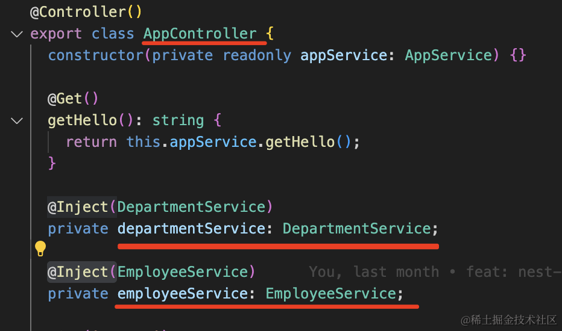

比如这样声明 AppController 依赖了这两个 Service，然后让工具分析依赖自动帮我创建好这三个对象并设置依赖关系。

它有一个放对象的容器，程序初始化的时候会扫描 class 上声明的依赖关系，然后把这些 class 都给 new 一个实例放到容器里。创建对象的时候，还会把它们依赖的对象注入进去，就完成了自动的对象创建和组装。

## 声明依赖

在 class 上声明依赖的方式，大家都选择了装饰器的方式（在 java 里这种语法叫做注解）

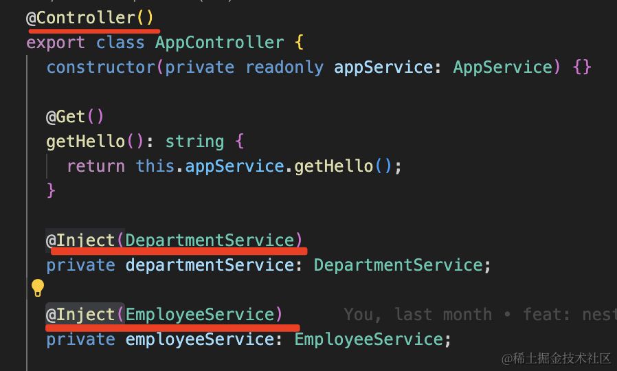

比如上面就是声明这个 class 要放到 IOC 容器里，然后它的依赖是啥。

这样 IOC 容器扫描到它就知道怎么创建它的对象了。

## nest-ioc

### 创建

```
nest new nest-ioc
```

### @Injectable

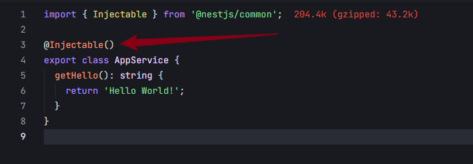

AppService 声明了 @Injectable，代表这个 class 可注入，那么 nest 就会把它的对象放到 IOC 容器里。

###  @Controller

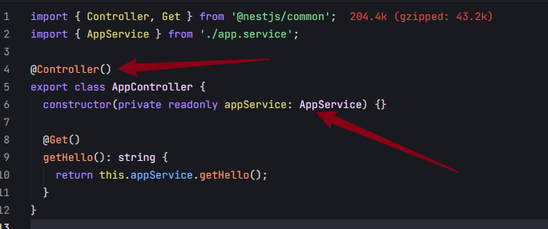

AppController 声明了 @Controller，代表这个 class 可以被注入，nest 也会把它放到 IoC 容器里。

AppController 的构造器参数依赖了 AppService。

或者这样通过属性的方式声明依赖：

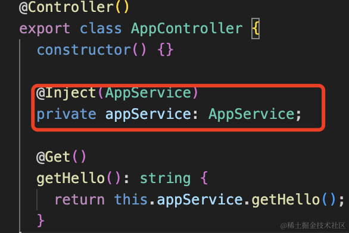

**前者是构造器注入，后者是属性注入**，两种都可以。

### @Module

为什么 Controller 是单独的装饰器呢？

因为 Service 是可以被注入也是可以注入到别的对象的，所以用 @Injectable 声明。

而 Controller 只需要被注入，所以 nest 单独给它加了 @Controller 的装饰器。

然后在 AppModule 里引入：

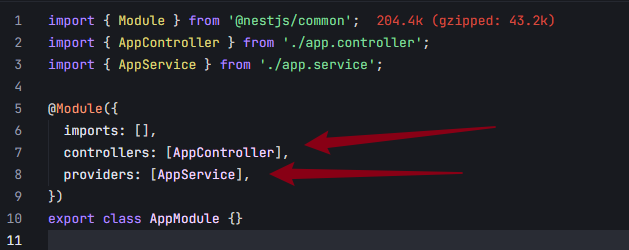

**通过 @Module 声明模块，其中 controllers 是控制器，只能被注入**。

providers 里可以被注入，也可以注入别的对象，比如这里的 AppService。

然后在入口模块里跑起来：

**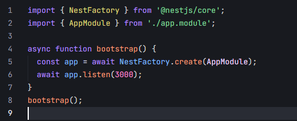**

### 依赖逻辑

那么 nest 就会从 AppModule 开始解析 class 上通过装饰器声明的依赖信息，自动创建和组装对象。

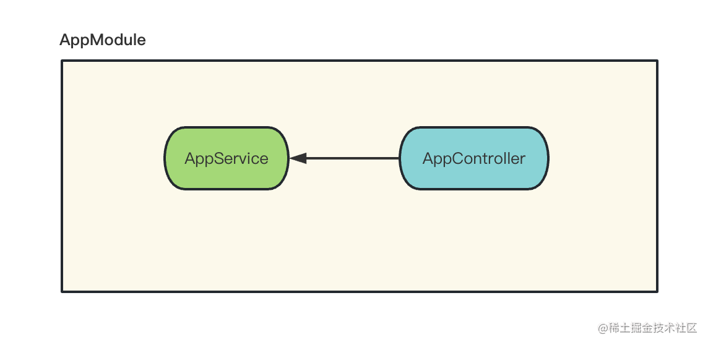

所以 AppController 只是声明了对 AppService 的依赖，就可以调用它的方法了

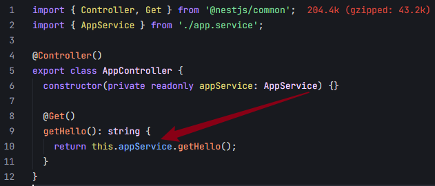

### 模块机制

#### module

nest 还加了模块机制，可以把不同业务的 controller、service 等放到不同模块里。

```
nest g module other
```

会在 AppModule 里自动 imports 这个模块：

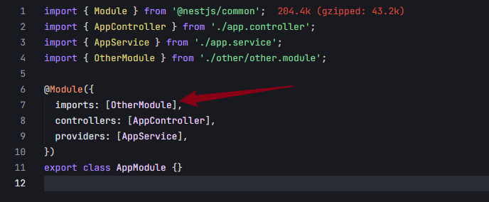

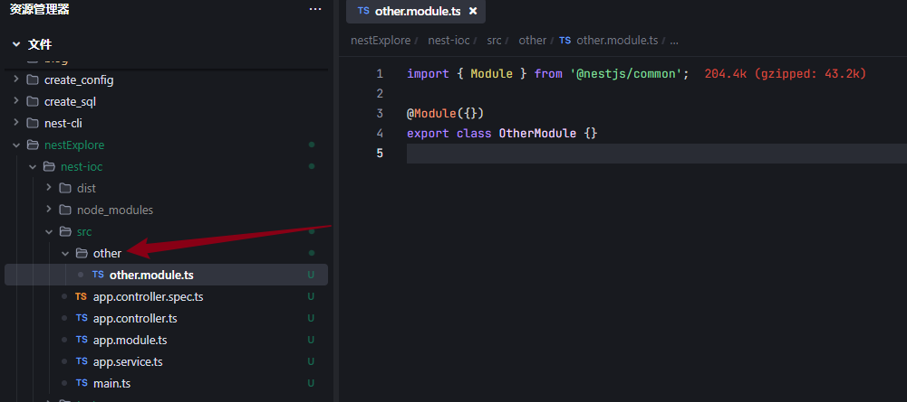

#### service

```
nest g service other
```

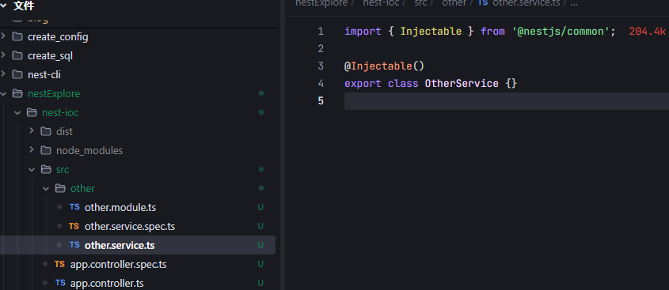

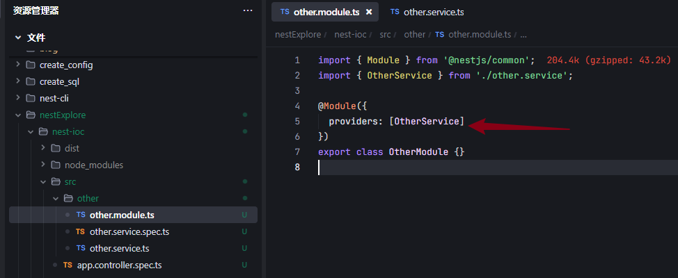

#### 作为模块导出

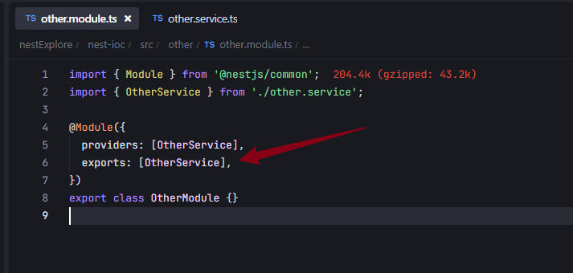

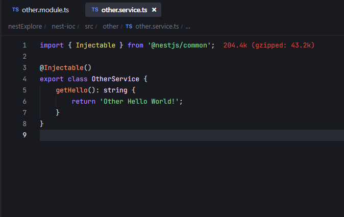

那当 AppModule 引用了 OtherModule 之后，就可以注入它 exports 的 OtherService 了

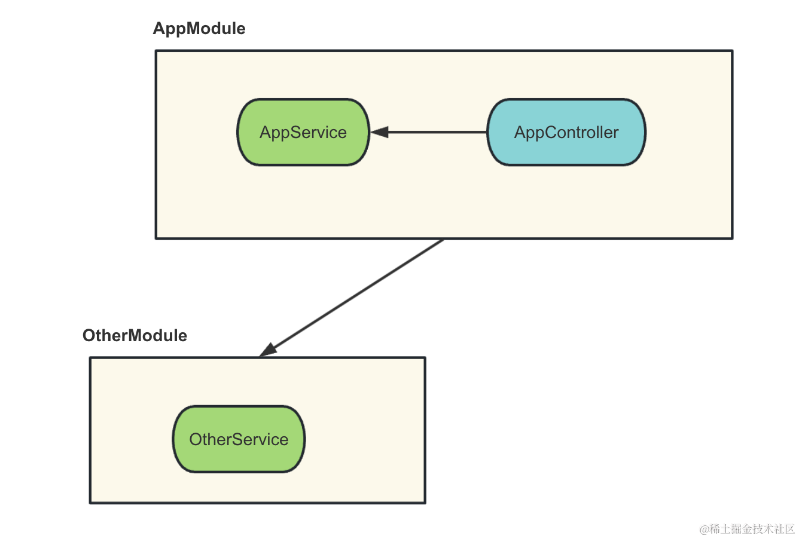

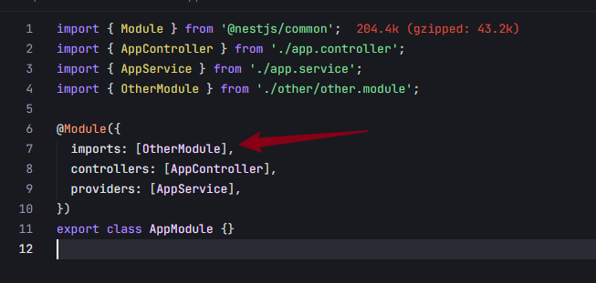

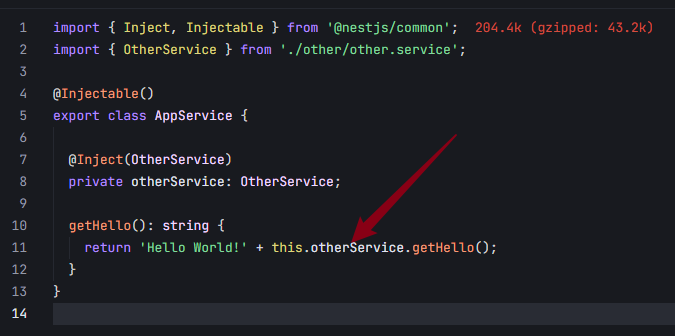

