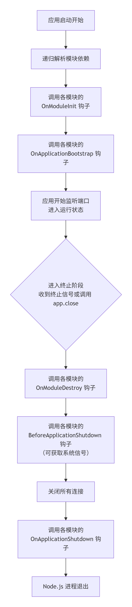

## 核心生命周期钩子详解

### onModuleInit()

- **触发时机**：在宿主模块的依赖项全部解析完成后，**立即调用一次**。这是模块自身进行初始化的最早时机。

- **执行顺序**：在模块依赖图中，**子模块**的 `onModuleInit`会先于**父模块**执行。在一个模块内部，其包含的 Controller 和 Provider 的 `onModuleInit`会先于 Module 类本身的 `onModuleInit`执行。

- **常见用途**：建立数据库连接、初始化第三方服务SDK、加载必要的配置文件等。你应该将需要依赖其他提供者（Provider）的初始化逻辑放在这里，而不是构造函数中。

### onApplicationBootstrap()

- **触发时机**：在**所有模块**的 `onModuleInit`都执行完毕，但**应用开始监听网络端口之前**，调用一次。此时整个应用的所有模块都已准备就绪。
- **常见用途**：执行一些全局的、需要依赖所有模块都已初始化完成的启动任务，例如启动定时任务、注册全局中间件或初始化种子数据等。

### 终止阶段 (Terminating)

终止阶段的钩子需要显式启用后才能生效

```
// main.ts
async function bootstrap() {
  const app = await NestFactory.create(AppModule);
  // 启用关闭钩子
  app.enableShutdownHooks();
  await app.listen(3000);
}
bootstrap();
```

#### onModuleDestroy()

- **触发时机**：当应用收到终止信号（如 `SIGTERM`）或显式调用 `app.close()`时，**最先触发**。这是模块开始清理资源的信号。
- **常见用途**：停止接受新的请求，开始执行模块级别的清理工作。

#### beforeApplicationShutdown(signal?: string)

- **触发时机**：在**所有模块**的 `onModuleDestroy`方法执行完成后触发。此时，应用即将开始关闭现有连接。
- **独特优势**：此钩子的参数 `signal`可以获取到导致应用关闭的**系统信号**（如 `SIGTERM`, `SIGINT`），这对于在 Kubernetes 等容器环境中实现优雅关闭非常重要。
- **常见用途**：记录日志、通知服务注册中心该实例即将下线、终止后台定时任务等。

#### onApplicationShutdown(signal?: string)

- **触发时机**：这是应用关闭前的**最后一个步骤**，在所有连接关闭后触发。
- **常见用途**：执行最终的清理操作，例如关闭数据库连接池、释放核心资源等。

## 如何使用与最佳实践

在任何类（如 Controller、Provider、Module）中，只需实现对应的接口并实现其方法即可。

```
import { Injectable, OnModuleInit, OnApplicationShutdown } from '@nestjs/common';

@Injectable()
export class DatabaseService implements OnModuleInit, OnApplicationShutdown {
  async onModuleInit() {
    // 应用启动时建立连接
    await this.$connect();
  }

  async onApplicationShutdown(signal: string) {
    // 应用关闭时断开连接
    await this.$disconnect();
    console.log(`Disconnected due to signal: ${signal}`);
  }
}
```

## 最佳实践建议

**异步操作**：所有生命周期钩子都支持 `async/await`。Nest 会等待你的异步操作完成后再继续生命周期流程。

**作用域限制**：请注意，生命周期钩子**不适用于请求作用域（Request-scoped）的类**，因为它们的生命周期与单个请求绑定，而非整个应用。

**优雅关闭**：在生产环境中，务必使用 `app.enableShutdownHooks()`并实现关闭钩子，这是确保你的应用在容器管理平台（如 Kubernetes）中能够优雅下线的关键。

## 生命周期图示

