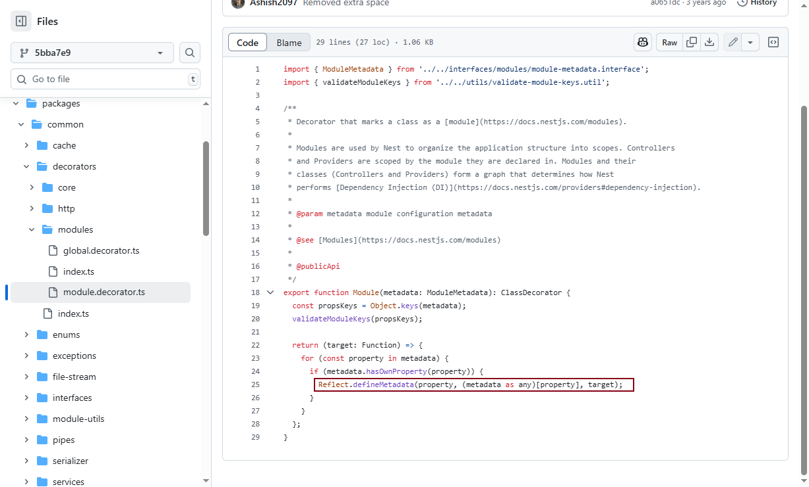

## Reflect API

- Reflect.get()
- Reflect.set()
- Reflect.has()
- Reflect.apply()
- Reflect.construct()
- Reflect.defineMetadata(metadataKey, metadataValue, target) // 设置某个类的元数据，如果传入了属性名，还可以单独为某个属性设置元数据
- Reflect.getMetadata(metadataKey, target) // 获取某个类的元数据

Reflect.defineMetadata、Reflect.getMetadata 未是JavaScript/TypeScript 的原生特性，需要通过 `reflect-metadata` 库提供实现和类型定义

```
npm install reflect-metadata --save
npm install @types/reflect-metadata --save-dev
```

```
// 必须首先导入 reflect-metadata
import 'reflect-metadata';

const obj = {
  a: 1,
  b: 2,
};

function say(prefix) {
  return `${prefix}_${this.name}`;
}

function Person(name, age) {
  this.name = name;
  this.age = age;
}

class MyClass {
  myMethod() {}
}

Reflect.set(obj, 'c', 3);
console.log(Reflect.get(obj, 'c')); // 3
console.log(Reflect.has(obj, 'c')); // true
console.log(Reflect.apply(say, { name: 'world' }, ['hello'])); // hello_world
console.log(Reflect.construct(Person, ['well', 18])); // Person { name: 'well', age: 18 }

// 为类本身定义元数据
Reflect.defineMetadata('class:version', '1.0.0', MyClass);
// 获取类的方法定义元数据
Reflect.defineMetadata('method:description', '这是一个示例方法', MyClass.prototype, 'myMethod');
// 获取类的元数据
const classVersion = Reflect.getMetadata('class:version', MyClass);
console.log(classVersion); // 输出: "1.0.0"
// 获取方法的元数据
const methodDesc = Reflect.getMetadata('method:description', MyClass.prototype, 'myMethod');
console.log(methodDesc); // 输出: "这是一个示例方法"

```

## ts-装饰器

[ts-装饰器](https://wangdoc.com/typescript/decorator)

装饰器（Decorator）是一种语法结构，用来在定义时修改类（class）的行为。

在语法上，装饰器有如下几个特征。

（1）第一个字符（或者说前缀）是`@`，后面是一个表达式。

（2）`@`后面的表达式，必须是一个函数（或者执行后可以得到一个函数）。

（3）这个函数接受所修饰对象的一些相关值作为参数。

（4）这个函数要么不返回值，要么返回一个新对象取代所修饰的目标对象。

```
npm install ts-node --save-dev
npx ts-node .\decorators_demo.ts
```

```
// 添加空导出，将文件转为模块
export {};

// 扩展 Function 接口以包含 version 属性
declare global {
  interface Function {
    version?: string;
  }
}

// 定义类装饰器
function AddMetadata(constructor: Function) {
  // 添加静态属性
  constructor.version = "1.0.0";
  
  // 添加实例方法
  constructor.prototype.log = function() {
    console.log("这是被装饰器添加的方法");
  };
}

// 为 MyClass 定义接口，包含 log 方法
interface MyClass {
  log(): void;
}

// 使用装饰器
@AddMetadata
class MyClass {
  name: string;
  
  constructor(name: string) {
    this.name = name;
  }
}

// 测试
console.log(MyClass.version); // 输出: "1.0.0"
const instance = new MyClass("test");
instance.log(); // 输出: "这是被装饰器添加的方法"
```

### Nest 装饰器原理

[nest-module 装饰器](https://github.com/nestjs/nest/blob/5bba7e9d264319490f142ca5e8099c559fa7e7e3/packages/common/decorators/modules/module.decorator.ts)

