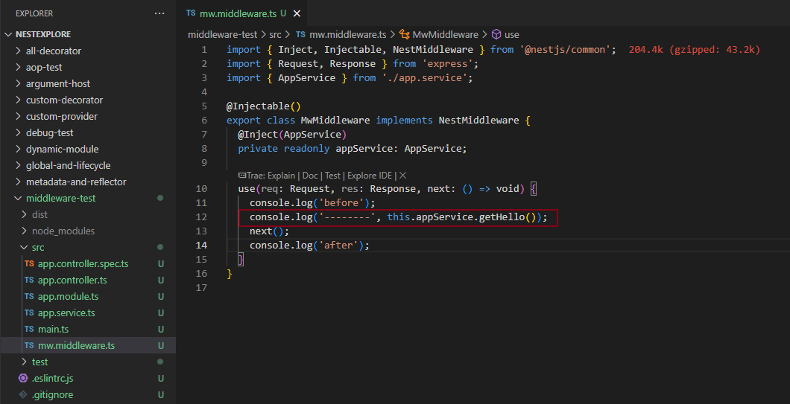
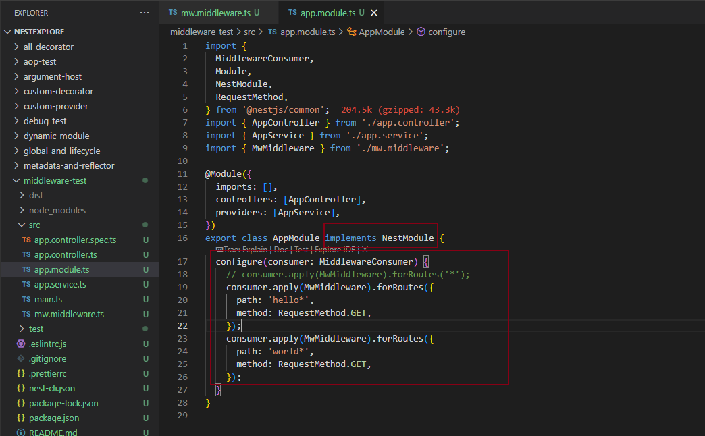
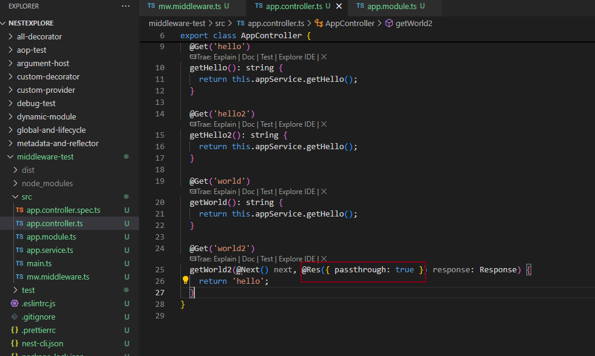

## middleware Demo

### 实现

```
nest new middleware-test

nest g middleware mw --no-spec --flat 
```



### 使用



### 说明

1. module 实现 NestModule接口，可以配置应用中间件
2. nest 的中间件做成类的方式，是为了依赖注入，可以在类中通过@Inject到middleware中

## 配合@Next 装饰器使用



当仅使用@Next 装饰器的时候，你会自己返回响应或者调用下个 handler，就不会处理返回值了，如果依然想让Nest 把函数返回值作为相应，需要加上上图配置。