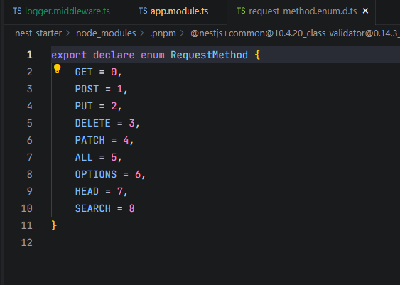

## 基础认知
### 核心定义
Nest 中间件本质是实现 NestMiddleware 接口的类，或简单的函数（功能中间件）。它可以：
- 访问 / 修改 request、response 对象；
- 调用下一个中间件（next()）；
- 终止请求 - 响应周期（如验证失败时直接返回 401）；
- 执行异步操作（支持 async/await）。


### 生命周期位置

```
客户端请求 → 全局中间件 → 模块级中间件 → 路由级中间件 → 守卫（Guards）→ 拦截器（Interceptors）→ 控制器/路由处理器 → 过滤器（Filters）→ 拦截器 → 路由级中间件 → 模块级中间件 → 全局中间件 → 响应返回
```

### 基础用法

```
//src\common\middleware\logger\logger.middleware.ts

import { Injectable, NestMiddleware } from '@nestjs/common';
import { Request, Response, NextFunction } from 'express';

// 类中间件需用 @Injectable() 标记，实现 NestMiddleware 接口
@Injectable()
export class LoggerMiddleware implements NestMiddleware {
  use(req: Request, res: Response, next: NextFunction) {
    console.log(
      `[${new Date().toISOString()}] ${req.method} ${req.originalUrl}`,
    );
    next(); // 调用下一个中间件/路由处理器（必须执行，否则请求会挂起）
  }
}
```

## 文档资料

### 资料连接

[中间件](https://nest.nodejs.cn/middleware)

### 注册中间件

Nest 不支持在 `@Module()` 装饰器中直接注册中间件，需通过**模块的 `configure()` 方法**（实现 `NestModule` 接口）注册，核心是使用 `MiddlewareConsumer`（中间件消费者）。

- `apply()`：传入要注册的中间件（类 / 函数，支持多个）；
- `forRoutes()`：指定中间件作用的路由，支持 3 种形式：
  - 控制器类（如 `CatsController`）：作用于该控制器的所有路由；
  - 路由路径字符串（如 `'cats'`）：作用于指定路径的所有路由；
  - 路由配置对象（如 `{ path: 'cats', method: RequestMethod.GET }`）：精准匹配路径 + 请求方法。

```
// app.module.ts
import { Module, NestModule, MiddlewareConsumer } from '@nestjs/common';
import { LoggerMiddleware } from './logger.middleware';
import { CatsController } from './cats.controller';

@Module({
  controllers: [CatsController],
})
export class AppModule implements NestModule {
  // 配置中间件
  configure(consumer: MiddlewareConsumer) {
    // 为 CatsController 的所有路由应用 LoggerMiddleware
    consumer
      .apply(LoggerMiddleware)
      .forRoutes(CatsController);
  }
}
```

### 路由通配符

`forRoutes()` 支持通配符匹配多个路由，满足「批量匹配非精确路径」的场景，语法兼容 Express 的路径匹配规则。

#### 常用通配符

| 通配符 | 含义                   | 示例               | 匹配场景                                     |
| ------ | ---------------------- | ------------------ | -------------------------------------------- |
| `*`    | 匹配任意字符（不含 /） | `'cats/*'`         | `/cats/1`、`/cats/abc`（不匹配 `/cats/1/2`） |
| `**`   | 匹配任意字符（含 /）   | `'cats/**'`        | `/cats/1`、`/cats/1/2`、`/cats/abc/x`        |
| `?`    | 匹配单个字符           | `'cats/?'`         | `/cats/1`、`/cats/a`（不匹配 `/cats/12`）    |
| `+`    | 匹配一个或多个字符     | `'cats/+'`         | `/cats/1`、`/cats/12`（不匹配 `/cats/`）     |
| `()`   | 分组匹配               | `'cats/(abc|def)'` | `/cats/abc`、`/cats/def`                     |

#### 示例

```
export class AppModule implements NestModule {
  configure(consumer: MiddlewareConsumer) {
    consumer.apply(LoggerMiddleware).forRoutes({
      path: 'cats/**',
      method: RequestMethod.GET,
    });
  }
}
```

RequestMethod：



### 中间件消费者

`MiddlewareConsumer` 是 Nest 提供的核心工具，用于精细控制中间件的应用范围，核心方法如下：

| 方法          | 作用                   | 示例                                                         |
| ------------- | ---------------------- | ------------------------------------------------------------ |
| `apply()`     | 指定要应用的中间件     | `apply(LoggerMiddleware, AuthMiddleware)`                    |
| `forRoutes()` | 指定作用的路由（必填） | `forRoutes(CatsController, 'dogs')`                          |
| `exclude()`   | 排除特定路由（可选）   | `exclude({ path: 'cats/ignore', method: RequestMethod.GET })` |

### 排除路由

`exclude()` 方法用于「排除不需要应用中间件的路由」，解决「全局 / 批量应用中间件时，部分路由需豁免」的场景，支持两种参数形式：

1. **路由配置对象**：`{ path: string, method: RequestMethod }`（精准匹配路径 + 方法）；
2. **路径字符串**：支持通配符（批量排除）

#### 注意事项

- 新版本的`exclude()` 用法不一致了；
- 排除的路由路径需与控制器的 `@Controller()`/`@Get()` 装饰器路径完全匹配（含前缀）；
- 不支持跨控制器排除（如为 `CatsController` 应用中间件，无法排除 `DogsController` 的路由）。

#### 示例

```
export class AppModule implements NestModule {
  configure(consumer: MiddlewareConsumer) {
    // consumer.apply(LoggerMiddleware).forRoutes(CatsController, DogsController); // 为 CatsController、DogsController 应用 LoggerMiddleware
    consumer
      .apply(LoggerMiddleware)
      // 为所有路由应用中间件，除了GET /cats/*
      .forRoutes(
        // 为所有非GET /cats/*的路由应用中间件
        { path: '*', method: RequestMethod.ALL },
        // 排除GET /cats/*路由
        { path: '!cats/*', method: RequestMethod.GET },
      );
  }
}
```

### 功能中间件（函数中间件）

#### 作用

类中间件需实现接口 + 依赖注入，适合复杂逻辑；而**功能中间件**是简单的函数，无需 `@Injectable()` 和接口，适合轻量逻辑（如简单日志、跨域）。

#### 示例

```
import { Request, Response, NextFunction } from 'express';

// 纯函数中间件
export function SimpleLoggerMiddleware(req: Request, res: Response, next: NextFunction) {
  console.log(`Simple Logger: ${req.method} ${req.url}`);
  next();
}
```

```
export class AppModule implements NestModule {
  configure(consumer: MiddlewareConsumer) {
    // consumer.apply(LoggerMiddleware).forRoutes(CatsController, DogsController); // 为 CatsController、DogsController 应用 LoggerMiddleware
    consumer
      .apply(LoggerMiddleware)
      // 为所有路由应用中间件，除了GET /cats/*
      .forRoutes(
        // 为所有非GET /cats/*的路由应用中间件
        { path: '*', method: RequestMethod.ALL },
        // 排除GET /cats/*路由
        { path: '!cats/*', method: RequestMethod.GET },
      );

    consumer
      .apply(SimpleLoggerMiddleware)
      // 为所有路由应用中间件
      .forRoutes('*');
  }
}
```

### 多个中间件（顺序执行）

#### 关键说明

`apply()` 方法可传入多个中间件（类 / 函数混合），Nest 会**按传入顺序依次执行**（先执行的中间件先处理请求，后执行的后处理）。

#### 示例

- 中间件执行遵循「先进先出」：请求阶段先执行 `LoggerMiddleware`，再执行 `AuthMiddleware`；响应阶段则反向（先执行 `SimpleLoggerMiddleware`，再执行 `AuthMiddleware`）；
- 若某个中间件未调用 `next()`（如 Auth 验证失败返回 401），后续中间件 / 路由处理器不会执行。

```
// app.module.ts
import { LoggerMiddleware } from './logger.middleware';
import { AuthMiddleware } from './auth.middleware';
import { SimpleLoggerMiddleware } from './simple-logger.middleware';

export class AppModule implements NestModule {
  configure(consumer: MiddlewareConsumer) {
    consumer
      // 执行顺序：LoggerMiddleware → AuthMiddleware → SimpleLoggerMiddleware
      .apply(LoggerMiddleware, AuthMiddleware, SimpleLoggerMiddleware)
      .forRoutes('cats');
  }
}
```

### 全局中间件（作用于所有路由）

#### 关键说明

全局中间件会应用于应用的**所有路由**，无需逐个模块注册，适合「全应用通用逻辑」（如全局日志、跨域、请求解析）。

#### 通过`use()`方法注册

```
async function bootstrap() {
  const app = await NestFactory.create(AppModule);
  app.use(SimpleLoggerMiddleware); // 全局应用中间件
  await app.listen(3000);
}
bootstrap();
```

#### 通过全局模块注册（支持类中间件+依赖注入）

```
// logger.middleware.ts

@Injectable()
export class LoggerMiddleware implements NestMiddleware {
  @Inject(ConfigService)
  private readonly configService: ConfigService;

  use(req: Request, res: Response, next: NextFunction) {
    console.log(
      `[${new Date().toISOString()}] ${this.configService.getDatabaseType()} ${req.method} ${req.originalUrl}`,
    );
    next(); // 调用下一个中间件/路由处理器（必须执行，否则请求会挂起）
  }
}
```

- 依赖的ConfigService 需要注入，注入器模块即可
- 需要直接注入 LoggerMiddleware

```
// config.module.ts
@Module({
  providers: [ConfigService],
  exports: [ConfigService],
})
export class ConfigModule {}


// app.module.ts
@Module({
  imports: [
    ConfigModule
  ],
  controllers: [AppController],
  providers: [AppService, LoggerMiddleware],
})
export class AppModule {}

```

```
// main.ts
async function bootstrap() {
  const app = await NestFactory.create(AppModule);

  // 全局应用类中间件（有依赖注入的情况）
  const loggerMiddleware = app.get(LoggerMiddleware);
  // app.use(loggerMiddleware.use.bind(loggerMiddleware));
  app.use((req, res, next) => loggerMiddleware.use(req, res, next));

  await app.listen(3000);
}
bootstrap();
```

