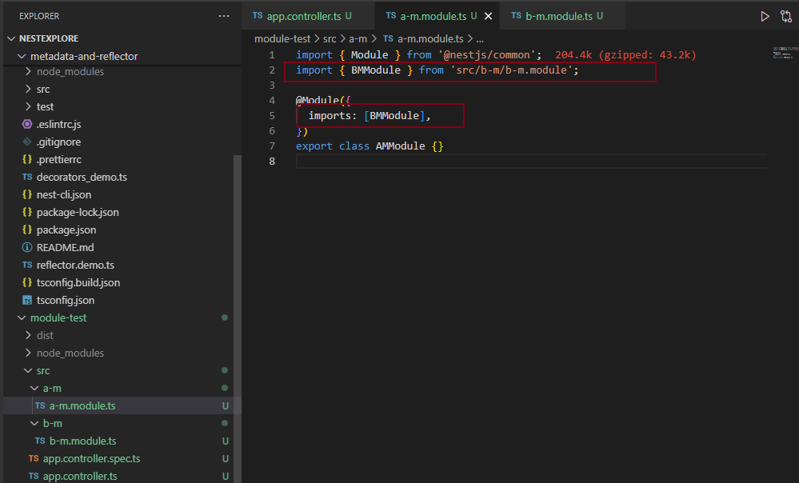
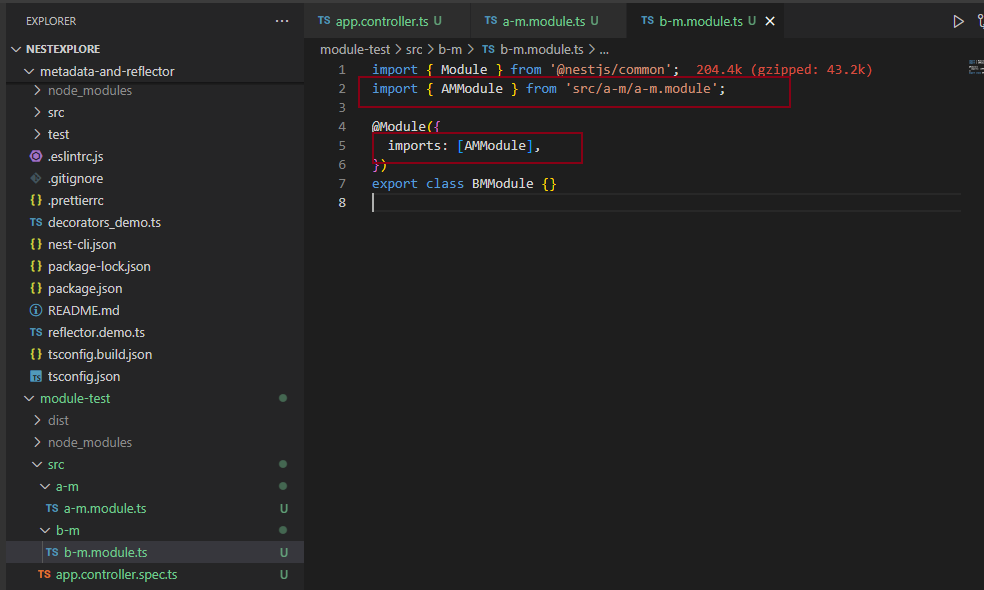
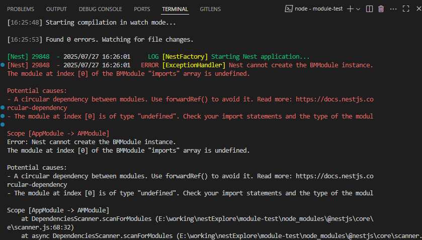
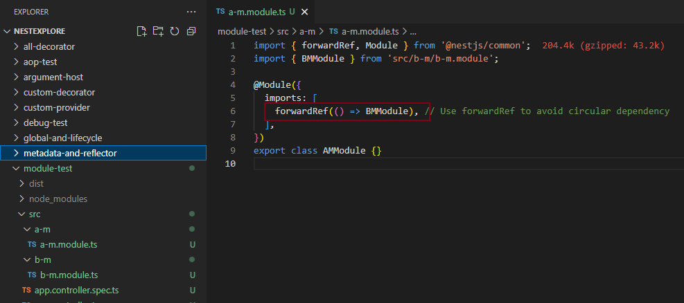
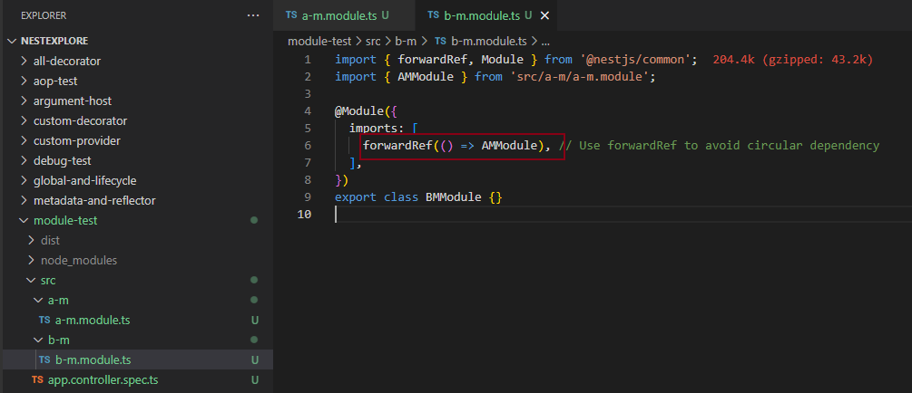
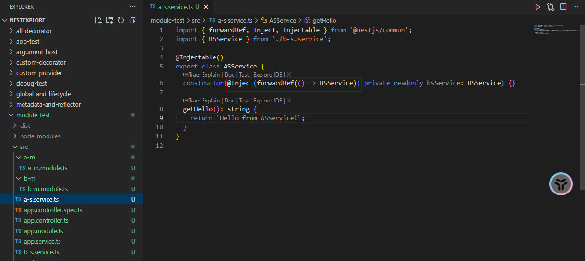
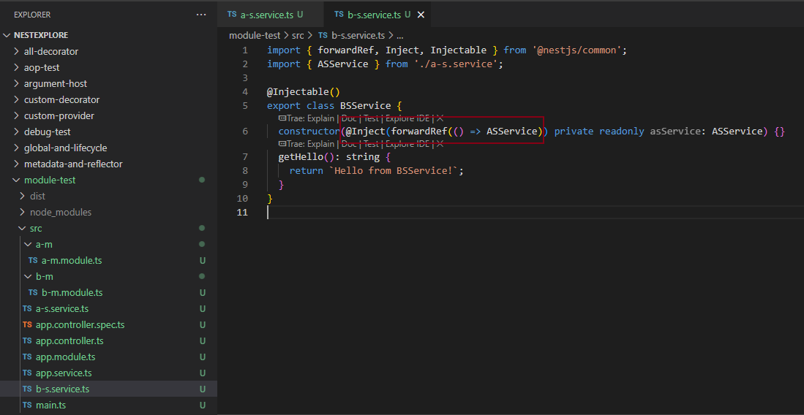
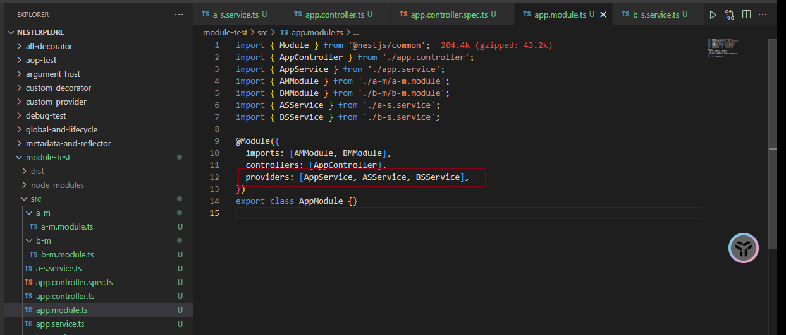
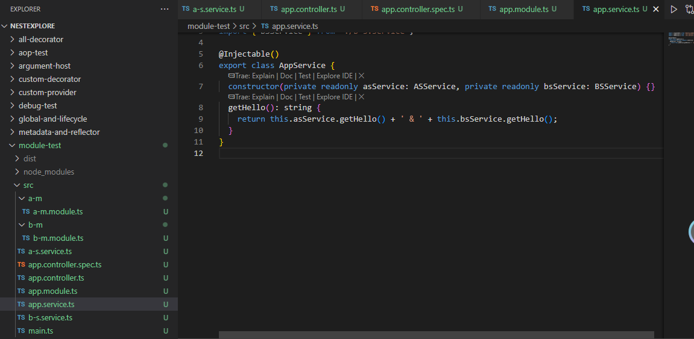

## Module 循环依赖demo

```
nest new module-test -p npm

nest g module aM
nest g module bM
```







## 解决Module循环依赖






## Provider 循环依赖demo

```
nest g service aS --no-spec --flat
nest g service bS --no-spec --flat
```







