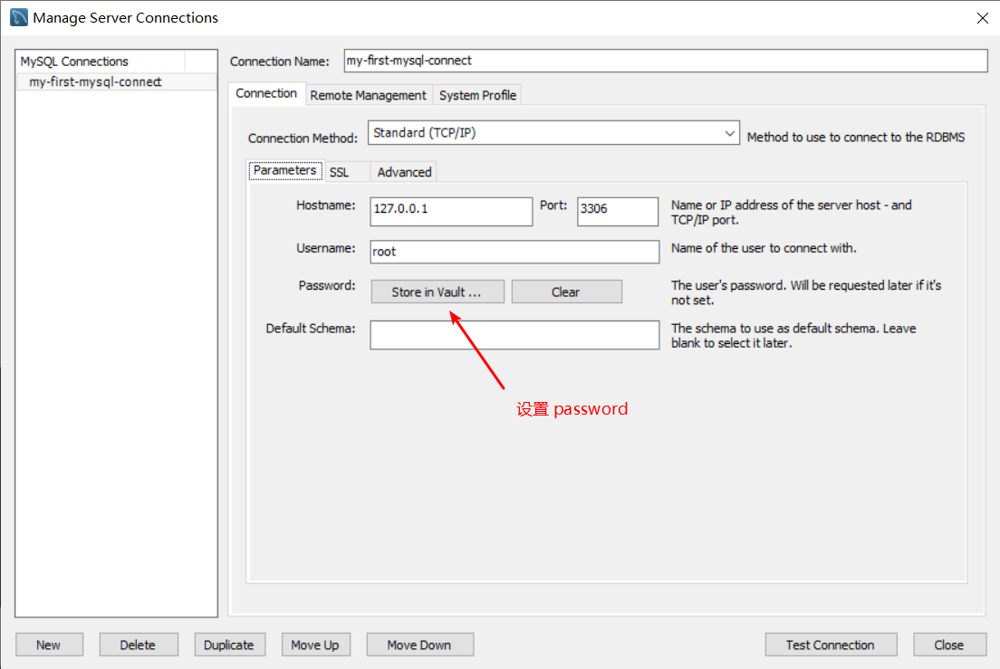
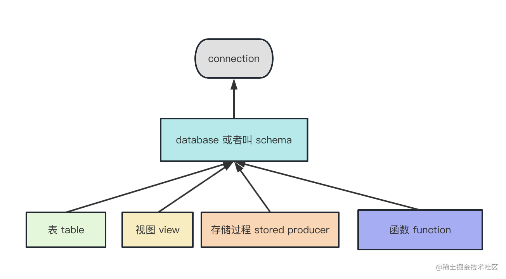
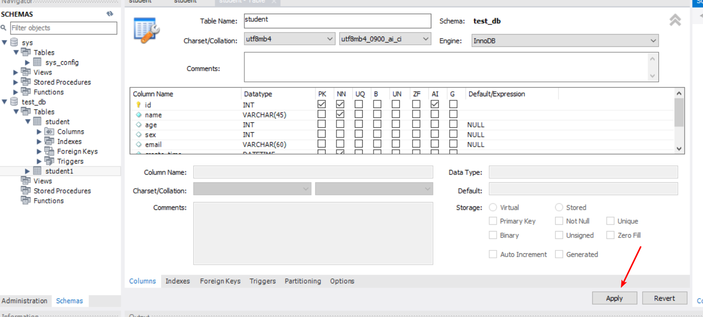
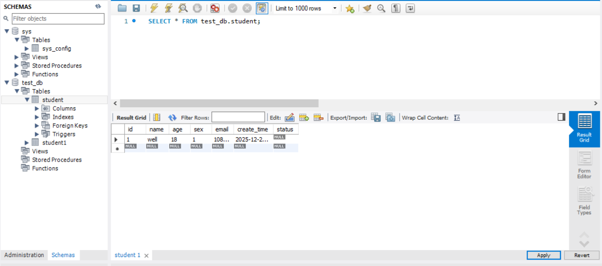
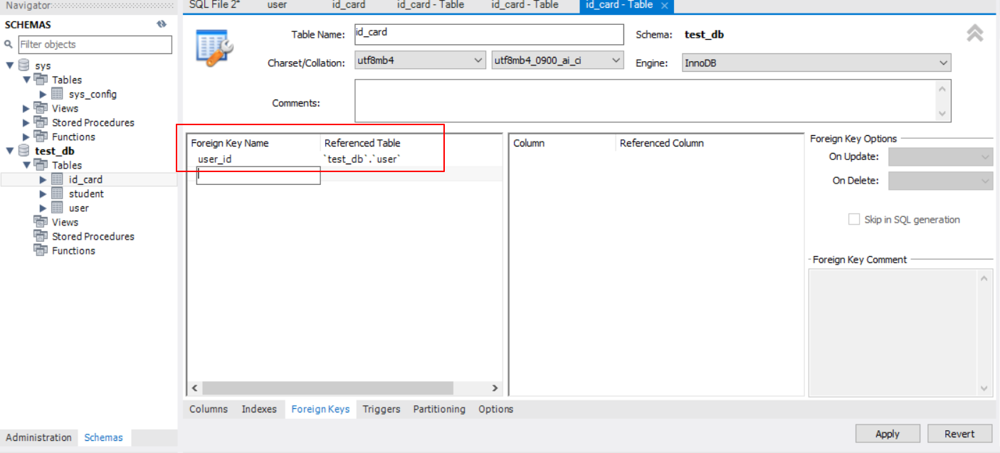
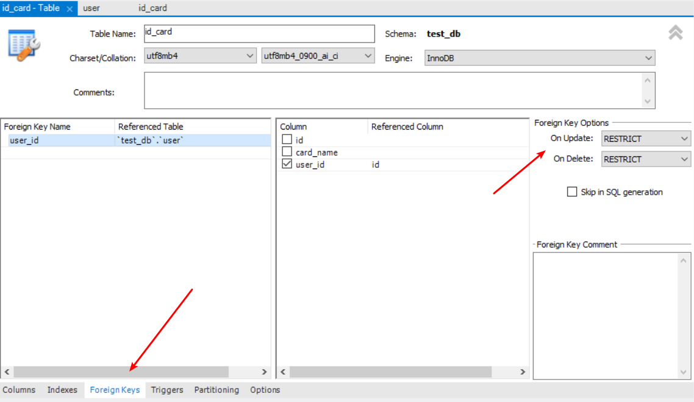

## 快速入门

### docker 启动 mysql

```
// 拉取镜像
docker pull mysql

// 启动镜像
docker run -d --name my-sql-db -e MYSQL_ROOT_PASSWORD=123456 -e MYSQL_DATABASE=test_db -p 3306:3306 mysql
```

- `-e`：设置环境变量
- `-e MYSQL_ROOT_PASSWORD=123456`：指定密码，`mysql`镜像要求必须设置密码。
- `-e MYSQL_DATABASE=test_db`：容器启动时自动创建一个名为 `test_db` 的数据库，省去了手动进入容器创建数据库的步骤。

### mysql 客户端

[mysql GUI 客户端](https://dev.mysql.com/downloads/workbench/)




### docker 命令行操作 mysql

- `docker exec -it my-sql-db /bin/bash` 运行命令行
- `mysql -u root -p`
  - `mysql`：启动 MySQL 命令行客户端程序的可执行文件（核心指令）
  - `-u root`：`u` 是 `--user` 的缩写，指定连接 MySQL 服务器使用的**用户名**为 `root`（MySQL 的超级管理员账户，拥有最高权限）
  - `-p`：是 `--password` 的缩写，指定连接时需要**输入密码**（注意：`-p` 后可以直接跟密码，但不推荐）
- 输入的`sql`语句，需要分号才会算结束。

```
C:\Users\10855>docker exec -it my-sql-db /bin/bash
bash-5.1# mysql -u root -p
Enter password:
Welcome to the MySQL monitor.  Commands end with ; or \g.
Your MySQL connection id is 12
Server version: 9.5.0 MySQL Community Server - GPL

Copyright (c) 2000, 2025, Oracle and/or its affiliates.

Oracle is a registered trademark of Oracle Corporation and/or its
affiliates. Other names may be trademarks of their respective
owners.

Type 'help;' or '\h' for help. Type '\c' to clear the current input statement.

mysql> show databases;
+--------------------+
| Database           |
+--------------------+
| information_schema |
| mysql              |
| performance_schema |
| sys                |
| test_db            |
+--------------------+
5 rows in set (0.001 sec)
```

### 基础核心操作



#### 创建表



对应的`sql` 命令：

```
CREATE TABLE `test_db`.`student` (
  `id` INT NOT NULL AUTO_INCREMENT,
  `name` VARCHAR(45) NOT NULL COMMENT '姓名',
  `age` INT NULL COMMENT '年龄',
  `sex` INT NULL COMMENT '性别',
  `email` VARCHAR(60) NULL COMMENT '邮箱',
  `create_time` DATETIME NOT NULL COMMENT '创建时间',
  `status` INT NULL DEFAULT 0 COMMENT '是否删除',
  PRIMARY KEY (`id`));
```

#### 数据类型

1. 整数型：`TINYINT、SMALLINT、MEDIUMINT、INT 、BIGINT`
2. 浮点型数字：`FLOAT、DOUBLE`
3. 定点型：`DECIMAL、MUMARIC`
4. 字符串：`CHAR、VARCHAR、TEXT、BLOB`
5. 日期型：`DATE、TIME、DATETIME、TIMESTAMP`

#### 插入数据



```
INSERT INTO `test_db`.`student` (`id`, `name`, `age`, `sex`, `email`, `create_time`) VALUES ('1', 'well', '18', '1', '1085550655@qq.com', '2025-12-21 16:30:00');
```

#### 修改数据

```
UPDATE `test_db`.`student` SET `email` = 'well@qq.com' WHERE (`id` = '1');
```

#### 删除数据

```
DELETE FROM `test_db`.`student` WHERE (`id` = '4');
```

#### 查询数据

```
SELECT * FROM test_db.student;
```

#### 删除表

```
drop table xxx;
```


### sql 查询语句/语法/函数总结

| 类别         | 语句/函数                            | 关键语法示例                                                 | 核心作用说明                                           |
| ------------ | ------------------------------------ | ------------------------------------------------------------ | ------------------------------------------------------ |
| **基础查询** | `SELECT ... FROM`                    | `SELECT name, price FROM products;`                          | 从表中检索数据，是查询的基石。                         |
|              | `WHERE`                              | `SELECT * FROM orders WHERE amount > 100;`                   | 过滤记录，只返回满足条件的行。                         |
|              | `ORDER BY`                           | `SELECT * FROM users ORDER BY reg_date DESC;`                | 对结果集按指定列进行排序（升序ASC或降序DESC）。        |
|              | `DISTINCT`                           | `SELECT DISTINCT country FROM suppliers;`                    | 返回指定列中唯一不同的值。                             |
|              | `LIMIT`(或 `TOP`)                    | `SELECT * FROM logs LIMIT 10;`                               | 限制返回的记录数量，常用于分页。                       |
| **高级查询** | `JOIN`(如 `INNER JOIN`, `LEFT JOIN`) | `SELECT o.id, c.name FROM orders o INNER JOIN customers c ON o.cust_id = c.id;` | 基于关系，从多个相关联的表中组合数据。                 |
|              | `GROUP BY`                           | `SELECT department, AVG(salary) FROM employees GROUP BY department;` | 将结果集按一列或多列分组，通常与聚合函数配合使用。     |
|              | `HAVING`                             | `SELECT department, AVG(salary) FROM employees GROUP BY department HAVING AVG(salary) > 50000;` | 对 `GROUP BY`分组后的结果进行条件过滤。                |
|              | 子查询                               | `SELECT name FROM products WHERE category_id IN (SELECT id FROM categories WHERE type='Electronics');` | 将一个查询嵌套在另一个查询中，用于复杂条件判断。       |
|              | `UNION`                              | `SELECT city FROM suppliers UNION SELECT city FROM customers;` | 合并两个或多个SELECT语句的结果集，并去除重复行。       |
| **数据操作** | `INSERT INTO`                        | `INSERT INTO products (name, price) VALUES ('Keyboard', 99.9);` | 向表中插入新的记录。                                   |
|              | `UPDATE ... SET`                     | `UPDATE employees SET salary = salary * 1.1 WHERE dept = 'Engineering';` | 更新表中已存在的记录。                                 |
|              | `DELETE FROM`                        | `DELETE FROM comments WHERE create_date < '2020-01-01';`     | 从表中删除记录。**务必谨慎使用WHERE条件**。            |
| **常用函数** | **聚合函数**                         | `COUNT()`, `SUM()`, `AVG()`, `MAX()`, `MIN()`                | 对一组值执行计算，返回单个汇总值。                     |
|              | **字符串函数**                       | `LEN()`, `UPPER()`, `LOWER()`, `SUBSTRING()`, `CONCAT()`     | 用于处理文本字符串，如转换大小写、截取子串等。         |
|              | **日期函数**                         | `NOW()`, `CURDATE()`, `YEAR()`, `MONTH()`, `DATEADD()`, `DATEDIFF()` | 用于处理日期和时间值，如获取当前时间、计算日期差等。   |
|              | **数学函数**                         | `ROUND()`, `ABS()`, `CEILING()`, `FLOOR()`, `RAND()`         | 用于执行数学运算，如四舍五入、取绝对值、生成随机数等。 |

#### 创建表

```
CREATE TABLE test_db.student(
    id INT PRIMARY KEY AUTO_INCREMENT COMMENT 'Id',
    name VARCHAR(50) NOT NULL COMMENT '学生名',
    gender VARCHAR(10) NOT NULL COMMENT '性别',
    age INT NOT NULL COMMENT '年龄',
    class VARCHAR(50) NOT NULL COMMENT '班级名',
    score INT NOT NULL COMMENT '分数'
) CHARSET=utf8mb4
```

#### 插入数据

```
INSERT INTO test_db.student (name, gender, age, class, score)
    VALUES 
        ('张三', '男',18, '一班',90),
        ('李四', '女',19, '二班',85),
        ('王五', '男',20, '三班',70),
        ('赵六', '女',18, '一班',95),
        ('钱七', '男',19, '二班',80),
        ('孙八', '女',20, '三班',75),
        ('周九', '男',18, '一班',85),
        ('吴十', '女',19, '二班',90),
        ('郑十一', '男',20, '三班',60),
        ('王十二', '女',18, '一班',95),
        ('赵十三', '男',19, '二班',75),
        ('钱十四', '女',20, '三班',80),
        ('孙十五', '男',18, '一班',90),
        ('周十六', '女',19, '二班',85),
        ('吴十七', '男',20, '三班',70),
        ('郑十八', '女',18, '一班',95),
        ('王十九', '男',19, '二班',80),
        ('赵二十', '女',20, '三班',75);
```

#### 查询数据

##### 全查询

```
use test_db;
SELECT name, score FROM test_db.student;
```

##### 查询部分字段

```
use test_db;
SELECT name as 名字, score as 分数 FROM student;
```

##### where

```
use test_db;
select name as 名字,class as 班级 from student where age >= 19;

use test_db;
select name as 名字,class as 班级 from student where gender='男' and score >= 90;
```

##### like

```
use test_db;
select * from student where name like '王%';
```

##### in&not in

```

use test_db;
select * from student where class in ('一班', '二班');

use test_db;
select * from student where class not in ('一班', '二班');
```

##### between

```
use test_db;
select * from student where age between 18 and 20;
```

##### limit

```
use test_db;
select * from student limit 0,5;
```

##### order by

```
use test_db;
select name,score,age from student order by score asc,age desc;
```

##### group by

```
use test_db;
SELECT class as 班级, AVG(score) AS 平均成绩
    FROM student
    GROUP BY class
    ORDER BY 平均成绩 DESC;
    
use test_db;
select class, count(*) as count from student group by class;
```

##### having

```
use test_db;
SELECT class,AVG(score) AS avg_score
    FROM student
    GROUP BY class
    HAVING avg_score > 90;
```

##### 字符串函数

```
use test_db;
SELECT CONCAT('xx', name, 'yy'), SUBSTR(name,2,3), LENGTH(name), UPPER('aa'), LOWER('TT') FROM student;
```

##### 日期函数

```
use test_db;
SELECT YEAR('2023-06-01 22:06:03'), MONTH('2023-06-01 22:06:03'),DAY('2023-06-01 22:06:03'),DATE('2023-06-01 22:06:03'), TIME('2023-06-01 22:06:03');
```

##### 条件函数

```
use test_db;
select name, if(score >=60, '及格', '不及格') from student;

use test_db;
SELECT name, score, CASE WHEN score >=90 THEN '优秀' WHEN score >=60 THEN '良好'ELSE '差' END AS '档次' FROM student;
```


## 一对一、join 查询、级联方式

### 表设计

- user（主表）
  - id（主键）
  - name
- id_card（从表）
  - id
  - card_name
  - user_id（外键：user.id）



- 创建 user 表命令

  ```
  CREATE TABLE `test_db`.`user` (
    `id` INT NOT NULL AUTO_INCREMENT COMMENT 'id',
    `name` VARCHAR(45) NOT NULL COMMENT '名字',
    PRIMARY KEY (`id`)
  );
  ```

- 创建 id_card 表命令

  ```
  CREATE TABLE `test_db`.`id_card` (
    `id` int NOT NULL AUTO_INCREMENT COMMENT 'id',
    `card_name` varchar(45) NOT NULL COMMENT '身份证号',
    `user_id` int DEFAULT NULL COMMENT '用户 id',
    PRIMARY KEY (`id`),
    INDEX `card_id_idx` (`user_id`),
    CONSTRAINT `user_id` FOREIGN KEY (`user_id`) REFERENCES `user` (`id`)
  )  CHARSET=utf8mb4
  ```

### 表数据

- user

  ```
  1	张三
  2	李四
  3	王五
  4	赵六
  5	孙七
  6	周八
  7	吴九
  8	郑十
  9	钱十一
  10	陈十二
  ```

- id_card

  ```
  1	110101199001011234	1
  2	310101199002022345	2
  3	440101199003033456	3
  4	440301199004044567	4
  5	510101199005055678	5
  6	330101199006066789	6
  7	320101199007077890	7
  8	500101199008088901	8
  9	420101199009099012	9
  10	610101199010101023	10
  ```

### join 查询

#### INNER JOIN

- 语法：`JOIN` 或 `INNER JOIN`
- 作用：只返回两表中满足关联条件的记录

```
SELECT * FROM test_db.user JOIN id_card ON user.id = id_card.user_id;

id  name card_id card_name
1	张三	1	110101199001011234	1
2	李四	2	310101199002022345	2
3	王五	3	440101199003033456	3
4	赵六	4	440301199004044567	4
5	孙七	5	510101199005055678	5
6	周八	6	330101199006066789	6
7	吴九	7	320101199007077890	7
8	郑十	8	500101199008088901	8
9	钱十一	9	420101199009099012	9
10	陈十二	10	610101199010101023	10
```

#### LEFT JOIN

- 语法：`LEFT JOIN`
- 作用：额外返回左表中没有关联上的数据
- `FROM` 后的是左表，`JOIN`后的表是右表

```
SELECT user.id, name, id_card.id as card_id, card_name 
    FROM user
    LEFT JOIN id_card ON user.id = id_card.user_id;
    
id  name card_id card_name
1	张三	1	110101199001011234
2	李四	2	310101199002022345
3	王五	3	440101199003033456
4	赵六	4	440301199004044567
5	孙七	5	510101199005055678
6	周八	6	330101199006066789
7	吴九	7	320101199007077890
8	郑十	8	500101199008088901
9	钱十一	9	420101199009099012
10	陈十二	10	610101199010101023
11	刘十三		
```

#### RIGHT JOIN

- 语法：`RIGHT JOIN`
- 作用：额外返回右表中没有关联上的数据
- `FROM` 后的是左表，`JOIN`后的表是右表

```
SELECT user.id, name, id_card.id as card_id, card_name 
    FROM user
    RIGHT JOIN id_card ON user.id = id_card.user_id;
    
id  name card_id card_name
1	张三	1	110101199001011234
2	李四	2	310101199002022345
3	王五	3	440101199003033456
4	赵六	4	440301199004044567
5	孙七	5	510101199005055678
6	周八	6	330101199006066789
7	吴九	7	320101199007077890
8	郑十	8	500101199008088901
9	钱十一	9	420101199009099012
10	陈十二	10	610101199010101023
		12	610101199010101021
```

### 级联操作



- RESTRICT：只有没有从表的关联记录时，才允许删除主表记录或者更新主表记录的主键 id
- CASCADE： 主表主键更新，从表关联记录的外键跟着更新，主表记录删除，从表关联记录删除
- SET NULL：主表主键更新或者主表记录删除，从表关联记录的外键设置为 null
- NO ACTION： 同 RESTRICT，只是 sql 标准里分了 4 种，但 mysql 里 NO ACTION 等同于 RESTRICT

#### 例子：RESERICT(默认)

例如当`user`表（主表）的id为1和`id_card`表的id为1存在关联时，则无法删除`user`表（主表）id为1的行（但是可以删除从表id为1的行）

```
DELETE FROM `test_db`.`user` WHERE (`id` = '1');
```

#### 例子：CASCADE

- 更新

  ```
  UPDATE `test_db`.`user` SET `id` = '21' WHERE (`id` = '1');
  
  id_card
  id  card_name           use_id
  1	310101199002022341	21
  ```

- 删除

  ```
  DELETE FROM `test_db`.`user` WHERE (`id` = '21');
  
  id_card 中 user_id 列为 21 的行也被删除了
  ```

#### 

## 一对多、多对多关系表设计

### 一对多关系表设计

- 背景：一个部门有多个员工（一对多关系）

- 表设计

  - 部门 department
    - id
    - name
  - 员工 employee
    - id
    - name
    - department_id

-  department

  ```
  id  name
  1	人事部
  2	财务部
  3	市场部
  4	技术部
  5	销售部
  6	客服部
  7	采购部
  8	行政部
  9	品控部
  10	研发部
  ```

- employee

  ```
  id name department_id
  1	张三	1
  2	李四	2
  3	王五	3
  4	赵六	4
  5	钱七	5
  6	孙八	5
  7	周九	5
  8	吴十	8
  9	郑十一	9
  10	王十二	10
  ```

- 联级查询

  ```
  select * from department
      join employee on department.id = employee.department_id
      where department.id = 5
      
  id  name  id  name department_id
  5	销售部	5	钱七	5
  5	销售部	6	孙八	5
  5	销售部	7	周九	5    
  ```

  

### 多对多关系表设计

- 背景：一个文章可以有多个标签，一个标签可以归属多个文章
- 表设计
  - 文章 article
    - id
    - title
    - content
  - 文章标签 article_tag (作为一个中间表来保存双方的外键)
    - article_id 
    - tag_id
  - 标签 tag
    - id
    - name

## 子查询 和 EXISTS\NOT EXISTS

### 子查询

如果我想查询学生表中成绩最高的学生的姓名和班级名称

```
SELECT MAX(score) FROM student; // 假设这个最高分的分数为95分
SELECT name, class FROM student WHERE score = 95;
```

子查询：

```
SELECT name, class FROM student WHERE score = (SELECT MAX(score) FROM student);
```

### EXISTS

查询所有存在员工的部门名称:

```
SELECT name FROM department
    WHERE EXISTS (
        SELECT * FROM employee WHERE department.id = employee.department_id
    );
```

| 部分                                                         | 作用                                                         |
| ------------------------------------------------------------ | ------------------------------------------------------------ |
| `SELECT name FROM department`                                | 主查询：从 `department` 表中获取部门名称                     |
| `WHERE EXISTS (...)`                                         | 条件：判断子查询是否有返回结果（只要有结果，`EXISTS` 就为 `TRUE`，该部门会被选中） |
| `SELECT * FROM employee WHERE department.id = employee.department_id` | 子查询：检查当前部门（`department.id`）是否在 `employee` 表中有对应的员工（`employee.department_id`） |

1. 主查询遍历 `department` 表的每一行（每个部门）。
2. 对于每个部门，执行子查询：在 `employee` 表中查找是否有 `department_id` 等于当前部门 `id` 的员工。
3. 如果子查询找到至少一条记录，`EXISTS` 返回 `TRUE`，该部门的名称会被加入结果集；否则跳过该部门。

### NOT EXISTS

查询所有不存在员工的部门名称:

```
SELECT name FROM department
    WHERE NOT EXISTS (
        SELECT * FROM employee WHERE department.id = employee.department_id
    );
```

| 部分                                                         | 具体作用                                                     |
| ------------------------------------------------------------ | ------------------------------------------------------------ |
| `SELECT name FROM department`                                | 主查询：从部门表中获取部门名称                               |
| `WHERE NOT EXISTS (...)`                                     | 条件：子查询**无结果返回**时，该部门才会被选中               |
| `SELECT * FROM employee WHERE department.id = employee.department_id` | 子查询：检查当前部门（`department.id`）是否在员工表中有对应的员工 |

1. 主查询遍历 `department` 表的每一个部门（每一行）。
2. 对每个部门，执行子查询：在 `employee` 表中查找是否有 `department_id` 等于当前部门 `id` 的员工。
3. 如果子查询**没有找到任何员工记录**，`NOT EXISTS` 返回 `TRUE`，该部门名称被加入结果集；如果找到员工，就跳过该部门。

### 非 select 用法

除了在select可以使用，还可以在update、insert、delete 等场景里使用

#### insert

```
产品表-product
id  name        price   category stock
1	iPhone12	6999.00	手机	100
2	iPad Pro	7999.00	平板电脑	50
3	MacBook Pro	12999.00	笔记本电脑	30
4	AirPods Pro	1999.00	耳机	200
5	Apple Watch	3299.00	智能手表	80
```

建立一个分类_平均价格（`avg_price_by_catrgory`）表，用于存储分类-平均价格

```
INSERT INTO avg_price_by_category (category, avg_price) 
    SELECT category, AVG(price) FROM product GROUP BY category;
```

#### update

把技术部所有人的name前加上：“技术-”

```
UPDATE employee SET name = CONCAT('技术-', name) 
    WHERE department_id = (
        SELECT id FROM department WHERE name = '技术部'
    );
```

#### delete

```
DELETE FROM employee WHERE department_id = (
    SELECT id FROM department WHERE name = '技术部'
);
```

