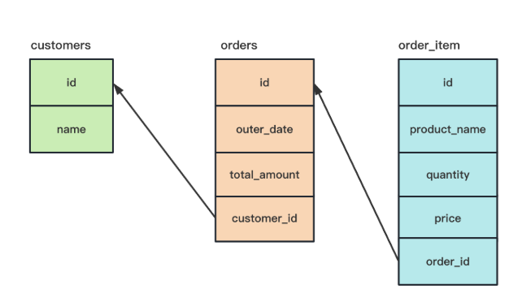

## 数据准备



- 客户表（customers）

  ```
  id  name
  1	张丽娜
  2	李明
  3	王磊
  4	赵静
  5	钱伟
  6	孙芳
  7	周涛
  8	吴洋
  9	郑红
  10	刘华
  11	陈明
  12	杨丽
  13	王磊
  14	张伟
  15	李娜
  16	刘洋
  17	陈静
  18	杨阳
  19	王丽
  20	张强
  ```

- 订单表（orders）

  ```
  id customer_id order_date total_amount
  1	1	2022-01-01	100.00
  2	1	2022-01-02	200.00
  3	2	2022-01-03	300.00
  4	2	2022-01-04	400.00
  5	3	2022-01-05	500.00
  6	3	2022-01-06	600.00
  7	4	2022-01-07	700.00
  8	4	2022-01-08	800.00
  9	5	2022-01-09	900.00
  10	5	2022-01-10	1000.00
  ```

- 订单项（order-item）

  ```
  id order_id product_name quantity price
  1	1	耐克篮球鞋	1	100.00
  2	1	阿迪达斯跑步鞋	2	50.00
  3	2	匡威帆布鞋	3	100.00
  4	2	万斯板鞋	4	50.00
  5	3	新百伦运动鞋	5	100.00
  6	3	彪马休闲鞋	6	50.00
  7	4	锐步经典鞋	7	100.00
  8	5	亚瑟士运动鞋	10	50.00
  9	5	帆布鞋	1	100.00
  10	1	苹果手写笔	2	50.00
  11	2	电脑包	3	100.00
  12	3	苹果手机	4	50.00
  13	4	苹果耳机	5	100.00
  14	5	苹果平板	7	100.00
  ```

  

## 查询每个客户的订单总金额

- 客户的订单存在订单表里，需要使用 JOIN 连结客户表和订单表 ON 根据客户id和订单的客户id进行关联
- 对客户id 进行分组
- 通过sum 函数计算价格总和

```
SELECT 
    customers.name, SUM(orders.total_amount) AS total_amount
FROM
    customers
        INNER JOIN
    orders ON customers.id = orders.customer_id
GROUP BY customers.id;
```

```
name  total_amount
张丽娜	300.00
李明	700.00
王磊	1100.00
赵静	1500.00
钱伟	1900.00
```

## 查询每个客户的订单总金额，并计算其占比

```
SELECT customers.name, SUM(orders.total_amount) AS `总额`, 
	SUM(orders.total_amount) / (SELECT SUM(total_amount) FROM orders) AS `百分比` 
    FROM customers
    INNER JOIN orders ON customers.id = orders.customer_id
    GROUP BY customers.id;
```

```
name  总额     百分比
张丽娜	300.00	0.054545
李明	700.00	0.127273
王磊	1100.00	0.200000
赵静	1500.00	0.272727
钱伟	1900.00	0.345455
```

## 查询每个客户的订单总金额，并列出每个订单的商品清单

```
SELECT 
    customers.name,
    orders.order_date,
    orders.total_amount,
    order_items.product_name,
    order_items.quantity,
    order_items.price
FROM
    customers
        JOIN
    orders ON customers.id = orders.customer_id
        JOIN
    order_items ON orders.id = order_items.order_id
ORDER BY customers.name , orders.order_date;
```

```
name order_date total_amount product_name quantity price
张丽娜	2022-01-01	100.00	耐克篮球鞋	1	100.00
张丽娜	2022-01-01	100.00	阿迪达斯跑步鞋	2	50.00
张丽娜	2022-01-01	100.00	苹果手写笔	2	50.00
张丽娜	2022-01-02	200.00	匡威帆布鞋	3	100.00
张丽娜	2022-01-02	200.00	万斯板鞋	4	50.00
张丽娜	2022-01-02	200.00	电脑包	3	100.00
李明	2022-01-03	300.00	新百伦运动鞋	5	100.00
李明	2022-01-03	300.00	彪马休闲鞋	6	50.00
李明	2022-01-03	300.00	苹果手机	4	50.00
李明	2022-01-04	400.00	锐步经典鞋	7	100.00
李明	2022-01-04	400.00	苹果耳机	5	100.00
王磊	2022-01-05	500.00	亚瑟士运动鞋	10	50.00
王磊	2022-01-05	500.00	帆布鞋	1	100.00
王磊	2022-01-05	500.00	苹果平板	7	100.00
```

## 查询每个客户的订单总金额，并列出每个订单的商品清单，同时只显示客户名字姓“张”的客户的记录

```
SELECT 
    customers.name,
    orders.order_date,
    orders.total_amount,
    order_items.product_name,
    order_items.quantity,
    order_items.price
FROM
    customers
        JOIN
    orders ON customers.id = orders.customer_id
        JOIN
    order_items ON orders.id = order_items.order_id
WHERE
    customers.name LIKE '张%'
ORDER BY customers.name , orders.order_date;
```

```
name order_date total_amount product_name quantity price
张丽娜	2022-01-01	100.00	耐克篮球鞋	1	100.00
张丽娜	2022-01-01	100.00	阿迪达斯跑步鞋	2	50.00
张丽娜	2022-01-01	100.00	苹果手写笔	2	50.00
张丽娜	2022-01-02	200.00	匡威帆布鞋	3	100.00
张丽娜	2022-01-02	200.00	万斯板鞋	4	50.00
张丽娜	2022-01-02	200.00	电脑包	3	100.00
```

## 查询每个客户的订单总金额，并列出每个订单的商品清单，同时只显示订单日期在2022年1月1日到2022年1月3日之间的记录

```
SELECT 
    customers.name,
    orders.order_date,
    orders.total_amount,
    order_items.product_name,
    order_items.quantity,
    order_items.price
FROM
    customers
        JOIN
    orders ON customers.id = orders.customer_id
        JOIN
    order_items ON orders.id = order_items.order_id
WHERE
    orders.order_date BETWEEN '2022-01-01' AND '2022-01-03'
ORDER BY customers.name , orders.order_date;
```

```
name order_date total_amount product_name quantity price
张丽娜	2022-01-01	100.00	耐克篮球鞋	1	100.00
张丽娜	2022-01-01	100.00	阿迪达斯跑步鞋	2	50.00
张丽娜	2022-01-01	100.00	苹果手写笔	2	50.00
张丽娜	2022-01-02	200.00	匡威帆布鞋	3	100.00
张丽娜	2022-01-02	200.00	万斯板鞋	4	50.00
张丽娜	2022-01-02	200.00	电脑包	3	100.00
李明	2022-01-03	300.00	新百伦运动鞋	5	100.00
李明	2022-01-03	300.00	彪马休闲鞋	6	50.00
李明	2022-01-03	300.00	苹果手机	4	50.00
```

## 查询每个客户的订单总金额，并计算商品数量，只包含商品名称包含“鞋”的商品，商品名用-连接，显示前 3 条记录

```
SELECT 
    customers.name,
    SUM(orders.total_amount) AS total_amount,
    SUM(order_items.quantity) AS total_quantity,
    GROUP_CONCAT(order_items.product_name
        SEPARATOR '-') AS product_names
FROM
    customers
        JOIN
    orders ON customers.id = orders.customer_id
        JOIN
    order_items ON orders.id = order_items.order_id
WHERE
    order_items.product_name LIKE '%鞋%'
GROUP BY customers.id
LIMIT 3;
```

```
name total_amount total_quantity product_names
张丽娜	600.00	10	耐克篮球鞋-阿迪达斯跑步鞋-匡威帆布鞋-万斯板鞋
李明	1000.00	18	新百伦运动鞋-彪马休闲鞋-锐步经典鞋
王磊	1000.00	11	亚瑟士运动鞋-帆布鞋
```

## 查询存在订单的客户

```
SELECT 
    *
FROM
    customers
WHERE
    NOT EXISTS( SELECT 
            *
        FROM
            orders
        WHERE
            customers.id = orders.customer_id)
```

## 将王磊的订单总金额打九折

```
UPDATE orders o SET o.total_amount = o.total_amount * 0.9
    WHERE o.customer_id IN (
        SELECT id FROM customers WHERE name = '王磊'
    );
```

