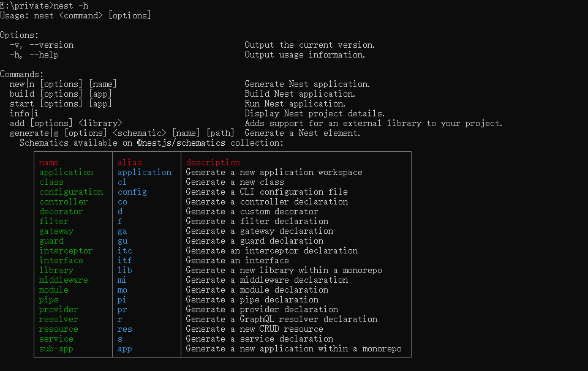
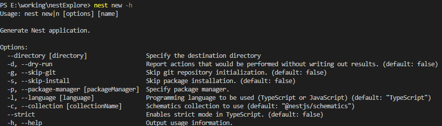
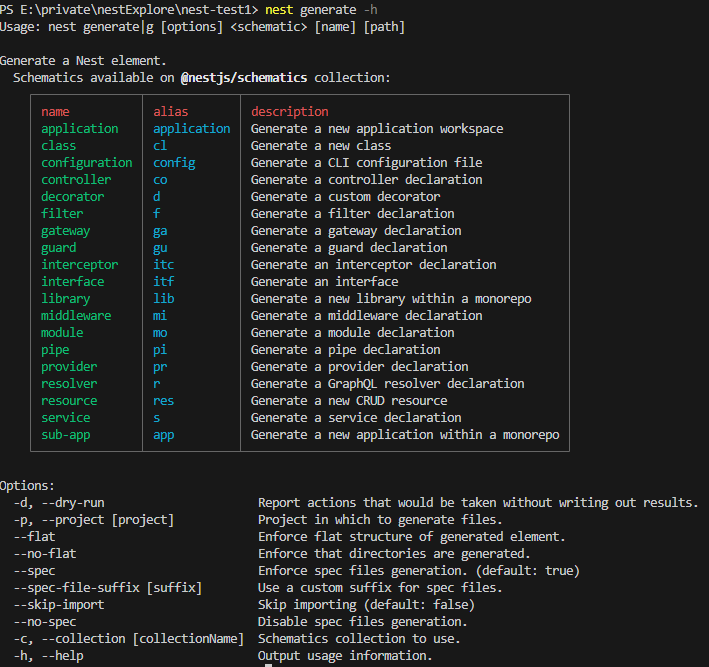
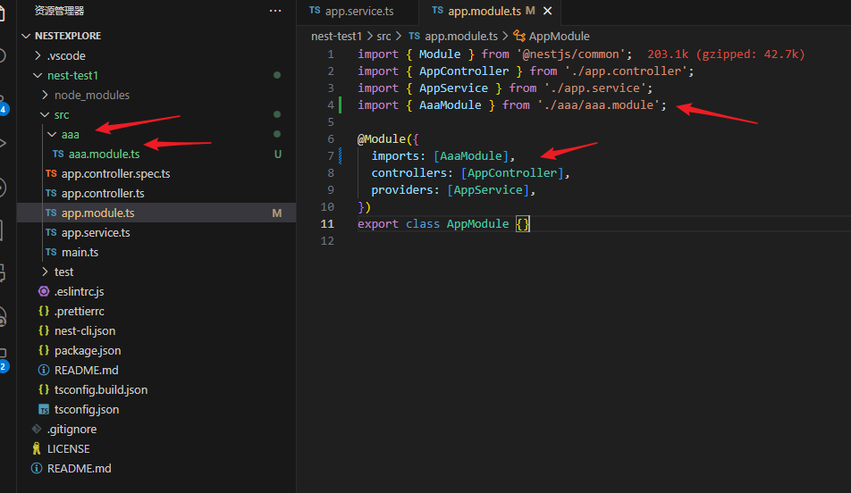
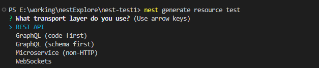
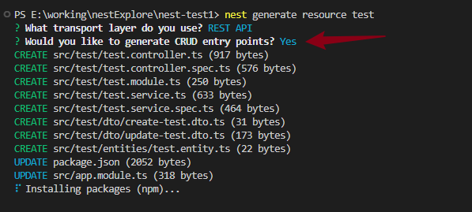
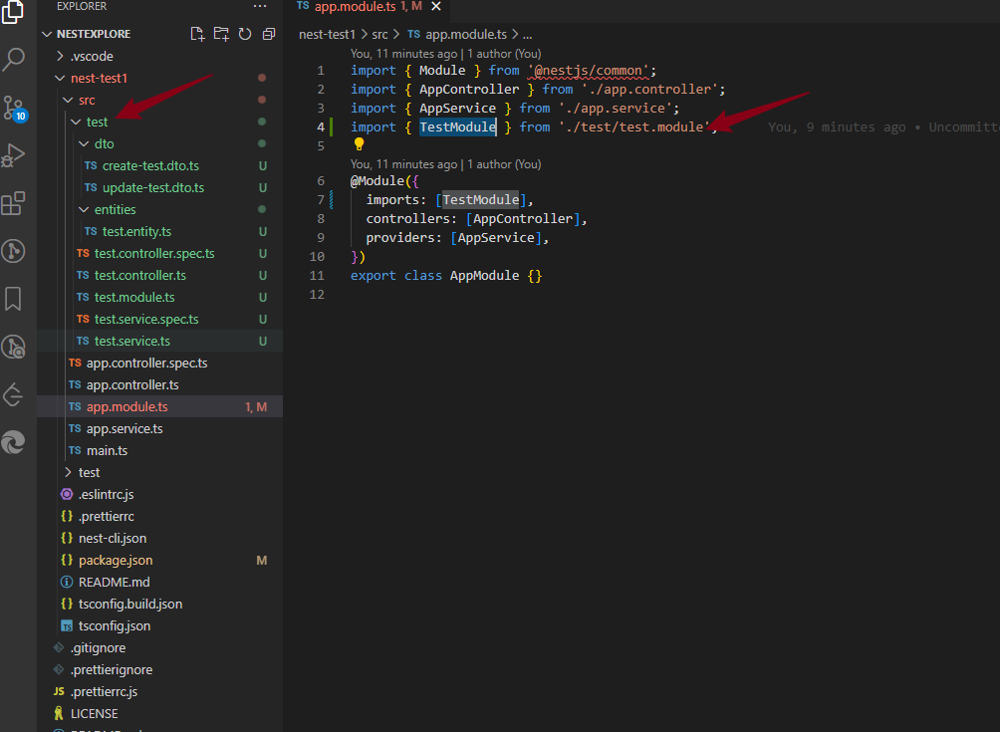
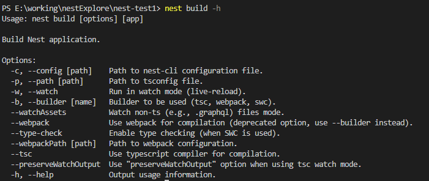
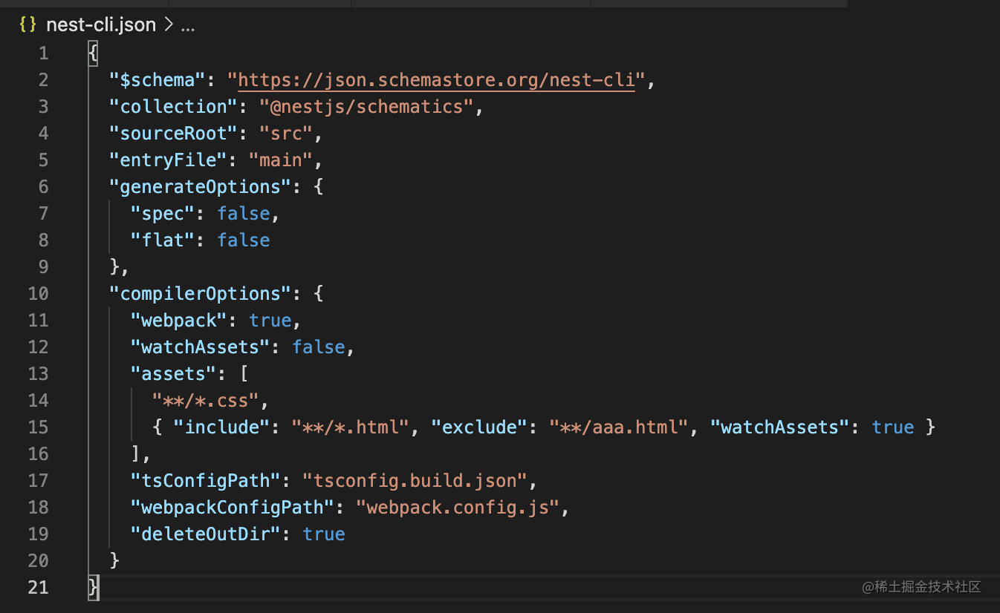

## 概述
Nest 在 @nestjs/cli 这个包里提供了相关命令。
可以直接 npx 执行，npm 会把它下载下来然后执行：
```
npx @nestjs/cli new 项目名
```
也可以安装到全局，然后执行，更推荐这种：
```
npm install -g @nestjs/cli

nest new 项目名
```
不过后者要时不时升级下版本，不然可能用它创建的项目版本不是最新的：
```
npm update -g @nestjs/cli
```
那 nest 都提供了啥命令呢？
```
nest -h
```



## nest new
- 作用：用来创建一个新的 nest 项目
- 具有选项：`nest new -h`



## nest generate



- 作用：生成一些代码片段，如controller、service、module 等
- 例子：生成module，controller和service 也是一样

```
nest generate module aaa
```

这里会生成并引入。



- 例子：nest generate resource xxx: 生成一个完成模块的代码

```
nest generate resource test
```



然后会让你选择是否生成 CRUD 代码：



然后就会生成整个模块的 CRUD + REST api 的代码




## nest build

- 作用：使用 tsc 或者 webpack 构建代码
- 查看指令：`nest build -h`
  - --webpack：使用webpack 编译，会做打包
  - --tsc: 使用 tsc 编译，不做打包
  - --watch：监听文件变动，自动 build。加上 --watchAssets 会连别的文件一同监听变化，并输出到dist目录
  - --path：指定 tsc 配置文件的路径
  - --config：指定 nest cli 的配置文件



## nest-cli.json



- compilerOptions
  - webpack 设置为false，就是用tsc了
  - deleteOutDir 设置为 true，每次 build 都会都清空 dist 目录
  - 而 assets 是指定 nest build 的时候，把那些非 js、ts 文件也复制到 dist 目录下
  - 可以通过 include、exclude 来精确匹配，并且可以单独指定是否 watchAssets（不过只支持 src 下文件的复制，如果是非 src 下的，可以自己写脚本复制）
- generateOptions
  - 这些就和我们 nest generate 时的 --no-spec、--no-flat 一样的效果
- sourceRoot 是指定源码目录
- entryFile 是指定入口文件的名字，默认是 main
- 而 $schema 是指定 nest-cli.json 的 schema，也就是可以有哪些属性的(https://json.schemastore.org/nest-cli), 可以根据该文档查看配置说明

## nest start

- 作用：启动开发服务，支持watch 调试

## nest info

- 作用：打印node、npm、nest 包的依赖版本

## 总结