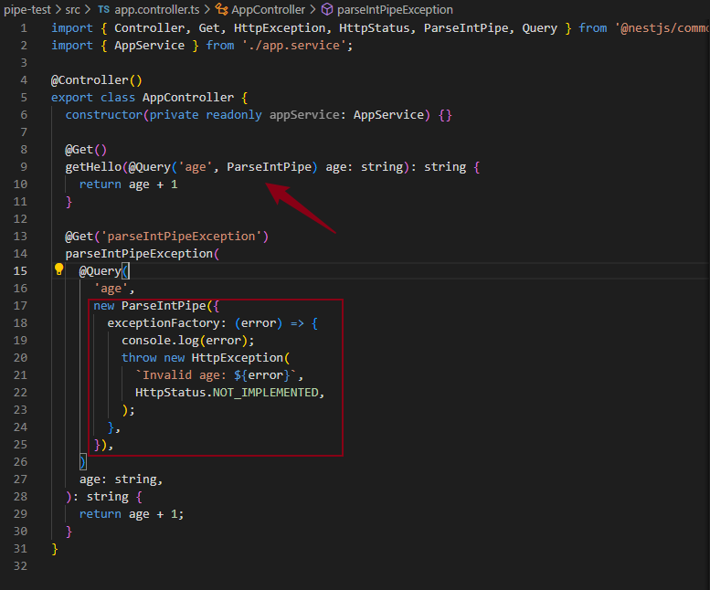
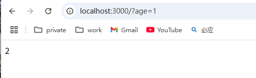
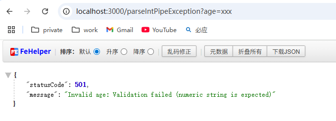
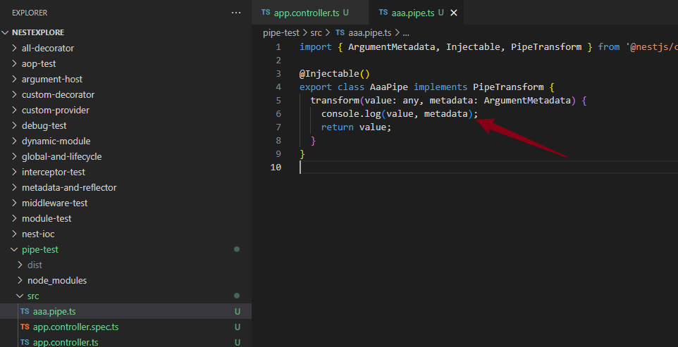
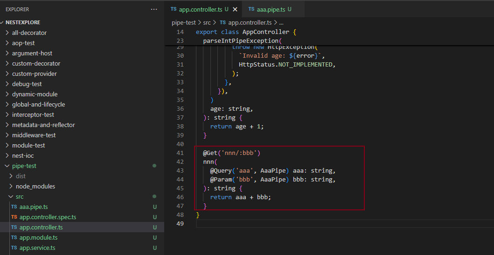
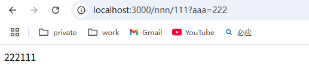

## 内置Pipe
Pipe 是在参数传给 handler 之前对参数做一些验证和转换的 class。
内置的 Pipe 有这些：
- ValidationPipe
- ParseIntPipe
- ParseBoolPipe
- ParseArrayPipe
- ParseUUIDPipe
- DefaultValuePipe
- ParseEnumPipe
- ParseFloatPipe
- ParseFilePipe

### ParseIntPipe
实现：

正常展示：age为number类型

非正常展示：age为非number类型，自定义异常处理：

## 自定义Pipe

## 总结

Pipe 是在参数传给 handler 之前做一些验证和转换的，有 9 个内置的 Pipe 可以直接用。

我们过了一遍内置的 ParseIntPipe、ParseBoolPipe、ParseArrayPipe、ParseUUIDPipe、ParseEnumPipe、ParseFloatPipe 还有 DefaultValuePipe。
