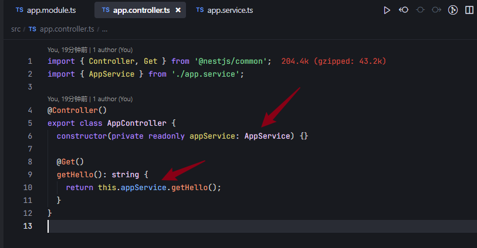

## Provides的声明方式

可以看到，AppService 是被 @Injectable 修饰的 class

在Module的providers 会把其进行声明。这是一种简写，完整的写法是：

1. 通过 provide指定 token
2. 通过 useClass 指定对象的类（nest 会自动对它做实例化后用来注入）

## 依赖的声明方式

这种是构造器注入，也可以属性注入：

即通过@Inject 指定注入的 provider 的 token；

构造参数里指定 AppService的依赖的时候没有指定 token，是因为默认 AppService 这个 class 本身就是token；

如果token 是字符串，注入的时候就要用 @Inject 手动指定注入对象的 token 了

## 注入值

除了指定class外，也可以直接指定一个值，让IOC容器来注入

### 注入静态值

### 注入动态对象

