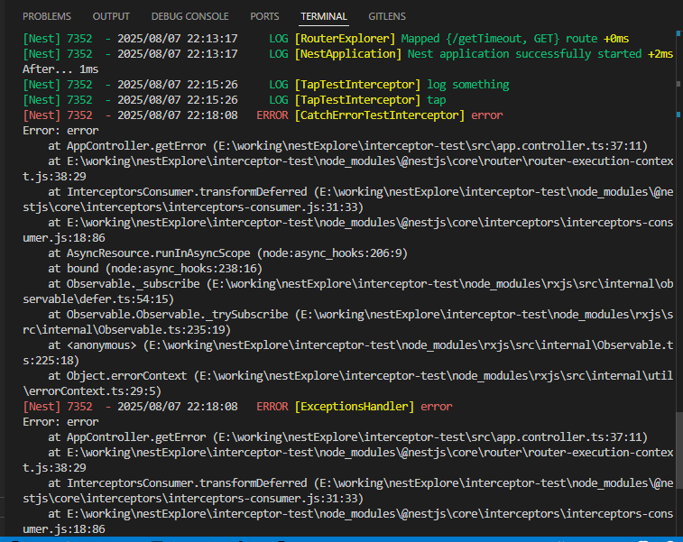

## RxJS
RxJS 是一个库，它通过使用 observable 序列来编写异步和基于事件的程序。它提供了一个核心类型 Observable，附属类型 (Observer、 Schedulers、 Subjects) 和受 [Array#extras]启发的操作符 (map、filter、reduce、every, 等等)，这些数组操作符可以把异步事件作为集合来处理。

[RxJS超链接](https://cn.rx.js.org/manual/overview.html)


## nest 使用 RxJs

Nest 的 interceptor 集成了 RxJS，可以用它来处理响应。


### 基础案例

```
nest g interceptor aaa --flat --no-spec
```


### map

```
nest g interceptor map-test --flat --no-spec
```


### tap

```
nest g interceptor tap-test --flat --no-spec
```


### catchError

```
nest g interceptor catch-error-test --flat --no-spec
```




### timeout

```
nest g interceptor timeout --flat --no-spec
```


## 总结

rxjs 是一个处理异步逻辑的库，它的特点就是 operator 多，你可以通过组合 operator 来完成逻辑，不需要自己写。

nest 的 interceptor 就用了 rxjs 来处理响应，但常用的 operator 也就这么几个：

- tap: 不修改响应数据，执行一些额外逻辑，比如记录日志、更新缓存等
- map：对响应数据做修改，一般都是改成 {code, data, message} 的格式
- catchError：在 exception filter 之前处理抛出的异常，可以记录或者抛出别的异常
- timeout：处理响应超时的情况，抛出一个 TimeoutError，配合 catchErrror 可以返回超时的响应