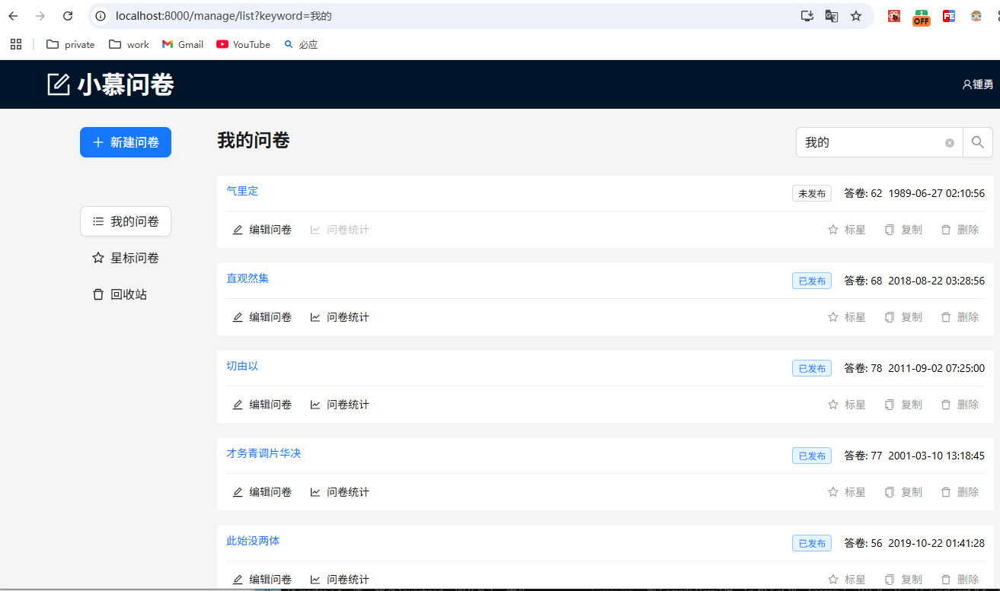

# antd form 组件

参考 antd 官网 https://ant.design/components/form-cn

## 表单组件

- Input
- Radio
- Checkbox
- Select

## 实战：搜索

ListSearch 组件, 通过修改URL参数, 对组件实现进行解耦
- ListSearch，仅仅改变URL参数
- 其他依赖URL参数的请求，在参数变更后刷新请求

