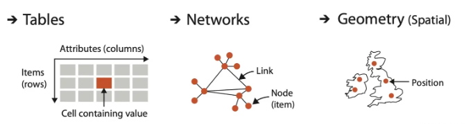

# 可视化入门

## 什么是数据
数据分为三个层次：**数据集（DataSet）、数据（Data）、属性（Attribute）**；
数据由一些数据集构成，数据集又是由 一条条数据构成，每一条数据都是由属性构成。

## 数据集类型
数据集主要分为：**表格（Table）、网络（Network）、几何（Geometry）**

- 表格
由行（Row）和列（Col）构成，对于一维表格，每一行是一个**实体（Item）**，每一列是该实体的一个**属性（Attribute）**
- 网络

